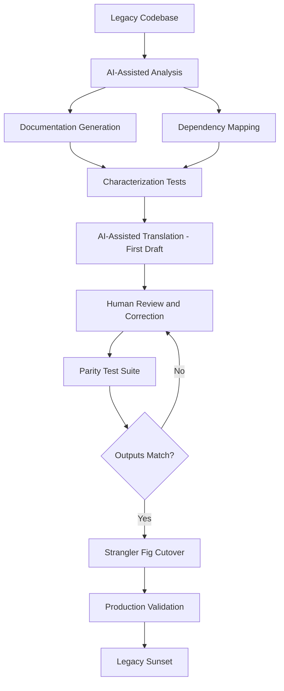

Legacy modernization is one of those projects that looks straightforward on the executive summary and humbles everyone six months in. The codebase is poorly documented, the original developers are gone, and the behavior is implicitly encoded in 30 years of edge cases that nobody thought to write down. AI tools help — genuinely — but they help in specific ways. Knowing where to apply them and where not to is what separates teams that succeed from teams that rewrite the rewrite.



## What "Legacy Modernization" Actually Means

The term covers a lot of different problems: COBOL batch systems migrating to Java services, PHP monoliths being split into microservices, Oracle stored procedures moving into an application layer, VB6 Windows apps becoming .NET or web-based. These are different technical challenges but share a common core problem — understanding code written by people who've left, in a context nobody fully remembers, with behavior that was never completely documented.

The common failure mode across all of them: teams underestimate how much business logic is embedded in the legacy system in non-obvious ways. The error paths. The edge cases. The timing dependencies. The implicit data contracts that exist because the old system happened to always return results in a particular order and the downstream system was written assuming that order.

## Where AI Genuinely Helps

**Code comprehension at scale** is probably the highest-value use of AI in legacy work. An LLM can read thousands of lines of undocumented COBOL or Oracle PL/SQL and give you a working summary of what a function does — in seconds — for code that would take a junior engineer a full day to trace manually. It's not perfect, but it's fast. And fast rough understanding is extremely valuable when you're trying to map a system you didn't build.

The prompt pattern that works: be specific about what you want, and ask for uncertainty. "Explain what this COBOL subroutine does. What inputs does it expect? What does it return? What side effects does it have? Flag any parts you're uncertain about." The flag-uncertainty instruction matters — AI will hallucinate confident-sounding explanations for code it doesn't understand if you don't ask it to say so.

**Documentation generation** from undocumented code is the second major win. Feed a module into the model and get function-level docstrings, module-level summaries, and business logic annotations. The output requires human review — AI will sometimes annotate the wrong intent — but it provides a scaffold that's dramatically faster than writing documentation from scratch. You're reviewing and correcting, not authoring.

**Characterization tests** are a pattern borrowed from Michael Feathers's "Working Effectively with Legacy Code": instead of testing what the code *should* do, you test what it *currently does*. Feed the AI the legacy code and ask it to generate tests that capture the current behavior. These tests become your safety net for the modernization — if the new system passes the same characterization tests, you have evidence (not proof, evidence) that the behavior is preserved.

**Translation assistance** — COBOL to Java, stored procedures to Python, VB6 to C# — is where AI provides the most obvious productivity gain. The AI produces a first draft translation. Engineers review and fix it. The improvement over doing it manually is real: translating a 500-line COBOL subroutine manually might take 2 days; reviewing an AI translation might take 4 hours. The quality of the first draft varies — simple, procedural code translates well; code with complex implicit state and side effects translates poorly — but even a mediocre first draft saves time.

**Dependency mapping** across large codebases is another area where AI can accelerate work that would otherwise require tedious manual tracing. Ask it to trace which modules call a given function, what database tables a stored procedure reads and writes, or what the data flow through a set of components looks like. Cross-reference with static analysis tools — AI output on dependency questions needs verification — but it can quickly surface the shape of a system you're trying to understand.

## Where AI Creates Risk

**Business logic buried in side effects** is the failure mode that bites AI-assisted modernizations hardest. Legacy systems often have critical behavior in error paths, exception handlers, and edge-case branches that AI code comprehension glosses over. The AI summarizes the happy path competently. It misses the behavior encoded in that catch block that was added in 1997 to handle a specific data anomaly that still occurs.

**AI-generated translations that are plausibly wrong** are harder to catch than obviously wrong translations. A translated function that compiles, passes unit tests, and handles 99% of inputs correctly will be shipped. It will behave incorrectly on that 1% of inputs that match a pattern the AI missed. The bugs surface in production, months later, in a business-critical path, and they're hard to debug because the code looks correct.

**Stateful and timing dependencies** resist AI analysis because the behavior isn't in the code — it's in the interaction between the code and its environment. A legacy system that processes records in a specific order because of how the database cursor iterates, and downstream code that depends on that order, is not something an AI can reliably identify from code inspection alone. You find it when the new system processes records in a different order and something breaks.

## The Safe Approach: Strangler Fig Plus AI Assistance

The strangler fig pattern — wrap the legacy system, build the new system behind it, route traffic incrementally — is the right modernization approach regardless of whether you use AI. AI fits into specific phases of this pattern:

**In the "understand" phase**: AI-assisted code comprehension and documentation generation. Fast. High value. Requires human review.

**In the "test" phase**: AI-generated characterization tests for legacy behavior. The tests define the contract the new system must satisfy.

**In the "translate" phase**: AI-generated first drafts of new implementations. Requires careful human review. More useful for simple procedural logic than for complex stateful code.

**In the "validate" phase**: parity testing — run the same inputs through both systems and compare outputs. This is the engineering work that AI doesn't do for you.

## Parity Testing: The Non-Negotiable

Any AI-assisted legacy translation needs a parity testing framework. Here's a minimal version in Python:

```python
import json
import hashlib
from typing import Any

def parity_test(
    input_data: dict,
    legacy_fn: callable,
    new_fn: callable,
    tolerance: float = 0.0
) -> dict[str, Any]:
    """
    Run the same input through both systems and compare outputs.
    Returns a result dict with match status and any differences.
    """
    legacy_output = legacy_fn(input_data)
    new_output = new_fn(input_data)
    
    legacy_hash = hashlib.sha256(
        json.dumps(legacy_output, sort_keys=True, default=str).encode()
    ).hexdigest()
    new_hash = hashlib.sha256(
        json.dumps(new_output, sort_keys=True, default=str).encode()
    ).hexdigest()
    
    return {
        "input": input_data,
        "match": legacy_hash == new_hash,
        "legacy_output": legacy_output,
        "new_output": new_output,
        "diff": find_diff(legacy_output, new_output) if legacy_hash != new_hash else None,
    }

def run_parity_suite(
    test_cases: list[dict],
    legacy_fn: callable,
    new_fn: callable,
) -> dict[str, Any]:
    results = [parity_test(case, legacy_fn, new_fn) for case in test_cases]
    failures = [r for r in results if not r["match"]]
    return {
        "total": len(results),
        "passed": len(results) - len(failures),
        "failed": len(failures),
        "failure_rate": len(failures) / len(results),
        "failures": failures,
    }
```

Run your real production traffic samples through this. Not synthetic test cases you made up — actual historical inputs from your production systems. The inputs you don't think of are the ones that expose differences.

## The Skill Requirement Doesn't Go Away

The expectation that AI will let you staff a COBOL modernization with engineers who've never seen COBOL is wrong. AI makes experienced legacy engineers more productive. It doesn't replace understanding of the legacy stack. You still need at least one person who can read the code, understand what the AI got wrong, and identify the edge cases the AI missed.

The realistic staffing model: one or two engineers with legacy stack experience who own the "does this translation preserve behavior" judgment, paired with engineers who may not know the legacy stack but who can execute the translation, write tests, and build the new system infrastructure. AI tools multiply the productivity of the legacy-experienced engineers by reducing the mechanical work. They don't replace those engineers.

Legacy modernization is fundamentally a risk management exercise. AI tools reduce the time and cost of several phases significantly. They don't reduce the risk of getting the behavior wrong — that's still owned by rigorous characterization testing, parity testing, and incremental traffic cutover with monitoring.
