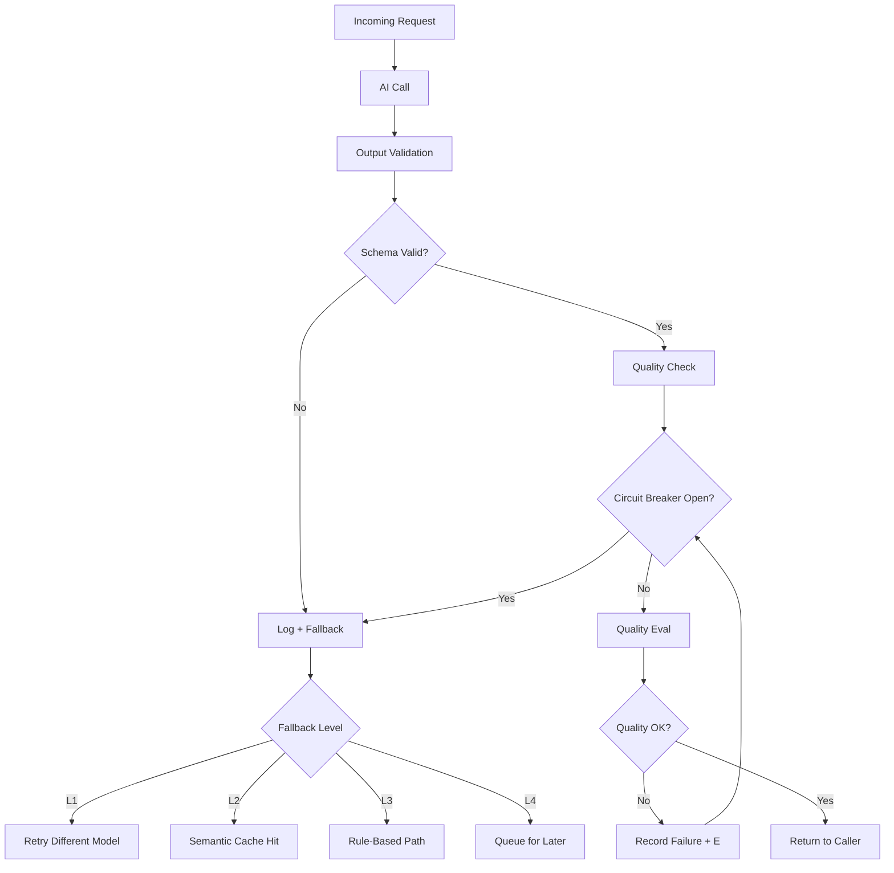

Traditional software fails with errors. Exceptions are raised, HTTP 500s are returned, circuit breakers trip. These failures are loud and relatively easy to detect. AI failures are different: the service returns 200, the response is structurally valid, and the output is wrong. Your monitoring sees a healthy system while your users are getting bad answers. That asymmetry — silent failures at the application layer — requires you to rethink how you design for fault tolerance from the ground up.



## The Four AI Failure Types

**Availability failures** are the most familiar: the AI service is down, rate-limited, or timing out. Traditional fault tolerance patterns apply — circuit breakers, exponential backoff, retry with jitter, fallback to a secondary provider. These failures are loud and your existing infrastructure handles them.

**Quality failures** are the hard ones: the model produces output that is technically valid but semantically wrong. Hallucinated facts, misunderstood intent, plausible-but-incorrect reasoning. No exception is raised. The request completed successfully. Detection requires evaluation, and evaluation requires building evaluation infrastructure — which most teams don't have when they first ship.

**Safety failures** occur when the model produces output that violates content policies, confidentiality requirements, or regulatory constraints. An AI assistant that surfaces a competitor's internal data when it shouldn't, or produces legally problematic content in a customer-facing context. Requires output filtering and monitoring, not just availability monitoring.

**Consistency failures** — the same input producing different outputs on different calls — break downstream systems that expect stable outputs. A downstream system that caches, indexes, or acts on AI output assumes the response for a given input is stable. Non-determinism violates that assumption in ways that surface as subtle, intermittent bugs.

## A Quality-Aware Circuit Breaker

Traditional circuit breakers trip on error rates. AI systems need a quality circuit breaker that trips when output quality degrades — which requires sampling and evaluating production outputs.

```python
import threading
from dataclasses import dataclass, field
from datetime import datetime, timedelta
from collections import deque

@dataclass
class AICircuitBreaker:
    failure_threshold: float = 0.15   # Trip if quality failure rate > 15%
    eval_window: int = 100            # Evaluate last N calls
    reset_timeout: int = 300          # Seconds before half-open attempt
    min_calls_to_evaluate: int = 10   # Don't trip on < 10 calls

    _results: deque = field(default_factory=lambda: deque(maxlen=100))
    _tripped_at: datetime = None
    _lock: threading.Lock = field(default_factory=threading.Lock)

    def record(self, is_quality_pass: bool):
        with self._lock:
            self._results.append(is_quality_pass)
            failure_rate = self._current_failure_rate()
            if (
                len(self._results) >= self.min_calls_to_evaluate
                and failure_rate > self.failure_threshold
                and self._tripped_at is None
            ):
                self._tripped_at = datetime.now()

    def _current_failure_rate(self) -> float:
        if not self._results:
            return 0.0
        return 1.0 - (sum(self._results) / len(self._results))

    @property
    def is_open(self) -> bool:
        if self._tripped_at is None:
            return False
        elapsed = datetime.now() - self._tripped_at
        if elapsed > timedelta(seconds=self.reset_timeout):
            # Half-open: reset and let next call through
            self._tripped_at = None
            self._results.clear()
            return False
        return True

    @property
    def failure_rate(self) -> float:
        return self._current_failure_rate()
```

The key design question: what counts as a quality failure? For structured outputs, it's a schema violation or a required field missing. For free-form responses, it requires an LLM judge or a lightweight heuristic (response too short, contains known failure patterns, confidence score below threshold). Don't wait until you have perfect evaluation methodology — start with heuristics and improve them over time.

## Fallback Hierarchy Design

Every AI feature needs a designed fallback chain. This is a product decision that should happen before you write the first line of AI integration code. When the AI is unavailable or quality-tripped, what happens?

**Level 1 — Retry with different model or provider**: if Claude is rate-limited, route to your secondary provider. If the flagship model is having quality issues, retry with a fresh call. Adds latency but preserves AI functionality.

**Level 2 — Semantic cache**: look up the current request against cached responses for semantically similar requests (not exact match — semantic similarity search over a vector cache). A customer asking "how do I reset my password?" at 2am when the AI is down should get the same cached response as the same question asked yesterday.

**Level 3 — Non-AI path**: rule-based, template-based, or manual lookup. The pre-AI answer to the question. This is the path that worked before you added AI — it should still work. If you removed it entirely when you added AI, you've created a single point of failure.

**Level 4 — Queue for later processing**: accept the request, queue it, process it when the AI recovers. Appropriate for async workflows. Not appropriate for synchronous user interactions.

## Output Validation as a First-Class Layer

Every AI output that flows into a downstream system or user interface should pass through an output validator. This is not optional — it's the layer that catches the most common failure modes before they propagate.

```python
import re
from typing import Any
from dataclasses import dataclass

@dataclass
class ValidationResult:
    valid: bool
    failures: list[str]

def validate_ai_output(
    output: Any,
    schema: dict,
    forbidden_patterns: list[str] = None,
    max_length: int = None,
) -> ValidationResult:
    failures = []

    # Schema validation
    for required_field in schema.get("required", []):
        if isinstance(output, dict) and required_field not in output:
            failures.append(f"Missing required field: {required_field}")

    # Length bounds
    if max_length and isinstance(output, str) and len(output) > max_length:
        failures.append(f"Output exceeds max length {max_length}: {len(output)}")

    # Minimum useful length (guards against empty or near-empty responses)
    if isinstance(output, str) and len(output.strip()) < 10:
        failures.append("Output suspiciously short — possible model refusal or error")

    # Forbidden content patterns
    for pattern in (forbidden_patterns or []):
        if re.search(pattern, str(output), re.IGNORECASE):
            failures.append(f"Forbidden pattern detected: {pattern}")

    return ValidationResult(valid=len(failures) == 0, failures=failures)
```

Add domain-specific validators on top of this base: numeric range checks for any outputs that should fall within a known range, format validators for structured fields (dates, IDs, URLs), and semantic validators for critical business fields.

## Idempotency for AI-Triggered Actions

If an AI agent takes actions — sends emails, creates tickets, modifies records, calls external APIs — those actions must be idempotent. Retrying a failed AI action should not create duplicate side effects. This is standard distributed systems practice but teams frequently miss it when building AI features.

The pattern: generate a deterministic action ID from the content of the intended action before executing it. Use this ID to deduplicate in your action execution layer.

```python
import hashlib
import json
from datetime import datetime

def action_id(action_type: str, action_content: dict) -> str:
    """Generate a deterministic ID for an action based on its content."""
    content = {
        "type": action_type,
        "content": action_content,
        # Include a time bucket if you want to allow the same action
        # to be taken again after a cooldown period
        "hour_bucket": datetime.utcnow().strftime("%Y-%m-%dT%H"),
    }
    return hashlib.sha256(
        json.dumps(content, sort_keys=True).encode()
    ).hexdigest()[:16]
```

Store executed action IDs in a fast store (Redis) with a TTL appropriate for your use case. Before executing any action, check if that ID has been executed. If yes, skip and log. If no, execute and record.

## Monitoring for Silent Failures

The key metric for AI systems is not error rate — it's quality rate, and quality is invisible to standard monitoring. You need a production eval pipeline:

1. Sample 1–5% of AI outputs (or all outputs for lower-volume systems) into an eval store
2. Run automated evaluation on the sample: LLM judge, rubric-based scoring, or human review depending on your throughput and stakes
3. Compute quality metrics per feature, per model, per time window
4. Alert on quality degradation — not just availability degradation

Without this, you have no signal that your AI feature is working well or poorly. You'll find out from support tickets or customer churn, weeks after the quality degraded.

The infrastructure investment is real: a sampling pipeline, an eval store, an automated evaluator, and dashboards. It takes a sprint to build and saves you from flying blind in production indefinitely. Build it before you go to production, not after your first quality incident.
