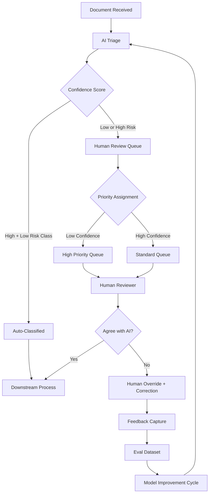

Many AI projects start with the goal of full automation. Some achieve it. A lot fail because the process has edge cases, judgment calls, and regulatory requirements that the AI handles poorly, and the teams discover this too late — after they've built toward full automation and can't easily insert human checkpoints they didn't design for. The teams that succeed usually designed the division of labor deliberately, before writing the first line of code.



## The Full Automation Trap

The promise is seductive: feed a document into the AI, get a decision out, no human involvement. For some processes and some document types, this works. For most enterprise workflows, it works on 80–90% of cases and fails in ways that are hard to detect on the other 10–20%.

The failure mode is insidious: the 10% that falls through isn't random. It tends to be the edge cases, the unusual formats, the documents from corner-case customers, the scenarios that weren't in the training data. These are also frequently the highest-stakes cases — the loan application from a customer with an unusual income structure, the support ticket from a technically sophisticated user with a non-standard setup, the contract clause that doesn't fit standard templates.

When you've built toward full automation and the 10% falls through incorrectly, you've either shipped incorrect decisions into production or you've built a system that fails silently. Neither is acceptable. The teams that designed for hybrid from the start have a human review path that catches these cases. The teams that designed for full automation are retrofitting one under pressure.

## The Automation Decision Matrix

Before designing any workflow, explicitly categorize each task along two dimensions: confidence level (how reliably does the AI get this right?) and consequence level (what happens when it's wrong?).

| | **Low Consequence** | **High Consequence** |
|---|---|---|
| **High AI Confidence** | Automate fully | AI decides, audit trail required |
| **Low AI Confidence** | AI draft, human approves | Human decides, AI provides analysis |

**High frequency, high confidence, low consequence — automate fully.** Classifying support tickets into routing categories. Extracting structured data from standard-format invoices. Summarizing meeting transcripts. The cost of occasional errors is low, and human review at this volume isn't cost-effective.

**High confidence, high consequence — automate with mandatory audit trail.** The AI can decide, but every decision is logged with the reasoning, the confidence score, and the input, and a human can audit any decision after the fact. Medical coding suggestions, financial transaction categorization, compliance flag generation.

**Low confidence or ambiguous, medium consequence — AI drafts, human approves.** The AI produces the artifact; a human reviews it before it goes out. Email responses, document summaries, content classification for regulatory purposes. The AI handles the mechanical work; the human owns the quality and correctness.

**Low AI confidence, high consequence — human decides, AI provides analysis.** AI surfaces relevant context, flags similar past cases, and provides structured analysis to support the human decision. The human makes the call. Legal review, underwriting decisions, escalated compliance cases.

## Modeling the Workflow as a State Machine

Once you've decided on the division of labor, model the workflow explicitly. A state machine makes the handoff points clear and keeps the implementation honest about where humans are actually involved.

```python
from enum import Enum
from dataclasses import dataclass, field
from datetime import datetime

class DocumentState(Enum):
    RECEIVED = "received"
    AI_TRIAGING = "ai_triaging"
    AUTO_CLASSIFIED = "auto_classified"
    PENDING_HUMAN_REVIEW = "pending_human_review"
    IN_HUMAN_REVIEW = "in_human_review"
    HUMAN_REVIEWED = "human_reviewed"
    COMPLETED = "completed"
    ESCALATED = "escalated"

# Classes where errors are too costly to automate even at high confidence
HIGH_RISK_CLASSES = {"fraud_suspected", "legal_hold", "regulatory_breach"}

@dataclass
class Document:
    id: str
    content: str
    state: DocumentState = DocumentState.RECEIVED
    ai_classification: str | None = None
    ai_confidence: float | None = None
    ai_reasoning: str | None = None
    human_reviewer: str | None = None
    human_override: str | None = None
    created_at: datetime = field(default_factory=datetime.utcnow)

    def apply_triage(self, ai_result: dict) -> "Document":
        self.ai_classification = ai_result["classification"]
        self.ai_confidence = ai_result["confidence"]
        self.ai_reasoning = ai_result.get("reasoning")

        auto_classify = (
            ai_result["confidence"] > 0.92
            and ai_result["classification"] not in HIGH_RISK_CLASSES
        )

        self.state = (
            DocumentState.AUTO_CLASSIFIED
            if auto_classify
            else DocumentState.PENDING_HUMAN_REVIEW
        )
        return self

    def assign_reviewer(self, reviewer_id: str) -> "Document":
        assert self.state == DocumentState.PENDING_HUMAN_REVIEW
        self.human_reviewer = reviewer_id
        self.state = DocumentState.IN_HUMAN_REVIEW
        return self

    def complete_review(self, agreed: bool, override_classification: str = None) -> "Document":
        assert self.state == DocumentState.IN_HUMAN_REVIEW
        if not agreed and override_classification:
            self.human_override = override_classification
        self.state = DocumentState.HUMAN_REVIEWED
        return self

    def finalize(self) -> "Document":
        self.state = DocumentState.COMPLETED
        return self

    @property
    def final_classification(self) -> str:
        return self.human_override or self.ai_classification
```

The state machine makes it impossible to accidentally skip the human review step for documents that require it, and it provides a clear audit trail of every state transition with timestamps.

## The Feedback Loop Requirement

Hybrid workflows only improve if human decisions flow back to evaluate and improve the AI component. This is the part teams most frequently skip — they build the workflow, ship it, and the AI component stays at its initial quality level while human effort accumulates indefinitely.

Design the feedback capture at the same time as the workflow:

```python
from dataclasses import dataclass
from datetime import datetime

@dataclass
class ReviewFeedback:
    document_id: str
    ai_classification: str
    ai_confidence: float
    human_agreed: bool
    human_classification: str  # same as AI if agreed, different if overridden
    reviewer_id: str
    reviewed_at: datetime
    correction_reason: str | None = None

def capture_feedback(document: Document, agreed: bool, override: str = None) -> ReviewFeedback:
    return ReviewFeedback(
        document_id=document.id,
        ai_classification=document.ai_classification,
        ai_confidence=document.ai_confidence,
        human_agreed=agreed,
        human_classification=override if override else document.ai_classification,
        reviewer_id=document.human_reviewer,
        reviewed_at=datetime.utcnow(),
        correction_reason=None,  # Capture this in the UI too
    )
```

Aggregate this feedback into an eval dataset. Review it monthly. The agreement rate by confidence band tells you where to adjust your automation threshold. The correction patterns tell you which classes the AI is systematically getting wrong. This data drives both short-term threshold tuning and long-term model improvement.

## Queue Management and Priority

When AI volume exceeds human review capacity — which happens during spikes — you need a queue with sensible priority rules. A naive first-in-first-out queue means reviewers process low-stakes, high-confidence items (the ones that least need review) before high-stakes, low-confidence items (the ones that most need it).

Priority should be inversely proportional to AI confidence and proportional to consequence level. A document the AI is 60% confident about should be reviewed before a document the AI is 95% confident about. A document in a high-risk class should be reviewed before one in a low-risk class at the same confidence level.

Get this wrong and you've built a queue that optimizes for throughput while leaving your highest-risk cases waiting longest.

## The Human Experience of Reviewing AI Output

Reviewers who feel like they're rubber-stamping AI decisions stop reviewing carefully. This is a real behavioral dynamic, not a hypothetical concern. When every document's AI classification looks right and reviewers rarely catch errors, they start approving without reading. The quality of human oversight degrades.

Two design choices that counteract this:

**Surface the AI's reasoning, not just its output.** Show the reviewer why the AI made this classification — the specific evidence it weighted, the confidence factors, the alternative classifications it considered. Reviewers who understand the reasoning can identify when the reasoning is flawed even when the conclusion looks plausible.

**Design the interface to require active engagement.** A checkbox labeled "AI classification is correct" requires less thought than a UI that asks "which sections of this document support the classification?" The interface design shapes reviewer behavior. Invest in it.

## Calibration Over Time

The automation thresholds you set on day one are guesses based on limited data. They should be recalibrated regularly — monthly or quarterly — as you accumulate feedback data and as AI model quality changes.

What starts as "automate at 0.92 confidence" might become "automate at 0.88 confidence" as the model improves on your data distribution. What was 60% automated might become 80% automated over six months. Track the recalibration decisions and the data that drove them — this is how you justify the AI investment to stakeholders who want to see efficiency improving over time.
