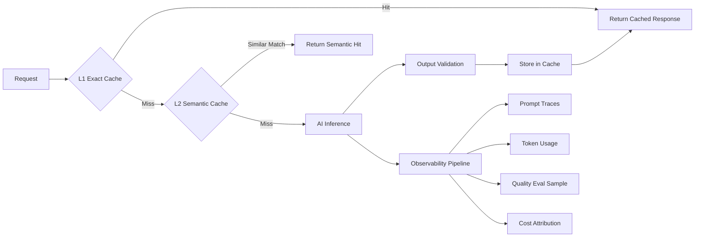

Most system design assumes deterministic components: a database query costs microseconds and returns a predictable result; a microservice call costs milliseconds and follows a documented contract; a cache lookup is fast and binary (hit or miss). Add an AI component and those assumptions break. You have a component with variable latency measured in seconds, non-deterministic output, per-call cost proportional to token volume, and quality characteristics that change over time as models are updated. Systems designed around deterministic assumptions fail in subtle ways when AI is inserted.



## The Inference Cost Component

A database query that costs $0.000001 and an AI inference call that costs $0.01 are in different economic categories. Architectural decisions that are effectively free in traditional systems become expensive when applied to AI inference.

"Retry on failure" costs nothing for a database call. It costs $0.01+ for every unnecessary retry of an AI inference call. "Process every event in the stream" is standard for a stream processor. Processing every event through AI inference requires careful event filtering to avoid spending $50/hour on a stream that deserves $2/hour. "Call the API for every user action" is normal for a REST service. Calling an AI API for every user action, without caching, produces an inference bill that scales with activity in a way that surprises finance teams.

Inference cost must be a first-class design constraint, not an afterthought. Before any AI feature is designed, answer: what's the expected call volume? What's the average input/output token count? What's the monthly cost at that volume? What's the budget? Build the feature to fit within the budget, not the other way around.

## Caching as a Core Architecture Component

For AI-augmented systems, caching isn't an optimization — it's a core architectural component. You need at least two layers:

**L1 — Exact match cache**: hash the prompt (after normalization to remove irrelevant whitespace and formatting variation) and cache the response. Redis with an appropriate TTL. Very fast lookup. Highest cost reduction for repeated identical prompts. Simple to implement.

**L2 — Semantic similarity cache**: store embedded representations of past prompts and use vector search to find semantically similar cached prompts. A 90%+ similar prompt probably deserves the same response as a cached one. More complex to implement but handles natural language variation (users asking the same thing in slightly different words).

**L3 — AI inference**: always the most expensive path. Everything above is trying to avoid reaching this layer.

```python
import hashlib
import json
from anthropic import Anthropic
import redis
from typing import Any

client = Anthropic()
cache = redis.Redis(host="localhost", port=6379, db=0)

CACHE_TTL = 3600  # 1 hour default

def normalize_prompt(prompt: str) -> str:
    """Normalize prompt before hashing to improve cache hit rate."""
    return " ".join(prompt.lower().split())

def cache_key(prompt: str) -> str:
    normalized = normalize_prompt(prompt)
    return f"ai:v1:{hashlib.sha256(normalized.encode()).hexdigest()}"

def get_cached(prompt: str) -> str | None:
    key = cache_key(prompt)
    hit = cache.get(key)
    if hit:
        cache.incr("metrics:cache_hits")
        return hit.decode()
    cache.incr("metrics:cache_misses")
    return None

def set_cached(prompt: str, response: str, ttl: int = CACHE_TTL):
    key = cache_key(prompt)
    cache.setex(key, ttl, response)

def ai_with_cache(prompt: str, model: str = "claude-sonnet-4-6") -> dict[str, Any]:
    if cached := get_cached(prompt):
        return {"response": cached, "source": "cache", "tokens_used": 0, "cost": 0.0}

    message = client.messages.create(
        model=model,
        max_tokens=1024,
        messages=[{"role": "user", "content": prompt}]
    )
    response = message.content[0].text
    set_cached(prompt, response)

    return {
        "response": response,
        "source": "inference",
        "tokens_used": message.usage.input_tokens + message.usage.output_tokens,
        "input_tokens": message.usage.input_tokens,
        "output_tokens": message.usage.output_tokens,
    }
```

Track cache hit rates per feature and per prompt category. A feature with a 20% cache hit rate has very different economics than a feature with an 80% hit rate — and both are meaningful signals about how much prompt variation exists in that feature's traffic.

## Latency Budget Allocation

AI inference latency (2–10 seconds for complex requests) dwarfs traditional component latency. A system with a 3-second total response time budget that inserts a synchronous AI call consuming 4 seconds has broken its latency contract. Latency budget allocation must be explicit before any AI feature is designed.

Three architectural modes for handling AI latency:

**Synchronous** — the user waits for the AI response. Budget: must fit inside the user-acceptable wait time (typically 10 seconds at most for interactive applications; 3 seconds for conversational UI). Use streaming to give the user progressive feedback. Use faster, smaller models where quality permits. Minimize context length.

**Asynchronous** — the AI processes in the background; the result is returned later (webhook, poll endpoint, push notification). No latency constraint from the user's perspective. Use flagship models, full context, highest quality. The latency budget is measured in seconds-to-minutes, not milliseconds.

**Pre-computed** — run the AI inference ahead of time, cache the result, serve from cache at query time. Zero AI latency at query time. Requires predicting what users will need. Appropriate for common queries, recommendation generation, content classification that can run overnight.

Most AI-augmented systems need all three modes operating simultaneously, routing different request types to the appropriate mode based on urgency and latency tolerance.

## Data Pipeline Changes

AI components introduce data flows that traditional systems don't have. These need to be designed, not discovered.

**Prompt logging**: every prompt sent to the AI should be logged somewhere (with PII scrubbing where required). Prompt logs are your primary debugging tool for production AI behavior. Without them, you can't reproduce or understand incidents.

**Human feedback capture**: wherever humans interact with AI outputs — approving, rejecting, correcting — those interactions are data. Capture them. They become your eval dataset, your training signal, and your quality measurement.

**Eval dataset management**: the test set for your AI features needs to be managed like production data. It drifts over time (new cases emerge that aren't represented). It needs versioning. It needs access controls if it contains sensitive examples.

**Cost tracking by feature**: your monthly AI bill is a single number that obscures wide variation across features. A billing system that attributes inference cost to specific features, user cohorts, or workflow steps is the only way to make intelligent decisions about where to optimize. Implement cost attribution from day one.

## The Model Version Dependency Problem

AI components have a dependency that traditional software components don't: the model version. When a provider updates a model, the behavior changes. When a provider deprecates a model, you must migrate. Unlike library versions, you can't pin a model indefinitely — Anthropic, OpenAI, and Google all have model deprecation schedules.

Design your system to swap model versions with controlled testing:

```python
from enum import Enum
from dataclasses import dataclass

class ModelTier(Enum):
    FAST = "fast"       # claude-haiku-4-5 or equivalent
    STANDARD = "standard"  # claude-sonnet-4-6 or equivalent
    POWERFUL = "powerful"  # claude-opus-4-5 or equivalent

MODEL_REGISTRY = {
    ModelTier.FAST: "claude-haiku-4-5",
    ModelTier.STANDARD: "claude-sonnet-4-6",
    ModelTier.POWERFUL: "claude-opus-4-5",
}

def get_model(tier: ModelTier, override: str = None) -> str:
    """
    Get the model ID for a given tier.
    Override allows A/B testing new models without changing feature code.
    """
    return override or MODEL_REGISTRY[tier]
```

When a new model version is available, test it against your eval suite before switching. When a model is deprecated, you have a feature flag to route to the new version. Model migration becomes a controlled operation rather than an emergency.

## Observability Requirements

AI-augmented systems need additional observability layers compared to traditional systems. Standard APM (latency, error rate, throughput) is necessary but not sufficient.

**Prompt traces**: what prompts are being sent to the model, with what context, and with what results. This is the AI equivalent of database query logging. Essential for debugging.

**Token usage metrics**: input tokens, output tokens, and total tokens per request, per feature, per user cohort. Tokens are money. Understanding where tokens are going is understanding where costs are going.

**Quality metrics**: sampled eval scores from production traffic. The single most important AI-specific metric. Without it, you don't know if your AI feature is working well or degrading.

**Cost attribution**: inference spend broken down by feature, workflow, and user segment. The only way to make intelligent cost optimization decisions.

Instrument all four from day one. Adding them after the fact requires retrofitting through code that wasn't written to support it, and you'll have months of production behavior you can't reason about.
