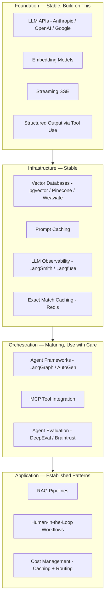

The AI tooling landscape has shifted dramatically since 2024. What was a research prototype two years ago — RAG, structured output, multi-modal, agent frameworks — is now production infrastructure with established patterns and mature libraries. The hype cycle ran its course on some things (fully autonomous agents in production), and the practical value of others exceeded early expectations (prompt caching, structured output as a reliability primitive). Here's where things actually stand heading into 2027.

## The Settled Layer — Build on This Confidently

**LLM APIs** from Anthropic, OpenAI, and Google are mature infrastructure. SLAs are published and generally met. Rate limit management is documented. SDK clients handle retries, streaming, and error handling correctly. The provider landscape has stabilized to three primary players for enterprise use, with regional and specialized providers filling niches. The Models-as-a-Service paradigm is stable — you're not building inference infrastructure.

**RAG infrastructure** is production-grade. The basic pattern — chunk documents, generate embeddings, store in a vector database, retrieve on query, generate with context — is well-understood and well-documented. pgvector works at moderate scale without operational overhead. Pinecone and Weaviate handle high-scale workloads in production for thousands of companies. The chunking strategies, embedding model selection, retrieval patterns, and reranking techniques are documented with empirical comparisons.

**Prompt caching** via Anthropic's ephemeral cache (and equivalent features at other providers) is production-stable and widely deployed. 70–90% cost reduction for systems with repeated long system prompts or reference documents is reliable and measurable. The implementation is straightforward — mark cache-eligible content blocks, let the provider handle the rest. If you're paying full price for inference on repeated context, you're leaving significant savings on the table.

**Structured output via tool use** is stable across Anthropic and OpenAI. The pattern — define a schema as a tool, force the model to call it, parse the structured response — produces reliable structured output from LLMs without fragile prompt engineering or regex parsing. Pydantic integration is mature on both sides. This pattern is now table stakes for any AI pipeline that moves data between systems.

**LLM observability** with tools like LangSmith and Langfuse is production-grade. OpenTelemetry GenAI semantic conventions are stabilizing, which matters for teams with existing OTel infrastructure. Helicone works well for teams that want minimal setup. If you're operating AI in production without LLM observability, you're flying blind — pick one and set it up before your first deployment.

**Streaming** via Server-Sent Events is universally supported and correctly handled by client libraries. The patterns for progressive rendering on the frontend, streaming aggregation on the backend, and error handling mid-stream are documented and understood. Streaming is no longer an advanced feature — it's the default for any interactive AI application.

## The Maturing Layer — Production-Usable With Caveats

**Agentic frameworks** — LangGraph, Microsoft AutoGen, AWS Strands — are production-usable for specific, well-scoped use cases. LangGraph is the most mature for stateful agent workflows. AutoGen is stronger for multi-agent conversations. Strands is gaining adoption in AWS-native teams. All three are evolving rapidly. Pin versions aggressively. Expect breaking changes between minor versions. Don't build a system that depends on framework internals. The patterns they implement (supervisor/worker, pipeline, state machine) are stable; the specific APIs are not.

**MCP (Model Context Protocol)** is increasingly the standard for AI tool integration. The protocol is stable. The server ecosystem is growing — Anthropic, GitHub, Google, and hundreds of community implementations exist. Implementation quality varies widely: some MCP servers are production-grade; others are proofs of concept. Before adopting any MCP server in a production workflow, audit it: does it handle errors gracefully? Does it have reasonable timeouts? Does it expose credentials it shouldn't? The protocol is sound; the ecosystem quality requires evaluation.

**Agent evaluation** tooling — DeepEval, Braintrust, RAGAS — is usable and valuable. The tooling is production-ready. The methodology is still evolving. What metrics matter for your specific use case, how to build representative evaluation datasets, and how to automate quality gates into your deployment pipeline are still active questions without universal answers. Start with the available tooling and expect to iterate on your eval approach.

**Fine-tuning** is available for most frontier models and delivers real improvements for behavior, tone, and format alignment. For knowledge-intensive tasks, well-engineered RAG consistently outperforms fine-tuning and is far easier to update. The teams that went deep on fine-tuning in 2024 mostly found this the hard way. Fine-tuning is real and valuable — but for the right problem (style, behavior, format) rather than the one it's usually pitched for (knowledge injection).

## The Still-Shifting Layer — Use Cautiously

**Computer use and browser agents** are available but not production-grade for anything beyond simple, controlled tasks in controlled environments. Reliability degrades quickly with UI variation, page structure changes, and unexpected states. Useful for automation in controlled internal tools; fragile in the real world.

**Long-context reasoning at 200K+ tokens** works but has well-documented quality degradation for content in the middle of very long contexts ("lost in the middle"). Don't assume a 200K context window eliminates the need for retrieval. For knowledge-intensive applications, retrieval of relevant context still outperforms flooding the context with everything. Long context and RAG are complementary tools, not alternatives.

**Voice and audio AI** is improving rapidly but is not at the integration maturity of text AI. The models are impressive; the production infrastructure (latency management, interruption handling, multi-speaker scenarios, noise robustness) requires significant engineering work that hasn't been packaged into reliable libraries yet.

## The 2026 Reference Stack

If you're starting a new AI-augmented system today, this is what I'd use:

| Layer | Choice | Notes |
|---|---|---|
| **Inference** | Anthropic (primary), OpenAI (secondary) | Claude for quality; OpenAI for specific use cases |
| **Orchestration** | LangGraph for complex agents; direct SDK for simple chains | Don't over-framework simple workflows |
| **Vector DB** | pgvector (moderate scale); Pinecone or Weaviate (high scale) | Start with pgvector; migrate if needed |
| **Caching** | Redis (exact match); pgvector/Qdrant (semantic) | Exact match first; semantic when volume justifies it |
| **Observability** | LangSmith or Langfuse | Both are good; pick one early and don't switch |
| **Evaluation** | DeepEval for automated gates; LLM-as-judge for production sampling | Both in production from day one |
| **Gateway** | LiteLLM for routing + rate limiting | Especially useful if you use multiple providers |

What I wouldn't do: adopt a new framework just because it's getting attention on social media. The tools in the "settled" layer got there because they work reliably at scale. New tools should earn production adoption through rigorous testing in non-critical workflows before you depend on them for something that matters.

The AI tooling landscape will continue to change in 2027. Multi-agent reliability will improve. New modalities will mature. Evaluation methodology will converge. But the foundation layer — APIs, RAG, structured output, observability — is stable enough to build on confidently today.
