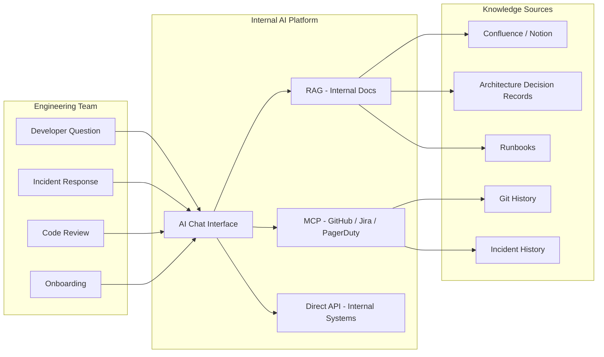

Most AI investment goes toward customer-facing products. That's where the visible demos are, where the competitive pressure is, where the board asks about it. Internal developer tooling gets scraps. This is backwards. An AI assistant that saves each of your 50 engineers 15 minutes per day on average is 750 engineer-minutes per day — 12.5 hours — every single day, indefinitely. The ROI compounds continuously and doesn't require a sales funnel to realize it.



## The Five Highest-ROI Internal AI Applications

**1. Internal knowledge search and AI chat over documentation**

Engineering teams accumulate vast amounts of internal knowledge — architecture decision records, runbooks, design docs, post-mortems, onboarding guides, Confluence pages, Notion docs, Slack threads — that's practically unsearchable in practice. The search interface on most internal wikis is keyword search that returns 40 results for any query, and engineers give up after the first page.

An AI assistant grounded in this documentation changes the economics of knowledge retrieval entirely. "Why did we choose PostgreSQL over MongoDB for this service?" should take 30 seconds, not 20 minutes of Confluence archaeology. "What's the escalation process for a P1 in the payments service at 2am?" should be instant. "What did the postmortem for the Q3 outage conclude about our caching strategy?" should surface the answer, not require the engineer to remember which quarter the outage was and navigate to the right page.

The implementation pattern is straightforward RAG: ingest, chunk, embed, store, retrieve, generate. The organizational work is harder: getting access to all the documentation sources, handling permissions (don't surface a restricted document to someone who can't access the original), keeping the index current as documentation changes. Start with a single high-value corpus (runbooks or ADRs) and expand from there.

**2. Automated code review assistance**

An AI reviewer that runs on every PR and comments before human reviewers see it isn't replacing code review — it's doing the mechanical parts so humans can focus on the interesting parts. Missing error handling, security antipatterns (SQL injection risk, hardcoded credentials, improper input validation), inconsistent style, obvious missing test cases — these are the things that consume 20% of a human reviewer's attention and add nothing to the review conversation.

The best implementations I've seen route different review types to different reviewers: the AI handles style and safety; human reviewers handle architecture, business logic, and correctness. The PR description includes an AI review summary that the human reviewer reads first. Review turnaround time drops because humans aren't burning time on the easy things.

**3. Runbook automation assistant**

A runbook is a list of steps to execute during an incident or operational procedure. Most runbooks have a mix of "gather information" steps (check this metric, run this query, look at these logs) and "take action" steps (restart this service, scale up this deployment, roll back this release). The information-gathering steps are where engineers spend most of their time at 2am — navigating dashboards, running queries, correlating signals across systems.

An AI assistant that can execute the read-only information-gathering steps of a runbook — query Datadog for the relevant metrics, pull the last 100 error log lines, check the current deployment status — and present the findings in a structured summary dramatically reduces the time between "incident declared" and "engineer understands the situation." The engineer still decides what action to take. But they're deciding based on a synthesized picture rather than assembling that picture manually.

**4. Onboarding assistant**

New engineers have hundreds of questions in their first 90 days. "What's the deployment process for the payment service?" "Who owns the authentication service?" "Why is this code pattern used everywhere — is it a convention or a framework requirement?" "What's the process for getting production access?" These questions have answers — they're in the documentation — but finding them requires knowing where to look, which new engineers don't know yet.

An onboarding assistant changes the experience: ask any question, get an answer, follow up with clarifying questions. The answers come from actual internal documentation, with citations to the source so the engineer can read more deeply. Senior engineers stop getting pinged for questions that have written answers. New engineers ramp up faster because they're not blocked on access to knowledge.

**5. Incident summarization and postmortem drafting**

After a multi-hour incident, someone has to write the postmortem. The timeline reconstruction alone — piecing together what happened from Slack messages, PagerDuty alerts, Datadog events, deployment logs, and people's memories — takes hours. An AI that can ingest the incident timeline from all these sources and produce a structured draft postmortem gets 60% of the work done before the engineer opens a document.

The engineer edits, adds nuance, verifies the technical details, and writes the recommendations. They don't write the timeline from scratch, search for which alert fired first, or reconstruct who said what when in the Slack channel. The postmortem quality improves because the mechanical parts are handled and engineers can focus on the analytical parts.

## Building Internal Knowledge Search

Here's a production-ready implementation pattern for the knowledge search assistant:

```python
from anthropic import Anthropic
from typing import Any

client = Anthropic()

SYSTEM_PROMPT = """You are an internal engineering assistant for our team.
Answer questions using only the documentation provided in the context below.
Always cite the source document and section for each key claim.
If the documentation doesn't cover the question, say so clearly — do not infer or guess.
If you find conflicting information in different documents, surface both and flag the conflict."""

def answer_internal_question(
    question: str,
    retrieved_docs: list[dict[str, Any]],
    conversation_history: list[dict] = None,
) -> dict[str, Any]:
    """
    Answer an internal engineering question using retrieved documentation.

    Args:
        question: The engineer's question
        retrieved_docs: List of dicts with keys: title, source, url, content
        conversation_history: Prior turns in the conversation for follow-up questions

    Returns:
        Dict with answer text and cited sources
    """
    context_blocks = []
    for doc in retrieved_docs:
        context_blocks.append(
            f"**{doc['title']}**\nSource: {doc['source']}\nURL: {doc.get('url', 'N/A')}\n\n{doc['content']}"
        )
    context = "\n\n---\n\n".join(context_blocks)

    messages = conversation_history or []
    messages.append({
        "role": "user",
        "content": f"<documentation>\n{context}\n</documentation>\n\nQuestion: {question}"
    })

    response = client.messages.create(
        model="claude-sonnet-4-6",
        max_tokens=2048,
        system=SYSTEM_PROMPT,
        messages=messages,
    )

    answer = response.content[0].text
    cited_sources = [
        {"title": doc["title"], "url": doc.get("url")}
        for doc in retrieved_docs
        if doc["title"].lower() in answer.lower()
    ]

    return {
        "answer": answer,
        "cited_sources": cited_sources,
        "input_tokens": response.usage.input_tokens,
        "output_tokens": response.usage.output_tokens,
    }
```

The key implementation detail: the system prompt instructs the model to cite sources and flag when the documentation doesn't cover the question. Both of these behaviors require explicit instruction — the model will hallucinate confidently if you don't tell it not to.

## The MCP Approach for Developer Tools

Instead of bespoke integrations for every internal system, expose internal systems as MCP servers and give engineers a single AI interface that queries all of them. Engineers ask natural language questions; the AI calls the appropriate tools and synthesizes the results.

"What PRs are blocked on my team's review?" — AI calls GitHub via MCP and returns the list.
"Are there any open P1s for the payments service right now?" — AI queries PagerDuty via MCP.
"What was the deployment before the incident started?" — AI queries your deployment system via MCP and cross-references with the incident timestamp.

The engineering work is building and maintaining the MCP servers for your internal systems. The payoff is a unified interface that doesn't require engineers to switch between six different dashboards to assemble context.

## Build vs. Buy

**Buy when**: the tool you need exists commercially at acceptable quality. GitHub Copilot for code completion. Glean for knowledge search (if your budget supports it). Splunk AI for log analysis. Faster to value, less maintenance overhead.

**Build when**: your internal systems are too proprietary for commercial tools, you need integrations that commercial tools don't support, or you need to combine multiple data sources in ways commercial tools don't support.

**The middle path**: use the Anthropic API with custom RAG over your internal docs. Faster than building everything; more flexible than buying. This is the right starting point for most teams — ship something in 4 weeks, iterate based on what engineers actually use.

## Measuring ROI Before and After

Define your metrics before you build. For internal knowledge search: average time to answer a representative set of 50 internal questions (measure manually before and after). For incident response: time from incident declaration to first responder understanding (track in your incident management system). For onboarding: time to first merged PR, time to first solo feature.

Collect baseline data before you deploy. AI tooling benefits are real but can be hard to attribute without a before/after measurement. You'll need the numbers when leadership asks whether the investment paid off.

## The Adoption Problem

The failure mode that kills more internal tools than technical flaws is neglecting adoption. You can build the best internal knowledge assistant in the world and have 10% adoption three months after launch if you don't invest in rollout. Engineers are busy. They won't discover tools organically.

Budget for adoption work: live demos in team standup, a dedicated Slack channel for tips and feedback, team champions who are early adopters and evangelists, and visible success stories. The ROI is only realized when engineers are actually using the tool daily.
