Two years after the agent hype peaked, the industry has sorted through what's real. Enterprise teams that deployed AI in 2024 and 2025 have production data now. The experiments are over; the results are in. Some patterns delivered exactly what they promised. Some delivered more than expected. Some were quietly shelved after six months of reliability problems. Here's a practitioner's account of what actually happened.

```mermaid
flowchart LR
    subgraph Level1["Ad Hoc — Individual AI Use"]
        A[Copilot Code Completion]
        B[ChatGPT for Drafting]
    end

    subgraph Level2["Foundational — Team-Level Adoption"]
        C[RAG Pipelines in Production]
        D[LLM Observability Active]
        E[Eval Infrastructure in CI]
        F[Structured Output Standard]
    end

    subgraph Level3["Systematic — Workflow Integration"]
        G[Agentic Workflows with Approval Gates]
        H[Human-in-the-Loop Automation]
        I[AI Cost Management Active]
    end

    subgraph Level4["Optimized — Platform Thinking"]
        J[Internal AI Platform Team]
        K[Cross-Team Eval Standards]
        L[Continuous Quality Improvement]
        M[Governance and Compliance Framework]
    end

    Level1 --> Level2
    Level2 --> Level3
    Level3 --> Level4
```

## Patterns That Proved Out

**RAG over fine-tuning for most enterprise knowledge tasks** is the clearest win in the 2024–2026 period. The teams that invested heavily in fine-tuning in 2024 — spending months on data preparation, training runs, and evaluation — mostly found that a well-engineered RAG pipeline with good retrieval outperformed their fine-tuned models for knowledge-intensive tasks. And RAG is dramatically easier to update when the knowledge base changes. Fine-tuning requires a new training run; RAG requires updating the document index.

Fine-tuning is real and valuable — just not for the use case it was usually pitched for. Fine-tuning excels at behavior alignment (teaching the model a specific tone, response format, or communication style) and domain-specific output formatting. It's not a reliable mechanism for injecting factual knowledge into a model. Teams that figured this out early saved significant engineering time.

**Structured output via schema-constrained generation** is now table stakes for any AI pipeline that moves data between systems. Teams that standardized on tool-use-based structured output had dramatically fewer production incidents from malformed AI output compared to teams that parsed free-form prose with regex. The quality difference isn't subtle — free-form parsing fails in production with a frequency that is genuinely surprising until you experience it. The pattern is settled: define a schema as a tool definition, require the model to call it, parse the typed response. Use this everywhere you move AI output into a downstream system.

**Agentic systems with explicit human approval gates** outperformed fully autonomous equivalents in almost every production deployment. The agents that shipped and stayed in production had checkpoints where a human could review and approve before consequential actions were taken. "Do you want me to proceed with creating these 47 JIRA tickets?" before creating them. "I'm about to send this email to 200 customers — confirm to proceed?" The agents that operated fully autonomously had a small but non-negligible rate of consequential errors that eroded trust and led to either rollback or much tighter constraints being added after the fact.

**Evaluation as development infrastructure** separated the teams that shipped reliably from the teams that shipped and scrambled. The teams that built eval pipelines alongside features — defining what "good" looks like for the AI output, creating evaluation datasets, running automated eval in CI — caught regressions before they reached production. The teams that treated evaluation as a post-development activity discovered regressions in production, from user complaints, weeks after the regression was introduced. Eval is to AI features what unit tests are to deterministic code. The discipline is the same; the tooling is different.

**Prompt caching for cost management** became standard practice in 2026 after provider support matured. 70–90% cost reduction for systems with repeated long context is reliable and measurable. Every team running AI at meaningful scale should have prompt caching instrumented. If your system prompt is longer than 1,000 tokens and is included in every request, you're overpaying by a factor of 3–10x.

**LLM observability from day one** is a lesson that most teams learned the hard way. Teams that started without AI observability and added it later had months of production behavior they couldn't reason about. When a quality issue surfaced — inconsistent outputs, higher refusal rates, degraded relevance — they couldn't determine when it started, what changed, or which specific prompt patterns were affected. Starting with observability is a sprint of upfront investment that pays indefinitely. Langfuse and LangSmith both work well; pick one before you go to production.

## Myths That Didn't Hold Up

**"AI will replace most software engineers within 2 years"** — AI made engineers more productive in measurable ways. The tasks AI handles well — code generation from specifications, boilerplate, test scaffolding, documentation, refactoring to a specified pattern — are real and the time savings are real. But they represent a fraction of what engineering work actually is. Architecture decisions, debugging complex distributed systems under time pressure, navigating organizational dynamics, making judgment calls with incomplete information — these remain human work. The teams that thought AI would let them run with fewer engineers and tried to do so had reliability and quality problems. The teams that used AI to make their existing engineers more effective shipped better software faster.

**"Fully autonomous AI agents are production-ready"** — The agents that stayed in production were the ones with guardrails, human checkpoints, and constrained action spaces. The fully autonomous ones had a tail of low-probability, high-impact failures that accumulated over time. The economics look different over a six-month horizon than over a two-week evaluation period. Short evals capture the common cases; production over time finds the edge cases. The lesson: autonomy should be earned incrementally, not assumed from the start.

**"Bigger context windows eliminate the need for RAG"** — 200K token context windows are available and genuinely useful. They don't replace retrieval. The "lost in the middle" quality degradation for content far from the beginning or end of a very long context is real and significant for knowledge-intensive tasks. RAG retrieves the most relevant context; long context floods with everything. Both tools have their place. Teams that concluded "we have a 200K context window, we don't need RAG" regretted it.

**"AI coding tools eliminate the need for rigorous code review"** — AI-generated code has a specific failure mode: it looks correct, reads fluently, and is subtly wrong in ways that don't surface in obvious tests. Code review became more important with AI coding tools, not less — but its focus shifted. Syntax, style, and obvious errors are now mostly handled by the AI tools. Human review needs to focus on semantic correctness (does this code actually do what the ticket says it should?), architectural fit (does this approach fit our system's patterns?), and long-term maintainability. Teams that loosened code review standards because "the AI wrote it" shipped bugs that would have been caught by a human reviewer looking for the right things.

**"Foundation model quality has converged — just use the cheapest"** — Quality differences between model tiers remain real and significant for complex tasks. The teams that commoditized to the cheapest available model for all tasks paid with reliability and output quality. The teams that developed a model routing strategy — lightweight models for simple classification and extraction, standard models for general generation, powerful models for complex reasoning — got both quality and cost efficiency. Task complexity is the relevant variable for model selection, not cost alone.

## What the Successful Teams Had in Common

Looking at the teams that got the most value from AI in 2026, a few common traits emerge:

They treated AI as engineering infrastructure with the same rigor they apply to databases, message queues, and microservices. Observability, testing, incident management, capacity planning — the same discipline.

They built evaluations before or alongside features, not after. They defined what "correct" looked like before they built anything, and they could measure whether their implementation achieved it.

They started with human-in-the-loop designs and automated cautiously as they accumulated evidence that automation was reliable. The trust was earned by data, not assumed.

They measured ROI with leading indicators (eval scores, human correction rates, task completion rates) and lagging indicators (support ticket volume, engineer productivity metrics, user adoption). They could point to specific numbers.

They maintained a stable model portfolio of two or three models rather than chasing every new release. Stability in model selection reduces the evaluation overhead of every new model choice.

## What's Coming in 2027

I'll be honest about the uncertainty here: AI predictions have a poor track record over 12-month horizons. With that caveat:

Multi-agent orchestration reliability is improving as frameworks mature and production patterns get documented. The infrastructure for running multiple agents collaboratively is getting better; the reliability problems are getting worked on.

Enterprise AI governance frameworks are maturing alongside regulatory requirements. Compliance tooling for AI is getting more sophisticated. The "AI platform team" is emerging as a standard internal function at mid-to-large companies — not a team doing AI experiments, but a team managing AI infrastructure the way platform engineering teams manage cloud infrastructure.

The engineers who will navigate 2027 well are the ones who built rigorous habits in 2026: evaluation-first development, human-in-the-loop design, observability from day one, and honest measurement of what's actually working.
