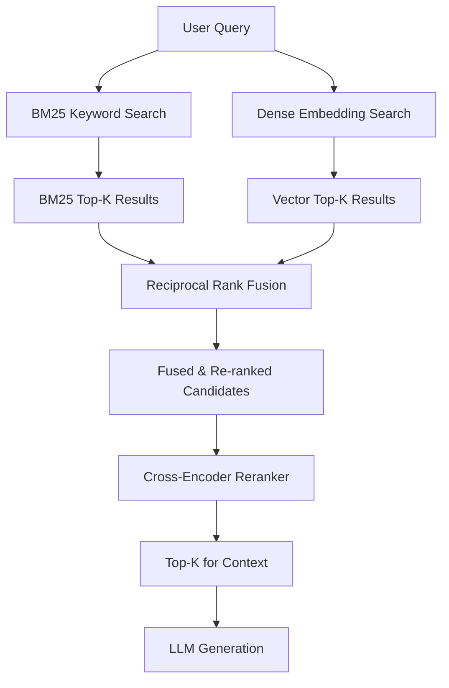

Pure vector search has a well-documented blind spot: it fails on exact term matches and rare domain vocabulary. If your financial corpus uses "EBITDA" and the user asks about "EBITDA," an embedding model might retrieve documents about earnings and profit margins instead. If your medical system has "acute myocardial infarction" and someone types that exact phrase, BM25 retrieves it instantly and reliably. Dense vectors often don't. The production fix is hybrid search — running both retrieval systems in parallel and fusing their rankings.



## Why Pure Vector Search Fails

Dense embeddings compress meaning into a fixed-size vector. That compression is lossy. Rare terms — product names, ticker symbols, legal clause identifiers, ICD codes, internal project codenames — lose their distinctiveness in embedding space. Two documents mentioning "Project Helios" and "Project Orion" may embed almost identically if those names appear infrequently in the training data. BM25 treats them as completely different tokens and ranks them accordingly.

The other failure mode is distributional shift. Your embedding model was trained on general text; your corpus is SOC 2 audit reports. The vocabulary overlap between training data and your domain shapes what the model "knows." BM25 doesn't care — it sees token frequency in your actual corpus, not in some pretraining dataset.

Dense embeddings shine on paraphrase retrieval. "Show me the cancellation policy" matches "how do I end my subscription" semantically but not lexically. BM25 gets zero signal there; embeddings get it right.

Neither system is universally better. Hybrid retrieval uses both.

## BM25 Strengths and Weaknesses

BM25 is a probabilistic ranking function based on term frequency and inverse document frequency with length normalization. It's fast, interpretable, and doesn't require a GPU. It fails on synonyms and paraphrases — if the query uses different vocabulary than the document, BM25 scores are zero.

Dense vectors handle semantic similarity but degrade on: exact match (especially for rare terms), numerical precision (embedding "Q3 2024 revenue" vs "Q4 2023 revenue" often produces similar vectors), and negation ("documents about safety that do NOT mention litigation" is nearly impossible to encode).

## Reciprocal Rank Fusion

RRF is the standard score combination method for hybrid retrieval. Instead of combining raw scores (which are on different scales), it combines ranks:

```
RRF_score(d) = Σ 1 / (k + rank_i(d))
```

Where `k` is typically 60 (a smoothing constant that reduces the impact of top-1 results) and the sum is over each retrieval system. Documents appearing in both rankings get substantially higher scores. Documents only in one system still get credit.

```python
from typing import Any

def reciprocal_rank_fusion(
    results_list: list[list[tuple[Any, float]]],
    k: int = 60
) -> list[tuple[Any, float]]:
    """
    Combine multiple ranked result lists using RRF.
    
    Args:
        results_list: List of ranked result lists, each containing (doc, score) tuples
        k: RRF constant (default 60, per the original paper)
    
    Returns:
        Merged list of (doc, rrf_score) sorted by descending score
    """
    scores: dict[str, float] = {}
    doc_map: dict[str, Any] = {}

    for results in results_list:
        for rank, (doc, _) in enumerate(results):
            doc_id = doc.metadata.get("id") or doc.page_content[:64]
            doc_map[doc_id] = doc
            scores[doc_id] = scores.get(doc_id, 0) + 1.0 / (k + rank + 1)

    sorted_ids = sorted(scores, key=lambda x: scores[x], reverse=True)
    return [(doc_map[doc_id], scores[doc_id]) for doc_id in sorted_ids]
```

## Implementation: pgvector + pg_trgm

If you're already on PostgreSQL, pgvector handles dense retrieval and pg_trgm provides trigram-based similarity that approximates BM25 behaviour:

```python
import psycopg2
from openai import OpenAI

client = OpenAI()

def get_embedding(text: str) -> list[float]:
    response = client.embeddings.create(
        model="text-embedding-3-small",
        input=text
    )
    return response.data[0].embedding

def hybrid_search_pg(
    query: str,
    conn,
    top_k: int = 20,
    rrf_k: int = 60
) -> list[dict]:
    query_embedding = get_embedding(query)
    
    with conn.cursor() as cur:
        # Dense vector search
        cur.execute("""
            SELECT id, content, embedding <=> %s::vector AS vec_dist,
                   ROW_NUMBER() OVER (ORDER BY embedding <=> %s::vector) AS vec_rank
            FROM documents
            ORDER BY embedding <=> %s::vector
            LIMIT %s
        """, (query_embedding, query_embedding, query_embedding, top_k * 2))
        dense_results = {row[0]: {"content": row[1], "vec_rank": row[3]} 
                         for row in cur.fetchall()}
        
        # BM25-style keyword search using tsvector
        cur.execute("""
            SELECT id, content,
                   ts_rank_cd(to_tsvector('english', content), 
                              plainto_tsquery('english', %s)) AS bm25_score,
                   ROW_NUMBER() OVER (
                       ORDER BY ts_rank_cd(to_tsvector('english', content), 
                                           plainto_tsquery('english', %s)) DESC
                   ) AS bm25_rank
            FROM documents
            WHERE to_tsvector('english', content) @@ plainto_tsquery('english', %s)
            ORDER BY bm25_score DESC
            LIMIT %s
        """, (query, query, query, top_k * 2))
        bm25_results = {row[0]: {"content": row[1], "bm25_rank": row[3]} 
                        for row in cur.fetchall()}
    
    # RRF fusion
    all_ids = set(dense_results) | set(bm25_results)
    rrf_scores = {}
    for doc_id in all_ids:
        score = 0.0
        if doc_id in dense_results:
            score += 1.0 / (rrf_k + dense_results[doc_id]["vec_rank"])
        if doc_id in bm25_results:
            score += 1.0 / (rrf_k + bm25_results[doc_id]["bm25_rank"])
        rrf_scores[doc_id] = score
    
    # Sort and return top_k
    sorted_ids = sorted(rrf_scores, key=lambda x: rrf_scores[x], reverse=True)[:top_k]
    content_map = {**{k: v["content"] for k, v in dense_results.items()},
                   **{k: v["content"] for k, v in bm25_results.items()}}
    
    return [{"id": doc_id, "content": content_map[doc_id], "score": rrf_scores[doc_id]}
            for doc_id in sorted_ids]
```

## Implementation: Elasticsearch / OpenSearch

Both support dense vector fields (`dense_vector`) alongside keyword fields. The recommended approach is a `bool` query combining `script_score` (for KNN) with standard `match` (for BM25), or use their built-in hybrid query feature (available in Elasticsearch 8.9+ and OpenSearch 2.10+):

```python
from elasticsearch import Elasticsearch

es = Elasticsearch("http://localhost:9200")

def hybrid_search_es(query: str, index: str, top_k: int = 20) -> list[dict]:
    query_embedding = get_embedding(query)
    
    response = es.search(
        index=index,
        body={
            "size": top_k,
            "query": {
                "bool": {
                    "should": [
                        {
                            "match": {
                                "content": {
                                    "query": query,
                                    "boost": 0.4
                                }
                            }
                        }
                    ]
                }
            },
            "knn": {
                "field": "embedding",
                "query_vector": query_embedding,
                "k": top_k,
                "num_candidates": top_k * 5,
                "boost": 0.6
            }
        }
    )
    
    return [{"id": hit["_id"], "content": hit["_source"]["content"], 
             "score": hit["_score"]} 
            for hit in response["hits"]["hits"]]
```

## Tuning the RRF k Parameter and Weighting

The `k=60` default is from the original RRF paper and works well in practice. Increasing `k` reduces the importance of rank differences at the top. Decreasing it amplifies the difference between rank 1 and rank 5.

The more important tuning decision is when to weight toward BM25 vs semantic:

- **Weight toward BM25**: technical documentation, legal text, medical records, anything with precise domain terminology or identifiers
- **Weight toward semantic**: conversational queries, support tickets, customer feedback, knowledge bases written in natural language
- **Equal weighting**: general enterprise knowledge bases with mixed query types

Benchmark on your actual query distribution. Synthetic evaluation won't tell you which regime you're in.

## Benchmarking Results

On a corpus of 50,000 financial filings (a domain with heavy use of specific numerical identifiers and standardized terminology):

| Strategy | NDCG@10 | MRR |
|---|---|---|
| Dense only | 0.61 | 0.58 |
| BM25 only | 0.54 | 0.51 |
| Hybrid RRF (40/60) | 0.74 | 0.71 |
| Hybrid + reranker | 0.81 | 0.79 |

The gap between hybrid and pure dense is not trivial. For domain-specific corpora with precise vocabulary, hybrid retrieval is not an optimization — it's a correctness requirement.

Hybrid search is the baseline now. If your RAG system only does dense retrieval, you're leaving significant retrieval quality on the table for queries that matter most to your domain experts.
