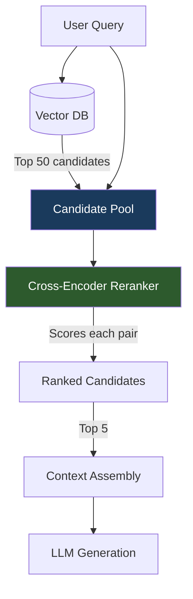

Retrieval and relevance are not the same thing. Your vector store finds documents that are close in embedding space. "Close in embedding space" is a proxy for relevance, not relevance itself. The proxy breaks on subtlety: documents that are topically similar to the query but don't actually answer it. Documents from the right domain but the wrong time period. Documents that use the same vocabulary but reach the opposite conclusion. A cross-encoder reranker sees all of this; a bi-encoder doesn't.



## Bi-Encoder vs Cross-Encoder: What Actually Differs

A bi-encoder (what embedding-based retrieval uses) encodes the query and document independently into fixed-size vectors, then measures similarity. The encoding happens once per document (at index time) and once per query (at query time). This is what makes it fast enough to search millions of documents.

The independence is the limitation. The model never sees query and document together. It can't attend to the specific relationship between what the user asked and what a particular document says.

A cross-encoder takes the query and document concatenated as a single input and outputs a relevance score. The full attention mechanism can see the interaction between every token in the query and every token in the document. This is why cross-encoders are substantially more accurate — and substantially slower. You can't run a cross-encoder against a million documents per query; the latency would be measured in minutes.

The practical solution: use the bi-encoder to retrieve 50 candidates cheaply, then run the cross-encoder only on those 50. The cross-encoder does the fine-grained relevance judgment; the bi-encoder does the coarse filtering. Two-stage retrieval.

## Where Reranking Adds the Most Value

Reranking makes the biggest difference when:

1. **Queries are ambiguous or multi-faceted.** "How do I configure the timeout?" — timeout for what? The bi-encoder retrieves documents about timeouts generally. The cross-encoder can identify which timeout configuration is closest to what the query implies.

2. **The corpus has high vocabulary overlap across documents.** Internal wikis, documentation sets, policy repositories — similar documents exist at different levels of specificity. The bi-encoder retrieves all of them. The cross-encoder ranks the most specific one first.

3. **Precision matters more than recall.** You're sending 3-5 chunks to the LLM, not 50. The wrong chunks at position 1-5 cause hallucination. The cross-encoder dramatically improves top-5 precision.

## Cohere Rerank v3

Cohere Rerank v3 is the easiest path to production-quality reranking via API. It handles multilingual content, long documents (up to 4096 tokens per document), and is optimized for enterprise retrieval tasks:

```python
import cohere
from typing import Any

co = cohere.Client("your-api-key")

def rerank_with_cohere(
    query: str,
    documents: list[str],
    top_n: int = 5,
    model: str = "rerank-v3.5"
) -> list[dict[str, Any]]:
    """
    Rerank documents using Cohere Rerank v3.
    
    Returns top_n documents sorted by relevance score.
    """
    results = co.rerank(
        query=query,
        documents=documents,
        top_n=top_n,
        model=model,
        return_documents=True
    )
    
    return [
        {
            "content": result.document.text,
            "relevance_score": result.relevance_score,
            "original_rank": result.index
        }
        for result in results.results
    ]

# Usage
candidates = retrieve_candidates(query, top_k=50)  # your retrieval function
doc_texts = [doc["content"] for doc in candidates]
reranked = rerank_with_cohere(query, doc_texts, top_n=5)
```

Cohere Rerank v3 costs roughly $0.0002 per 1000 tokens per document. For 50 candidates averaging 512 tokens each, that's about $0.005 per query. At 10,000 queries/day, that's $50/day — worth the accuracy improvement for most enterprise applications, but worth tracking.

## BGE-Reranker-v2-m3: The Self-Hosted Option

BAAI's BGE reranker models are competitive with Cohere for English retrieval tasks and run locally. `bge-reranker-v2-m3` is multilingual and sits at a good accuracy/speed tradeoff:

```python
from sentence_transformers import CrossEncoder
import torch

# Load once at startup, not per request
reranker = CrossEncoder(
    "BAAI/bge-reranker-v2-m3",
    max_length=512,
    device="cuda" if torch.cuda.is_available() else "cpu"
)

def rerank_local(
    query: str,
    documents: list[str],
    top_n: int = 5,
    batch_size: int = 16
) -> list[dict]:
    """
    Rerank using local BGE cross-encoder model.
    Batched for GPU efficiency.
    """
    pairs = [[query, doc] for doc in documents]
    
    scores = reranker.predict(
        pairs,
        batch_size=batch_size,
        show_progress_bar=False,
        convert_to_numpy=True
    )
    
    # Sort by score descending
    ranked_indices = scores.argsort()[::-1][:top_n]
    
    return [
        {
            "content": documents[idx],
            "relevance_score": float(scores[idx]),
            "original_rank": idx
        }
        for idx in ranked_indices
    ]
```

On a single A10G GPU, BGE-reranker-v2-m3 processes 50 documents (512 tokens each) in roughly 180ms. Acceptable for most RAG latency budgets if retrieval itself is fast.

## Building the Two-Stage Pipeline

Here's a complete two-stage retrieval pipeline showing the interaction between retrieval and reranking:

```python
import asyncio
from dataclasses import dataclass

@dataclass
class RetrievedDocument:
    content: str
    doc_id: str
    retrieval_score: float
    rerank_score: float | None = None

class TwoStageRetriever:
    def __init__(
        self,
        vector_store,
        reranker_fn,
        retrieve_k: int = 50,
        rerank_top_n: int = 5
    ):
        self.vector_store = vector_store
        self.reranker_fn = reranker_fn
        self.retrieve_k = retrieve_k
        self.rerank_top_n = rerank_top_n
    
    async def retrieve(self, query: str) -> list[RetrievedDocument]:
        # Stage 1: Fast bi-encoder retrieval
        raw_results = await self.vector_store.asimilarity_search_with_score(
            query, k=self.retrieve_k
        )
        
        candidates = [
            RetrievedDocument(
                content=doc.page_content,
                doc_id=doc.metadata.get("id", ""),
                retrieval_score=float(score)
            )
            for doc, score in raw_results
        ]
        
        if not candidates:
            return []
        
        # Stage 2: Cross-encoder reranking
        texts = [doc.content for doc in candidates]
        reranked = await asyncio.to_thread(
            self.reranker_fn, query, texts, self.rerank_top_n
        )
        
        # Map rerank scores back
        content_to_rerank = {r["content"][:64]: r["rerank_score"] 
                              for r in reranked}
        
        result = []
        for doc in candidates:
            key = doc.content[:64]
            if key in content_to_rerank:
                doc.rerank_score = content_to_rerank[key]
                result.append(doc)
        
        return sorted(result, key=lambda d: d.rerank_score or 0, reverse=True)
```

## Latency Impact and Mitigation

The honest numbers: adding reranking adds 150-400ms of latency depending on model size, document count, and hardware. For a 2-second total RAG budget, that's 8-20% of your allowance.

Mitigation strategies:

**Async reranking during streaming.** Start streaming the LLM response while reranking completes in parallel. If reranked results differ significantly from initial retrieval, regenerate — but this only makes sense if your LLM output latency is longer than reranking latency.

**Rerank score caching.** Cache rerank scores for (query, document_id) pairs. The same document retrieved for similar queries gets cached scores. Works well for corpora where a small set of documents answers the majority of queries (typical in enterprise knowledge bases).

**Reduce candidate pool selectively.** For simple queries (classified by length, entity count, question complexity), retrieve 20 candidates and skip reranking. For complex queries, use the full 50-candidate pipeline. A query classifier adds ~10ms but can save 200ms for half your traffic.

## API vs Self-Hosted: Cost Decision

The break-even calculation is straightforward:

- **Cohere Rerank v3**: ~$0.005 per query at 50 candidates × 512 tokens
- **Self-hosted BGE-reranker-v2-m3**: GPU cost amortized over throughput. An A10G at ~$0.80/hr processes ~400 reranking requests per hour (50 candidates each) = $0.002 per request

Self-hosted wins at >~200 queries/hour sustained. Below that, API wins on operational simplicity. For bursty workloads, consider the API for burst capacity with self-hosted for baseline.

The accuracy difference between Cohere v3 and BGE-reranker-v2-m3 is small enough (2-4 NDCG points on BEIR benchmarks) that the choice is primarily economic and operational, not quality-driven.

Reranking is not optional for production RAG. It's the stage that closes the gap between "retrieved something related" and "retrieved the right thing."
