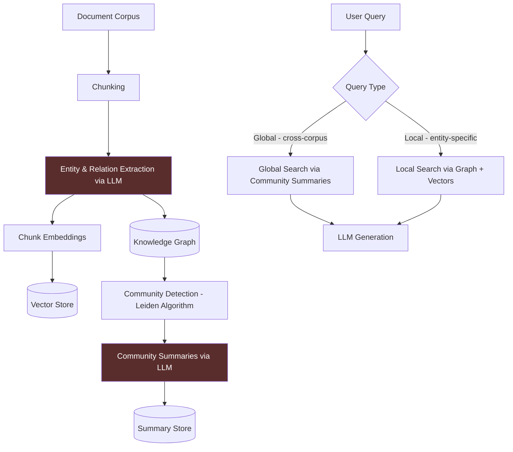

Most RAG questions are local: "What does document X say about topic Y?" Flat retrieval handles these well. The questions that break flat RAG are global: "Which executives have been mentioned in connection with the compliance issues across our Q1-Q4 board minutes?" "How do the risks identified in the security audit relate to the compensating controls described in the incident response plan?" Those questions require synthesizing information across multiple documents, tracing entity relationships, and aggregating across the entire corpus. That's what GraphRAG was built for. The cost is real and the complexity is significant — here's how to decide if it's warranted.



## What Flat RAG Fails At

Flat vector retrieval is chunk-level. Each chunk embeds independently. Relationships between entities that span chunks are invisible to the retrieval mechanism.

Failure mode 1: **Multi-hop reasoning.** "Who approved the budget for Project Alpha, and what is their track record on projects exceeding estimates?" Requires: finding who approved Project Alpha (document A), identifying their name (entity extraction), finding their other projects (cross-document entity resolution), retrieving outcome data (documents B, C, D). Flat RAG retrieves documents related to "budget approval" but can't trace the entity relationship chain.

Failure mode 2: **Corpus-wide aggregation.** "What are the most commonly cited risks across all 200 vendor assessments?" No single chunk answers this. You'd need to retrieve all risk mentions, aggregate, and count. Even with large context windows, 200 documents of vendor assessments exceed token limits.

Failure mode 3: **Relationship queries.** "Which of our software vendors have a relationship with the hardware vendors mentioned in our supply chain audit?" Entity co-occurrence across documents. Flat retrieval has no mechanism for this.

## How GraphRAG Works

Microsoft's GraphRAG implementation (the open-source reference) does the following:

**Indexing phase (expensive):**
1. Chunk the corpus into overlapping text units
2. Run LLM entity extraction on every chunk — extract entities (people, organizations, concepts, events) and their relationships
3. Build a graph where nodes are entities and edges are relationships
4. Run community detection (Leiden algorithm) to find clusters of related entities
5. Generate LLM summaries of each community and each entity

**Query phase:**
- **Global search**: the question is about the entire corpus. GraphRAG generates multiple answers using community summaries, then aggregates and ranks them. This is where GraphRAG genuinely outperforms flat RAG.
- **Local search**: the question is about a specific entity or neighborhood in the graph. GraphRAG uses the entity graph plus nearby text chunks and summaries. Often comparable to well-tuned flat RAG.

## The Real Cost

This is where most evaluations understate the problem. Running LLM entity extraction over every chunk means you're making an LLM API call for every 300-600 token chunk in your corpus.

A corpus of 10,000 documents, average 5,000 tokens each, chunked at 600 tokens = ~80,000 chunks. At GPT-4o pricing ($2.50/M input, $10/M output), extraction averaging 800 input tokens + 200 output tokens per chunk:

- Input: 80,000 × 800 = 64M tokens × $2.50/M = **$160**
- Output: 80,000 × 200 = 16M tokens × $10/M = **$160**
- Community summaries: additional ~20-30% on top

Total indexing cost: **~$380-400 for 10,000 documents.** Compare this to flat RAG indexing (just embedding): 10,000 docs × 5,000 tokens = 50M tokens × $0.02/M (text-embedding-3-small) = **$1**.

That's a 300-400x cost difference for indexing alone. Query costs also increase because global search uses community summaries (more tokens per query). For a corpus that updates frequently, you're paying those indexing costs repeatedly.

## Installing and Running Microsoft GraphRAG

```bash
pip install graphrag
```

Initialize a project:

```bash
mkdir my_rag_project
cd my_rag_project
python -m graphrag init --root .
```

This creates `settings.yaml` and `prompts/` directory. Configure `settings.yaml`:

```yaml
# settings.yaml (key sections)
llm:
  api_key: ${GRAPHRAG_API_KEY}
  type: openai_chat
  model: gpt-4o-mini  # Use mini for extraction to reduce costs
  model_supports_json: true

embeddings:
  async_mode: threaded
  llm:
    api_key: ${GRAPHRAG_API_KEY}
    type: openai_embedding
    model: text-embedding-3-small

chunks:
  size: 600
  overlap: 100

entity_extraction:
  max_gleanings: 1  # Reduce from default 2 to cut costs

community_reports:
  max_length: 2000
```

Run indexing:

```bash
python -m graphrag index --root .
```

Query:

```python
import asyncio
from graphrag.query.cli import run_global_search, run_local_search

# Global search - cross-corpus synthesis
async def global_query(query: str, data_dir: str) -> str:
    result = await run_global_search(
        config_filepath=f"{data_dir}/settings.yaml",
        data_dir=f"{data_dir}/output",
        root_dir=data_dir,
        community_level=2,  # Higher = more abstract summaries
        response_type="single paragraph",
        query=query
    )
    return result

# Local search - entity-specific
async def local_query(query: str, data_dir: str) -> str:
    result = await run_local_search(
        config_filepath=f"{data_dir}/settings.yaml",
        data_dir=f"{data_dir}/output",
        root_dir=data_dir,
        community_level=2,
        response_type="single paragraph",
        query=query
    )
    return result

# Run
result = asyncio.run(global_query(
    "What are the most common compliance risks mentioned across all vendor assessments?",
    "./my_rag_project"
))
```

## Alternatives to Full GraphRAG

Before committing to full GraphRAG, try these in order:

**Entity-enriched chunks.** Run named entity recognition (spaCy or a cheap LLM call) during indexing and store entity mentions as metadata. Filter retrieval by entity name. Gets you most of the entity lookup benefit at a fraction of the cost.

```python
import spacy
nlp = spacy.load("en_core_web_sm")

def extract_entities(text: str) -> list[str]:
    doc = nlp(text)
    return [ent.text for ent in doc.ents 
            if ent.label_ in ["PERSON", "ORG", "PRODUCT", "EVENT"]]

# Store as metadata during indexing
metadata = {
    "content": chunk_text,
    "entities": extract_entities(chunk_text)
}
```

**Multi-step retrieval.** For complex queries, decompose them explicitly. Ask the LLM to identify entities and sub-questions, retrieve for each, synthesize. Slower at query time but no expensive indexing.

**Metadata filtering with structured extraction.** If your cross-document questions are predictable (always by vendor name, by project code, by time period), extract those fields during indexing and filter on them. Often solves 80% of the "GraphRAG use cases" in enterprise settings.

## When GraphRAG Is Actually Worth It

Use GraphRAG when:
- Questions genuinely require global corpus synthesis (not just entity lookup)
- Your corpus is large, relatively static, and the indexing cost is amortized over many queries
- The query types are demonstrably failing with flat RAG (benchmark first)
- You have the operational budget to maintain the graph as the corpus updates

Don't use GraphRAG when:
- Your corpus updates daily or more frequently
- Most questions are local (document-specific) rather than global
- You haven't tried entity-enriched chunks and metadata filtering first
- Your indexing budget is measured in single-digit dollars

GraphRAG is a real advancement for corpus-wide synthesis questions. It's also genuinely expensive and complex to operate. Run the benchmark on your actual queries before committing.
