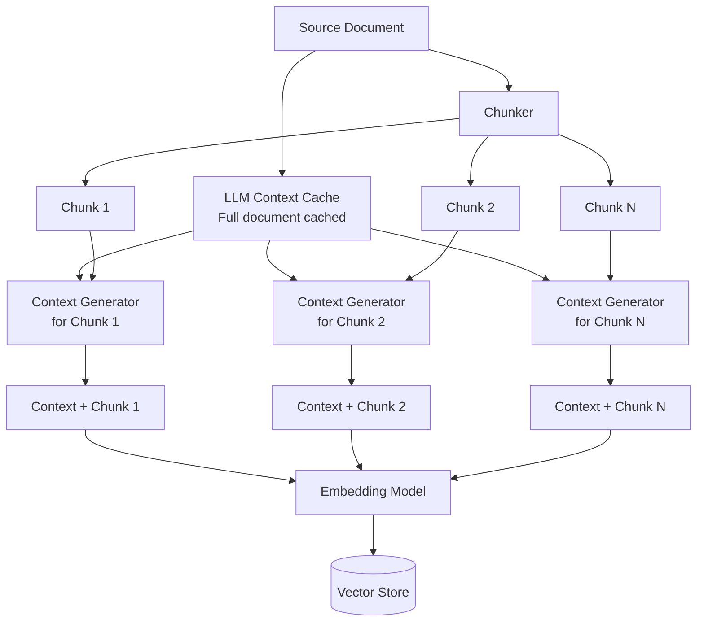

A chunk that reads "The revenue was $4.2M, up 18% year-over-year" is useless in isolation. Which company? Which quarter? Which product line? When you split a document into 512-token chunks for embedding, most of that contextual information stays in a different chunk. The embedding for the revenue chunk reflects "revenue growth metrics" rather than "Acme Corp Q3 2024 North America SaaS revenue growth." When a user asks about Acme Corp's North America performance, the retrieval system may miss this chunk entirely. Contextual retrieval fixes this by generating a short context description for each chunk using the full document, then prepending that context before embedding.



## Why Naive Chunking Fails

Fixed-size chunking is the default because it's simple and predictable. The problem is that semantic meaning doesn't distribute evenly across fixed windows.

Consider a 5-page earnings report. The first page establishes the company name, fiscal period, and reporting segments. Pages 2-5 contain the actual financial data — revenue figures, margin analysis, segment breakdowns — often referencing "the company," "this quarter," or "the segment" without repeating the full context. When those pages are chunked into 512-token windows and embedded independently, the embeddings capture the financial content but lose the document-level context that makes those numbers meaningful.

This is the core problem contextual retrieval addresses: chunks are semantically meaningful within their document but semantically ambiguous in isolation.

Anthropic's research shows contextual retrieval reduces retrieval failures by 35% when combined with BM25 hybrid search, and up to 49% when combined with reranking.

## The Contextual Retrieval Approach

For each chunk, generate a short (1-2 sentence) description of what role that chunk plays within the full document. Prepend this description to the chunk content before embedding.

The context description might look like:
- "This chunk is from the Q3 2024 earnings report for Acme Corp, discussing North America SaaS segment revenue of $4.2M."
- "This chunk is from the incident response runbook for the payment processing service, covering the escalation procedure for P1 severity outages."

The enriched chunk then embeds with full document context baked in, rather than context-free content.

## The Cost Problem and Prompt Caching

The naive implementation calls the LLM once per chunk with the full document in context. For a 10-page document chunked into 25 chunks, that's 25 LLM calls each sending the same full document — paying for the document tokens 25 times.

Anthropic's prompt caching eliminates this. You mark the full document as a cacheable prefix. The first call processes it; subsequent calls within the cache TTL (5 minutes for default cache, up to 1 hour with extended) retrieve it from cache at a fraction of the cost (cache read is 10% of standard input pricing with Claude's API).

```python
import anthropic
from typing import Iterator

client = anthropic.Anthropic()

CONTEXT_PROMPT = """<document>
{document}
</document>

Here is the chunk we want to situate within the whole document:
<chunk>
{chunk}
</chunk>

Please give a short succinct context to situate this chunk within the overall document for the purposes of improving search retrieval of the chunk. Answer only with the succinct context and nothing else."""

def generate_chunk_contexts(
    document: str,
    chunks: list[str],
    model: str = "claude-3-5-haiku-20241022"
) -> list[str]:
    """
    Generate context descriptions for all chunks in a document.
    Uses prompt caching so the document is processed once, not N times.
    """
    contexts = []
    
    for i, chunk in enumerate(chunks):
        # The document content is marked as cacheable
        # First call: full processing cost
        # Subsequent calls: cache read cost (10% of input tokens)
        response = client.messages.create(
            model=model,
            max_tokens=200,
            system="You are a document analysis assistant. Generate concise context descriptions for document chunks.",
            messages=[
                {
                    "role": "user",
                    "content": [
                        {
                            "type": "text",
                            "text": f"<document>\n{document}\n</document>",
                            "cache_control": {"type": "ephemeral"}
                        },
                        {
                            "type": "text",
                            "text": f"Situate this chunk within the document for search retrieval purposes:\n\n<chunk>\n{chunk}\n</chunk>\n\nProvide 1-2 sentences of context only."
                        }
                    ]
                }
            ]
        )
        
        context = response.content[0].text.strip()
        contexts.append(context)
        
        # Log cache performance
        if hasattr(response.usage, 'cache_read_input_tokens'):
            cache_read = response.usage.cache_read_input_tokens
            cache_created = response.usage.cache_creation_input_tokens
            if i == 0:
                print(f"Chunk {i}: Created cache ({cache_created} tokens)")
            else:
                print(f"Chunk {i}: Cache hit ({cache_read} tokens from cache)")
    
    return contexts


def build_contextual_chunks(
    document: str,
    chunks: list[str]
) -> list[str]:
    """
    Returns enriched chunks with prepended context.
    """
    contexts = generate_chunk_contexts(document, chunks)
    
    enriched = []
    for context, chunk in zip(contexts, chunks):
        # Prepend context to chunk — both context and chunk content are embedded
        enriched_chunk = f"{context}\n\n{chunk}"
        enriched.append(enriched_chunk)
    
    return enriched
```

## Cost Reality Check

For a document of 8,000 tokens chunked into 20 chunks (400 tokens each), with claude-3-5-haiku-20241022:

Without caching:
- 20 calls × 8,400 tokens input = 168,000 input tokens
- At $0.80/M tokens = $0.13 per document

With prompt caching:
- Call 1: 8,400 tokens at full price = $0.0067
- Calls 2-20: 8,000 tokens cached (10% cost) + 400 tokens uncached = 400 tokens each at full price
- Cache reads: 19 × 8,000 × $0.08/M = $0.012
- Uncached inputs: 19 × 400 × $0.80/M = $0.006
- Total: ~$0.025 per document

That's an 80% cost reduction through caching. The math gets better as documents get longer relative to chunk size.

## Chunking Strategy Comparison

Contextual retrieval works with any chunking strategy. The question is which strategy to use before adding context.

**Fixed-size chunking** (512-1024 tokens with overlap) is the default. Simple, predictable. Breaks mid-sentence frequently. Overlap helps but doesn't solve context loss.

**Semantic chunking** splits on sentence boundaries or paragraph boundaries rather than token counts. Produces more coherent chunks. Slightly more complex to implement. Use `langchain_experimental.text_splitter.SemanticChunker` or a similar library:

```python
from langchain_experimental.text_splitter import SemanticChunker
from langchain_openai import OpenAIEmbeddings

semantic_splitter = SemanticChunker(
    OpenAIEmbeddings(),
    breakpoint_threshold_type="percentile",
    breakpoint_threshold_amount=90  # Split at 90th percentile similarity drop
)

chunks = semantic_splitter.split_text(document_text)
```

**Proposition-based chunking** (from the Dense X Retrieval paper) extracts self-contained factual propositions from each passage. Each proposition is independently meaningful. Produces small, high-precision chunks. More expensive to generate. Best for highly structured factual corpora (technical documentation, legal text).

For most enterprise RAG systems, semantic chunking with contextual retrieval outperforms fixed-size chunking alone, and proposition-based chunking is overkill unless you're building a highly precise Q&A system over structured content.

## Full Ingestion Pipeline

```python
from langchain.text_splitter import RecursiveCharacterTextSplitter
import hashlib

def ingest_document(
    document_text: str,
    doc_id: str,
    vector_store,
    chunk_size: int = 600,
    chunk_overlap: int = 100
) -> int:
    """
    Full ingestion pipeline with contextual retrieval.
    Returns number of chunks indexed.
    """
    # Split document
    splitter = RecursiveCharacterTextSplitter(
        chunk_size=chunk_size,
        chunk_overlap=chunk_overlap,
        separators=["\n\n", "\n", ". ", " ", ""]
    )
    raw_chunks = splitter.split_text(document_text)
    
    # Generate contextual enrichment (with prompt caching)
    enriched_chunks = build_contextual_chunks(document_text, raw_chunks)
    
    # Index with metadata
    docs_to_index = []
    for i, (enriched, raw) in enumerate(zip(enriched_chunks, raw_chunks)):
        chunk_id = hashlib.md5(f"{doc_id}:{i}".encode()).hexdigest()
        docs_to_index.append({
            "id": chunk_id,
            "content": enriched,      # Enriched for embedding
            "raw_content": raw,        # Original for display
            "doc_id": doc_id,
            "chunk_index": i
        })
    
    vector_store.add_documents(docs_to_index)
    return len(docs_to_index)
```

## Practical Results

On internal evaluations across enterprise knowledge bases (HR policy docs, technical runbooks, contract repositories):

| Strategy | Recall@5 | MRR@5 |
|---|---|---|
| Fixed chunking, dense only | 0.67 | 0.59 |
| Semantic chunking, dense only | 0.71 | 0.63 |
| Fixed chunking + contextual retrieval | 0.79 | 0.72 |
| Semantic chunking + contextual + hybrid | 0.84 | 0.78 |

The contextual retrieval improvement is most pronounced for documents where later chunks reference earlier context (financial reports, long-form technical docs, legal agreements). For short, self-contained documents (FAQ entries, individual support tickets), the improvement is smaller because chunks are already meaningful in isolation.

If you're running RAG on any corpus where documents have meaningful structure and later sections reference earlier context, contextual retrieval is one of the highest-ROI improvements you can make. The implementation is straightforward, the cost with prompt caching is manageable, and the retrieval quality gains are consistent.
