The data leakage scenario in multi-tenant RAG is straightforward and serious: User A works for Company X. Company Y is also a tenant in your system. Their documents share a vector index. User A's query retrieves Company Y's confidential pricing data because it's semantically similar to documents User A is allowed to see. The LLM answers User A's question using Company Y's private information. This isn't a theoretical edge case — it's a predictable outcome of naive vector search across shared indexes. The architecture you choose for access control determines whether this can happen.

```mermaid
flowchart LR
    subgraph ARCH1["Architecture 1: Separate Indexes"]
        T1_IDX[(Tenant A Index)]
        T2_IDX[(Tenant B Index)]
    end

    subgraph ARCH2["Architecture 2: Metadata Filter"]
        SHARED_IDX[(Shared Index)]
        FILTER[Tenant ID Filter]
    end

    subgraph ARCH3["Architecture 3: Namespace Prefix"]
        NS_IDX[(Namespaced Index)]
        NS[tenant_a:: prefix]
    end

    Q1[Tenant A Query] --> T1_IDX
    Q2[Tenant B Query] --> T2_IDX

    Q3[Query] --> FILTER
    FILTER --> SHARED_IDX

    Q4[Query] --> NS
    NS --> NS_IDX

    style ARCH1 fill:#1a2a1a
    style ARCH2 fill:#1a1a2a
    style ARCH3 fill:#2a1a1a
```



## Three Access Control Architectures

### Architecture 1: Separate Indexes Per Tenant

The most secure and simplest to reason about. Each tenant gets their own vector collection/index. Tenant isolation is enforced at the infrastructure level — there is no query path that crosses tenant boundaries.

```python
import pinecone
from pinecone import Pinecone, ServerlessSpec

pc = Pinecone(api_key="your-api-key")

def get_or_create_tenant_index(tenant_id: str) -> pinecone.Index:
    """Create isolated index per tenant."""
    index_name = f"tenant-{tenant_id.replace('_', '-').lower()}"
    
    if index_name not in [idx.name for idx in pc.list_indexes()]:
        pc.create_index(
            name=index_name,
            dimension=1536,
            metric="cosine",
            spec=ServerlessSpec(cloud="aws", region="us-east-1")
        )
    
    return pc.Index(index_name)

def retrieve_for_tenant(
    query_embedding: list[float],
    tenant_id: str,
    top_k: int = 10
) -> list[dict]:
    """Retrieve from tenant-isolated index — no cross-tenant access possible."""
    index = get_or_create_tenant_index(tenant_id)
    results = index.query(
        vector=query_embedding,
        top_k=top_k,
        include_metadata=True
    )
    return results.matches
```

**Trade-offs:**
- Pros: Maximum isolation, simple to audit, no filter bypass possible
- Cons: Index creation time per onboarding, management complexity at scale (hundreds of tenants = hundreds of indexes), higher base cost (minimum index size applies per index in most managed services)

Viable for: enterprise B2B SaaS where tenants number in tens to low hundreds, data sensitivity is high.

### Architecture 2: Metadata Filtering on Shared Index

All tenants share a single index. Every document has a `tenant_id` metadata field. Every query includes a pre-filter that restricts results to the querying tenant's documents.

```python
from qdrant_client import QdrantClient
from qdrant_client.models import Filter, FieldCondition, MatchValue

client = QdrantClient(url="http://localhost:6333")

def retrieve_with_tenant_filter(
    query_embedding: list[float],
    tenant_id: str,
    collection: str = "documents",
    top_k: int = 10
) -> list[dict]:
    """
    Retrieve with mandatory tenant filter.
    The filter is applied server-side before vector comparison.
    """
    tenant_filter = Filter(
        must=[
            FieldCondition(
                key="tenant_id",
                match=MatchValue(value=tenant_id)
            )
        ]
    )
    
    results = client.search(
        collection_name=collection,
        query_vector=query_embedding,
        query_filter=tenant_filter,
        limit=top_k,
        with_payload=True
    )
    
    return [
        {
            "content": hit.payload.get("content"),
            "score": hit.score,
            "tenant_id": hit.payload.get("tenant_id")
        }
        for hit in results
    ]

def upsert_document(
    doc_id: str,
    content: str,
    embedding: list[float],
    tenant_id: str,
    additional_metadata: dict | None = None,
    collection: str = "documents"
) -> None:
    """Always enforce tenant_id in metadata at write time."""
    from qdrant_client.models import PointStruct
    
    payload = {
        "content": content,
        "tenant_id": tenant_id,
        **(additional_metadata or {})
    }
    
    client.upsert(
        collection_name=collection,
        points=[PointStruct(id=doc_id, vector=embedding, payload=payload)]
    )
```

**Trade-offs:**
- Pros: Operationally simpler, scales to thousands of tenants, cost-efficient
- Cons: Filter bypass vulnerability in approximate nearest neighbor (ANN) search

### The ANN Filter Bypass Vulnerability

This is the part most implementations get wrong. HNSW (Hierarchical Navigable Small World), the dominant ANN algorithm used by Qdrant, Weaviate, and Pinecone, does not guarantee filter compliance in pre-filter mode. The graph traversal finds approximate neighbors; applying a metadata filter afterward may cause it to return fewer results than requested, or in extreme cases, skip regions of the graph where all neighbors belong to other tenants.

Different vector databases handle this differently:
- **Qdrant**: uses payload-indexed filtering with exact IVF-based search when filters are selective — set `payload_m` in HNSW config and index the `tenant_id` field explicitly
- **Pinecone**: namespaces (see Architecture 3) are the recommended isolation mechanism, not metadata filters, for exactly this reason
- **Weaviate**: supports pre-filtering with ACORN (Approximate search with Condition Optimization for Range queries and Node pruning) which is more filter-safe

For Qdrant, enable payload indexing on the tenant field:

```python
from qdrant_client.models import PayloadSchemaType

# Index tenant_id for efficient filtered search
client.create_payload_index(
    collection_name="documents",
    field_name="tenant_id",
    field_schema=PayloadSchemaType.KEYWORD
)
```

With a keyword index on `tenant_id`, Qdrant can use filtered HNSW traversal that respects tenant boundaries without falling back to full scan. Verify this is actually happening by checking `explain_score_threshold` in your query responses.

### Architecture 3: Namespace Prefix (Pinecone Pattern)

Pinecone namespaces provide logical partitioning within a single index. Vectors in different namespaces don't interact during search — they're effectively separate search spaces within shared infrastructure.

```python
from pinecone import Pinecone

pc = Pinecone(api_key="your-api-key")
index = pc.Index("documents")

def retrieve_namespaced(
    query_embedding: list[float],
    tenant_id: str,
    top_k: int = 10
) -> list[dict]:
    """Namespace-scoped retrieval — no cross-namespace leakage."""
    namespace = f"tenant_{tenant_id}"
    
    results = index.query(
        vector=query_embedding,
        top_k=top_k,
        namespace=namespace,
        include_metadata=True
    )
    
    return [
        {"content": m.metadata.get("content"), "score": m.score}
        for m in results.matches
    ]

def upsert_namespaced(
    vectors: list[dict],
    tenant_id: str
) -> None:
    namespace = f"tenant_{tenant_id}"
    index.upsert(vectors=vectors, namespace=namespace)
```

Namespaces are cheaper than separate indexes, more isolated than metadata filters, and operationally simple. Recommended for Pinecone-based systems.

## Document-Level vs Chunk-Level Permissions

Document-level permissions are easier to implement: check if the user has access to the source document, filter out chunks from inaccessible documents. This is the right approach when access control maps to whole documents.

Chunk-level permissions matter when different sections of a document have different access levels — a contract where the pricing section is visible to account managers but not to technical contacts, for example. Implement this by tagging individual chunks with their permission set at ingestion time:

```python
def ingest_with_chunk_permissions(
    document_sections: list[dict],  # [{content, required_roles}]
    tenant_id: str,
    doc_id: str
) -> None:
    """
    Each section may have different required roles.
    Stored as metadata, filtered at retrieval time.
    """
    for i, section in enumerate(document_sections):
        embedding = get_embedding(section["content"])
        upsert_document(
            doc_id=f"{doc_id}_chunk_{i}",
            content=section["content"],
            embedding=embedding,
            tenant_id=tenant_id,
            additional_metadata={
                "required_roles": section.get("required_roles", ["any"]),
                "doc_id": doc_id
            }
        )

def retrieve_with_role_filter(
    query_embedding: list[float],
    tenant_id: str,
    user_roles: list[str],
    top_k: int = 10
) -> list[dict]:
    """Filter to chunks the user's roles allow access to."""
    from qdrant_client.models import Filter, FieldCondition, MatchAny
    
    access_filter = Filter(
        must=[
            FieldCondition(key="tenant_id", match=MatchValue(value=tenant_id)),
            FieldCondition(
                key="required_roles",
                match=MatchAny(any=user_roles + ["any"])
            )
        ]
    )
    
    results = client.search(
        collection_name="documents",
        query_vector=query_embedding,
        query_filter=access_filter,
        limit=top_k,
        with_payload=True
    )
    return [{"content": h.payload.get("content"), "score": h.score} for h in results]
```

## Handling Permission Changes

When a user loses access to documents, you have two options:

**Lazy deletion**: Keep chunks in the index but update the permission metadata. The filter excludes them at retrieval time. No reindexing required. Risk: if your filter implementation has the ANN bypass vulnerability, revoked documents might still surface.

**Eager deletion**: Delete the vectors immediately on permission revocation. Requires you to track which vector IDs correspond to which documents (store this mapping in your relational database at ingestion time). Slower operationally but eliminates the filter bypass risk.

```python
# Store the mapping at ingestion time
def record_chunk_index_ids(doc_id: str, chunk_ids: list[str], db_conn) -> None:
    with db_conn.cursor() as cur:
        cur.executemany(
            "INSERT INTO chunk_index_map (doc_id, chunk_id) VALUES (%s, %s)",
            [(doc_id, chunk_id) for chunk_id in chunk_ids]
        )
    db_conn.commit()

# On permission revocation
def revoke_document_access(doc_id: str, db_conn) -> None:
    with db_conn.cursor() as cur:
        cur.execute(
            "SELECT chunk_id FROM chunk_index_map WHERE doc_id = %s", (doc_id,)
        )
        chunk_ids = [row[0] for row in cur.fetchall()]
    
    if chunk_ids:
        client.delete(
            collection_name="documents",
            points_selector=chunk_ids
        )
```

For high-sensitivity data, always use eager deletion. The performance cost is worth the audit trail and the elimination of filter bypass risk.

Multi-tenant RAG access control is not a feature you can add later. The architecture decision needs to happen before you index your first document — retrofitting isolation onto a shared index is a migration project, not a configuration change.
