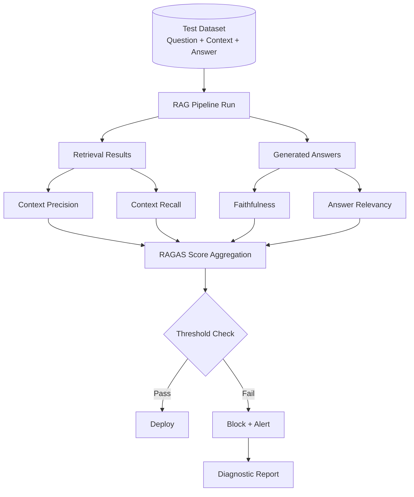

RAG systems fail silently. The LLM always generates an answer — it doesn't throw an exception when the retrieved context is irrelevant or incomplete. That means you can ship a retrieval regression and not know about it until users complain or, worse, until someone catches a confident but incorrect answer. The only protection is a continuous evaluation pipeline that measures retrieval quality independently from generation quality, runs on every material change, and blocks deployment when metrics drop below threshold.



## Why RAG Evaluation Is Hard

You're evaluating two systems jointly — retrieval and generation — and they fail in different ways. A good retriever with a poor prompt fails. A good prompt with a poor retriever fails. The failure mode looks the same to the end user (a wrong answer) but requires different fixes.

Standard LLM evaluation (BLEU, ROUGE, human preference ratings) doesn't decompose these failure modes. RAGAS does. It gives you component-level metrics so you can identify whether a regression is in retrieval (context precision/recall dropped) or generation (faithfulness dropped while context metrics stayed the same).

The other challenge is metric variance. RAGAS uses LLM-as-judge for several metrics. LLM judges are non-deterministic — the same evaluation dataset produces slightly different scores on different runs. You need to account for this variance in your thresholds and your CI pass/fail logic.

## RAGAS Metrics Explained

**Faithfulness** — Is the generated answer grounded in the retrieved context? Measures hallucination. A faithful answer only makes claims that can be directly traced to the retrieved documents. Score of 1.0 means every claim in the answer is supported; 0.0 means no claims are supported.

**Answer Relevancy** — Does the answer address the question asked? Measures whether the answer is on-topic and complete. A technically faithful answer that ignores the actual question scores low here.

**Context Precision** — Of the chunks retrieved, what proportion are actually relevant to the question? Measures retrieval precision. High context precision means you retrieved mostly useful chunks. Low precision means you retrieved a lot of noise.

**Context Recall** — Given the ground truth answer, was the information needed to generate it actually present in the retrieved context? Measures retrieval recall. Low context recall means relevant information wasn't retrieved — the retriever missed documents it should have found.

## Building an Evaluation Dataset

The hardest part of RAG evaluation is building a test dataset. You need question-context-answer triples where the "context" is the ground truth relevant documents (not what your system retrieves). This is what allows you to measure recall — you can check whether the ground truth context appeared in what your system retrieved.

**Manual curation** is highest quality and most expensive. Domain experts write questions and identify which documents should answer them. For 100-200 questions covering your key use cases, this is feasible and worth the investment.

**Synthetic generation** uses an LLM to generate questions from your document corpus. Less human effort, lower quality coverage:

```python
import anthropic
import json
import random

client = anthropic.Anthropic()

def generate_eval_questions(
    documents: list[dict],
    n_questions: int = 100
) -> list[dict]:
    """
    Generate question-context-answer triples from document corpus.
    Each triple: {question, ground_truth_context, ground_truth_answer, doc_id}
    """
    eval_dataset = []
    sampled_docs = random.sample(documents, min(n_questions, len(documents)))
    
    for doc in sampled_docs:
        prompt = f"""Given this document excerpt, generate one specific question that can be answered from it and provide the answer.

Document:
{doc['content'][:2000]}

Respond with JSON in this format:
{{
  "question": "the question",
  "answer": "the specific answer from the document"
}}

Generate a factual question that requires specific knowledge from this text — not a general question answerable from common knowledge."""

        response = client.messages.create(
            model="claude-3-5-haiku-20241022",
            max_tokens=300,
            messages=[{"role": "user", "content": prompt}]
        )
        
        try:
            data = json.loads(response.content[0].text)
            eval_dataset.append({
                "question": data["question"],
                "ground_truth_answer": data["answer"],
                "ground_truth_context": doc["content"],
                "doc_id": doc.get("id", "")
            })
        except (json.JSONDecodeError, KeyError):
            continue
    
    return eval_dataset
```

## Running RAGAS

```bash
pip install ragas langchain-openai
```

```python
from ragas import evaluate
from ragas.metrics import (
    faithfulness,
    answer_relevancy,
    context_precision,
    context_recall,
)
from datasets import Dataset

def run_rag_pipeline(question: str, retriever, llm) -> dict:
    """Run your RAG pipeline and return all components for RAGAS."""
    # Retrieval
    retrieved_docs = retriever.retrieve(question)
    contexts = [doc["content"] for doc in retrieved_docs]
    
    # Generation
    context_text = "\n\n".join(contexts)
    prompt = f"Answer based on the following context:\n\n{context_text}\n\nQuestion: {question}"
    answer = llm.generate(prompt)
    
    return {
        "question": question,
        "answer": answer,
        "contexts": contexts,
    }

def evaluate_rag_pipeline(
    eval_dataset: list[dict],
    retriever,
    llm
) -> dict:
    """
    Run full RAG evaluation with RAGAS metrics.
    
    eval_dataset: list of {question, ground_truth_answer, ground_truth_context}
    """
    results = []
    
    for item in eval_dataset:
        pipeline_output = run_rag_pipeline(item["question"], retriever, llm)
        results.append({
            "question": item["question"],
            "answer": pipeline_output["answer"],
            "contexts": pipeline_output["contexts"],
            "ground_truth": item["ground_truth_answer"],
            "ground_truths": [item["ground_truth_context"]],
        })
    
    # Convert to RAGAS Dataset format
    ragas_dataset = Dataset.from_list(results)
    
    # Run evaluation
    scores = evaluate(
        ragas_dataset,
        metrics=[
            faithfulness,
            answer_relevancy,
            context_precision,
            context_recall,
        ]
    )
    
    return scores.to_pandas().mean().to_dict()
```

## Integrating RAGAS into a pytest Suite

```python
import pytest
from pathlib import Path
import json

EVAL_DATASET_PATH = Path("tests/eval_dataset.json")

# Thresholds — set based on your baseline, tighten over time
METRIC_THRESHOLDS = {
    "faithfulness": 0.85,
    "answer_relevancy": 0.80,
    "context_precision": 0.75,
    "context_recall": 0.70,
}

# Number of runs for variance averaging
N_EVAL_RUNS = 3

@pytest.fixture(scope="session")
def eval_dataset():
    with open(EVAL_DATASET_PATH) as f:
        return json.load(f)

@pytest.fixture(scope="session")
def rag_pipeline():
    # Initialize your production RAG pipeline
    from your_rag import RAGPipeline
    return RAGPipeline.from_config("config/production.yaml")

def test_rag_faithfulness(eval_dataset, rag_pipeline):
    """Fail if faithfulness drops below threshold."""
    # Average over multiple runs to reduce LLM judge variance
    scores_across_runs = []
    for _ in range(N_EVAL_RUNS):
        scores = evaluate_rag_pipeline(eval_dataset[:50], rag_pipeline.retriever, rag_pipeline.llm)
        scores_across_runs.append(scores["faithfulness"])
    
    avg_faithfulness = sum(scores_across_runs) / len(scores_across_runs)
    
    assert avg_faithfulness >= METRIC_THRESHOLDS["faithfulness"], (
        f"Faithfulness {avg_faithfulness:.3f} below threshold "
        f"{METRIC_THRESHOLDS['faithfulness']}. "
        f"Individual runs: {scores_across_runs}"
    )

def test_rag_context_recall(eval_dataset, rag_pipeline):
    """Fail if context recall drops — retriever is missing relevant documents."""
    scores_across_runs = []
    for _ in range(N_EVAL_RUNS):
        scores = evaluate_rag_pipeline(eval_dataset[:50], rag_pipeline.retriever, rag_pipeline.llm)
        scores_across_runs.append(scores["context_recall"])
    
    avg_recall = sum(scores_across_runs) / len(scores_across_runs)
    
    assert avg_recall >= METRIC_THRESHOLDS["context_recall"], (
        f"Context recall {avg_recall:.3f} below threshold "
        f"{METRIC_THRESHOLDS['context_recall']}. "
        f"Retriever is failing to surface relevant documents."
    )

def test_rag_metrics_full(eval_dataset, rag_pipeline):
    """Run full evaluation suite and emit metrics for tracking."""
    all_metrics = {k: [] for k in METRIC_THRESHOLDS}
    
    for _ in range(N_EVAL_RUNS):
        scores = evaluate_rag_pipeline(eval_dataset, rag_pipeline.retriever, rag_pipeline.llm)
        for metric in all_metrics:
            if metric in scores:
                all_metrics[metric].append(scores[metric])
    
    avg_metrics = {k: sum(v) / len(v) for k, v in all_metrics.items() if v}
    
    # Emit metrics to your monitoring system
    for metric, value in avg_metrics.items():
        print(f"METRIC: rag.{metric}={value:.4f}")  # Parsed by CI metric collector
    
    # Assert all thresholds
    failures = []
    for metric, threshold in METRIC_THRESHOLDS.items():
        if avg_metrics.get(metric, 0) < threshold:
            failures.append(f"{metric}: {avg_metrics.get(metric, 0):.3f} < {threshold}")
    
    assert not failures, f"RAG quality regression detected:\n" + "\n".join(failures)
```

## Handling LLM Judge Variance

LLM-as-judge metrics vary by 3-8% across runs on the same dataset. Strategies:

**Average over multiple runs.** The code above runs 3 evaluations and averages. Add variance as a metric — if variance is high, your eval dataset may have ambiguous ground truth.

**Use deterministic metrics alongside probabilistic ones.** Context recall (exact match on whether ground truth context appears in retrieved docs) is more deterministic than faithfulness (LLM judgment on whether answer is grounded). Use both and be more conservative with your thresholds on the LLM-judged metrics.

**Set thresholds conservatively.** If your baseline faithfulness is 0.91 with ±0.04 variance, set the threshold at 0.85, not 0.90. A real regression will move the metric 10+ points; variance won't.

## Cost of Running Evals at Scale

For 100 eval questions, 3 runs, with RAGAS using GPT-4o for judging:
- Approximately 400 LLM calls per run (4 metrics × 100 questions)
- ~800 tokens per call on average
- 3 runs × 400 calls × 800 tokens = 960K tokens
- At $2.50/M input tokens = ~$2.40 per full eval suite run

For a CI pipeline running on every PR, that's affordable. For nightly runs on 500 questions, multiply accordingly. Use `claude-3-5-haiku` or `gpt-4o-mini` for evaluation judging if cost is a constraint — the quality difference for RAGAS-style evaluation is small enough that the cheaper models are adequate.

Don't skip evaluation to save $2.40 per CI run. A faithfulness regression that ships to production costs orders of magnitude more to diagnose and remediate than catching it before it deploys.
