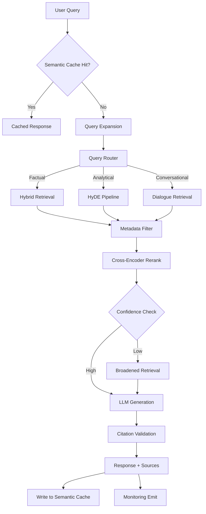

Demo RAG is three lines of code: embed query, retrieve docs, generate answer. Production RAG is an architecture. The tutorials stop at the demo. What follows are the ten patterns that separate RAG systems that work under real load and real query diversity from the ones that look fine in the happy path and degrade silently everywhere else.



## Pattern 1: Semantic Caching

Don't re-retrieve and re-generate for semantically identical queries. "What is our refund policy?" and "How do I get a refund?" are different strings but often retrieve the same documents and produce the same answer. Cache the response keyed on query embedding similarity, not exact string match.

```python
import numpy as np
from datetime import timedelta

class SemanticCache:
    def __init__(self, vector_store, similarity_threshold: float = 0.95, ttl_hours: int = 24):
        self.vector_store = vector_store
        self.threshold = similarity_threshold
        self.ttl = timedelta(hours=ttl_hours)
    
    def get(self, query_embedding: list[float]) -> dict | None:
        results = self.vector_store.query(
            vector=query_embedding,
            namespace="semantic_cache",
            top_k=1,
            include_metadata=True
        )
        if not results.matches:
            return None
        top = results.matches[0]
        if top.score >= self.threshold:
            return top.metadata  # Contains cached response + contexts
        return None
    
    def set(self, query_embedding: list[float], response: dict) -> None:
        import time, hashlib, json
        cache_id = hashlib.md5(str(time.time()).encode()).hexdigest()
        self.vector_store.upsert(
            vectors=[{"id": cache_id, "values": query_embedding, "metadata": response}],
            namespace="semantic_cache"
        )
```

Cache hit rates of 30-50% are common in enterprise knowledge base applications where users ask similar questions. At $0.01+ per query for retrieval + generation, the savings are significant.

## Pattern 2: Query Expansion

Single queries miss synonyms, abbreviations, and related terms. Generate 2-3 alternative phrasings before retrieval and union the results. Deduplicate by document ID.

```python
async def expand_query(query: str, llm) -> list[str]:
    prompt = f"""Generate 3 alternative phrasings of this search query.
Cover different vocabulary, including abbreviations, synonyms, and related terms.
Return only the queries, one per line, no numbering.

Query: {query}"""
    
    response = await llm.agenerate(prompt)
    alternatives = [line.strip() for line in response.strip().split('\n') if line.strip()]
    return [query] + alternatives[:3]  # Original + up to 3 alternatives

async def retrieve_expanded(query: str, retriever, llm, top_k: int = 10) -> list[dict]:
    expanded_queries = await expand_query(query, llm)
    all_results: dict[str, dict] = {}
    
    for q in expanded_queries:
        results = await retriever.aretrieve(q, top_k=top_k)
        for doc in results:
            doc_id = doc.get("id") or doc["content"][:64]
            if doc_id not in all_results:
                all_results[doc_id] = doc
    
    return list(all_results.values())
```

## Pattern 3: HyDE — Hypothetical Document Embeddings

Instead of embedding the user's question, generate a hypothetical answer document and embed that. Questions and their answers often live in different parts of embedding space. A hypothetical answer is more likely to be near real answers in the corpus than the question itself.

```python
async def hyde_retrieve(query: str, llm, embedder, vector_store, top_k: int = 10) -> list[dict]:
    # Generate a hypothetical answer
    hyde_prompt = f"""Write a concise, factual passage that would directly answer this question.
Write it as if it were a paragraph from an expert document on the topic.

Question: {query}

Passage:"""
    
    hypothetical_doc = await llm.agenerate(hyde_prompt)
    
    # Embed the hypothetical document, not the query
    hyp_embedding = await embedder.aembed_query(hypothetical_doc)
    
    # Retrieve real documents similar to the hypothetical answer
    results = await vector_store.asimilarity_search_by_vector(hyp_embedding, k=top_k)
    return results
```

HyDE works best for factual Q&A against expert-written corpora. It's less useful for procedural queries ("how do I...") where the answer structure differs substantially from your document style.

## Pattern 4: Step-Back Prompting

For specific technical questions, retrieve at a higher level of abstraction first, then narrow down. "Why does the Kubernetes pod restart with OOMKilled status?" → step-back to "What causes Kubernetes pod restart events?" — retrieves foundational context that helps the LLM interpret the specific answer.

```python
async def stepback_retrieve(query: str, llm, retriever, top_k: int = 10) -> list[dict]:
    stepback_prompt = f"""Generate a more general version of this question that covers the broader concept.

Specific question: {query}
General question:"""
    
    general_query = await llm.agenerate(stepback_prompt)
    general_query = general_query.strip()
    
    # Retrieve for both specific and general
    specific_results = await retriever.aretrieve(query, top_k=top_k // 2)
    general_results = await retriever.aretrieve(general_query, top_k=top_k // 2)
    
    # Merge, dedup, return
    seen = set()
    merged = []
    for doc in specific_results + general_results:
        doc_id = doc.get("id") or doc["content"][:64]
        if doc_id not in seen:
            seen.add(doc_id)
            merged.append(doc)
    return merged
```

## Pattern 5: Query Routing

Not all queries need the same retrieval strategy. A question about a specific named entity needs exact lookup. A conceptual question needs semantic search. A time-sensitive question needs date-filtered retrieval. Classify the query type first, then route.

```python
from enum import Enum

class QueryType(str, Enum):
    FACTUAL = "factual"       # Specific fact lookup — use exact + semantic
    ANALYTICAL = "analytical"  # Reasoning required — use HyDE
    RECENT = "recent"         # Time-sensitive — apply date filter
    CONVERSATIONAL = "conversational"  # Follow-up — use conversation context

async def classify_and_route(query: str, llm, conversation_history: list) -> QueryType:
    has_history = len(conversation_history) > 1
    
    classify_prompt = f"""Classify this query into one of: factual, analytical, recent, conversational.

- factual: asks for a specific fact, definition, or data point
- analytical: requires reasoning, comparison, or synthesis across information  
- recent: explicitly asks about recent events or current status
- conversational: refers to previous turns ("you mentioned", "what about", "and also")

Query: {query}
Has conversation history: {has_history}

Respond with just one word."""
    
    result = await llm.agenerate(classify_prompt)
    query_type_str = result.strip().lower()
    
    try:
        return QueryType(query_type_str)
    except ValueError:
        return QueryType.FACTUAL  # Default
```

## Pattern 6: Retrieval-Time Metadata Filtering

Filter by document metadata before vector comparison to improve precision and reduce noise. Date ranges, document type, source system, author, classification level — use whatever metadata you indexed.

```python
from datetime import datetime, timedelta

def build_retrieval_filter(
    query: str,
    user_context: dict,
    date_sensitive: bool = False
) -> dict:
    """Build a metadata filter from query context and user permissions."""
    filters = {
        "tenant_id": user_context["tenant_id"],
    }
    
    if date_sensitive:
        # Only retrieve documents from the last 90 days
        cutoff = (datetime.utcnow() - timedelta(days=90)).isoformat()
        filters["created_at"] = {"$gte": cutoff}
    
    if user_context.get("doc_type_filter"):
        filters["doc_type"] = {"$in": user_context["doc_type_filter"]}
    
    return filters
```

## Pattern 7: Adaptive Retrieval (Dynamic top-K)

Simple queries need fewer context chunks. Complex queries need more. Statically setting top-K at 5 over-retrieves for simple queries (noise) and under-retrieves for complex ones (missed context). Adapt based on query complexity signals.

```python
def estimate_top_k(query: str, base_k: int = 5) -> int:
    words = query.split()
    question_words = sum(1 for w in words if w.lower() in 
                         {"what", "who", "where", "when", "why", "how", "which", "compare", "list", "explain"})
    conjunctions = sum(1 for w in words if w.lower() in {"and", "also", "additionally", "moreover", "furthermore"})
    
    # Simple single-concept queries: use base_k
    # Complex multi-concept queries: scale up
    complexity_multiplier = 1.0 + (0.3 * question_words) + (0.4 * conjunctions)
    return min(int(base_k * complexity_multiplier), base_k * 3)
```

## Pattern 8: Fallback to Broader Context

If retrieval confidence is low (no chunk exceeds a relevance threshold), broaden the search rather than sending poor context to the LLM.

```python
async def retrieve_with_fallback(
    query: str,
    retriever,
    confidence_threshold: float = 0.7,
    narrow_k: int = 5,
    broad_k: int = 20
) -> tuple[list[dict], bool]:
    """Returns (results, used_fallback)."""
    results = await retriever.aretrieve(query, top_k=narrow_k)
    
    if not results or max(r.get("score", 0) for r in results) < confidence_threshold:
        # Broaden: more results, looser filtering
        broad_results = await retriever.aretrieve(
            query, top_k=broad_k, min_score=0.3
        )
        return broad_results, True
    
    return results, False
```

## Pattern 9: Citation Validation

The LLM will sometimes cite sources that don't exist in the retrieved context. Before returning a response, verify that each cited source ID corresponds to an actually retrieved chunk.

```python
import re

def validate_citations(response: str, retrieved_docs: list[dict]) -> dict:
    retrieved_ids = {doc.get("id", "") for doc in retrieved_docs}
    
    cited_ids = set(re.findall(r'\[(?:Source|Doc|Ref)[-_]?(\w+)\]', response))
    
    invalid_citations = cited_ids - retrieved_ids
    valid_citations = cited_ids & retrieved_ids
    
    return {
        "valid": len(invalid_citations) == 0,
        "invalid_citations": list(invalid_citations),
        "valid_citations": list(valid_citations),
        "response_clean": re.sub(
            r'\[(?:Source|Doc|Ref)[-_]?\w+\]',
            lambda m: m.group(0) if m.group(1) in retrieved_ids else "[unverified]",
            response
        ) if invalid_citations else response
    }
```

## Pattern 10: Async Pre-Fetching

If your application has a streaming text input (search box, chat interface), start retrieval while the user is still typing. By the time they hit Enter, retrieval may already be complete.

```python
import asyncio
from dataclasses import dataclass, field

@dataclass  
class PrefetchState:
    task: asyncio.Task | None = None
    partial_query: str = ""
    results: list[dict] = field(default_factory=list)

async def handle_keystroke(
    current_input: str,
    state: PrefetchState,
    retriever,
    debounce_ms: int = 300
) -> None:
    """Called on each keystroke. Prefetches if input is substantial."""
    if len(current_input) < 20:
        return
    
    if state.task and not state.task.done():
        state.task.cancel()
    
    async def prefetch():
        await asyncio.sleep(debounce_ms / 1000)  # Debounce
        state.partial_query = current_input
        state.results = await retriever.aretrieve(current_input, top_k=10)
    
    state.task = asyncio.create_task(prefetch())

async def handle_submit(
    final_query: str,
    state: PrefetchState,
    retriever
) -> list[dict]:
    """On submit: use prefetched results if they match, else fetch fresh."""
    if state.partial_query == final_query and state.results:
        return state.results  # Prefetch hit
    
    if state.task and not state.task.done():
        state.task.cancel()
    
    return await retriever.aretrieve(final_query, top_k=10)
```

For interactive chat interfaces with average message length > 60 characters, async pre-fetching can eliminate perceived retrieval latency entirely — the retrieval completes during the user's typing time.

These patterns aren't academic. Semantic caching, query routing, citation validation, and adaptive top-K are the difference between a RAG system that works in QA and one that's defensible in production. Implement them incrementally — start with caching and citation validation, which have the highest ROI per implementation hour.
