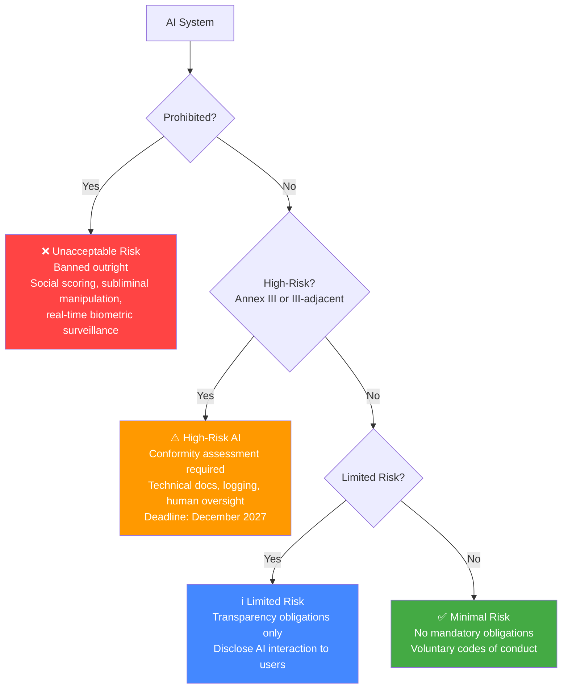

August 2, 2026 passed quietly for most engineering teams. But if your company operates in the EU or processes EU residents' data, the day was legally significant: the EU AI Act's general provisions came into full force. The prohibition on unacceptable AI systems (Article 5) and the governance requirements for general-purpose AI models (Title VIII) are now enforceable, not aspirational. And there's a deadline nuance that most engineers haven't seen yet — one that actually buys you time on the piece that costs the most to implement.



## What Actually Became Enforceable on August 2, 2026

Three things went live in August:

**Prohibited systems (Article 5)** — These are banned outright. Real-time remote biometric surveillance in public spaces (with narrow law enforcement exceptions), AI-based social scoring by governments or public authorities, systems that exploit cognitive vulnerabilities or subconscious behavior, and predictive policing systems that profile individuals based solely on characteristics. If your system does any of these, you're not in a compliance gray zone — you're violating law.

**General-purpose AI model obligations (Title VIII)** — If you're building products on top of foundation models (GPT-4o, Claude, Gemini, Llama 3), you need technical documentation of how you're using the model, what data it accesses, and what safeguards you've implemented. Model providers have their own obligations, but downstream integrators — that's you — also carry documentation requirements.

**Governance infrastructure** — Regulated organizations need an AI governance function, internal policies for AI development, and a documented process for classifying new AI systems by risk tier before deployment.

## The Digital Omnibus Deal: Annex III Deadline Moved to December 2027

This is the nuance that matters. The original EU AI Act required Annex III high-risk systems to achieve full compliance by August 2, 2026. That deadline has been moved to December 31, 2027 through the Digital Omnibus directive — an amendment package negotiated to give industry more runway.

Annex III is the list that defines high-risk AI for most enterprise applications: employment and recruitment tools, credit scoring and access to essential services, educational assessment, systems used in critical infrastructure management, and AI used by law enforcement or border control.

What this means practically: if your HR platform uses AI for resume screening, or your lending product uses AI for credit risk, you have until the end of 2027 to achieve full Annex III compliance. You do not have until then to *start* — the documentation work, conformity assessments, and technical controls for a complex system take 12-18 months to execute.

## Does Your System Qualify as High-Risk?

The Annex III categories are broader than they sound:

| Category | Examples | What engineers often miss |
|---|---|---|
| Employment, workers management | AI that ranks job candidates, performance scoring, task assignment systems | Applies even if AI is advisory, not final-decision |
| Access to essential services | Credit decisions, insurance risk, benefit eligibility | Includes AI-assisted human review, not just automated decisions |
| Critical infrastructure | Energy grid management, water treatment, transport | Lower threshold — any AI that "manages or operates" critical infrastructure |
| Education and vocational training | Automated essay scoring, student monitoring | Includes proctoring systems |
| Law enforcement | Risk assessment for criminal recidivism, predictive analytics | High sensitivity, third-party audits expected |

The question to ask: does your AI system make, assist, or substantially influence decisions that affect a person's access to employment, services, education, or their legal status? If yes, you're probably in Annex III territory regardless of how the AI is framed.

## Technical Documentation Requirements

For high-risk AI systems, the required documentation package under Article 11 and Annex IV is substantial. The core elements:

**System description:**
- Intended purpose, deployment context, and the specific decision it supports
- Architecture: what model, what version, how it's integrated, what data it consumes
- Known limitations and performance boundaries
- Human oversight mechanisms — specifically, how a human can review, override, or reject the AI's output

**Performance metrics:**
- Accuracy, precision, recall — broken down by demographic groups where applicable
- Evaluation dataset description: composition, sources, size, any known gaps
- Residual risk assessment after mitigations

**Training data governance:**
- Data sources and acquisition method
- Data preparation, labeling, and cleaning steps
- Known biases in the training set and how they were addressed

**Change management:**
- Versioning: what changed between model versions, how changes are evaluated
- Significant modification criteria — when a change is substantial enough to trigger re-assessment

Here's a minimal documentation record structure in YAML that covers the Article 11 essentials:

```yaml
ai_system:
  id: "hiring-screener-v2"
  version: "2.3.1"
  intended_purpose: "First-pass candidate screening for software engineering roles"
  annex_iii_category: "employment"
  risk_tier: "high"

model:
  provider: "Anthropic"
  model_id: "claude-opus-4"
  access_method: "API"
  system_prompt_version_hash: "sha256:a1b2c3..."

deployment:
  geography: ["DE", "FR", "NL", "IE"]
  eu_affected: true
  human_oversight: "Recruiter reviews all AI scores before candidate contact"
  override_mechanism: "Recruiter portal allows score override with required reason code"

performance:
  eval_date: "2026-09-15"
  eval_dataset: "1,200 historical applications (anonymized)"
  metrics:
    precision: 0.84
    recall: 0.79
    demographic_parity_gap: 0.03  # measured across gender, ethnicity groups
  known_limitations:
    - "Performance degrades for non-traditional career paths"
    - "Not validated for roles outside software engineering"

training_data:
  description: "Fine-tuning not performed; base model used via API"
  rag_corpus: "Internal job descriptions, role criteria documents"
  data_sources: ["internal HR system"]
  pii_handling: "Candidate names redacted before processing"
```

## Conformity Assessment: Self-Assessment vs. Third-Party

Most Annex III systems can do self-assessment — you document, assess, and declare conformity yourself. The exceptions where third-party assessment is required: biometric identification systems and AI used in critical infrastructure by public authorities.

Self-assessment means: complete the technical documentation, run your own conformity evaluation against the requirements, generate a Declaration of Conformity document, and affix the CE mark if you're placing the system on the EU market. You don't submit this to a regulator — you keep it, ready for inspection.

What the self-assessment process looks like in practice:
1. Gap analysis against Annex IV requirements (usually takes a week with the right people)
2. Documentation package development (4-8 weeks for a moderately complex system)
3. Internal conformity evaluation — does the system meet the accuracy, transparency, and oversight requirements?
4. Declaration of Conformity signed by an authorized representative
5. Registration in the EU AI Act database (for Annex III systems — the Commission database went live in mid-2026)

## What to Start Now

Even with the December 2027 deadline for Annex III, starting now makes sense. The work that takes the longest isn't the final documentation — it's the technical changes required to *enable* the documentation.

**Start immediately:**
- Inventory every AI system in production or development — classify each by risk tier
- Implement logging for AI-assisted decisions (you need this for the audit trail requirements anyway)
- Add human override mechanisms to any AI-assisted decision workflow that touches EU users
- Identify which systems are Annex III — get legal and engineering aligned on this

**6-12 months out:**
- Build the documentation infrastructure: version tracking, eval dataset management, demographic performance breakdowns
- Draft system descriptions for Annex III systems while the technical details are fresh
- Run a first conformity assessment on your highest-risk system as a pilot

**Before December 2027:**
- Full conformity assessment on all Annex III systems
- EU AI Act database registration
- Incident reporting process operational (significant incidents must be reported to national supervisory authorities)

The engineers who are going to struggle in late 2027 are the ones who haven't done the logging and version control work yet. That infrastructure is the foundation everything else sits on — and it's also just good engineering practice regardless of regulation.
