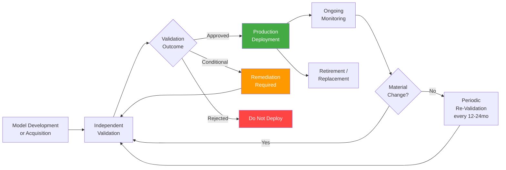

SR 11-7 — the Federal Reserve's model risk management guidance from 2011 — has governed how banks think about quantitative models for fifteen years. Credit scorecards, stress testing models, valuation models: every bank has a mature process for inventorying them, validating them independently, and monitoring their ongoing performance. Now those same banks are deploying LLMs for customer service, credit decisioning support, and document analysis, and the question is how their existing MRM frameworks apply.

The short answer: SR 11-7's principles are the right foundation, but LLMs break every assumption the framework was built on. Non-determinism, prompt sensitivity, emergent behaviors, and opaque version updates require significant adaptation. Here's how to do it.



## What SR 11-7 Requires (and Where LLMs Diverge)

SR 11-7 defines model risk as the potential for adverse consequences from decisions based on incorrect or misused models. The guidance requires three things: effective challenge (independent validation), sound development and implementation, and ongoing monitoring.

For traditional quantitative models — a logistic regression for credit risk, a Monte Carlo simulation for portfolio valuation — these requirements translate cleanly. The model has a fixed mathematical form, deterministic outputs given the same inputs, and measurable performance against a historical dataset.

LLMs break all of this:

**Non-determinism** — The same prompt with temperature > 0 produces different outputs on every call. You can't validate a traditional model the way you validate a statistical model — there's no ground truth output to compare against for a given input. You validate output distributions and behavioral properties instead.

**Prompt sensitivity** — Minor changes in phrasing can produce qualitatively different outputs. The "model" that's actually running in production isn't just the weights — it's the weights plus the system prompt plus the retrieval context. Validating the weights without validating the prompt is incomplete.

**Version drift** — When Anthropic updates Claude or OpenAI updates GPT-4o, the model changes without your intervention. What you validated last quarter may not be what's running today. Traditional MRM assumes you control model versions; API-accessed LLMs break that assumption.

**Emergent behaviors** — LLMs can behave unexpectedly on inputs that are semantically similar to ones in the training distribution. There's no comprehensive way to enumerate failure modes in advance.

## The Three Components of an LLM MRM Framework

### 1. Model Inventory

Every LLM deployment needs an inventory record. The record must be complete enough that a validator — who wasn't involved in building the system — can understand what the system does, what risks it carries, and what controls are in place.

```yaml
llm_model_record:
  model_id: "loan-decision-support-v3"
  business_use: "Loan officer support — summarizes applicant file, flags risk factors"
  risk_tier: "high"  # high / medium / low — based on materiality and decision impact
  owner: "consumer-lending-team"
  date_registered: "2026-08-01"

  model_details:
    provider: "Anthropic"
    model_family: "claude-opus"
    access_method: "API"
    system_prompt_version: "v4.2"
    system_prompt_hash: "sha256:d4e5f6..."
    retrieval_corpus: "applicant-documents-rag-v2"
    fine_tuned: false

  data_access:
    pii_categories: ["name", "income", "employment", "credit_history"]
    sensitive_categories: ["financial"]
    data_residency: "US"

  risk_assessment:
    decision_impact: "supports human loan officer — officer retains final authority"
    materiality: "high — influences credit decisions"
    regulatory_scope: ["ECOA", "FCRA", "SR_11-7"]
    annual_decision_volume: 45000

  validation:
    last_validated: "2026-09-15"
    next_validation_due: "2027-09-15"
    validator: "model-risk-validation-team"  # separate from development team
    validation_status: "approved"
    open_findings: 2

  monitoring:
    review_frequency: "monthly"
    last_review: "2026-10-15"
    drift_alert_threshold: 0.05  # performance metric drop trigger
```

### 2. Independent Validation Program

SR 11-7's independence requirement means the team that builds the model can't also validate it. For internal builds, this is achievable — a separate model risk team runs validation. For API-accessed models, independence is more nuanced: you can't validate the underlying model weights, but you can independently validate the implementation (prompt design, integration logic, retrieval pipeline) and the use case (does this application use the model appropriately?).

**Pre-deployment validation checklist:**

Conceptual soundness — does the model approach make sense for this use case? An LLM summarizing loan documents is conceptually appropriate; an LLM making autonomous final credit decisions is not.

Outcome testing — test the system against a dataset of historical cases where outcomes are known. For each case, record the LLM's output and compare against what actually happened or what a human expert would recommend. This isn't about getting 100% agreement — it's about understanding the error rate and the character of errors.

Disparity analysis — for any system that affects humans, measure performance differences across demographic segments. Document findings honestly, including cases where the system performs worse for specific groups.

Adversarial testing — red team the system with inputs designed to elicit problematic outputs: manipulative prompts, unusual edge cases, inputs from outside the intended use distribution.

Prompt validation — the system prompt is part of the model. Validate it separately: does it correctly constrain behavior? Are there injection vectors? Does it produce consistent behavior across paraphrased inputs?

### 3. Documentation Package

Each validated LLM system needs a documentation package that persists and is version-controlled. At minimum:

- **Model card** — intended use, out-of-scope uses, performance metrics by segment, known limitations
- **System architecture document** — full pipeline diagram, data flows, dependencies
- **Validation report** — validator's findings, model owner's responses, conditions of approval
- **Risk assessment** — how materiality and risk tier were determined

## Ongoing Monitoring: What to Track and How Often

Traditional models have well-defined performance metrics that can be monitored against historical baselines. LLM monitoring is harder — outputs are qualitative, reference data is scarce, and distribution shift is difficult to detect.

Practical monitoring metrics:

| Metric | Frequency | Trigger |
|---|---|---|
| Refusal / error rate | Daily | >2x baseline triggers review |
| Human override rate | Weekly | Significant increase suggests model degradation |
| Hallucination rate (sampled) | Monthly | Human review of a random output sample |
| Output length distribution | Daily | Significant drift may indicate model version change |
| Latency p95 | Daily | Provider-side changes often show here first |
| Downstream business outcome correlation | Quarterly | Do AI-assisted decisions perform differently than human-only? |

The hardest part: detecting when the underlying model has silently changed. API providers update models without guaranteed notice. Add a canary evaluation suite — a fixed set of test prompts with expected output characteristics — that runs daily against production. If outputs shift, you know something changed.

```python
# Minimal canary eval for LLM version drift detection
import hashlib
import json
from datetime import date

CANARY_PROMPTS = [
    {
        "id": "loan-summary-standard",
        "prompt": "Summarize this loan application: [STANDARD_TEST_FIXTURE]",
        "expected_length_range": (100, 400),
        "must_contain": ["income", "debt-to-income", "employment"],
        "must_not_contain": ["approved", "denied", "recommend"],
    },
    # ... more canary cases
]

def run_canary_eval(client, model_id: str) -> dict:
    results = []
    for case in CANARY_PROMPTS:
        response = client.messages.create(
            model=model_id,
            messages=[{"role": "user", "content": case["prompt"]}]
        )
        output = response.content[0].text
        result = {
            "id": case["id"],
            "date": str(date.today()),
            "length_ok": case["expected_length_range"][0] <= len(output) <= case["expected_length_range"][1],
            "contains_required": all(kw in output.lower() for kw in case["must_contain"]),
            "no_prohibited": all(kw not in output.lower() for kw in case["must_not_contain"]),
        }
        result["pass"] = all([result["length_ok"], result["contains_required"], result["no_prohibited"]])
        results.append(result)

    pass_rate = sum(r["pass"] for r in results) / len(results)
    return {"date": str(date.today()), "pass_rate": pass_rate, "results": results}
```

Run this daily. Store results. Alert when pass rate drops more than 10 percentage points from the rolling 30-day average.

## Periodic Re-Validation and Retirement

High-risk models — those that materially influence significant decisions — should be re-validated annually. Medium-risk models every 18-24 months. Re-validation is triggered earlier by: a material change to the model or its inputs, a significant performance finding in ongoing monitoring, or a regulatory exam that raises questions.

Retirement criteria are as important as deployment criteria. An LLM system should be retired when: the underlying model is deprecated by the provider, the use case has changed beyond what was validated, or a newer approach is significantly better and the old system hasn't been validated for the new capabilities.

One thing SR 11-7 practitioners get right that LLM teams often skip: documenting *why* a model was retired and what replaced it. Future regulators will ask, and "we upgraded to a better model" is not a complete answer.

## The Limitation You Need to Acknowledge

LLM MRM is harder than traditional MRM, and anyone who tells you otherwise hasn't actually tried to validate an LLM system for regulatory purposes. The non-determinism is manageable. The version opacity is genuinely difficult — you're validating a model you don't control, operated by a provider who can change it without your knowledge.

The pragmatic response: validate what you can control (the implementation, the prompt, the integration), monitor for what you can detect (behavioral drift, error rate changes), and document your monitoring approach as part of the validation record. Regulators examining LLM systems are mostly looking for evidence that you thought seriously about the risks and implemented proportionate controls — not for the same level of mathematical precision that traditional MRM provides.
