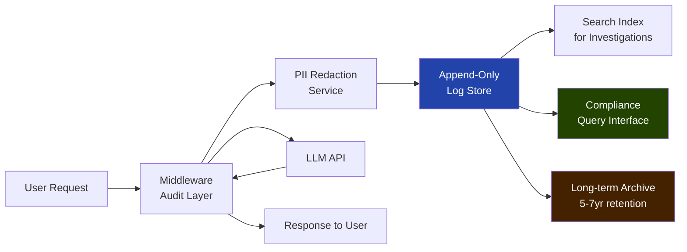

Application logs tell you what happened to your system. AI audit trails tell you what your AI told someone, and why. These are different things with different requirements. When a bank's LLM surfaces a credit decision rationale, or a healthcare system's AI summarizes a patient record, or an HR platform's AI ranks candidates — those outputs need an audit record that can survive regulatory examination, legal discovery, and internal incident investigation, sometimes years later.

Most engineering teams discover this requirement after the fact, while trying to reconstruct what their AI did in a specific case. Building the audit infrastructure retrospectively is painful. Building it right the first time takes maybe a sprint.



## Why AI Audit Trails Differ from Application Logs

Standard application logs capture: timestamps, request/response codes, latencies, error states, user IDs. That's enough for debugging and operations. It tells you that request X happened, took Y milliseconds, and returned HTTP 200.

For AI systems, that's not enough. What you actually need to reconstruct in a regulatory or legal context:

- What was the model asked, exactly — including the full system prompt and any retrieved context?
- What did the model say?
- Who was the user, and what was their role?
- Which model version was used?
- What data sources were accessed (RAG retrieval, tool calls)?
- Was the output modified before reaching the user?

The difference matters enormously in an investigation. "The model returned HTTP 200" tells you nothing about whether the model's advice was appropriate for the user's situation, whether it hallucinated, or whether it was operating outside its intended scope.

## The Minimum Viable AI Audit Record

Every LLM interaction that influences a decision affecting a person should produce a record with these fields:

```json
{
  "event_id": "evt_01j8k2m3n4p5q6r7s8t9",
  "event_type": "llm_interaction",
  "timestamp_utc": "2026-11-10T09:14:33.241Z",

  "session": {
    "session_id": "sess_abc123",
    "user_id": "usr_9876",
    "user_role": "loan_officer",
    "source_ip_hash": "sha256:f1a2b3...",
    "application": "loan-decision-support",
    "application_version": "3.2.1"
  },

  "model": {
    "provider": "Anthropic",
    "model_id": "claude-opus-4",
    "model_version_reported": "claude-opus-4-20261101",
    "system_prompt_id": "loan-support-v4",
    "system_prompt_hash": "sha256:d4e5f6..."
  },

  "request": {
    "user_input_hash": "sha256:a1b2c3...",
    "user_input_redacted": "Applicant [REDACTED] submitted for $[AMOUNT] loan. Employment: [EMPLOYER]. Income: [INCOME_REDACTED].",
    "retrieval_context_ids": ["doc_123", "doc_456"],
    "tool_calls_made": [],
    "input_tokens": 847
  },

  "response": {
    "output_hash": "sha256:e7f8g9...",
    "output_redacted": "Summary: Applicant has [DURATION] at current employer. DTI ratio is [RATIO]. Key risk factors: [FACTORS_LIST].",
    "output_tokens": 312,
    "finish_reason": "end_turn"
  },

  "performance": {
    "latency_ms": 1847,
    "ttfb_ms": 423
  },

  "compliance": {
    "data_classification": "confidential",
    "regulatory_scope": ["ECOA", "FCRA"],
    "pii_detected": true,
    "pii_categories_detected": ["financial", "employment"],
    "retention_years": 7
  }
}
```

A few design decisions worth explaining:

**Hash the full input and output, store the redacted version.** This lets you verify integrity (a stored hash matches the original) while not storing raw PII in the audit log. In an investigation where you need the full content, you can retrieve from the source system using the event ID.

**Store system prompt hash, not the full prompt.** System prompts can be long and may contain business logic you'd rather not store in audit logs. The hash lets you prove the prompt hasn't changed between two events. Keep the prompts in a versioned artifact store, referenced by ID and hash.

**Record token counts explicitly.** Token counts are your forensic evidence of what was actually processed. A 50-token response to an 847-token input tells a very different story than a 3,000-token response.

## PII Handling: Redact Before Storing

The challenge with AI audit trails is that LLM inputs contain natural language — and natural language from users discussing their own situations will contain PII. Names, financial amounts, medical conditions, employment details, addresses.

Two approaches:

**Redact before storing:** Run inputs and outputs through a PII detection and redaction service before writing to the audit log. Store the redacted version plus a hash of the original. The original (with PII) stays in the source system under its own access controls.

**Store encrypted with access controls:** Store the full content, encrypted at rest, with access limited to specific compliance and legal roles. This is operationally simpler but creates a data minimization problem under GDPR — you're storing more PII than is strictly necessary for the audit purpose.

For most enterprise use cases, redact-before-storing is the right default. It satisfies GDPR data minimization, simplifies retention policies, and reduces the blast radius of a log storage breach.

PII detection in Python using a lightweight approach:

```python
import re
from typing import Optional

# Simple regex patterns — in production use a purpose-built library
# (Presidio from Microsoft is a good open-source option)
PII_PATTERNS = {
    "email": r"\b[A-Za-z0-9._%+-]+@[A-Za-z0-9.-]+\.[A-Z|a-z]{2,}\b",
    "ssn": r"\b\d{3}-\d{2}-\d{4}\b",
    "phone": r"\b\+?1?\s*[-.]?\s*\(?\d{3}\)?[-.\s]?\d{3}[-.\s]?\d{4}\b",
    "credit_card": r"\b(?:\d[ -]?){13,16}\b",
    "dollar_amount": r"\$\s*\d{1,3}(?:,\d{3})*(?:\.\d{2})?",
}

CATEGORY_REPLACEMENTS = {
    "email": "[EMAIL_REDACTED]",
    "ssn": "[SSN_REDACTED]",
    "phone": "[PHONE_REDACTED]",
    "credit_card": "[CARD_REDACTED]",
    "dollar_amount": "[AMOUNT]",
}

def redact_pii(text: str) -> tuple[str, list[str]]:
    """Returns (redacted_text, list_of_detected_categories)."""
    detected = []
    result = text
    for category, pattern in PII_PATTERNS.items():
        if re.search(pattern, result):
            detected.append(category)
            result = re.sub(pattern, CATEGORY_REPLACEMENTS[category], result)
    return result, detected
```

> **Note**: Regex-based PII detection misses a lot. In production, use a proper NER-based tool. Presidio, spaCy with custom NER, or a purpose-built PII detection service are all better options. The regex approach is a starting point, not a production solution.
{: .prompt-warning }

## Retention Policies

Retention requirements vary by jurisdiction and use case:

| Regulatory context | Minimum retention | Notes |
|---|---|---|
| GDPR (EU) | No minimum — data minimization applies | Keep only as long as necessary |
| Financial services (US) | 5-7 years | Depends on regulation; SR 11-7 systems → 7 years |
| Consumer lending (ECOA) | 25 months for adverse action records | Minimum — prudent to keep longer |
| HIPAA (healthcare AI) | 6 years | From creation or last effective date |
| EU AI Act (high-risk systems) | 10 years | From market placement |

The practical answer for most regulated enterprise AI: 7 years, tiered storage. Keep the last 12 months in hot storage (fast query). Move older records to warm storage (slower query, lower cost). Move records beyond 3 years to cold archive (restore time measured in hours, costs nearly nothing to store).

## Immutability: Making Audit Logs Tamper-Evident

Audit logs that can be modified after the fact are useless for regulatory purposes. The minimum requirement: logs must be append-only and tamper-evident.

Implementation options, from simplest to most rigorous:

**Write-once object storage:** AWS S3 Object Lock (Compliance mode), Azure Blob Storage with immutability policies. Once written, objects cannot be modified or deleted until the retention period expires. Simple to implement, sufficient for most regulated use cases.

**Cryptographic chaining:** Each log record includes a hash of the previous record. Any modification breaks the chain and is detectable. More complex to implement and verify, but provides stronger tamper evidence without depending on storage-layer controls.

**Audit-specific database:** TimescaleDB with append-only hypertables, or a purpose-built audit log service (Immudb is a good open-source option). These handle the immutability semantics at the application layer.

For most enterprise implementations: S3 Object Lock in Compliance mode plus an append-only write IAM policy is sufficient and operationally simple.

## Querying Audit Logs for Incident Investigation

The moment you actually need the audit trail is the moment you'll thank yourself for building it with query in mind. Essential query patterns:

```sql
-- All LLM interactions for a specific user in a time range
SELECT event_id, timestamp_utc, model.model_id, response.output_redacted
FROM ai_audit_log
WHERE session.user_id = 'usr_9876'
  AND timestamp_utc BETWEEN '2026-10-01' AND '2026-10-31'
ORDER BY timestamp_utc DESC;

-- All interactions using a specific model version (e.g., after a model update incident)
SELECT event_id, session.user_id, timestamp_utc
FROM ai_audit_log
WHERE model.model_version_reported = 'claude-opus-4-20261101'
  AND timestamp_utc > '2026-11-01'
ORDER BY timestamp_utc ASC;

-- Interactions where PII was detected (compliance review)
SELECT event_id, timestamp_utc, compliance.pii_categories_detected
FROM ai_audit_log
WHERE compliance.pii_detected = true
  AND compliance.regulatory_scope @> '["ECOA"]'
ORDER BY timestamp_utc DESC
LIMIT 100;
```

Store audit logs in a columnar format (Parquet in S3, or a columnar database like Redshift or BigQuery) and you'll get queries that run in seconds even at millions of records.

The investment to build this properly is maybe two weeks of engineering time. The cost of not having it — when a regulator asks you to produce all AI-assisted decisions for a specific user over the past two years — is much higher.
