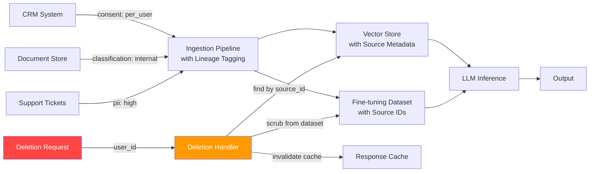

When you ingest a document into a RAG corpus, embed it as a vector, and use it to answer user queries, you've just created a data pipeline that your existing data governance framework almost certainly doesn't cover. The document might have been created by an employee whose data rights you need to respect. It might contain customer PII that's subject to GDPR. It might be classified at a level that shouldn't go to an external API. And if someone exercises their right to be forgotten, you need to know which embeddings to delete, which fine-tuning datasets to scrub, and which cached responses to invalidate.

Most enterprise AI teams are running ahead of their data governance programs. The technical capability to ingest and process data at scale arrived years before the governance frameworks to manage it responsibly. That gap is now a regulatory exposure, and it's getting more explicit as the EU AI Act, GDPR enforcement actions, and sector-specific AI regulations mature.



## How LLM Systems Create New Data Governance Challenges

A traditional application has clear data flows: data enters through defined inputs, is processed by defined logic, and is stored in defined places. Data classification, consent management, and access controls can be mapped to specific tables, fields, and API endpoints.

LLM systems break this model in four ways:

**Embeddings are a derived form of PII** — If you embed a document containing an individual's name, salary, and performance history, the embedding captures that information in compressed form. You can't "see" the PII in the embedding the way you'd see it in a database record, but you can reconstruct approximate versions of the original content from embeddings, especially with access to similar documents. Courts and regulators are beginning to treat embeddings as a derived personal data representation.

**RAG retrieval creates implicit data access** — When a user query retrieves chunks from the vector store, those chunks may contain information the user doesn't have direct access rights to in the source system. A sales rep querying the AI might inadvertently access engineering documents, HR data, or financial projections through retrieved context.

**Fine-tuning bakes data into weights** — If you fine-tune a model on a dataset containing PII, removing that PII later is technically very difficult. You'd need to retrain the model from scratch or apply machine unlearning techniques — which are experimental and not yet reliable enough for regulatory compliance.

**Prompt logs contain user conversations** — Every interaction with an LLM generates a log that is itself a dataset, often containing sensitive information the user shared conversationally. These logs need their own data governance treatment.

## Data Lineage: What You Need to Track

For every document or record ingested into an AI system, you need a lineage record that follows it through the pipeline. This isn't optional for GDPR compliance — Article 30 requires records of processing activities, and Article 22 requires the ability to explain automated decision-making.

A data lineage record for an AI asset:

```yaml
ai_data_asset:
  asset_id: "doc_a1b2c3d4"
  asset_type: "document"

  source:
    system: "sharepoint"
    document_id: "SP-2026-HR-Policy-023"
    document_url: "https://company.sharepoint.com/sites/hr/..."
    created_by: "user_id_789"
    created_at: "2026-03-15T10:00:00Z"
    last_modified: "2026-07-22T14:30:00Z"

  classification:
    data_sensitivity: "confidential"
    contains_pii: true
    pii_categories: ["employment_status", "compensation"]
    regulatory_scope: ["GDPR", "labor_law"]
    approved_for_ai_ingestion: true
    approved_by: "data-governance-team"
    approval_date: "2026-08-01"

  consent:
    consent_basis: "legitimate_interest"
    consent_basis_documentation: "AI-policy-2026-v2.pdf"
    data_subject_notified: true
    notification_date: "2026-08-15"
    opt_out_available: true

  ingestion:
    ingested_at: "2026-08-20T09:00:00Z"
    ingestion_pipeline_version: "rag-ingestor-v3"
    chunk_ids: ["chunk_001", "chunk_002", "chunk_003"]
    embedding_model: "text-embedding-3-large"
    vector_store: "pinecone-enterprise-prod"
    vector_store_ids: ["vec_x1y2z3", "vec_x1y2z4", "vec_x1y2z5"]

  retention:
    retention_policy: "align_with_source"
    delete_after: "2031-03-15"  # 5 years from source creation
    deletion_handlers: ["vector-store-delete", "embedding-cache-invalidate"]

  deletion_log: []  # populated if deletion request processed
```

The `chunk_ids` and `vector_store_ids` are the critical fields for deletion handling — when a deletion request comes in, you look up the source document ID, find the lineage record, and use those IDs to locate and delete every derived artifact.

## Consent Management for AI Data

GDPR's lawful basis requirements apply to AI systems consuming personal data. The most common bases in enterprise AI:

**Legitimate interest** — You have a legitimate interest in improving your products and operations, and processing employee data in AI systems that support work tasks can qualify. But it must pass a balancing test: is the processing necessary, and does the individual's interest in privacy override your legitimate interest?

**Contract performance** — If AI processing is integral to delivering a contracted service, you can rely on contract performance. This works well for customer-facing AI features that customers are explicitly buying.

**Consent** — The gold standard for data rights but hardest to operationalize. Consent must be freely given, specific, informed, and revocable. For employee data, genuine freedom is often questionable.

What consent management looks like in practice for an AI system:
1. Identify every category of personal data the AI system consumes
2. Document the lawful basis for each category
3. Implement opt-out mechanisms where consent is the basis
4. When someone opts out, trigger the deletion pipeline for their data across all AI artifacts

## The Right to Deletion in the Context of Embeddings

This is the hard one. GDPR Article 17 grants individuals the right to have their personal data erased. For structured databases, deletion is straightforward. For vector stores and fine-tuned model weights, it's much harder.

**Vector store deletion** is the manageable case. If you've maintained lineage records with vector IDs, you can delete the specific embeddings derived from a person's data. The embedding is gone from the index. Future queries won't retrieve it. This works.

**Fine-tuning dataset deletion** is harder. If the data has already been used for fine-tuning, removing it from the training set and retraining is expensive. The practical approach: don't fine-tune on data that might be subject to deletion requests. If you must, maintain the exact training datasets with lineage records so you can identify affected records, rebuild the dataset without them, and retrain.

**"Forgetting" from base model weights** isn't currently viable. If a base model was pre-trained on data that includes an individual's information, there is no reliable technique to remove that information from the weights without degrading the model. Document this limitation clearly in your data governance framework — it's an honest limitation, not a compliance gap, as long as you're not making representations that the information has been removed.

## Data Classification Before AI Ingestion

Not all enterprise data should go into AI systems. A data classification gate before ingestion is essential:

```python
DATA_CLASSIFICATION_AI_POLICY = {
    "public": {
        "external_ai_api": True,
        "internal_vector_store": True,
        "fine_tuning": True,
    },
    "internal": {
        "external_ai_api": True,  # with DLP controls in gateway
        "internal_vector_store": True,
        "fine_tuning": True,  # with PII scrubbing
    },
    "confidential": {
        "external_ai_api": False,  # default no; DLP must approve case-by-case
        "internal_vector_store": True,  # with access controls
        "fine_tuning": False,  # not without explicit approval
    },
    "restricted": {
        "external_ai_api": False,
        "internal_vector_store": False,
        "fine_tuning": False,
    },
}

def check_ingestion_allowed(
    classification: str,
    destination: str
) -> tuple[bool, str]:
    policy = DATA_CLASSIFICATION_AI_POLICY.get(classification)
    if policy is None:
        return False, f"Unknown classification: {classification}"
    allowed = policy.get(destination, False)
    reason = "approved by data classification policy" if allowed else f"{classification} data not approved for {destination}"
    return allowed, reason
```

The classification check runs at ingestion time, before any data touches the vector store or gets sent to an external API. Classification of the source document is pulled from the source system's metadata. If classification is missing, the default should be to block ingestion and flag for review.

## AI Data Governance Checklist

Before deploying any AI system that ingests enterprise data:

- [ ] Inventory all data sources the AI will consume
- [ ] Classify each source by sensitivity and regulatory scope
- [ ] Document the lawful basis for processing personal data in each source
- [ ] Implement lineage tracking: source ID → chunk IDs → vector store IDs
- [ ] Build deletion handlers for each storage layer (vector store, fine-tuning dataset, response cache)
- [ ] Test the deletion pipeline with a synthetic data subject before go-live
- [ ] Implement the ingestion gate that checks classification against AI usage policy
- [ ] Create a data asset register for the AI system (an inventory of what's been ingested)
- [ ] Define retention periods for all AI-generated artifacts (embeddings, logs, cached responses)
- [ ] Document known limitations (e.g., embedded fine-tuning data cannot be individually deleted)

Data governance for AI systems is genuinely harder than data governance for traditional applications. The derived artifact problem — embeddings, fine-tuned weights, cached outputs — is new territory with evolving regulatory interpretation. The teams that will handle this well are the ones who are building the lineage infrastructure now, before they receive a deletion request they can't fulfill.
