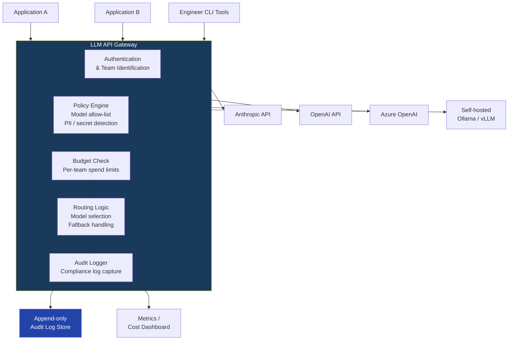

At some point, your engineering org will have more than a few teams calling LLM APIs. Different teams building different features, some using Claude, some using GPT-4o, maybe someone spinning up a Llama instance for cost reasons. Each team manages their own API key. Audit logs are scattered — or nonexistent. No one knows what the total spend is until the bill arrives. Security has no visibility into what's being sent to external APIs.

This is the moment when someone proposes a centralized LLM API gateway, and everyone else groans because "we don't want another proxy layer." The groan is understandable, but the proxy layer is correct. The 5-20ms of added latency is worth it once you have more than about 10 engineers using LLM APIs in production.



## What an LLM Gateway Actually Does

The gateway is a proxy that sits between your applications and the LLM providers. Every API call routes through it. No application holds a provider API key directly — the gateway holds them, and applications authenticate to the gateway using internal credentials.

This is not a novel architecture. It's the same pattern as a database connection pool, an API management layer like Kong or Apigee, or an egress proxy for outbound traffic. The LLM-specific layer on top handles things that generic proxies don't understand: token-based cost attribution, prompt inspection, model routing logic, and the structured audit logging format that compliance requires.

What the gateway enforces:

**Model allow-list** — Only models that have been security-reviewed and approved may be called. A team can't decide to use a new provider or model without going through the approval process. This is the single most important control for an enterprise: it prevents shadow AI that bypasses your governance controls.

**Per-team spend limits** — Each team or application has a daily/monthly token budget. The gateway tracks cumulative spend and rejects requests when a team hits their limit — or warns when they're approaching it. This converts "surprise $40K bill" into "budget alert at 80% of limit."

**PII and secret detection** — Inspect outbound prompts for patterns that indicate PII (emails, phone numbers, SSNs) or secrets (API keys, passwords, connection strings). Block or flag requests that contain these before they leave your network.

**Audit log capture** — Every request and response logged to a compliant audit store. The application doesn't have to implement logging — the gateway does it universally.

**Routing and fallback** — Route requests to the cheapest model that meets the declared quality tier. Fall back to an alternative provider if the primary is unavailable. Retry on transient errors.

## Choosing a Gateway Layer: LiteLLM vs. Building Your Own

For most teams, the right starting point is LiteLLM Proxy. It's open-source, supports every major LLM provider through a single OpenAI-compatible API, and has the core gateway features built in: virtual keys, spend tracking, routing, Redis-backed rate limiting.

Deploy LiteLLM Proxy and add custom middleware for the enterprise-specific requirements it doesn't cover out of the box.

Basic LiteLLM configuration:

```yaml
# litellm_config.yaml
model_list:
  - model_name: "claude-3-5-sonnet"
    litellm_params:
      model: "anthropic/claude-sonnet-4-5"
      api_key: "os.environ/ANTHROPIC_API_KEY"

  - model_name: "claude-opus"
    litellm_params:
      model: "anthropic/claude-opus-4"
      api_key: "os.environ/ANTHROPIC_API_KEY"

  - model_name: "gpt-4o"
    litellm_params:
      model: "openai/gpt-4o"
      api_key: "os.environ/OPENAI_API_KEY"

  - model_name: "gpt-4o-mini"
    litellm_params:
      model: "openai/gpt-4o-mini"
      api_key: "os.environ/OPENAI_API_KEY"

router_settings:
  routing_strategy: "cost-based-routing"
  fallbacks:
    - claude-opus:
        - gpt-4o

litellm_settings:
  callbacks: ["langfuse"]  # observability integration
  success_callback: ["langfuse"]
  failure_callback: ["langfuse"]

general_settings:
  master_key: "os.environ/LITELLM_MASTER_KEY"
  database_url: "os.environ/DATABASE_URL"  # PostgreSQL for spend tracking
```

## Custom Middleware for Enterprise Requirements

LiteLLM doesn't cover PII detection, detailed compliance audit logging, or custom policy enforcement out of the box. Add these as middleware:

```python
from fastapi import Request, HTTPException
from fastapi.middleware.base import BaseHTTPMiddleware
import json
import re
import hashlib
from datetime import datetime, timezone
import uuid

# Patterns to check in outbound prompts
SENSITIVE_PATTERNS = {
    "api_key": r'(?:api[_-]?key|apikey|api[_-]?secret)\s*[=:]\s*["\']?[A-Za-z0-9_\-]{20,}',
    "connection_string": r'(?:postgresql|mysql|mongodb|redis)://[^\s]+',
    "ssn": r'\b\d{3}-\d{2}-\d{4}\b',
    "email": r'\b[A-Za-z0-9._%+-]+@[A-Za-z0-9.-]+\.[A-Za-z]{2,}\b',
    "phone": r'\b\+?1?\s*[-.]?\s*\(?\d{3}\)?[-.\s]?\d{3}[-.\s]?\d{4}\b',
}

class ComplianceMiddleware(BaseHTTPMiddleware):
    def __init__(self, app, audit_logger, policy_engine):
        super().__init__(app)
        self.audit_logger = audit_logger
        self.policy_engine = policy_engine

    async def dispatch(self, request: Request, call_next):
        # Only intercept /chat/completions and /messages endpoints
        if not request.url.path.endswith(("/chat/completions", "/messages")):
            return await call_next(request)

        body = await request.body()
        event_id = str(uuid.uuid4())

        try:
            payload = json.loads(body)
        except json.JSONDecodeError:
            return await call_next(request)

        # Extract team identity from virtual key header
        team_id = request.headers.get("x-team-id", "unknown")
        virtual_key = request.headers.get("authorization", "").replace("Bearer ", "")

        # Policy check: model allow-list
        requested_model = payload.get("model", "")
        if not self.policy_engine.is_model_approved(team_id, requested_model):
            await self.audit_logger.log_policy_block(
                event_id, team_id, requested_model, "model_not_approved"
            )
            raise HTTPException(
                status_code=403,
                detail=f"Model '{requested_model}' is not approved for team '{team_id}'"
            )

        # PII / secret detection in prompt
        prompt_text = self._extract_prompt_text(payload)
        detected_patterns = self._scan_for_sensitive_content(prompt_text)

        if detected_patterns.get("api_key") or detected_patterns.get("connection_string"):
            await self.audit_logger.log_policy_block(
                event_id, team_id, requested_model, "secret_detected",
                detected_types=list(detected_patterns.keys())
            )
            raise HTTPException(
                status_code=400,
                detail="Request blocked: potential secret detected in prompt"
            )

        # Budget check
        if not await self.policy_engine.check_budget(team_id):
            raise HTTPException(
                status_code=429,
                detail=f"Team '{team_id}' has exceeded their daily token budget"
            )

        # Log the request (with hashing, not full content)
        prompt_hash = hashlib.sha256(prompt_text.encode()).hexdigest()
        await self.audit_logger.log_request(
            event_id=event_id,
            team_id=team_id,
            model=requested_model,
            prompt_hash=prompt_hash,
            pii_detected=bool(detected_patterns),
            pii_types=list(detected_patterns.keys()),
            timestamp=datetime.now(timezone.utc).isoformat()
        )

        # Forward request
        response = await call_next(request)

        # Log response metadata
        await self.audit_logger.log_response(event_id=event_id, status_code=response.status_code)

        return response

    def _extract_prompt_text(self, payload: dict) -> str:
        messages = payload.get("messages", [])
        return " ".join(
            m.get("content", "") for m in messages
            if isinstance(m.get("content"), str)
        )

    def _scan_for_sensitive_content(self, text: str) -> dict:
        detected = {}
        for pattern_name, pattern in SENSITIVE_PATTERNS.items():
            if re.search(pattern, text, re.IGNORECASE):
                detected[pattern_name] = True
        return detected
```

## Routing Logic: Cheapest Model That Meets Quality Tier

Not every LLM call needs your most capable model. A request to summarize a short internal document doesn't need claude-opus. Let the application declare its quality tier and route accordingly:

```python
QUALITY_TIER_ROUTING = {
    "fast": {
        "primary": "gpt-4o-mini",
        "fallback": "claude-3-5-sonnet",
        "max_tokens": 1000,
        "use_cases": "summarization, classification, simple extraction",
    },
    "standard": {
        "primary": "claude-3-5-sonnet",
        "fallback": "gpt-4o",
        "max_tokens": 4000,
        "use_cases": "code review, document analysis, customer service",
    },
    "premium": {
        "primary": "claude-opus",
        "fallback": "gpt-4o",
        "max_tokens": 16000,
        "use_cases": "complex reasoning, legal analysis, architecture review",
    },
}
```

Applications set an `x-quality-tier` header. The gateway resolves the model. The application doesn't need to know which model it's actually using — it just declares what it needs.

## Cost Dashboards

Token spend without visibility is a budget risk. At minimum, track per-team daily spend and surface it somewhere the team lead can see it:

| Metric | Implementation |
|---|---|
| Per-team daily token spend | Aggregated from gateway logs in Grafana |
| Per-model usage breakdown | Group by model in the audit log |
| Budget utilization % | (current_spend / budget_limit) × 100 |
| Projected monthly spend | Rolling 7-day average × 30 |
| Cost per request by application | Group by application ID |

A Prometheus counter scraping the gateway's spend tracking endpoint, visualized in Grafana, gives you this with about a day of setup work.

## The Latency Tradeoff

Adding a gateway adds latency. Measured in practice on LiteLLM Proxy with custom middleware:

- Gateway overhead (auth + policy check + logging): 5-15ms
- PII scanning with regex: 1-3ms per KB of prompt
- Budget check (Redis): 1-2ms
- **Total overhead**: typically 8-20ms

For a call to claude-opus with p50 latency around 1,500ms, 20ms overhead is 1.3%. Acceptable. For fast completions (gpt-4o-mini at p50 ~300ms), 20ms is about 7% overhead — still acceptable for most use cases, potentially noticeable for real-time streaming applications.

The crossover point — where the governance value exceeds the latency cost — is roughly when you have more than 10 engineers making LLM API calls in production, or when you're subject to compliance requirements that require audit trails. Below that threshold, per-team logging and shared API keys under manual management might be simpler. Above it, the gateway pays for itself within weeks.
