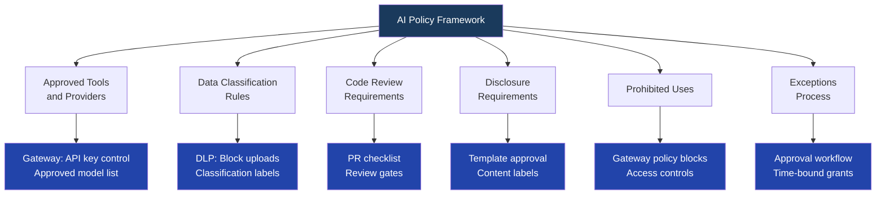

Most enterprise AI acceptable use policies are useless. Not because the people who wrote them don't care, but because they were written by lawyers for auditors, not by engineers for engineers. They use phrases like "use AI responsibly" and "exercise appropriate judgment" and "ensure accuracy of AI outputs." These phrases are legally defensible because they're vague. They're useless as guidance because they tell engineers nothing about what they're actually allowed to do.

When a policy doesn't help engineers make decisions, engineers ignore it. They don't ignore it maliciously — they ignore it because it doesn't answer the questions they actually have. "Can I paste this customer support ticket into ChatGPT to draft a response?" "Can I use Claude to help write the code that handles payment processing?" "Can I feed our internal runbooks into an AI to build a troubleshooting bot?"

A good AI policy answers those questions with yes or no, and explains why.



## Why Most Enterprise AI Policies Fail

**They're written without engineering input.** Legal writes the policy, security reviews it, the CISO signs it. Engineers are not in the room. The result is a document that captures legal risk but misunderstands how engineers actually use AI tools.

**They have no technical enforcement mechanism.** "Do not send confidential data to external AI APIs" is a good rule. But if there's no DLP tool checking uploads, no gateway inspecting outbound prompts, and no technical barrier to an engineer copy-pasting a confidential document into Claude — the rule exists only on paper.

**There's no exceptions process.** Real engineering work has legitimate edge cases. A security team that needs to analyze a malware sample with AI assistance. A legal team using AI to process documents under NDA. If the policy has no exceptions path, engineers work around it rather than through it.

**The rules aren't binary.** "Use AI responsibly with customer data" requires the engineer to make a judgment call in the moment, without enough context. "Do not send data classified as Customer Confidential to external AI APIs" is binary — it either is or isn't that classification, and the engineer knows what to do.

## What a Working AI Policy Covers

### 1. Approved Tools and Providers

Name them explicitly. No guessing, no interpretation needed.

```
Approved AI tools as of November 2026:
- Claude (via company AI gateway) — approved for all data classifications up to Internal
- GitHub Copilot (enterprise license) — approved for code completion in approved IDEs
- Microsoft Copilot (M365 license) — approved for productivity tasks with Internal data

Not approved for production use (personal accounts, free tiers):
- ChatGPT (personal openai.com account)
- Claude.ai (personal account outside company gateway)
- Perplexity, Gemini, or any other consumer AI tools

Adding a new AI tool to the approved list: submit a request through [link] to the AI governance team. Review time: 2-4 weeks for standard tools, 4-8 weeks for tools requiring security review.
```

The provider list needs a maintenance owner and a review cadence. AI tooling changes fast. A policy written in January will have gaps by July if no one updates the approved list.

### 2. Data Classification Rules

Engineers need a clear mapping between data classification and what AI can receive it. This is the most operationally useful section of the policy.

```
Data classification → AI usage rules:

PUBLIC
- May be sent to any approved AI tool
- May be used in AI training datasets
- No restrictions

INTERNAL
- May be sent to approved AI tools with enterprise data agreements
- Company gateway only (not personal accounts)
- May be used in internal AI systems (RAG, fine-tuning) with standard review

CONFIDENTIAL
- May NOT be sent to external AI APIs without explicit DLP team approval
- May be used in company-hosted AI systems (on-premise or private cloud only)
- Requires data classification review before AI ingestion
- Examples: customer PII, employee records, financial projections, legal documents

RESTRICTED
- May NOT be used with any AI system without CISO exception approval
- Examples: trade secrets, M&A information, security vulnerability details, regulated health data
```

**Why this matters in practice:** An engineer writing a support response doesn't need to reason from principles — they just need to know that the customer's ticket (Confidential) can't go to their personal Claude account but can go through the company gateway.

### 3. Code Review Requirements for AI-Generated Code

AI-generated code needs the same review as human-written code. Often more, because AI generates plausible-looking code that fails in non-obvious ways at edge cases.

```
AI-generated code requirements:
1. All AI-generated code must be reviewed by a human engineer before merge
2. Code reviewer must understand the code, not just verify it runs
3. Security-sensitive code (authentication, authorization, cryptography, input validation) 
   requires review by a senior engineer or the security team
4. Do not commit AI-generated code that you cannot explain line-by-line
5. AI-generated tests do not substitute for coverage requirements — 
   they count toward coverage only if a human has validated the test logic

What "reviewed" means: you have read the code, understood what it does, 
understood why it does it that way, and are prepared to defend it in a code review.
"The AI wrote it and it passed tests" is not a review.
```

### 4. Disclosure Requirements

For customer-facing content and formal company communications, people have a right to know when AI drafted the material.

```
Disclosure requirements by content type:

Customer-facing content:
- AI-drafted email responses to customers: human review required before send; 
  no disclosure required if substantially edited
- AI-generated marketing copy: must be disclosed to content approval workflow; 
  disclosure to customers not required if reviewed and edited
- AI-generated legal documents, contracts, terms: prohibited — human legal must draft

Internal communications:
- Meeting summaries generated by AI transcription tools: disclose by labeling 
  "AI-generated summary — may contain errors"
- AI-drafted internal communications: no disclosure required if reviewed and edited

Prohibited without disclosure:
- Publishing AI-generated content under a named human author's byline 
  without their review and approval
- Submitting AI-drafted research, analysis, or reports to regulators 
  without human review and sign-off
```

### 5. Prohibited Uses

Binary, explicit, no interpretation required:

```
Prohibited uses — no exceptions without CISO + Legal approval:

Hiring and employment decisions:
- Do not use AI to make or substantially influence final hiring decisions
- AI may be used for resume summarization and candidate research assistance only
- Human hiring manager must make all decisions independent of AI ranking

Providing authoritative professional advice:
- Do not use AI outputs as authoritative legal, medical, or financial advice 
  to customers or third parties
- AI may assist in drafting, summarizing, and researching — a qualified 
  professional must review and take responsibility for all advice delivered

Customer data processing in personal accounts:
- Do not upload customer data to personal AI accounts (ChatGPT personal, 
  Claude.ai personal, etc.)
- Violation is a disciplinary matter; repeat violations trigger access revocation

Autonomous actions in production systems:
- AI agents must not take irreversible actions in production without human approval
- This includes: deleting data, sending external communications, executing financial 
  transactions, modifying access controls
```

## The Exceptions Process

Without an exceptions process, engineers work around policy rather than through it. Make the exceptions process fast enough that circumventing it isn't the rational choice.

```
Requesting a policy exception:

1. Submit request at [internal link] with:
   - What you want to do that the policy prohibits
   - Why the business need is legitimate
   - What data classification is involved
   - What mitigations you propose
   - Duration of exception needed

2. Review: AI governance team within 5 business days (standard), 
   48 hours (production incident with AI component)

3. Outcomes:
   - Approved: time-bound exception granted, recorded in audit log
   - Approved with conditions: exception granted if specific controls implemented
   - Denied: reason provided; appeal to AI governance lead available

Common approved exceptions:
- Security team using AI to analyze malware samples (Restricted data → approved with isolated environment requirement)
- Legal team using AI to process privileged documents (Confidential → approved with private instance requirement)
```

## Technical Enforcement: Policy That Enforces Itself

The policy document matters. The technical enforcement matters more. For each rule, identify the enforcement mechanism:

| Policy rule | Technical control |
|---|---|
| Use approved tools only | API gateway holds provider keys; engineers get virtual keys only |
| No Confidential data to external APIs | DLP tool with content inspection on approved gateway |
| No secrets in prompts | Gateway middleware scans outbound prompts for secret patterns |
| Per-team spending limits | Gateway budget tracking with hard cutoff |
| Code review requirement | PR template with AI code review checklist; branch protection rules |

Rules that exist only in a document get violated. Rules that exist in the technical infrastructure enforce themselves.

## Rolling Out Without Creating Adversaries

The fastest way to make a policy fail is to announce it by email and start auditing for violations the next day. Engineers who feel blindsided by policy enforcement become actively hostile to the governance process.

What works better:

**Pilot with the engineering team first.** Ask engineering leads to help identify where the draft policy creates unnecessary friction. Iterate before company-wide rollout. Engineers who helped write the policy explain it to their teams differently than engineers who received it from Legal.

**Lead with the why.** Every rule in the policy should have a one-sentence explanation of why it exists. "Confidential data may not go to personal AI accounts because personal accounts are outside the company's data processing agreements and incident response capabilities." Engineers who understand the reason are better at applying judgment in edge cases.

**Document the enforcement gap honestly.** If you don't have DLP enforcement yet, say so. "This rule is currently self-enforcing; we're implementing technical controls by Q1 2027." Pretending you have controls you don't have is worse than acknowledging the gap.

**Review quarterly.** AI tooling and the threat landscape change fast. A policy written today that isn't reviewed in 6 months will have gaps that don't match reality. Assign an owner with authority to update the approved tools list and make minor policy adjustments between formal reviews.

The goal isn't a policy document that passes a legal audit. The goal is a policy that engineers actually use to make decisions — and that makes those decisions easy enough that they don't reach for workarounds.
