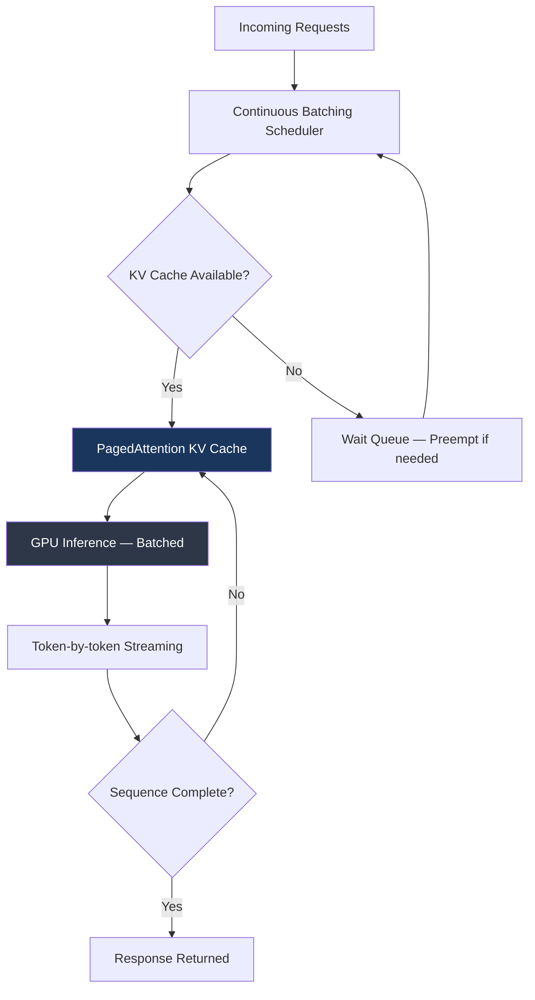

Most engineers reach for Ollama when they first start self-hosting LLMs. It's easy to install, runs models with a single command, and works fine when you're the only person hitting it. Then you demo it to a team, or wire it into a pipeline, and discover that it was never designed for concurrent load. Requests queue. Latency spikes. GPU sits partially idle while requests wait.

vLLM solves a fundamentally different problem. It was built from the ground up for throughput at production load, and the numbers are not close — benchmarks consistently show 9-24x higher throughput than naive serving approaches at moderate concurrency. The gap comes from two architectural innovations: PagedAttention and continuous batching.



---

## Why Ollama Falls Short at Load

Ollama processes one request at a time per model instance. When request two arrives while request one is generating, it waits. The GPU runs at full utilization for request one, then full utilization for request two — but the overall system throughput is requests-per-hour, and sequential processing caps that hard.

The deeper issue is KV cache management. During generation, the model produces key-value attention states for every token in the context. These states need to live in VRAM for the duration of generation. Naive implementations pre-allocate a fixed-size contiguous block for each request, sized to the maximum context length. For a 4K context limit, you reserve 4K worth of KV cache per request — even if the actual request is 500 tokens. That memory waste means you can serve far fewer concurrent requests than your hardware actually supports.

---

## PagedAttention: KV Cache Without Fragmentation

PagedAttention treats the KV cache like virtual memory — allocated in fixed-size pages (typically 16-32 tokens each), mapped to physical VRAM blocks on demand. A 500-token request uses 500 tokens worth of pages, not 4096. Pages are allocated incrementally as generation proceeds.

The practical effect: GPU memory utilization goes from ~60% (with pre-allocation waste) to >90%. More sequences fit in memory simultaneously. Throughput scales with the actual load.

---

## Continuous Batching: No More Request Queuing

Traditional batching waits to collect a batch of requests before starting inference. Continuous batching (also called iteration-level scheduling) adds new requests to in-progress batches at each forward pass. When a sequence completes and frees a batch slot, the next waiting request fills it immediately.

This keeps the GPU perpetually utilized regardless of arrival rate variance. At low load, requests complete immediately. At high load, GPU utilization stays high without the step-function delays of static batching.

---

## Deploying vLLM: The Minimal Production Setup

**Docker (single GPU):**

```bash
docker run --runtime nvidia --gpus all \
  -v ~/.cache/huggingface:/root/.cache/huggingface \
  -p 8000:8000 \
  --ipc=host \
  vllm/vllm-openai:latest \
  --model meta-llama/Llama-3.1-8B-Instruct \
  --max-model-len 8192 \
  --gpu-memory-utilization 0.90 \
  --max-num-seqs 256 \
  --enable-prefix-caching
```

**Kubernetes deployment:**

```yaml
apiVersion: apps/v1
kind: Deployment
metadata:
  name: vllm-server
spec:
  replicas: 1
  selector:
    matchLabels:
      app: vllm-server
  template:
    metadata:
      labels:
        app: vllm-server
    spec:
      containers:
      - name: vllm
        image: vllm/vllm-openai:latest
        args:
        - "--model"
        - "meta-llama/Llama-3.1-8B-Instruct"
        - "--max-model-len"
        - "8192"
        - "--gpu-memory-utilization"
        - "0.90"
        - "--max-num-seqs"
        - "256"
        - "--enable-prefix-caching"
        ports:
        - containerPort: 8000
        resources:
          limits:
            nvidia.com/gpu: "1"
        env:
        - name: HUGGING_FACE_HUB_TOKEN
          valueFrom:
            secretKeyRef:
              name: hf-token
              key: token
```

---

## Key Configuration Parameters

**`--max-model-len`**: Maximum context length vLLM will support. Reducing this from the model's native max (e.g., 128K → 8K) dramatically increases how many sequences fit in the KV cache. For most enterprise chatbot and RAG workloads, 8K is sufficient. Don't set it higher than your actual use case requires.

**`--gpu-memory-utilization`**: Fraction of GPU memory reserved for KV cache (after model weights are loaded). Default is 0.90, which is reasonable. Set lower (0.80) if you're seeing OOM errors or if the model is near its VRAM limit. Set higher (0.95) only if you have headroom and need maximum throughput.

**`--max-num-seqs`**: Maximum number of concurrent sequences in the scheduler. Default is 256. Increase for high-throughput workloads with short sequences; decrease if individual requests are long and you're OOMing.

**`--tensor-parallel-size`**: Number of GPUs for tensor parallelism (see the multi-GPU post for details). Defaults to 1.

---

## Prefix Caching: The System Prompt Win

Add `--enable-prefix-caching` to vLLM's startup flags. This is one of the highest-ROI configuration changes for agentic and RAG workloads.

When multiple requests share the same prefix (system prompt, few-shot examples, retrieved context), vLLM computes the KV states for that prefix once and reuses them. For a system prompt that's 2000 tokens, every request that shares it skips 2000 tokens of compute. At scale, this reduces TTFT (time to first token) by 40-60% and increases effective throughput.

The catch: prefix caching is only effective if your requests actually share long common prefixes. If every request has a unique system prompt or unique context prepended, caching hits nothing.

---

## Monitoring: The Metrics That Matter

vLLM exposes Prometheus metrics at `/metrics`. The ones worth alerting on:

```bash
# GPU KV cache utilization — if this hits 100%, requests will be preempted
vllm:gpu_cache_usage_perc

# Request queue depth — sustained queue > 0 means you need more capacity
vllm:num_requests_waiting

# Time to first token (p99) — user-visible latency signal
vllm:time_to_first_token_seconds

# Tokens per second — overall throughput
vllm:generation_tokens_total
```

A simple Prometheus scrape config:

```yaml
scrape_configs:
  - job_name: 'vllm'
    static_configs:
      - targets: ['vllm-server:8000']
    metrics_path: '/metrics'
    scrape_interval: 15s
```

When `gpu_cache_usage_perc` is consistently above 80%, you're approaching the throughput ceiling. Either scale horizontally (another vLLM instance behind a load balancer) or move to a larger GPU.

---

## When Ollama Is Still the Right Answer

vLLM adds operational complexity — Docker GPU configuration, Kubernetes resource management, metric collection. That overhead is worth it at sustained load. It's not worth it when:

- You're in a development or prototyping phase with a single user
- Request rate is reliably under 1 request/second
- You're running on a machine without a CUDA GPU (Ollama supports Apple Silicon and CPU inference; vLLM does not)
- You need a simple local development environment that engineers can run on their laptops

Ollama for dev, vLLM for production. The transition point is roughly when you start serving a team or wiring the model into an automated pipeline.

---

## Production Readiness Checklist

- [ ] Health check endpoint configured (`/health` returns 200)
- [ ] HUGGINGFACE token stored as a secret, not in the Dockerfile
- [ ] `--max-model-len` tuned to actual workload requirements (not default 128K)
- [ ] `--enable-prefix-caching` enabled for workloads with shared system prompts
- [ ] Prometheus metrics collected and dashboarded
- [ ] Alerts on `gpu_cache_usage_perc > 80%` and `num_requests_waiting > 10`
- [ ] Request timeout configured at the load balancer (vLLM itself does not enforce timeouts)
- [ ] Model weights pre-loaded from a persistent volume (not downloaded on pod startup)
- [ ] Liveness and readiness probes set with appropriate startup delays (model loading takes 30-120s)

The OpenAI-compatible API (`/v1/chat/completions`) means zero code changes for anything already talking to OpenAI — just swap the base URL and remove the API key requirement (or set a dummy value).
