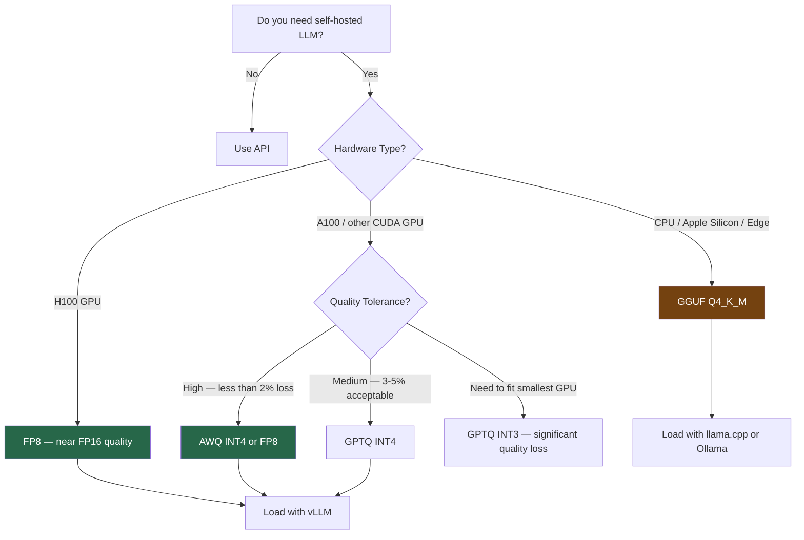

A Llama 3.1 70B model at FP16 (full precision) needs 140GB of VRAM. That puts it on 4-5 A100 80GB GPUs minimum — roughly $30,000/month in cloud GPU costs if you're running them dedicated. At INT4 quantization, the same model fits in 35GB — two A100 GPUs. The cost difference is 2-4x. At high request volume, that math matters.

Quantization compresses a model by reducing the precision of its weights from 16-bit floating point to lower bit widths (8-bit, 4-bit, even 3-bit). The question is not whether to quantize — for most enterprise workloads at scale, you should — but which format, and at what quality cost.



---

## The Formats, Explained

**GGUF** is the format used by llama.cpp and Ollama. It's a single-file format designed for portability and CPU inference, with optional GPU offloading. The key advantage is CPU compatibility — it runs without a CUDA GPU. The trade-off is that it's slower on GPU compared to GPU-native formats. GGUF supports multiple quantization levels in the same format family: Q4_K_M, Q5_K_M, Q8_0, and others. Q4_K_M is the practical default — it's the best quality-per-bit ratio in the 4-bit tier.

**GPTQ** (Generalized Post-Training Quantization) is a GPU-native format that applies quantization to weights while minimizing reconstruction error layer by layer. It was the dominant GPU quantization format before AWQ and is widely available on HuggingFace. It's solid at INT8 with negligible quality loss; at INT4, quality degradation is noticeable but acceptable for many use cases. Does not require the original model for quantization — only the pre-quantized weights.

**AWQ** (Activation-aware Weight Quantization) improves on GPTQ by identifying which weights are most important based on activation magnitudes, then protecting those weights from aggressive quantization. The result: at the same 4-bit width, AWQ models consistently outperform GPTQ models on quality benchmarks. AWQ is now the preferred GPU quantization format when it's available for your target model.

**FP8** (8-bit floating point, E4M3 format) is hardware-accelerated on H100 GPUs via the transformer engine. Unlike INT4/INT8, FP8 retains the floating point representation and suffers almost no quality loss relative to FP16 — benchmarks show less than 1% degradation on most tasks. The constraint: it requires H100 (or newer) hardware. On A100, FP8 falls back to software emulation and loses its throughput advantage.

---

## Quality Impact by Bit Width

Here's what to expect from each quantization level relative to the FP16 baseline:

| Format | Bit Width | VRAM (70B) | Quality Loss | Use Case |
|--------|-----------|------------|--------------|----------|
| FP16 | 16-bit | 140 GB | Baseline | Reference / H100 with FP8 |
| FP8 | 8-bit | 70 GB | < 1% | H100 production serving |
| AWQ INT4 | 4-bit | 35 GB | 2–3% | A100 production serving |
| GPTQ INT4 | 4-bit | 35 GB | 3–5% | A100, widely available |
| GGUF Q4_K_M | ~4-bit | 35 GB | 3–5% | CPU / Ollama / edge |
| GPTQ INT3 | 3-bit | 26 GB | 8–15% | Extreme memory constraint only |

These numbers are approximate and task-dependent. Coding tasks are more sensitive to quantization than summarization tasks. Complex reasoning degrades faster than classification. If your workload is quality-sensitive, test your specific use case rather than relying on aggregate benchmarks.

---

## Loading Quantized Models with vLLM

AWQ INT4:

```python
from vllm import LLM, SamplingParams

llm = LLM(
    model="Qwen/Qwen2.5-72B-Instruct-AWQ",
    quantization="awq",
    max_model_len=8192,
    gpu_memory_utilization=0.90,
    tensor_parallel_size=2,  # Two A100s for 72B AWQ
)

params = SamplingParams(temperature=0.1, max_tokens=512)
outputs = llm.generate(["Explain PagedAttention in one paragraph."], params)
print(outputs[0].outputs[0].text)
```

FP8 on H100:

```python
llm = LLM(
    model="meta-llama/Llama-3.1-70B-Instruct",
    quantization="fp8",
    max_model_len=8192,
    gpu_memory_utilization=0.92,
    tensor_parallel_size=2,  # Two H100s for 70B FP8
)
```

GPTQ INT4:

```python
llm = LLM(
    model="TheBloke/Llama-2-70B-Chat-GPTQ",
    quantization="gptq",
    max_model_len=4096,
    gpu_memory_utilization=0.88,
    tensor_parallel_size=2,
)
```

For GGUF with llama.cpp or Ollama, quantization is handled transparently when you pull a GGUF model file — there's no explicit quantization parameter to set.

---

## Quantizing Your Own Fine-Tuned Model

If you've fine-tuned a model and want to quantize it, AWQ is the best current option for GPU serving.

```python
# Requires: pip install autoawq
from awq import AutoAWQForCausalLM
from transformers import AutoTokenizer

model_path = "./my-finetuned-model"
quant_path = "./my-finetuned-model-awq"

model = AutoAWQForCausalLM.from_pretrained(model_path, low_cpu_mem_usage=True)
tokenizer = AutoTokenizer.from_pretrained(model_path, trust_remote_code=True)

quant_config = {
    "zero_point": True,
    "q_group_size": 128,
    "w_bit": 4,
    "version": "GEMM"
}

model.quantize(tokenizer, quant_config=quant_config)
model.save_quantized(quant_path)
tokenizer.save_pretrained(quant_path)
```

This requires a calibration dataset run during quantization — AutoAWQ uses a default dataset (WikiText-2) if you don't provide one. For domain-specific fine-tuned models, using samples from your actual training data as the calibration set produces better results.

---

## Mixed Precision: Protecting Critical Layers

Some layers are more sensitive to quantization than others. Embedding layers and the final LM head layer are particularly vulnerable. Most production-grade quantization tools handle this by defaulting to FP16 for these layers, but it's worth verifying if you're doing custom quantization:

```python
# AutoAWQ protects sensitive layers by default
# You can inspect which layers were quantized:
from awq import AutoAWQForCausalLM
model = AutoAWQForCausalLM.from_quantized(quant_path)

for name, module in model.named_modules():
    if hasattr(module, 'weight') and hasattr(module.weight, 'dtype'):
        print(f"{name}: {module.weight.dtype}")
```

Layers that remain in FP16 after quantization are typically `embed_tokens` and `lm_head` — these are expected and correct.

---

## What You're Actually Giving Up

Three percent quality loss sounds small. Whether it matters depends on your use case.

For high-volume, well-defined tasks — classification, summarization, structured extraction, RAG answer generation — 3-5% quality loss in INT4 is usually invisible in production. Users cannot tell the difference. Eval benchmarks show it; human evaluations at scale typically do not.

For complex reasoning, novel coding tasks, or math — the degradation is more noticeable. An INT4 70B model may underperform an FP16 13B model on hard reasoning tasks. If your workload skews toward reasoning, the benchmark numbers matter more than the averages suggest.

The practical advice: run your actual workload through both and measure. Don't decide based on published benchmark aggregates. Your use case might be fine; it might not be. The test takes an afternoon and saves a lot of regret.
