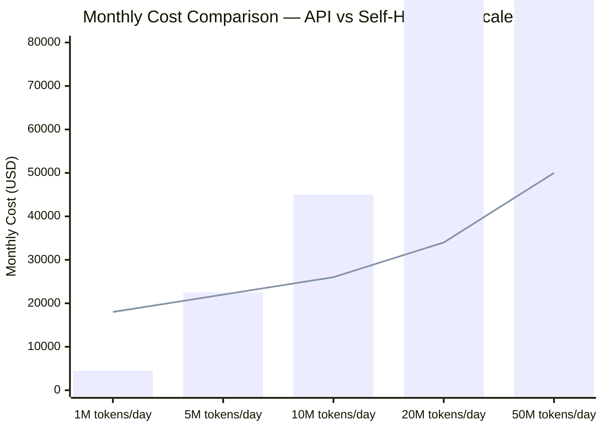

The case for self-hosting LLMs usually gets made in one of two ways: someone runs the numbers on API costs and gets sticker shock at scale, or legal/security says certain data cannot go to a third-party API. Both are legitimate reasons. Neither of them means self-hosting is automatically the right answer.

The problem with the typical self-hosting pitch is incomplete accounting. People compare GPU hardware costs against API token costs and declare self-hosting cheaper. They forget the full picture: cloud instance management, networking, storage, model update processes, monitoring, incident response, and the engineering time to operate all of it. These costs are real, and they close the gap considerably.



> Note: API cost based on $0.15/1M input tokens for a mid-tier model. Self-hosted includes 2× H100 GPU instances + $8K/month ops overhead.
{: .prompt-info }

---

## The Three Reasons to Self-Host

**Data sovereignty.** Some data cannot legally or contractually leave your infrastructure. HIPAA-covered PHI, GDPR special category data, data subject to export controls, trade secrets under NDA, and attorney-client privileged communications — sending any of these to a third-party API endpoint is a compliance risk regardless of the provider's DPA. If your use case involves this data, self-hosting is not optional.

**Cost at volume.** At low request volumes, API pricing wins — no infrastructure to manage, no engineers to hire. At high request volumes, the math flips. The inflection point varies based on model selection and cloud region, but for a typical enterprise chatbot or RAG pipeline at 10M+ tokens/day, self-hosted compute becomes cost-competitive with API pricing once you account for the full self-hosted cost stack (not just the GPU).

**Latency.** External API calls add network round-trips. For most interactive use cases, 50-100ms of network overhead is irrelevant — generation time dominates. For latency-sensitive embedded applications or when chaining many model calls in a pipeline, running inference locally eliminates that overhead entirely.

---

## The TCO Calculation You Should Actually Run

```python
# Rough TCO calculator — fill in your numbers

# API option
requests_per_day = 500_000           # Total requests per day
avg_input_tokens = 800               # Average tokens per request (input)
avg_output_tokens = 200              # Average tokens per request (output)
input_price_per_mtok = 0.15          # $ per million input tokens
output_price_per_mtok = 0.60         # $ per million output tokens

api_input_cost_monthly = (requests_per_day * avg_input_tokens / 1_000_000
                          * input_price_per_mtok * 30)
api_output_cost_monthly = (requests_per_day * avg_output_tokens / 1_000_000
                           * output_price_per_mtok * 30)
api_total_monthly = api_input_cost_monthly + api_output_cost_monthly

print(f"API monthly cost: ${api_total_monthly:,.0f}")

# Self-hosted option — 2x H100 on cloud (CoreWeave / AWS p5.xlarge equivalent)
gpu_instance_hourly = 12.00          # $ per hour for 2x H100 instance
gpu_instance_monthly = gpu_instance_hourly * 24 * 30

# Storage, networking, monitoring tooling
infra_overhead_monthly = 2_000

# Engineer ops time — conservative 0.5 FTE for model ops
eng_hourly_rate = 75                 # $ per hour fully loaded
eng_hours_per_month = 40 * 0.5 * 4  # 0.5 FTE * 4 weeks
eng_cost_monthly = eng_hourly_rate * eng_hours_per_month

self_hosted_total_monthly = gpu_instance_monthly + infra_overhead_monthly + eng_cost_monthly
print(f"Self-hosted monthly cost: ${self_hosted_total_monthly:,.0f}")
print(f"Break-even: {'Self-hosted cheaper' if api_total_monthly > self_hosted_total_monthly else 'API cheaper'}")
```

At 500K requests/day with 800 input + 200 output tokens, the API cost is roughly $27,000/month. Self-hosted with 2x H100 runs about $21,000/month all-in. The gap is $6,000/month — real, but not transformative.

Increase to 2M requests/day and the API cost jumps to $108,000/month. Self-hosted stays at $21,000/month (same hardware handles more load with batching). Now you're talking about $1M/year in savings, which easily justifies dedicated infrastructure investment.

---

## Hardware Options for Self-Hosting

**On-premises (owned hardware):**
- NVIDIA H100 SXM 80GB: ~$35,000/unit; 8x per node is the standard cluster configuration
- NVIDIA A100 SXM 80GB: ~$15,000/unit; previous generation but still excellent
- Amortized over 3 years, a single H100 costs ~$970/month. At that price, break-even with cloud GPU instances is about 80 hours of use per month

**Cloud GPU instances:**
- AWS P5 (H100): ~$98/hour for 8x H100 — suitable for 70B+ models requiring multi-GPU
- AWS P4d (A100): ~$32/hour for 8x A100
- CoreWeave: H100 instances available from ~$2.50/GPU/hour — significantly cheaper than AWS for pure compute workloads
- Lambda Labs: H100 available at ~$2.49/GPU/hour, A100 at ~$1.10/GPU/hour

**AMD alternative:**
- AMD MI300X (192GB HBM3) — strong specs for large models, driver and software ecosystem is improving but CUDA tooling does not work. Evaluate carefully before committing.

---

## The Ops Burden Is Real

This is where the self-hosting pitch usually glosses over the details.

When you run your own model serving infrastructure, you own:

- **Model updates**: New model versions drop. Evaluating, quantizing, testing, and deploying them takes engineering time. API providers do this for you.
- **Security patches**: vLLM, the serving framework, the container runtime, the OS — all require ongoing patching. CVEs in GPU driver stacks happen.
- **Monitoring and incident response**: VRAM OOM crashes, NCCL communication errors, CUDA driver mismatches, model weight corruption on disk — your on-call team handles these at 3am.
- **Capacity planning**: If your request volume spikes, you need more GPUs. Procuring and provisioning GPU hardware is not a fast process.

Rough rule of thumb: every two production GPU nodes requires 0.25-0.5 FTE of dedicated infrastructure engineer time to operate correctly. This is not documentation overhead — it's real maintenance load.

---

## Llama 3.1 70B vs 405B: The Capability-Cost Tradeoff

For most enterprise use cases in 2026, Llama 3.1 70B (or Qwen2.5 72B) is the practical choice:

- Fits on 2x A100 80GB in AWQ INT4, or 4x A100 in FP16
- Achieves 85-90% of GPT-4-class performance on structured tasks
- Throughput on a 2x A100 setup: 400-800 tokens/second depending on batch size

Llama 3.1 405B requires 8x H100 in FP16, or 4x H100 in FP8. The capability improvement is real but marginal for most enterprise tasks. The hardware cost is 4x. The 405B is worth it for complex reasoning or coding tasks where the quality gap matters; it's not worth it for RAG retrieval answer generation or classification pipelines.

---

## When Self-Hosting Wins Clearly

Self-hosting is the clear choice when:
- Data legally cannot leave your infrastructure (HIPAA, GDPR special categories, export controls)
- Daily token volume exceeds 10M tokens and growing
- You need sub-50ms round-trip for model inference
- You're running a regulated workload that requires full auditability of every model inference

Self-hosting is the wrong call when:
- You're still in prototyping — the ops overhead will slow you down
- Your volume is below 5M tokens/day — the cost savings don't justify the operational burden
- You don't have infrastructure engineers available who can own the system
- You need the absolute best model quality and the open-source gap still matters for your use case

The honest version of the self-hosting calculation includes all the costs. It still makes sense in the right circumstances — just not as many circumstances as the GPU cost comparison alone would suggest.
