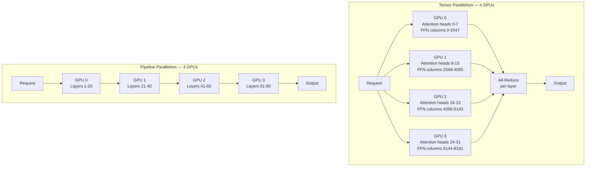

A Llama 3.1 70B model at FP16 needs 140GB of VRAM. A single H100 has 80GB. The model doesn't fit. Serving it requires spreading the model across multiple GPUs, and how you split it has a larger effect on performance than most engineers expect.

vLLM supports two parallelism strategies: tensor parallelism (TP) and pipeline parallelism (PP). They solve the same problem — fitting a large model across multiple devices — but they partition the model differently, have different communication patterns, and perform differently depending on your hardware and workload.



---

## Tensor Parallelism: Split Attention Heads

Tensor parallelism divides each layer's computation across all GPUs simultaneously. For a transformer model, the attention heads are split across GPUs: if you have 32 attention heads and 4 GPUs, each GPU handles 8 heads. The feed-forward layers are split column-wise (input projection) and row-wise (output projection).

Every forward pass requires an all-reduce collective operation to synchronize outputs across GPUs. For a token generation step, each GPU computes its portion of the layer, then all GPUs communicate to sum their partial results before moving to the next layer.

The consequence: tensor parallelism is extremely sensitive to interconnect bandwidth. All-reduce latency is measured in microseconds over NVLink (600 GB/s bandwidth on H100 SXM), and in milliseconds over PCIe (64 GB/s). On NVLink-connected GPUs (H100 SXM, A100 SXM), TP scales well. On PCIe-connected GPUs (H100 PCIe, any multi-GPU desktop setup), TP efficiency drops significantly above 2 GPUs.

**When to use tensor parallelism:**
- GPUs connected via NVLink or NVSwitch
- Low-latency single-request performance is important
- GPUs are in the same node (no inter-node fabric overhead)
- Model fits in the TP degree you're using (70B in FP16 across 2x H100: each GPU holds 70GB — tight but viable at 0.88 GPU memory utilization)

---

## Pipeline Parallelism: Split Layers

Pipeline parallelism assigns consecutive transformer layers to consecutive GPUs. GPU 0 holds layers 1-20, GPU 1 holds layers 21-40, and so on. During inference, each token flows through GPU 0, then GPU 1, then the rest in sequence — a pipeline.

The communication overhead per layer boundary is much lower than TP: you're passing a single activation tensor (batch × sequence × hidden_dim) between adjacent GPUs, not doing an all-reduce across all of them. This makes pipeline parallelism tolerant of slower interconnects — it works reasonably well over PCIe and even over InfiniBand in multi-node deployments.

The trade-off: pipeline parallelism introduces pipeline bubbles. While GPU 1 is processing, GPU 0 is idle waiting for the next request. At low batch sizes, GPU utilization is poor. vLLM mitigates this with micro-batching, but the fundamental tension remains: PP adds latency per token for single requests.

**When to use pipeline parallelism:**
- GPUs connected via PCIe or InfiniBand (not NVLink)
- Multi-node deployment (GPUs across different machines)
- High-throughput batch workloads where single-request latency matters less
- Model is too large for TP on available GPUs (405B model that doesn't fit on 8 GPUs with TP alone)

---

## vLLM Configuration

Single node, 2 GPUs, tensor parallelism (the most common case for 70B models):

```bash
vllm serve meta-llama/Llama-3.1-70B-Instruct \
  --tensor-parallel-size 2 \
  --max-model-len 8192 \
  --gpu-memory-utilization 0.90
```

Single node, 4 GPUs, combining TP and PP (for 70B in FP16 when 2-GPU TP doesn't fit):

```bash
vllm serve meta-llama/Llama-3.1-70B-Instruct \
  --tensor-parallel-size 2 \
  --pipeline-parallel-size 2 \
  --max-model-len 8192 \
  --gpu-memory-utilization 0.88
```

Multi-node with Ray (two machines, 4 GPUs each, for 405B):

```bash
# On the head node — start Ray
ray start --head --port=6379

# On worker node
ray start --address='HEAD_NODE_IP:6379'

# Launch vLLM on head node
vllm serve meta-llama/Llama-3.1-405B-Instruct \
  --tensor-parallel-size 8 \
  --max-model-len 4096 \
  --gpu-memory-utilization 0.92
```

---

## NVLink vs PCIe: The Interconnect Reality

NVLink bandwidth on H100 SXM: 900 GB/s (bidirectional). An all-reduce across 8 GPUs for a 4096-length hidden dimension takes under 100 microseconds.

PCIe Gen4 bandwidth: 64 GB/s. The same all-reduce takes over 1 millisecond. Across 8 GPU-generations of transformer layers, that's 80ms added latency per token — enough to make the model feel sluggish for interactive use.

Check whether your GPU instances use SXM (NVLink) or PCIe variants:
- H100 SXM: NVLink — strong TP performance up to 8 GPUs per node
- H100 PCIe: PCIe — TP degrades above 2 GPUs; use PP or minimize TP degree
- A100 SXM: NVLink — solid TP performance
- A100 PCIe: PCIe — same limitations as H100 PCIe

Cloud instance naming: AWS P5 (H100 SXM), AWS P4d (A100 SXM), AWS P3 (V100 SXM). The "SXM" suffix in the chip name indicates NVLink. CoreWeave and Lambda Labs product pages specify NVLink or PCIe explicitly.

---

## Common Failure Modes

**OOM on startup:** The model doesn't fit at the requested `--gpu-memory-utilization`. Reduce the value, reduce `--max-model-len`, or increase TP degree (add more GPUs).

```bash
# Debug: check what's consuming VRAM before vLLM starts
nvidia-smi --query-gpu=memory.used,memory.free --format=csv
```

**NCCL initialization errors:** The collective communication library can't find all GPUs or can't establish communication. Common causes:
- Firewall blocking the NCCL port range (by default 29400-29500)
- Incorrect `NCCL_SOCKET_IFNAME` environment variable
- GPUs not visible to all processes (check `CUDA_VISIBLE_DEVICES`)

```bash
# Test NCCL communication before launching vLLM
NCCL_DEBUG=INFO python -c "
import torch
import torch.distributed as dist
dist.init_process_group('nccl')
print('NCCL OK, rank:', dist.get_rank())
"
```

**Uneven GPU utilization:** One GPU runs at 95%, others at 60%. Usually indicates a TP/PP configuration mismatch — the layer split isn't balanced, or the attention head count isn't evenly divisible by the TP degree.

The attention head count must be divisible by tensor parallel size. Llama 3.1 70B has 64 attention heads. TP=2 (32 heads/GPU) and TP=4 (16 heads/GPU) work. TP=3 does not.

---

## Benchmarking: Measuring What You Actually Have

Before calling your setup production-ready, measure real throughput:

```bash
# vLLM includes a benchmarking script
python -m vllm.entrypoints.benchmark_throughput \
  --model meta-llama/Llama-3.1-70B-Instruct \
  --input-len 512 \
  --output-len 256 \
  --num-prompts 200 \
  --tensor-parallel-size 2

# Also benchmark with the OpenAI-compatible API under load
pip install locust

# locustfile.py — run with: locust -f locustfile.py --host http://localhost:8000
from locust import HttpUser, task, between
class LLMUser(HttpUser):
    wait_time = between(0.1, 0.5)

    @task
    def chat(self):
        self.client.post("/v1/chat/completions", json={
            "model": "meta-llama/Llama-3.1-70B-Instruct",
            "messages": [{"role": "user", "content": "Summarize the key features of transformer attention."}],
            "max_tokens": 256,
        }, timeout=60)
```

Target metrics for a production vLLM deployment under sustained load:
- P50 TTFT (time to first token): < 500ms
- P99 TTFT: < 2s
- Throughput: > 500 tokens/second aggregate
- GPU utilization: > 80% sustained
- KV cache utilization: 60-85% (above 90% causes preemption overhead)
