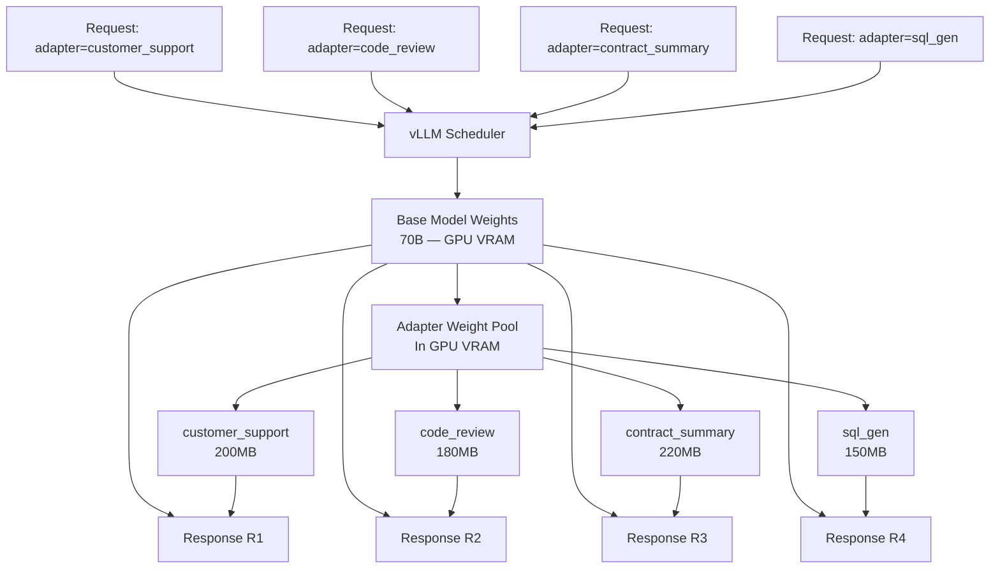

The scenario appears often in enterprise AI: you've fine-tuned the base model for customer support. Then the product team wants a code review assistant. Then legal wants a contract summarizer. Then finance wants a financial report narrator.

The naive approach is to serve a separate model instance for each use case. Four use cases, four model instances, four sets of GPU nodes. At $4,000-8,000/month per deployment, the cost compounds quickly, and the operational burden grows proportionally.

LoRA (Low-Rank Adaptation) fine-tuning produces adapters — small weight matrices (typically 50-500MB each) that modify a base model's behavior for a specific task. Instead of storing full model copies, you store one base model plus a collection of adapters. vLLM's multi-LoRA support takes this further: it loads all adapters into a shared pool and switches between them per request, with no GPU reload between invocations.



---

## The Memory Math

The key insight: LoRA adapters are tiny relative to the base model. A 70B parameter base model in AWQ INT4 takes 35GB. A LoRA adapter for the same model, trained with rank 16 and targeting attention layers, takes 100-300MB.

Load 10 adapters:
- Base model: 35,000 MB
- 10 adapters × 200 MB: 2,000 MB
- Total: 37,000 MB

You're running 10 specialized models for the price (in GPU memory) of 1.06 base models. Compare that to 10 separate model instances at 35GB each — 350GB total vs 37GB.

The limitation: adapters must all target the same base model and architecture. You cannot mix a Llama 3.1 70B adapter with a Qwen2.5 72B base model. All your fine-tuned adapters need to be trained on the same base checkpoint.

---

## vLLM Multi-LoRA Configuration

Start vLLM with LoRA enabled:

```bash
vllm serve meta-llama/Llama-3.1-8B-Instruct \
  --enable-lora \
  --max-loras 4 \
  --max-lora-rank 32 \
  --lora-modules \
    customer_support=/models/adapters/customer_support \
    code_review=/models/adapters/code_review \
    contract_summary=/models/adapters/contract_summary \
    sql_generator=/models/adapters/sql_generator \
  --max-model-len 8192 \
  --gpu-memory-utilization 0.90
```

Key parameters:

**`--enable-lora`**: Required to activate multi-LoRA support.

**`--max-loras`**: Maximum number of adapters active in GPU memory simultaneously. This is not the total number of available adapters — it's the pool size that fits in VRAM at once. vLLM evicts least-recently-used adapters when the pool is full. Set this based on your memory budget and adapter swap frequency.

**`--max-lora-rank`**: Must match the maximum rank used in your trained adapters. If any adapter was trained with rank 64, set this to 64. Setting it too low causes a loading error.

**`--lora-modules`**: Static adapter registrations at startup. Format: `name=path_or_hf_id`. The name becomes the model ID you specify in API requests.

---

## Making Requests to Specific Adapters

The adapter name is passed as the `model` field in the OpenAI-compatible API:

```python
from openai import OpenAI

client = OpenAI(
    base_url="http://localhost:8000/v1",
    api_key="not-required",  # vLLM doesn't require this by default
)

# Request routed to customer_support adapter
response = client.chat.completions.create(
    model="customer_support",  # This is the adapter name, not the base model
    messages=[
        {"role": "system", "content": "You are a customer support agent."},
        {"role": "user", "content": "My order hasn't arrived after 2 weeks."},
    ],
    max_tokens=256,
)

# Request routed to sql_generator adapter
sql_response = client.chat.completions.create(
    model="sql_generator",
    messages=[
        {"role": "user", "content": "Write a SQL query to find customers with no orders in the last 90 days."},
    ],
    max_tokens=512,
)
```

The routing is entirely in the application layer — the `model` parameter. No special headers, no separate endpoints. Existing OpenAI client code works without changes once you've named your adapters appropriately.

---

## Dynamic Adapter Loading (Hot-Swap)

vLLM supports loading and unloading adapters at runtime without restarting the server. Use the REST API:

```python
import httpx

base_url = "http://localhost:8000"

# Load a new adapter
response = httpx.post(
    f"{base_url}/v1/load_lora_adapter",
    json={
        "lora_name": "finance_narrator",
        "lora_path": "/models/adapters/finance_narrator",
    },
)
print(response.json())  # {"status": "loaded"}

# List currently loaded adapters
models = httpx.get(f"{base_url}/v1/models").json()
for model in models["data"]:
    print(model["id"])

# Unload an adapter (frees pool slot)
response = httpx.post(
    f"{base_url}/v1/unload_lora_adapter",
    json={"lora_name": "contract_summary"},
)
```

This is useful for adapter versioning — you can deploy a new adapter version while the server is running, switch traffic to the new version, and unload the old one without downtime.

---

## Adapter Versioning in Practice

A clean adapter versioning pattern:

```python
import httpx
from dataclasses import dataclass

@dataclass
class AdapterVersion:
    name: str
    version: str
    path: str

    @property
    def versioned_name(self) -> str:
        return f"{self.name}_v{self.version}"


class AdapterManager:
    def __init__(self, vllm_base_url: str):
        self.client = httpx.Client(base_url=vllm_base_url)
        self.active_adapters: dict[str, AdapterVersion] = {}

    def deploy(self, adapter: AdapterVersion) -> None:
        """Load new version, swap traffic, unload old version."""
        # Load new version
        self.client.post("/v1/load_lora_adapter", json={
            "lora_name": adapter.versioned_name,
            "lora_path": adapter.path,
        }).raise_for_status()

        # Track old version for cleanup
        old = self.active_adapters.get(adapter.name)

        # Update routing (update your router to send traffic to new versioned name)
        self.active_adapters[adapter.name] = adapter

        # Unload old version after brief drain period
        if old and old.versioned_name != adapter.versioned_name:
            import time; time.sleep(5)  # Let in-flight requests complete
            self.client.post("/v1/unload_lora_adapter", json={
                "lora_name": old.versioned_name,
            })

    def route(self, use_case: str) -> str:
        """Returns the current versioned model name for a use case."""
        if use_case not in self.active_adapters:
            raise ValueError(f"No adapter registered for use case: {use_case}")
        return self.active_adapters[use_case].versioned_name
```

---

## Training Your LoRA Adapters

If you're fine-tuning your own adapters, the standard tooling is HuggingFace PEFT:

```python
from peft import LoraConfig, get_peft_model, TaskType
from transformers import AutoModelForCausalLM, AutoTokenizer, TrainingArguments
from trl import SFTTrainer

model_name = "meta-llama/Llama-3.1-8B-Instruct"

lora_config = LoraConfig(
    task_type=TaskType.CAUSAL_LM,
    r=16,                          # Rank — higher = more parameters, better quality
    lora_alpha=32,                 # Scaling factor (typically 2x rank)
    target_modules=["q_proj", "v_proj", "k_proj", "o_proj"],  # Attention layers
    lora_dropout=0.05,
    bias="none",
)

model = AutoModelForCausalLM.from_pretrained(model_name, load_in_4bit=True)
model = get_peft_model(model, lora_config)
model.print_trainable_parameters()
# trainable params: 6,815,744 || all params: 8,036,564,992 || trainable%: 0.0848

training_args = TrainingArguments(
    output_dir="./customer_support_adapter",
    num_train_epochs=3,
    per_device_train_batch_size=4,
    gradient_accumulation_steps=4,
    warmup_steps=100,
    save_steps=500,
    learning_rate=2e-4,
    fp16=True,
)

trainer = SFTTrainer(
    model=model,
    args=training_args,
    train_dataset=your_dataset,
    dataset_text_field="text",
    max_seq_length=2048,
    peft_config=lora_config,
)
trainer.train()
trainer.save_model("./customer_support_adapter")
```

Target rank (r) guidelines: rank 8 for minimal parameter tasks (style adaptation), rank 16-32 for task-specific behavior, rank 64 for complex capability injection. Higher rank means larger adapter files and higher quality ceiling but also more risk of overfitting on small datasets.

---

## The Honest Limitations

**Adapter switching adds latency.** Each request that uses an adapter in the pool incurs ~5ms overhead for merging the adapter weights into the computation graph. For most interactive applications this is invisible. For very high-throughput short-inference workloads (classification, short extraction), the overhead is measurable.

**All adapters must share the same base model.** If you decide to upgrade from Llama 3.1 70B to a newer base model, you need to retrain every adapter. Plan your base model selection carefully — changing it is a significant operational event.

**The pool size limit is real.** If you have 20 adapters but only 10 fit in the VRAM pool (`--max-loras 10`), the 11th adapter request triggers an eviction. For workloads with evenly distributed adapter usage, this is fine. For workloads where adapter 20 is rarely used but suddenly gets a burst of requests, cold starts from disk are slower.

**Quality is bounded by the base model.** If the base model can't do something well, the LoRA adapter can partially compensate but cannot fix fundamental capability gaps. A LoRA adapter trained on medical terminology on top of a 7B base model is not a substitute for a larger medically fine-tuned model.

For the right use case — multiple specialized tasks, shared base model, cost-sensitive deployment — multi-LoRA serving is a compelling pattern. The operational complexity is low once the initial infrastructure is in place, and the cost savings relative to separate model deployments are substantial.
