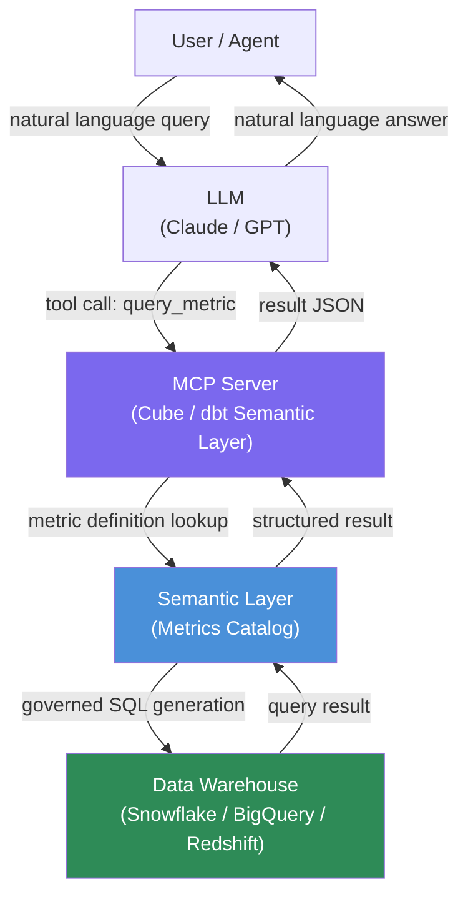

Ask an LLM to query your data warehouse directly and you will immediately hit the same wall: the model has no idea which of your 47 tables actually holds revenue, what business logic is buried in the `v_active_customers` view, or that "conversion rate" in your organization means something different from the textbook definition. It generates plausible-looking SQL that returns wrong numbers. You discover this after the VP of Sales sends a panicked Slack message.

The fix is not better prompting. It is giving the model a semantic layer — a governed catalog of pre-defined business metrics that acts as the translation layer between natural language and your data. Here is how to wire dbt Semantic Layer or Cube to an LLM via MCP, and why it works.



## Why LLMs Generate Bad SQL Against Raw Schemas

The root cause is not that LLMs are bad at SQL — they are actually reasonably good at SQL syntax. The problem is that raw database schemas carry almost no business context.

Consider a `transactions` table with columns `txn_id`, `txn_amount`, `txn_status`, `created_at`, `account_id`. The LLM does not know:

- That `txn_status = 'SETTLED'` is the only status that counts as revenue
- That refunds live in a separate `reversals` table that must be subtracted
- That `created_at` is in UTC but your CFO always reports in IST
- That certain `account_id` ranges are test accounts that must be excluded

A semantic layer encodes all of this. When you define a `revenue` metric, you write that business logic once, in a governed, versioned object. The LLM never touches the raw schema — it calls a tool that returns the metric value with the correct logic applied.

## Semantic Layer Options

**dbt Semantic Layer** (part of dbt Cloud) is the strongest choice if your team already uses dbt for transformations. You define metrics in YAML alongside your models, and the Semantic Layer exposes a query API. As of 2025, it supports the JDBC interface and a REST API that makes MCP integration straightforward.

**Cube** is the more flexible option — it works with any warehouse, does not require dbt, and has an actively maintained MCP server. Cube's semantic layer (now called "Cube Semantic Layer") supports metrics, dimensions, and access control with row-level security.

**AtScale** is the enterprise-licensed option with deeper BI tool integration, relevant if you are in a Microsoft or Tableau-heavy environment.

## Wiring Cube to Claude via MCP

Cube ships a first-party MCP server as of v0.36. Configuration in your `claude_desktop_config.json` (or equivalent MCP host config):

```json
{
  "mcpServers": {
    "cube": {
      "command": "npx",
      "args": ["@cubejs-backend/mcp-server"],
      "env": {
        "CUBEJS_API_URL": "https://your-cube-instance.com/cubejs-api/v1",
        "CUBEJS_API_TOKEN": "${CUBE_API_TOKEN}"
      }
    }
  }
}
```

This exposes tools like `query_cube` to the LLM. A Claude interaction then looks like:

```
User: What was revenue by region for the last 30 days?

Claude calls: query_cube({
  "measures": ["Orders.revenue"],
  "dimensions": ["Customers.region"],
  "timeDimensions": [{
    "dimension": "Orders.createdAt",
    "dateRange": "last 30 days"
  }]
})
```

Cube translates that into the correct governed SQL — including all the business logic encoded in your schema — executes it, and returns structured JSON. Claude formats the result for the user.

The LLM never sees a table name. It never generates SQL. It works with metric names and dimension names that your business already understands.

## Governance Is the Real Win

The accuracy improvement is real — Cube's 2025 research showed roughly 3x improvement in correct results compared to direct SQL generation from raw schema, validated across a dataset of 500 common business questions. But governance is the more durable benefit.

With direct database access via MCP, an LLM can in theory query any table the database user has access to. That is a large blast radius. With a semantic layer:

- **Access control is enforced at the metric level**: you can expose `revenue` to sales managers without exposing the underlying `accounts` table that contains PII
- **Business definitions are versioned**: when your definition of "active customer" changes, you update one metric definition; every LLM query automatically uses the new definition
- **Audit trail is centralized**: all queries go through the semantic layer's query log, not scattered across raw DB query logs
- **Column-level lineage is preserved**: because the semantic layer knows which tables and columns feed each metric

## dbt Semantic Layer Integration

If you are on dbt Cloud, the setup is similar but uses dbt's JDBC endpoint:

```python
# dbt Semantic Layer Python client
from dbtsl import SemanticLayerClient

client = SemanticLayerClient(
    environment_id=int(os.environ["DBT_ENVIRONMENT_ID"]),
    auth_token=os.environ["DBT_SERVICE_TOKEN"],
    host="semantic-layer.cloud.getdbt.com"
)

async def query_metric(metric: str, group_by: list[str], where: str = None):
    async with client.session():
        result = await client.query(
            metrics=[metric],
            group_by=group_by,
            where=where
        )
        return result.to_dict()
```

You can wrap this in an MCP tool definition or expose it via a FastAPI endpoint that your agent calls. The key is that your metric definitions — encoded in `metrics:` blocks in your dbt YAML files — are the single source of truth.

## What This Does Not Solve

Semantic layers require upfront investment. Defining metrics properly takes time, and it takes organizational alignment on what those definitions should be. If your organization cannot agree on what "revenue" means in a meeting room, encoding it in a semantic layer will be contentious.

The semantic layer approach also does not help for truly ad hoc analysis — questions about tables or columns that are not yet modeled. For those, you either model them (if the question is recurring) or fall back to direct SQL generation with all the attendant risks.

There is also a cold start problem: if your warehouse has no existing dbt models or semantic layer definitions, the investment to get here is substantial. Prioritize this if you have a core set of 20-30 metrics that get queried constantly and where accuracy matters.

## Accuracy Expectations

In practice, expect correct results on roughly 80-90% of questions that map cleanly to your defined metrics. The failure cases are questions that require combining metrics in ways the model interprets differently from how you define them, or questions where the user's intent is genuinely ambiguous.

The 300% improvement number from Cube's research is real but measures against a particularly challenging baseline (GPT-4 with raw schema and no examples). With a well-crafted raw schema prompt and few-shot examples, the gap narrows — but the semantic layer still wins on governance grounds regardless.

> Semantic layers are worth building when you have recurring metric queries, governance requirements, or accuracy requirements. They are not worth building as a one-time exploration tool.
{: .prompt-info }

For teams beyond the exploratory phase — where AI-generated SQL is going into dashboards or automated reports — the semantic layer is not optional. It is the architecture that makes this production-safe.
