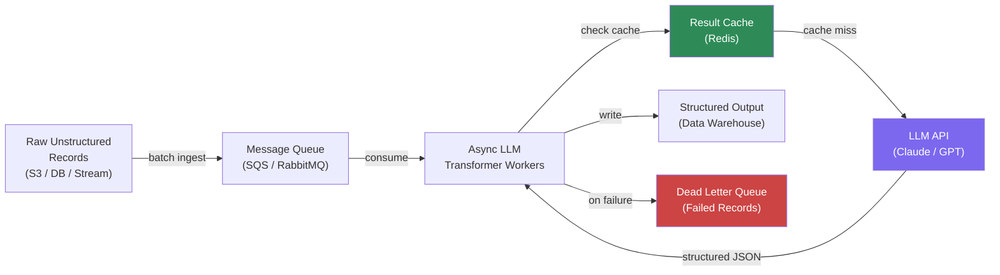

Regex and rule-based parsers work until the input stops conforming to what you expected when you wrote them. Customer support tickets in 14 languages, product descriptions scraped from 300 different suppliers, medical notes dictated by doctors who do not follow templates — these break rule engines constantly. LLMs handle them well. The challenge is fitting LLM inference into a pipeline that needs to process millions of records without spending a fortune or grinding to a halt.

Here is the architecture and the practical code for doing it reliably.



## Where LLMs Fit in ETL

LLMs are not a replacement for traditional ETL — they are a new primitive for specific transformation steps. Do not use them for:

- Data movement (S3 → Redshift)
- Aggregations and rollups
- Join logic
- Schema validation

Use them for transformations that require language understanding:

- **Entity extraction**: pull structured fields from free-text (name, address, date, product name from a customer email)
- **Classification**: categorize a product description into a taxonomy, classify a support ticket by issue type
- **Normalization**: standardize "two-day shipping", "2-day delivery", "express 2d" → a canonical `shipping_tier` value
- **Enrichment**: given a company name, infer industry vertical; given a job title, infer seniority level
- **Sentiment analysis**: when you need nuance that simple sentiment libraries miss (sarcasm, mixed sentiment, domain-specific tone)

The pattern is always the same: unstructured or semi-structured input → LLM → structured JSON output.

## The Throughput Challenge

LLM inference is slow (0.5–5 seconds per call) and expensive (roughly $0.01–$0.10 per 1000 records depending on model and record length). At 1 million records, even $0.01/record is $10,000. You need to be deliberate about where in your pipeline you deploy LLMs.

Three architectural patterns to manage throughput:

**1. Synchronous for low-volume, high-value records**: If you are processing 10,000 enterprise contract documents per day where extraction accuracy is critical and cost is not the primary concern, synchronous LLM calls in a pipeline are acceptable.

**2. Async batch processing for backfills**: Process historical data in parallel workers, rate-limited to stay within API quotas. This is the most common pattern.

**3. Streaming with queuing for real-time pipelines**: Kafka or SQS acts as the buffer; LLM workers consume at their own pace; downstream systems tolerate enrichment latency. Covered in more detail in the Kafka post.

## Production Python Implementation

Here is a complete async batch processor for document normalization using the Anthropic API:

```python
import asyncio
import json
import logging
from dataclasses import dataclass
from typing import Any

import anthropic
import redis.asyncio as redis

logger = logging.getLogger(__name__)

@dataclass
class ExtractionResult:
    record_id: str
    extracted: dict[str, Any]
    cached: bool
    error: str | None = None


EXTRACTION_PROMPT = """Extract the following fields from the document below.
Return ONLY valid JSON with these keys: company_name, contact_email, 
contract_value_usd, start_date (YYYY-MM-DD), end_date (YYYY-MM-DD), 
renewal_type (auto|manual|none).

If a field cannot be determined, use null. Do not include explanation text.

Document:
{document}"""


class LLMETLProcessor:
    def __init__(
        self,
        model: str = "claude-3-5-haiku-20241022",
        max_concurrent: int = 10,
        cache_ttl_seconds: int = 86400,
    ):
        self.client = anthropic.AsyncAnthropic()
        self.model = model
        self.semaphore = asyncio.Semaphore(max_concurrent)
        self.cache = redis.Redis(host="localhost", decode_responses=True)
        self.cache_ttl = cache_ttl_seconds

    def _cache_key(self, text: str) -> str:
        import hashlib
        return f"llm_extract:{hashlib.sha256(text.encode()).hexdigest()[:16]}"

    async def extract_fields(self, record_id: str, text: str) -> ExtractionResult:
        cache_key = self._cache_key(text)

        # Check cache first — identical documents need not be re-processed
        cached = await self.cache.get(cache_key)
        if cached:
            return ExtractionResult(
                record_id=record_id,
                extracted=json.loads(cached),
                cached=True
            )

        async with self.semaphore:
            try:
                response = await self.client.messages.create(
                    model=self.model,
                    max_tokens=512,
                    messages=[{
                        "role": "user",
                        "content": EXTRACTION_PROMPT.format(document=text[:4000])
                    }]
                )
                raw = response.content[0].text.strip()
                extracted = json.loads(raw)

                await self.cache.setex(cache_key, self.cache_ttl, json.dumps(extracted))
                return ExtractionResult(record_id=record_id, extracted=extracted, cached=False)

            except json.JSONDecodeError as e:
                logger.error("JSON parse failed for %s: %s", record_id, e)
                return ExtractionResult(record_id=record_id, extracted={}, cached=False, error=str(e))
            except anthropic.RateLimitError:
                await asyncio.sleep(60)
                raise  # Let the retry layer handle it

    async def process_batch(self, records: list[dict]) -> list[ExtractionResult]:
        tasks = [
            self.extract_fields(r["id"], r["text"])
            for r in records
        ]
        return await asyncio.gather(*tasks, return_exceptions=False)
```

Usage in a pipeline:

```python
async def run_pipeline(records: list[dict]):
    processor = LLMETLProcessor(max_concurrent=20)
    
    # Process in chunks to avoid overwhelming the queue
    chunk_size = 100
    all_results = []
    
    for i in range(0, len(records), chunk_size):
        chunk = records[i:i + chunk_size]
        results = await processor.process_batch(chunk)
        
        successes = [r for r in results if not r.error]
        failures = [r for r in results if r.error]
        
        # Write successes to warehouse
        await write_to_warehouse(successes)
        
        # Write failures to DLQ for manual review
        await write_to_dlq(failures)
        
        logger.info(
            "Chunk %d/%d: %d success, %d failed",
            i // chunk_size + 1, len(records) // chunk_size,
            len(successes), len(failures)
        )
    
    return all_results
```

## Cost Optimization in Practice

Three levers that matter:

**Model selection**: Use the cheapest model that meets your accuracy bar. For classification tasks with clear categories, Haiku-class models perform nearly as well as Opus-class models at 10-20x lower cost. Benchmark your specific task before defaulting to the most capable model.

**Caching**: In most enterprise ETL, you will have near-duplicate records — same supplier, similar documents. Caching by content hash avoids redundant LLM calls. In one accounts payable pipeline I worked on, caching eliminated 40% of LLM calls on the first backfill run.

**Selective processing**: Not every record needs LLM transformation. Apply cheap pre-filters first — if a structured field can be parsed with a simple regex, do not send it to the LLM. Only escalate records that fail structured parsing.

## Error Handling and Monitoring

LLMs will occasionally return malformed JSON, refuse to process certain content, or time out. Your pipeline needs:

- **Retry with exponential backoff** on rate limit errors
- **Dead letter queue** for records that fail after retries — do not silently drop failures
- **JSON schema validation** on the output — do not trust that the LLM returned what you asked for
- **Sample-based quality monitoring** — periodically review a random 1% of extractions manually to catch systematic errors before they propagate

Key metrics to track:
- LLM call success rate (target > 99%)
- JSON parse success rate (target > 98%; failures indicate prompt drift)
- Average cost per record
- Cache hit rate
- Records in DLQ (should trend toward zero for stable pipelines)

> If your JSON parse failure rate climbs above 2%, your prompt needs work or your model version changed. Do not let this metric drift unmonitored.
{: .prompt-warning }

## When Not to Use LLMs in ETL

If your extraction task can be solved with a fine-tuned small model (BERT-class, ~110M parameters), that will be faster and cheaper for high-volume pipelines. LLMs shine when the task requires broad language understanding and you cannot afford the fine-tuning iteration cycle. For simpler NLP tasks — single-label classification from a fixed set, named entity recognition in a known domain — specialized models will beat LLMs on cost per record by 10-50x.

The architecture above works well for 10K–10M records per day. Beyond that, you are looking at fine-tuned small models, or a hybrid where LLMs handle the long tail and smaller models handle the common cases. The principles are the same — the economics shift.
