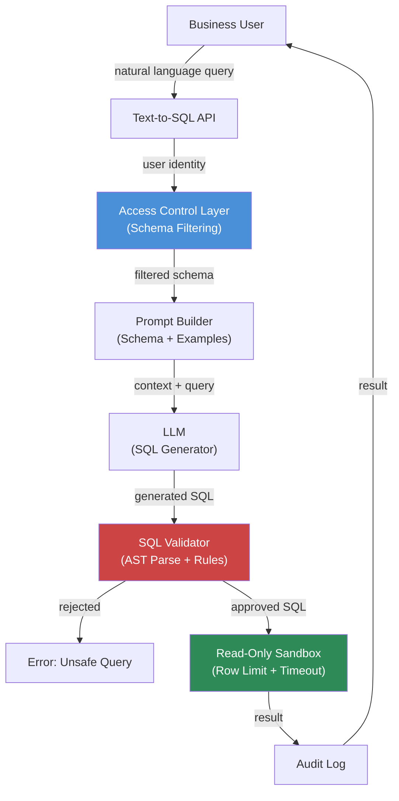

Every text-to-SQL demo makes the same mistake: it runs directly against a production database with a superuser connection and calls it "enterprise-ready." The demo looks impressive until you realize a motivated user could ask "show me all customer PII" or "what does a query that takes an hour to run look like?" and the system happily complies.

Production text-to-SQL needs a safety envelope around the LLM's output. Here is the architecture that makes it safe, and the accuracy techniques that make it useful.



## The Security Layers You Actually Need

### 1. Schema Filtering by User Identity

The LLM can only generate SQL for tables and columns it knows about. If you never put a table in the context, it cannot query it. This is your first and most important defense.

```python
from dataclasses import dataclass

@dataclass
class SchemaPermission:
    table: str
    allowed_columns: list[str]  # empty list = all columns
    row_filter: str | None = None  # SQL WHERE clause for row-level security


USER_SCHEMA_PERMISSIONS: dict[str, list[SchemaPermission]] = {
    "analyst": [
        SchemaPermission("orders", ["order_id", "region", "amount", "created_at"]),
        SchemaPermission("products", []),  # all columns
        SchemaPermission("customers", ["customer_id", "region", "tier"],
                         row_filter="tier != 'enterprise'"),  # no enterprise customers
    ],
    "finance": [
        SchemaPermission("orders", []),
        SchemaPermission("refunds", []),
        SchemaPermission("customers", []),
    ]
}

def build_filtered_schema(user_role: str, full_schema: dict) -> str:
    permissions = USER_SCHEMA_PERMISSIONS.get(user_role, [])
    allowed_tables = {p.table for p in permissions}
    
    schema_lines = []
    for perm in permissions:
        table_info = full_schema.get(perm.table)
        if not table_info:
            continue
        
        if perm.allowed_columns:
            cols = [c for c in table_info["columns"] if c["name"] in perm.allowed_columns]
        else:
            cols = table_info["columns"]
        
        col_defs = ", ".join(f"{c['name']} {c['type']}" for c in cols)
        schema_lines.append(f"Table: {perm.table} ({col_defs})")
        if perm.row_filter:
            schema_lines.append(f"  Note: Only returns rows where {perm.row_filter}")
    
    return "\n".join(schema_lines)
```

### 2. SQL AST Validation

Before executing any generated SQL, parse it and validate it structurally. You want to catch:

- Any write operations (INSERT, UPDATE, DELETE, DROP, TRUNCATE, CREATE)
- UNION queries that try to JOIN with tables outside the allowed set
- Subqueries referencing unauthorized tables
- Stored procedure calls

```python
import sqlglot
from sqlglot import exp

def validate_sql_safety(sql: str, allowed_tables: set[str]) -> tuple[bool, str]:
    """Returns (is_safe, rejection_reason)."""
    try:
        parsed = sqlglot.parse_one(sql, dialect="bigquery")
    except sqlglot.errors.ParseError as e:
        return False, f"SQL parse error: {e}"

    # Block write operations
    write_types = (exp.Insert, exp.Update, exp.Delete, exp.Drop, exp.Create, exp.Truncate)
    for node in parsed.walk():
        if isinstance(node, write_types):
            return False, f"Write operations are not permitted: {type(node).__name__}"

    # Validate all referenced tables are in the allowed set
    for table in parsed.find_all(exp.Table):
        table_name = table.name.lower()
        if table_name and table_name not in allowed_tables:
            return False, f"Table '{table_name}' is not accessible"

    return True, ""
```

### 3. Read-Only Sandbox with Row Limit and Timeout

Connect to the database with a read-only user. Wrap every query execution in a transaction that is always rolled back, with a hard row limit and a query timeout:

```python
import asyncpg
import asyncio

async def execute_sandboxed(sql: str, conn_string: str) -> dict:
    conn = await asyncpg.connect(conn_string)  # read-only DB user
    
    try:
        # Hard row limit — prevents runaway queries
        limited_sql = f"SELECT * FROM ({sql}) _q LIMIT 1000"
        
        # Timeout kills the query if it runs too long
        result = await asyncio.wait_for(
            conn.fetch(limited_sql),
            timeout=30.0
        )
        
        return {
            "rows": [dict(r) for r in result],
            "row_count": len(result),
            "truncated": len(result) == 1000
        }
    except asyncio.TimeoutError:
        await conn.execute("SELECT pg_cancel_backend(pg_backend_pid())")
        raise ValueError("Query exceeded 30-second time limit")
    finally:
        await conn.close()
```

## Accuracy: Getting the SQL Right

Safety gets you to production. Accuracy determines whether anyone uses the system.

**Schema documentation in context**: Column names alone are often not enough. Add descriptions:

```
Table: orders
  order_id INTEGER — unique order identifier
  amount NUMERIC — order total in USD, always positive (refunds are in refunds table)
  status VARCHAR — one of: pending, fulfilled, cancelled, refunded
  created_at TIMESTAMP — UTC timestamp of order creation
```

**Few-shot examples from your actual schema**: Five well-chosen examples from your domain, showing how your naming conventions translate to SQL, are worth more than elaborate prompting. Include examples that demonstrate your organization's specific quirks — like which status values count as "active" or which accounts are test accounts to exclude.

**Clarification before generation**: For ambiguous queries, ask before generating. "Revenue" can mean gross, net, or recognized revenue. "Last month" can mean the previous calendar month or the trailing 30 days.

```python
AMBIGUITY_CHECK_PROMPT = """Given this database schema and user question, determine if the question 
is ambiguous enough to require clarification before writing SQL.

Schema:
{schema}

User question: {question}

If the question is unambiguous, respond with: CLEAR
If clarification is needed, respond with: CLARIFY: <one specific question to ask>

Do not write SQL. Only output CLEAR or CLARIFY: <question>."""
```

## Handling the Common Failure Cases

**"Show me everything"**: Users sometimes ask for unbounded queries. Your row limit handles the execution safety, but you should detect these and explain the truncation in the response.

**Multi-step reasoning**: "Which customers who bought product X last month haven't placed an order this month?" requires joining tables and conditional logic. LLMs handle this reasonably well if the schema is clear, but it is worth building a test suite of your 20 hardest business questions and tracking accuracy over time.

**Ambiguous column references**: If a user asks for "orders this week" and your `orders` table has both `created_at` and `updated_at`, the LLM will guess. Make your schema documentation explicit about which timestamp to use for filtering.

## Audit Logging

Every text-to-SQL interaction should produce an audit record:

```python
@dataclass
class QueryAuditRecord:
    timestamp: str
    user_id: str
    user_role: str
    natural_language_query: str
    generated_sql: str
    validation_passed: bool
    rejection_reason: str | None
    rows_returned: int | None
    execution_time_ms: int | None
    llm_model: str
```

This log serves two purposes: compliance (who queried what, when) and improvement (review rejected queries to find gaps in your schema documentation or permission model).

## Accuracy Expectations in Practice

Across a well-documented schema with clear business context, expect:

- ~85% first-attempt accuracy on single-table queries
- ~70% first-attempt accuracy on multi-table joins
- ~50% accuracy on queries requiring date arithmetic or complex aggregations

These numbers improve significantly with schema documentation and few-shot examples. They will also vary based on how well-named your columns and tables are — a schema that was built for internal use with abbreviated column names will perform worse than one built with clarity in mind.

> Do not benchmark text-to-SQL against toy databases. Build a test set from the 50 questions your analysts actually ask, and measure against that. The results will be sobering and will tell you where to invest in schema documentation.
{: .prompt-tip }

The technology is genuinely useful, but the gap between a impressive demo and a reliable production system is mostly unglamorous work: schema documentation, permission modeling, test suite building, and user education on how to phrase queries clearly.
