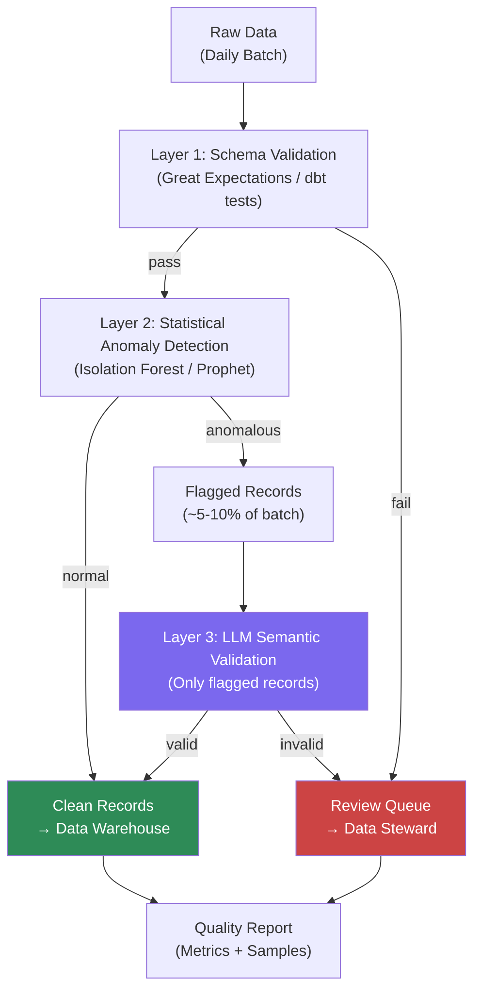

Great Expectations will tell you that a column has no nulls, values are in range, and the schema matches. It will not tell you that a batch of customer records all have suspiciously similar addresses that suggest a data entry error, that a revenue figure spiked 800% in one region for reasons that do not match any known promotion, or that a product description is categorized under the wrong department. Rule-based validation catches known errors. AI-powered quality catches the errors you did not know to write rules for.

Here is the multi-layer quality architecture and the code to implement it.



## Layer 1: Schema Validation (Do Not Skip the Basics)

Statistical and LLM validation do not replace schema validation — they extend it. Run your existing dbt tests or Great Expectations suite first. Catch the obvious errors cheaply before invoking anything more expensive. Every record that fails schema validation goes directly to the review queue without consuming AI resources.

## Layer 2: Statistical Anomaly Detection

Statistical methods catch quantitative anomalies — unusual values, unexpected distributions, metric spikes — without knowing in advance what "unusual" looks like.

**Isolation Forest for tabular anomaly detection**: Works well for identifying individual records that are statistically outliers across multiple dimensions simultaneously.

```python
import numpy as np
import pandas as pd
from sklearn.ensemble import IsolationForest
from sklearn.preprocessing import StandardScaler

def detect_record_anomalies(
    df: pd.DataFrame,
    numeric_columns: list[str],
    contamination: float = 0.05
) -> pd.DataFrame:
    """Flag records that are statistical outliers across numeric dimensions."""
    features = df[numeric_columns].fillna(df[numeric_columns].median())
    
    scaler = StandardScaler()
    scaled = scaler.fit_transform(features)
    
    model = IsolationForest(
        contamination=contamination,  # expect ~5% anomalies
        random_state=42,
        n_estimators=100
    )
    scores = model.fit_predict(scaled)
    
    df = df.copy()
    df["anomaly_flag"] = scores == -1  # -1 = anomaly
    df["anomaly_score"] = model.score_samples(scaled)
    return df
```

**Prophet for time-series metric anomaly detection**: When you are validating daily metric batches (revenue, order count, user signups), Prophet fits a trend model and flags batches that fall outside expected bounds:

```python
from prophet import Prophet

def detect_metric_anomaly(
    metric_history: pd.DataFrame,  # columns: ds (date), y (value)
    new_value: float,
    new_date: str
) -> dict:
    model = Prophet(interval_width=0.95)
    model.fit(metric_history)
    
    future = model.make_future_dataframe(periods=1)
    forecast = model.predict(future)
    
    last_forecast = forecast[forecast["ds"] == new_date].iloc[0]
    lower = last_forecast["yhat_lower"]
    upper = last_forecast["yhat_upper"]
    
    is_anomaly = not (lower <= new_value <= upper)
    deviation_pct = ((new_value - last_forecast["yhat"]) / last_forecast["yhat"]) * 100
    
    return {
        "is_anomaly": is_anomaly,
        "expected_range": (lower, upper),
        "actual": new_value,
        "deviation_pct": round(deviation_pct, 1)
    }
```

## Layer 3: LLM Semantic Validation

Only run LLM validation on records flagged by Layer 2. This is the economics lever — if 5% of your records are flagged, you are running LLM calls on 5% of your volume, not 100%.

LLM semantic validation covers qualitative checks that statistics cannot catch:

```python
import anthropic
import json

client = anthropic.Anthropic()

SEMANTIC_VALIDATION_PROMPT = """You are a data quality validator. Examine this record and identify 
any semantic data quality issues — fields that look syntactically valid but are likely wrong.

Record type: {record_type}
Record data:
{record_json}

Check for:
- Address fields that look implausible or internally inconsistent
- Category/product mismatches (product description doesn't match its category)
- Dates that are logically impossible (end date before start date, future birth dates)
- Values that are statistically plausible but contextually wrong

Respond with JSON only:
{{
  "has_issues": true/false,
  "issues": ["issue 1", "issue 2"],
  "severity": "low|medium|high",
  "recommendation": "pass|review|reject"
}}"""


async def semantic_validate_record(record: dict, record_type: str) -> dict:
    response = client.messages.create(
        model="claude-3-5-haiku-20241022",
        max_tokens=256,
        messages=[{
            "role": "user",
            "content": SEMANTIC_VALIDATION_PROMPT.format(
                record_type=record_type,
                record_json=json.dumps(record, indent=2)[:2000]
            )
        }]
    )
    
    try:
        return json.loads(response.content[0].text)
    except json.JSONDecodeError:
        return {"has_issues": False, "issues": [], "severity": "low", "recommendation": "pass"}
```

## Embedding-Based Deduplication

Exact-match deduplication misses near-duplicates: "Acme Corp", "Acme Corporation", "ACME CORP." All three are the same entity. Embedding similarity catches them.

```python
from anthropic import Anthropic
import numpy as np

def find_near_duplicates(
    records: list[dict],
    text_field: str,
    similarity_threshold: float = 0.92
) -> list[tuple[int, int, float]]:
    """Returns pairs of record indices that are likely duplicates."""
    client = Anthropic()
    
    texts = [str(r[text_field]) for r in records]
    
    # Batch embedding generation
    response = client.messages.create(
        model="claude-3-5-haiku-20241022",
        max_tokens=1,
        messages=[{"role": "user", "content": "embed"}],
        # Note: use your embedding service of choice here
        # Claude does not expose an embedding endpoint;
        # use OpenAI text-embedding-3-small or Cohere embed for this step
    )
    
    # With an actual embedding provider:
    # embeddings = embed_client.embed(texts)
    # Compare pairwise cosine similarity
    # Flag pairs above threshold as likely duplicates
    
    duplicates = []
    # ... cosine similarity comparison logic
    return duplicates
```

> For embedding-based deduplication, use a dedicated embedding model (Cohere Embed, OpenAI text-embedding-3-small, or a local model) rather than a chat LLM. Chat LLMs do not expose embedding vectors.
{: .prompt-info }

## Integration with dbt and Great Expectations

Package the quality checks as a dbt macro or post-hook:

```yaml
# dbt schema.yml — add AI quality test alongside schema tests
models:
  - name: stg_orders
    columns:
      - name: amount
        tests:
          - not_null
          - dbt_utils.accepted_range:
              min_value: 0
              max_value: 1000000
    tests:
      - ai_anomaly_check:  # custom dbt test calling your quality API
          model: ref('stg_orders')
          numeric_columns: ["amount", "quantity", "discount_pct"]
          contamination: 0.03
```

## Quality Monitoring Dashboard Metrics

Track these across every pipeline run:

| Metric | Target | Alert threshold |
|---|---|---|
| Schema validation pass rate | >99.5% | <99% |
| Statistical anomaly rate | <5% | >10% |
| LLM validation severity: high | <1% | >2% |
| Records routed to review queue | <3% | >8% |
| False positive rate (steward override rate) | <20% | >40% |

The false positive rate is the most important operational metric. If data stewards are overriding 50% of the records flagged for review, your anomaly detection thresholds are too aggressive and you will get alert fatigue.

## Cost Reality

For a pipeline processing 1M records/day with a 5% flagging rate:

- Layer 2 (Isolation Forest): ~$0 marginal cost, runs in seconds in memory
- Layer 3 (LLM on 50K records): at $0.01/1000 tokens with 500-token records, roughly $25/day

That is reasonable for most enterprise pipelines where data quality errors have meaningful downstream cost. If your pipeline is 100M records/day, the same architecture with tighter flagging thresholds (contamination=0.01) keeps costs manageable.

The economics work because the expensive layer only runs on the small fraction of records that cheaper methods identified as suspicious. Never run LLM validation on your full dataset.
