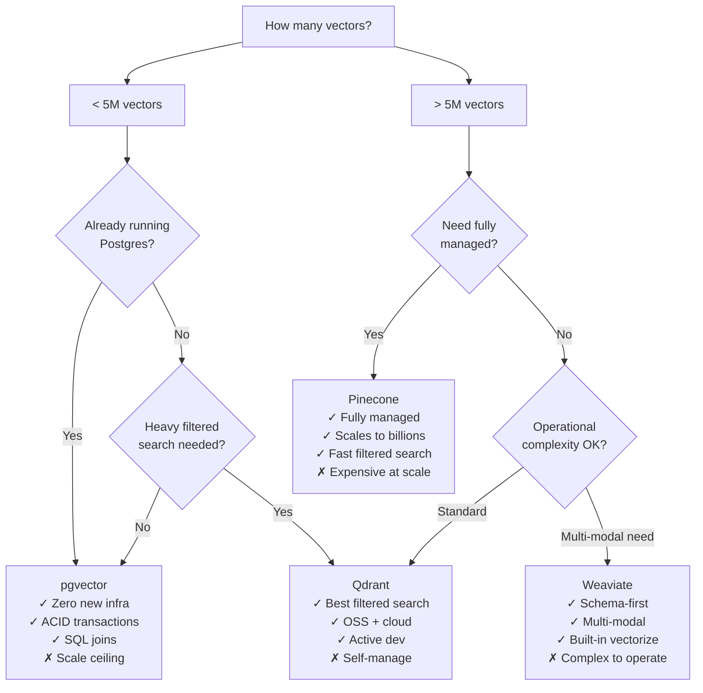

Every vector database comparison article eventually reveals itself as an ad for one of them. This one is not. I have used pgvector in two production systems, Qdrant in one, and evaluated Pinecone and Weaviate against those use cases. Here are the real tradeoffs, without the marketing framing.

The short version: pgvector if you are under 5M vectors and already run Postgres. Qdrant if you need advanced filtered search or are building something at scale on your own infrastructure. Pinecone if you need managed scale with minimal operational investment and have the budget. Weaviate if you have a specific multi-modal or schema-first use case.



## pgvector — The Default Choice for Most Teams

pgvector is a Postgres extension that adds vector similarity search. It supports two index types: IVFFlat (faster builds, slightly lower recall) and HNSW (better recall, slower builds, better query performance).

**The honest case for pgvector**: If you are storing vectors alongside relational data — user profiles, document metadata, product catalog — pgvector lets you join vectors with relational data in a single query with no extra infrastructure. That is a meaningful operational simplification, and the performance is fine for most RAG applications under 5M vectors.

```sql
-- Create a table with a vector column
CREATE TABLE documents (
    id BIGSERIAL PRIMARY KEY,
    content TEXT,
    embedding VECTOR(1536),  -- OpenAI ada-002 dimensions
    category VARCHAR(50),
    created_at TIMESTAMPTZ DEFAULT NOW()
);

-- HNSW index — better query performance than IVFFlat for most use cases
CREATE INDEX ON documents USING hnsw (embedding vector_cosine_ops)
WITH (m = 16, ef_construction = 64);

-- Filtered semantic search — category filter applied as a WHERE clause
SELECT id, content, 1 - (embedding <=> $1::vector) AS similarity
FROM documents
WHERE category = 'engineering'
  AND created_at > NOW() - INTERVAL '90 days'
ORDER BY embedding <=> $1::vector
LIMIT 10;
```

**The honest case against pgvector**: Above roughly 5M vectors, query latency starts climbing. The HNSW index does not partition across shards the way dedicated vector databases do. At 50M vectors with heavy concurrent query load, you will want something else.

Filtered search in pgvector also has a subtle performance problem: the vector index and the relational filter operate somewhat independently. With highly selective filters on a large table, you may end up doing an index scan on the vector column followed by a filter, which can be slower than you expect.

## Qdrant — Best-in-Class Filtered Search

Qdrant's primary advantage over pgvector is its payload-indexed filtered search. It builds separate indexes for each payload (metadata) field, so filtering by category, date range, user ID, or any combination of metadata fields is genuinely fast — it narrows the search space before running the vector comparison, not after.

```python
from qdrant_client import QdrantClient
from qdrant_client.models import (
    Distance, VectorParams, PointStruct,
    Filter, FieldCondition, MatchValue, Range
)

client = QdrantClient(url="http://localhost:6333")

# Create collection
client.create_collection(
    collection_name="documents",
    vectors_config=VectorParams(size=1536, distance=Distance.COSINE)
)

# Index payload fields for fast filtered search
client.create_payload_index(
    collection_name="documents",
    field_name="category",
    field_schema="keyword"
)
client.create_payload_index(
    collection_name="documents",
    field_name="created_at",
    field_schema="float"
)

# Filtered search — genuinely fast because both indexes are used
results = client.search(
    collection_name="documents",
    query_vector=query_embedding,
    query_filter=Filter(
        must=[
            FieldCondition(key="category", match=MatchValue(value="engineering")),
            FieldCondition(key="created_at", range=Range(gte=1700000000.0))
        ]
    ),
    limit=10
)
```

Qdrant also has a good Python client, a well-maintained Docker image, and a managed cloud option (Qdrant Cloud) if you want to avoid self-hosting. The OSS version is genuinely production-capable.

**Where Qdrant underperforms**: If you need SQL joins with relational data, you are back to running two data stores and merging results in application code. For multi-modal (text + image + audio vectors), the developer experience is more manual than Weaviate.

## Pinecone — Managed Scale, Managed Cost

Pinecone is the right answer when your priorities are: scale to hundreds of millions of vectors, no infrastructure team, fast setup. You get an API and it works.

```python
from pinecone import Pinecone

pc = Pinecone(api_key="your-api-key")
index = pc.Index("documents")

# Upsert with metadata
index.upsert(vectors=[{
    "id": "doc_123",
    "values": embedding_vector,
    "metadata": {
        "category": "engineering",
        "created_at": 1700000000,
        "title": "Document title"
    }
}])

# Filtered search
results = index.query(
    vector=query_embedding,
    filter={"category": {"$eq": "engineering"}},
    top_k=10,
    include_metadata=True
)
```

**The honest case against Pinecone**: Cost. At scale, Pinecone's pricing is substantial. A production index with 100M vectors at 1536 dimensions, at moderate query volume, runs into thousands of dollars per month. For the same workload on self-hosted Qdrant, the primary cost is EC2 or GKE instances. If you have the engineering bandwidth to operate Qdrant, the economics are meaningfully better.

Pinecone also lacks native joins with relational data — you store IDs and fetch the full records from your relational database after the vector search.

## Weaviate — Schema-First, Multi-Modal

Weaviate is the most opinionated option. It has a schema where you define object types (classes), and it can automatically vectorize content using integrated vectorization modules (OpenAI, Cohere, HuggingFace, and others).

It makes sense when: you have a clearly defined schema with multiple object types that need to be cross-referenced in queries, or you are working with multiple modalities (text + images) and want a single system to handle both.

It is harder to operate than Qdrant and has a steeper learning curve. If your use case is standard RAG over text documents, Weaviate is more complexity than you need.

## The Decision Framework

| Criterion | pgvector | Qdrant | Pinecone | Weaviate |
|---|---|---|---|---|
| Vector count | <5M | <200M | Billions | <100M |
| Filtered search quality | Medium | Best | Good | Good |
| Ops complexity | Low | Medium | None | High |
| Cost at scale | Low | Low | High | Medium |
| SQL joins | Yes | No | No | No |
| Multi-tenancy | Yes | Yes | Yes | Yes |
| Multi-modal | No | No | No | Yes |

Start with pgvector unless you have a specific reason not to. Add complexity only when you have data showing you need it. The teams I have seen switch from pgvector to Qdrant did so at >10M vectors with filtered search as the performance bottleneck — that is the right trigger.

> Never choose a vector database based on benchmarks published by the vendor. The benchmarks are real but they measure optimal conditions. Benchmark against your actual data, your actual query patterns, and your actual filter selectivity.
{: .prompt-warning }

Multi-tenancy implementation differs significantly across options. In pgvector, row-level security handles it via standard Postgres RLS policies. In Qdrant, you either use separate collections per tenant (clean but expensive at many tenants) or payload filtering with a `tenant_id` field (efficient but requires careful access control). Pinecone uses namespaces. Plan your multi-tenancy strategy before you commit to a database — it is not easy to change after data is loaded.
