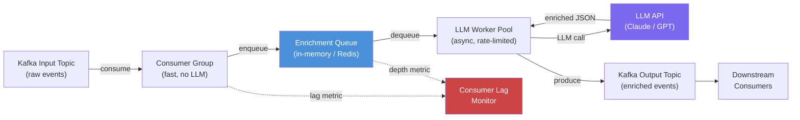

The mistake is straightforward: you have a Kafka consumer, you add an LLM call inside the `consume → process → commit` loop, and you wonder why your consumer group lag starts growing immediately. LLM inference takes 1–10 seconds. Kafka consumers are expected to process messages and commit offsets in milliseconds. Put a 3-second LLM call in a synchronous consumer loop and you will produce consumer lag faster than you can drain it.

The architecture that actually works decouples consumption from LLM enrichment and treats backpressure as a first-class concern.



## Why Naive In-Loop LLM Calls Kill Consumer Groups

Kafka's consumer group protocol requires consumers to send heartbeats at regular intervals (default: 3 seconds) and to commit processed offsets. If your processing loop takes longer than `max.poll.interval.ms` (default: 5 minutes, but often tuned lower), the broker assumes the consumer is dead and triggers a rebalance.

More practically: if each LLM call takes 3 seconds and you process messages one at a time, you can handle at most 20 messages per minute per consumer instance. A Kafka partition receiving 1000 events/minute with one consumer instance will accumulate lag immediately.

The fix is architectural: separate the concerns of consumption, enrichment, and production.

## Pattern 1: Decoupled Enrichment with Async Workers

The consumer reads from Kafka as fast as possible and deposits messages into an internal queue. A separate worker pool drains that queue, making LLM calls asynchronously, and writes enriched results to an output topic.

```python
import asyncio
import json
import logging
from dataclasses import dataclass, field
from aiokafka import AIOKafkaConsumer, AIOKafkaProducer
import anthropic

logger = logging.getLogger(__name__)

@dataclass
class EnrichmentConfig:
    input_topic: str
    output_topic: str
    kafka_bootstrap: str
    group_id: str
    llm_model: str = "claude-3-5-haiku-20241022"
    max_concurrent_llm: int = 20
    queue_max_depth: int = 1000


async def enrich_event(client: anthropic.AsyncAnthropic, event: dict, model: str) -> dict:
    """Call LLM to classify and enrich a single event."""
    prompt = f"""Classify this customer support event and extract key entities.
Return JSON only with keys: category, sentiment, priority (low/medium/high), entities (list).

Event: {json.dumps(event)}"""
    
    response = await client.messages.create(
        model=model,
        max_tokens=256,
        messages=[{"role": "user", "content": prompt}]
    )
    
    enrichment = json.loads(response.content[0].text.strip())
    return {**event, "enrichment": enrichment}


async def llm_worker(
    queue: asyncio.Queue,
    producer: AIOKafkaProducer,
    output_topic: str,
    client: anthropic.AsyncAnthropic,
    model: str,
    semaphore: asyncio.Semaphore
):
    """Worker coroutine: drain queue, enrich via LLM, publish to output topic."""
    while True:
        raw_event = await queue.get()
        
        async with semaphore:
            try:
                enriched = await enrich_event(client, raw_event, model)
                await producer.send_and_wait(
                    output_topic,
                    json.dumps(enriched).encode()
                )
            except json.JSONDecodeError:
                logger.warning("LLM returned non-JSON for event %s", raw_event.get("id"))
                # Still publish with empty enrichment — do not drop events
                await producer.send_and_wait(
                    output_topic,
                    json.dumps({**raw_event, "enrichment": None, "enrichment_error": "parse_failure"}).encode()
                )
            except anthropic.RateLimitError:
                # Put it back in the queue — will retry
                await queue.put(raw_event)
                await asyncio.sleep(60)
            finally:
                queue.task_done()


async def run_streaming_enrichment(config: EnrichmentConfig):
    queue: asyncio.Queue = asyncio.Queue(maxsize=config.queue_max_depth)
    semaphore = asyncio.Semaphore(config.max_concurrent_llm)
    client = anthropic.AsyncAnthropic()

    consumer = AIOKafkaConsumer(
        config.input_topic,
        bootstrap_servers=config.kafka_bootstrap,
        group_id=config.group_id,
        auto_offset_reset="earliest",
        enable_auto_commit=True
    )
    producer = AIOKafkaProducer(bootstrap_servers=config.kafka_bootstrap)

    await consumer.start()
    await producer.start()

    # Launch LLM worker pool
    workers = [
        asyncio.create_task(
            llm_worker(queue, producer, config.output_topic, client, config.llm_model, semaphore)
        )
        for _ in range(config.max_concurrent_llm)
    ]

    try:
        async for msg in consumer:
            event = json.loads(msg.value.decode())
            
            if queue.full():
                # Backpressure: queue is full, pause consumption
                # Consumer heartbeats still fire; we just stop pulling messages
                logger.warning("Enrichment queue at capacity (%d), applying backpressure", config.queue_max_depth)
                await asyncio.sleep(1)
                continue
            
            await queue.put(event)
    finally:
        await consumer.stop()
        await queue.join()  # Wait for all queued items to be processed
        for w in workers:
            w.cancel()
        await producer.stop()
```

## Pattern 2: Micro-Batching

Instead of processing one event per LLM call, accumulate events over a short window (100ms–500ms) and process them together. This is effective when your LLM supports parallel requests and each event is short enough that you can pack many into a single prompt — classification tasks, short text categorization.

```python
async def micro_batch_processor(queue: asyncio.Queue, batch_window_ms: int = 200):
    while True:
        batch = []
        deadline = asyncio.get_event_loop().time() + (batch_window_ms / 1000)
        
        # Accumulate events until window closes or queue is empty
        while asyncio.get_event_loop().time() < deadline:
            try:
                event = queue.get_nowait()
                batch.append(event)
            except asyncio.QueueEmpty:
                await asyncio.sleep(0.01)
        
        if batch:
            await enrich_batch(batch)
```

Micro-batching is most effective when you can pack multiple records into one LLM call. It reduces API overhead but adds latency per individual event. Only use it when per-event enrichment latency tolerance is greater than your batch window.

## Pattern 3: Selective Enrichment

Before sending any event to the LLM, apply a cheap pre-filter to decide if enrichment is needed. Most event streams have a power-law distribution — a small fraction of events are ambiguous or high-value enough to warrant LLM enrichment.

```python
def needs_enrichment(event: dict) -> bool:
    """Apply cheap heuristics before invoking LLM."""
    # Only enrich support tickets (not billing or account events)
    if event.get("type") != "support_ticket":
        return False
    
    # Only enrich if the description is long enough to be ambiguous
    description = event.get("description", "")
    if len(description) < 50:
        return False
    
    # Skip if category was already set by the upstream system
    if event.get("category") and event["category"] != "uncategorized":
        return False
    
    return True
```

In practice, selective enrichment often reduces LLM call volume by 80-90% with minimal impact on enrichment coverage for the cases that actually matter.

## Capacity Planning

Calculate the number of worker coroutines you need:

```
Required parallelism = (events_per_second × avg_llm_latency_seconds)

Example:
  1000 events/second × 0.05 fraction needing enrichment = 50 events/second
  50 events/second × 2 seconds avg LLM latency = 100 concurrent requests needed
```

With 100 concurrent requests, you are hitting the LLM API rate limit. Most LLM APIs cap concurrent requests at 50-100 per API key for standard tiers. At that point you need multiple API keys (against ToS for most providers) or on-premises inference — something like vLLM serving a smaller open-source model that you can scale horizontally.

## Monitoring

Consumer lag is the single most important metric. If it is growing, your enrichment pipeline cannot keep up.

```yaml
# Prometheus alerting rule
- alert: KafkaEnrichmentLagGrowing
  expr: |
    kafka_consumergroup_lag{group="enrichment-workers"} > 10000
  for: 5m
  annotations:
    summary: "Enrichment consumer lag exceeds 10K messages for 5 minutes"
```

Secondary metrics: enrichment queue depth, LLM call success rate, enrichment latency p99, dead letter queue growth rate.

> If consumer lag is growing during normal traffic, you have three levers: more concurrent LLM workers, stricter selective enrichment filters, or a smaller/faster model. Trying all three simultaneously makes it impossible to know which helped.
{: .prompt-tip }

The architecture above handles up to several hundred LLM-enriched events per second on commodity infrastructure. Beyond that, you are looking at batched inference with local model serving — a different problem domain where the economics of hosted APIs no longer make sense.
