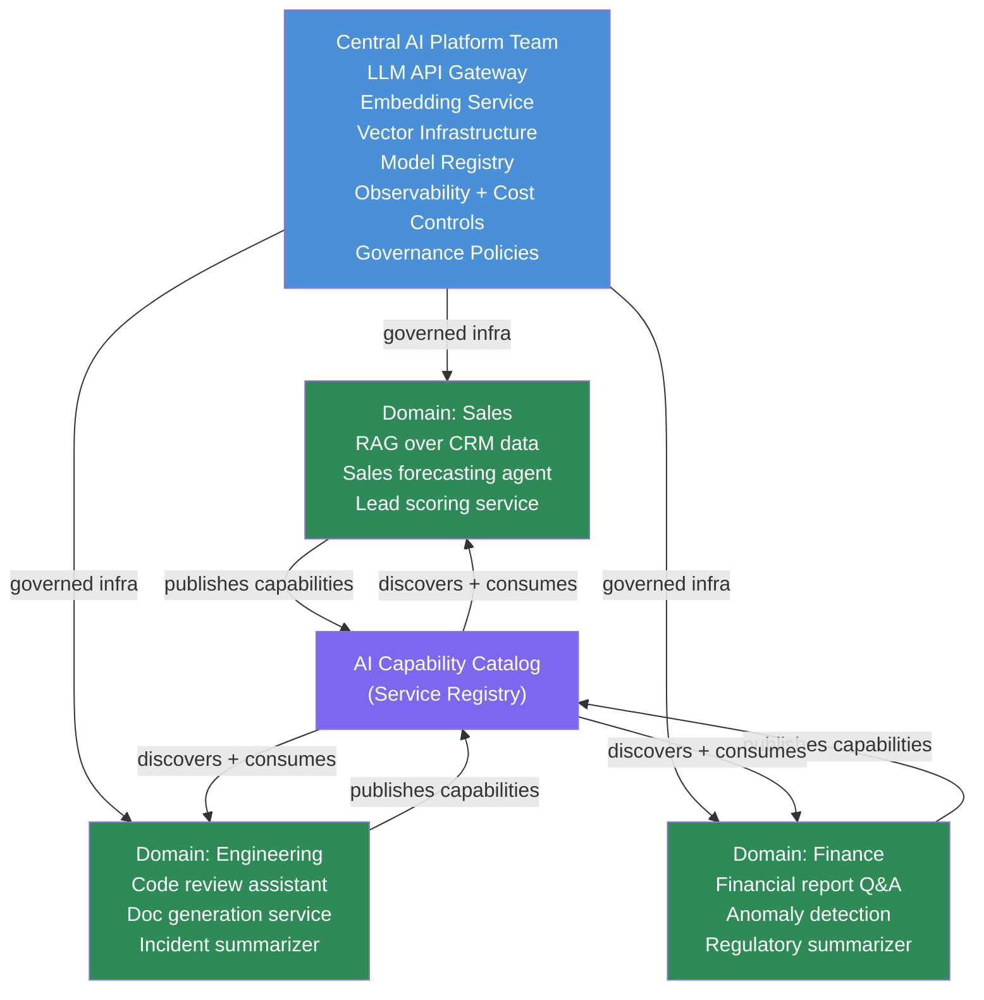

The pattern plays out the same way at most enterprises: a central AI team gets overwhelmed with requests, becomes a bottleneck, and domain teams start building shadow AI solutions in their own AWS accounts, bypassing security reviews and cost controls. By the time anyone notices, you have eight different Vector databases, four different LLM provider accounts, and no one knows what data is being sent where.

The data mesh solution to data ownership bottlenecks — domain autonomy within a federated governance model — applies directly to AI. The extension is not conceptually difficult, but the implementation details matter.



## Why the Central AI Team Model Breaks at Scale

A central AI team as the sole builder of AI capabilities works up to roughly 10-15 production AI use cases. Beyond that, the team cannot keep up — they become a project queue, and domain teams wait 6-12 weeks for capabilities that a skilled domain team could build in 2 weeks if given the right platform.

The response is usually one of two failure modes: the central team says no to everything (AI stagnates), or domain teams go around them (shadow AI proliferates). Neither is good.

The data mesh insight is that the solution is not more central engineers — it is redistributing ownership while keeping governance centralized. Domain teams own their data products AND their AI capabilities. The platform team owns the infrastructure that makes domain AI safe, observable, and cost-controlled.

## What the Central Platform Provides

The platform team's scope in an AI mesh:

**LLM API Gateway**: A single internal gateway for all LLM API calls — not individual API keys held by domain teams. The gateway enforces:
- Model allow-list (only approved models can be called)
- Data classification rules (no PII sent to external APIs unless explicitly approved)
- Per-team spend limits and rate limits
- Audit logging of all LLM calls
- Usage attribution for chargeback

```yaml
# Example gateway configuration (Kong or custom FastAPI proxy)
gateway:
  models:
    allowed:
      - claude-3-5-sonnet-20241022
      - claude-3-5-haiku-20241022
    # claude-3-opus explicitly not allowed — cost too high without approval
  
  teams:
    sales:
      monthly_spend_limit_usd: 2000
      rate_limit_rpm: 500
      data_classifications_allowed: [internal, restricted]
      # PII classification requires separate approval
    engineering:
      monthly_spend_limit_usd: 1000
      rate_limit_rpm: 1000
      data_classifications_allowed: [internal]
```

**Shared Vector Infrastructure**: A multi-tenant Qdrant or pgvector cluster with namespace isolation per domain. Domain teams provision their own collections; the platform team manages the cluster.

**Embedding Service**: One internal API for generating embeddings, backed by the approved model. Prevents domain teams from each calling their own embedding provider and creating inconsistent vectors.

**Model Registry**: A catalog of fine-tuned adapters, prompt templates, and evaluation benchmarks. Domain teams register their model configurations here; the platform team validates before approval to production.

**Observability**: Centralized LLM call logging, latency dashboards, cost attribution by domain and use case, quality metrics. Domain teams see their own data; the platform team sees everything.

## What Domain Teams Own

Within the governance guardrails set by the platform team, domain teams own:

- Their RAG corpora (what documents go into their knowledge bases)
- Their AI capability implementations (the tools, agents, and workflows)
- Their evaluation benchmarks (what "good" looks like for their use case)
- Their deployment cadence (within the platform's deployment pipeline)
- Their fine-tuned adapters (once trained on approved data)

Critically, domain teams own **quality accountability**. If the sales domain's lead scoring AI produces bad scores, that is the sales AI team's problem to diagnose and fix — not the platform team's.

## The AI Capability Catalog

The catalog is what prevents domain teams from rebuilding the same capabilities independently. It is a service registry where teams publish their AI capabilities for other domains to consume.

```yaml
# Example catalog entry — published by the Engineering domain
capability:
  id: incident-summarizer-v2
  name: "Incident Summary Generator"
  owner_domain: engineering
  description: "Generates structured post-incident summaries from raw incident timelines"
  
  inputs:
    - name: incident_id
      type: string
    - name: timeline_events
      type: array[event]
  
  outputs:
    - name: summary
      type: IncidentSummary
      schema:
        customer_impact: string
        root_cause: string
        timeline: string
        action_items: array[string]
  
  sla:
    p50_latency_ms: 3000
    p99_latency_ms: 8000
    availability: "99.5%"
  
  data_classification: internal
  cost_per_call_usd: 0.015
  
  endpoint: "https://ai-platform.internal/capabilities/incident-summarizer-v2"
  auth: "service-account-token"
```

The Finance domain can now call the Engineering domain's incident summarizer when they need incident context for regulatory reporting, instead of building their own.

## Preventing Shadow AI

Shadow AI happens when domain teams cannot get what they need through approved channels. The AI mesh reduces shadow AI by:

1. **Fast-path provisioning**: Domain teams can get a new Qdrant collection and LLM gateway credentials in hours, not weeks. The friction of going around the platform should be higher than the friction of going through it.

2. **Self-service with guardrails**: Platform provides a developer portal where teams can provision what they need without waiting for platform team manual work.

3. **Audit, not control**: Rather than requiring platform team review before every LLM call, the platform audits after the fact and flags violations. This is faster for teams while still maintaining accountability.

4. **Budget visibility**: Teams see their LLM spend in real time. Nobody wants to explain a surprise $50,000 AWS bill to their director — visibility is a natural control mechanism.

## Federated Governance in Practice

The governance model is a set of policies that domain teams agree to when they join the platform:

```python
# Policy enforcement runs at the gateway layer — not in domain code
class LLMCallPolicy:
    def check(self, request: LLMRequest) -> PolicyResult:
        checks = [
            self._check_model_allowed(request.model),
            self._check_data_classification(request.messages, request.team),
            self._check_spend_budget(request.team, request.estimated_cost),
            self._check_pii_scan(request.messages),
        ]
        failures = [c for c in checks if not c.passed]
        return PolicyResult(approved=len(failures) == 0, violations=failures)
```

The PII scan is worth implementing early: scan outbound LLM requests for common PII patterns before they leave your network. It catches accidental data leakage before it reaches an external API.

## The Organizational Change Is Harder Than the Technical Change

The AI mesh requires domain teams to have AI engineering capability — people who can build and maintain AI capabilities, not just consume them. If your domain teams are entirely composed of domain experts with no technical depth, this model does not work and you need a stronger central capability with a service model.

It also requires the platform team to resist the urge to rebuild domain capabilities themselves. The platform team's job is to make domain teams successful, not to own every AI capability in the organization. That shift in mindset is harder than any technical architecture decision.

> An AI mesh is an intermediate-to-advanced organizational capability. If you do not yet have consistent data platform practices, fix that first — AI on top of inconsistent data infrastructure makes both problems worse.
{: .prompt-warning }

Start with 2-3 pilot domains that have strong technical teams and clear AI use cases. Build the platform capabilities around their real needs. Expand from there.
