Enterprise data catalogs accumulate an embarrassing amount of undocumented assets. A warehouse with 2,000 tables will have maybe 200 where someone wrote a meaningful description. The rest have either nothing, or copy-pasted schema names that tell you nothing you could not infer from the column name itself. Data stewardship programs that depend on humans writing metadata do not scale — the engineers who created the tables have moved on, and the people who use them do not know enough about implementation to document them.

AI can bootstrap documentation from what is already there: column names, data types, sample values, and SQL transformation code. The quality is not perfect, but 80% accurate documentation on 100% of your tables beats 100% accurate documentation on 10% of them.

```mermaid
flowchart LR
    Warehouse["Data Warehouse\n(Snowflake / BigQuery)"]
    Scanner["Schema Scanner\n+ Sample Collector"]
    Context["Context Builder\n(Schema + Samples + Lineage SQL)"]
    LLM["LLM Metadata\nGenerator"]
    Review["Human Review\nQueue"]
    Catalog["Data Catalog\n(Datahub / Atlan / Collibra)"]
    Search["Search-Enabled\nDiscovery"]

    Warehouse -->|schema + 10 rows sample| Scanner
    Scanner --> Context
    Context -->|table context prompt| LLM
    LLM -->|generated descriptions| Review
    Review -->|approved| Catalog
    Review -->|rejected| LLM
    Catalog --> Search

    style LLM fill:#7B68EE,color:#fff
    style Review fill:#4A90D9,color:#fff
    style Catalog fill:#2E8B57,color:#fff
```



## What AI-Generated Metadata Looks Like in Practice

For a table named `fct_orders` with columns like `order_id`, `customer_id`, `order_total_usd`, `shipping_region`, `fulfillment_status`, `created_at` — an LLM can generate a description like:

> "Fact table recording individual customer orders. Each row represents a single order transaction. Use `created_at` for time-based filtering. `fulfillment_status` tracks the order lifecycle (pending → shipped → delivered → returned). Join to `dim_customers` on `customer_id` for customer attributes."

That is more useful than a blank field, and more useful than what most engineers write when documentation is mandatory and they are in a hurry.

The quality degrades for tables with abbreviated or ambiguous names (`tmp_xref_ab_v3_final`). For those, the AI correctly generates something vague, which is the signal that a human needs to rename or document it properly.

## Implementation: Automated Metadata Generation Pipeline

```python
import json
import asyncio
from dataclasses import dataclass
import anthropic

@dataclass
class TableContext:
    schema_name: str
    table_name: str
    columns: list[dict]  # [{name, type, nullable}]
    sample_rows: list[dict]
    upstream_sql: str | None = None  # dbt model SQL or view definition


METADATA_GENERATION_PROMPT = """You are a data catalog assistant. Generate clear, 
accurate documentation for a data warehouse table.

Table: {schema}.{table}

Columns:
{columns}

Sample data (first 5 rows):
{samples}

{upstream_context}

Generate a JSON response with exactly these fields:
{{
  "table_description": "2-3 sentence description of what this table contains and its primary use case",
  "grain": "The granularity — what does one row represent?",
  "primary_use_cases": ["use case 1", "use case 2"],
  "column_descriptions": {{
    "column_name": "description of what this column contains and how to use it"
  }},
  "join_hints": ["Join to X on Y for ...", "..."],
  "data_caveats": ["Any known issues, exclusions, or non-obvious behavior"],
  "confidence": "high|medium|low"
}}

Only include columns in column_descriptions that you can describe with reasonable confidence.
Mark confidence as 'low' if column names are ambiguous or sample data is uninformative."""


async def generate_table_metadata(
    client: anthropic.AsyncAnthropic,
    context: TableContext,
    model: str = "claude-3-5-haiku-20241022"
) -> dict:
    columns_text = "\n".join(
        f"  - {c['name']} ({c['type']}, {'nullable' if c['nullable'] else 'not null'})"
        for c in context.columns
    )
    
    samples_text = json.dumps(context.sample_rows[:5], indent=2, default=str)
    
    upstream_context = ""
    if context.upstream_sql:
        upstream_context = f"\nUpstream SQL (dbt model or view definition):\n```sql\n{context.upstream_sql[:2000]}\n```"
    
    response = await client.messages.create(
        model=model,
        max_tokens=1024,
        messages=[{
            "role": "user",
            "content": METADATA_GENERATION_PROMPT.format(
                schema=context.schema_name,
                table=context.table_name,
                columns=columns_text,
                samples=samples_text,
                upstream_context=upstream_context
            )
        }]
    )
    
    try:
        return json.loads(response.content[0].text.strip())
    except json.JSONDecodeError:
        return {"confidence": "low", "table_description": "Documentation generation failed — requires manual review"}


async def process_warehouse_schema(
    tables: list[TableContext],
    max_concurrent: int = 10
) -> list[dict]:
    client = anthropic.AsyncAnthropic()
    semaphore = asyncio.Semaphore(max_concurrent)
    results = []
    
    async def process_one(table: TableContext):
        async with semaphore:
            metadata = await generate_table_metadata(client, table)
            return {"table": f"{table.schema_name}.{table.table_name}", "metadata": metadata}
    
    tasks = [process_one(t) for t in tables]
    return await asyncio.gather(*tasks)
```

## Business Glossary Mapping

Beyond table and column documentation, catalogs need a business glossary — the mapping between business terms ("ARR", "active customer", "churn") and the specific columns and tables that implement them.

AI can automate glossary mapping using semantic similarity: embed business term definitions and column descriptions, then find the closest matches.

```python
async def map_to_business_glossary(
    column_descriptions: dict[str, str],
    glossary_terms: dict[str, str],
    embed_fn,  # Your embedding function
    similarity_threshold: float = 0.82
) -> dict[str, list[str]]:
    """
    Returns: {business_term: [matched_column_paths]}
    """
    term_embeddings = {
        term: await embed_fn(f"{term}: {definition}")
        for term, definition in glossary_terms.items()
    }
    col_embeddings = {
        col: await embed_fn(description)
        for col, description in column_descriptions.items()
    }
    
    mappings = {}
    for term, term_emb in term_embeddings.items():
        matched_cols = []
        for col, col_emb in col_embeddings.items():
            similarity = cosine_similarity(term_emb, col_emb)
            if similarity >= similarity_threshold:
                matched_cols.append((col, similarity))
        
        matched_cols.sort(key=lambda x: x[1], reverse=True)
        mappings[term] = [col for col, _ in matched_cols[:5]]
    
    return mappings
```

## Lineage Inference from SQL

If you have dbt models, the SQL code itself is a rich source of lineage information. An LLM can read a dbt model and infer what it does:

```python
LINEAGE_PROMPT = """Analyze this dbt model SQL and extract lineage information.

Model name: {model_name}
SQL:
{sql}

Return JSON:
{{
  "upstream_tables": ["schema.table_name"],
  "transformations": ["brief description of each major transformation step"],
  "business_logic": ["any encoded business rules — status mappings, exclusions, calculations"],
  "output_grain": "what does one row in the output represent?"
}}"""
```

dbt also exposes its lineage graph via `dbt ls --output json`, which gives you exact upstream/downstream relationships without needing LLM inference. Use dbt for structural lineage and LLM inference for the semantic interpretation ("this model filters out test accounts and converts currency to USD").

## Human-in-the-Loop Review

AI-generated metadata needs a review step before publishing. The workflow:

1. AI generates metadata for all tables
2. Low-confidence results (confidence: "low") go to the review queue immediately
3. High/medium-confidence results are published as drafts — visible in the catalog but marked as AI-generated
4. Data stewards review drafts during their normal workflow, approving or editing
5. Approved metadata loses the AI-generated tag; edited metadata is versioned

Track the override rate per confidence level. If data stewards are editing 60% of "high confidence" outputs, the model or prompt needs adjustment. In practice, high-confidence outputs for well-named tables see ~20-30% edits — mostly additions, not corrections.

## Integration with Existing Catalogs

Most enterprise catalogs expose REST APIs for programmatic metadata ingestion:

```python
# Datahub ingestion via Python REST client
from datahub.emitter.rest_emitter import DatahubRestEmitter
from datahub.metadata.schema_classes import DatasetPropertiesClass

def publish_to_datahub(table_urn: str, metadata: dict, emitter: DatahubRestEmitter):
    props = DatasetPropertiesClass(
        description=metadata.get("table_description"),
        customProperties={
            "grain": metadata.get("grain", ""),
            "ai_generated": "true",
            "confidence": metadata.get("confidence", "unknown"),
            "generated_at": datetime.utcnow().isoformat()
        }
    )
    emitter.emit_mce_async(
        MetadataChangeEventClass(proposedSnapshot=DatasetSnapshotClass(
            urn=table_urn,
            aspects=[props]
        ))
    )
```

Atlan and Collibra have similar ingestion APIs — the structure differs but the pattern is the same.

## The ROI Calculation

For a warehouse with 2,000 tables, manual documentation at 30 minutes per table = 1,000 hours = roughly 6 months of one data steward's time. AI-generated documentation for 2,000 tables at ~$0.02/table = $40 in LLM costs, producing draft documentation in a few hours that stewards then review and refine.

The quality is not the same as expert-written documentation, but the coverage is 20x better. For data discovery — helping analysts find the right table — coverage matters more than perfection.

> Prioritize tables that appear most frequently in query logs. If 80% of your analyst queries touch 200 tables, document those 200 well before touching the rest.
{: .prompt-tip }
