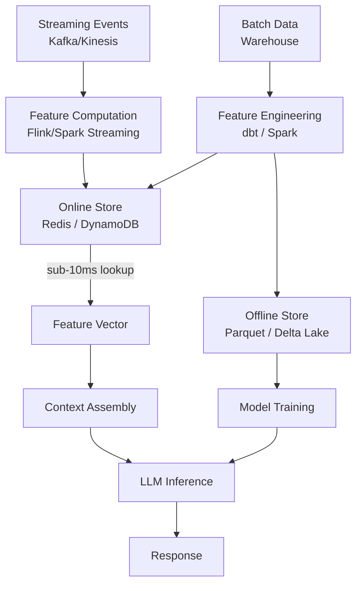

The stale feature problem is subtle until it bites. Your AI system recommends products based on a user's purchase history — but that history is loaded from a batch pipeline that runs nightly. The user just bought something 20 minutes ago. The recommendation engine doesn't know. The recommendation is wrong in a way that's technically correct but practically useless.

Real-time feature stores solve this. They sit between your streaming data and your inference layer, serving fresh feature values in milliseconds. When your LLM-augmented system needs to know the user's current context — recent clicks, active session state, live account balance — the feature store has it ready without a database query.



## What a feature store actually is

A feature store has two halves that serve different purposes.

The **online store** is a low-latency key-value database (Redis, DynamoDB, Bigtable) that stores the most recent value of each feature for each entity. Lookups take 1-5ms. This is what your inference pipeline hits at request time.

The **offline store** is a columnar data warehouse (Delta Lake, Parquet on S3, BigQuery) that stores historical feature values with point-in-time correctness. This is what your model training pipeline reads from.

The coupling between them matters: a feature defined once should be served from both stores without duplicating logic. Feature stores enforce this single definition.

## Where AI inference needs fresh features

Real-time features matter most when your AI system personalizes based on recent behavior:

- **Recommendation systems**: what did the user view in the last 30 minutes? What did they just add to cart? This context changes the recommendation more than demographic data.
- **Fraud detection**: how many transactions has this account made in the last hour? What's the velocity compared to historical baseline? Stale aggregates miss fraud patterns.
- **Customer support AI**: what is the customer's current subscription tier? Did they submit a ticket in the last 24 hours? Did their last order ship? This context shapes the appropriate response.
- **Dynamic pricing AI**: what is current inventory? What is the real-time demand signal? These features change by the minute.

Without a feature store, each of these requires a live database query at inference time, adding 50-200ms latency and coupling your inference service to your operational database.

## Point-in-time correctness

The offline store's most important property is point-in-time correctness: when you train a model on historical data, the feature values used in training must be the values that were actually available at prediction time, not values that were updated after the fact.

Without this, your training data leaks future information. A model trained with "leaked" features performs well in backtesting and poorly in production — a training-serving skew that's hard to debug.

Feature stores enforce this by timestamping every feature write. The offline store lookup for a historical event at timestamp `T` returns the feature values that existed at time `T`, not their current values.

```python
from datetime import datetime
import feast

store = feast.FeatureStore(repo_path=".")

# Point-in-time correct feature retrieval for training
training_df = store.get_historical_features(
    entity_df=entity_df_with_timestamps,  # Each row has an event_timestamp
    features=[
        "user_stats:total_purchases_30d",
        "user_stats:last_purchase_category",
        "user_stats:session_count_7d",
    ],
).to_df()

# Online feature retrieval for inference
online_features = store.get_online_features(
    features=[
        "user_stats:total_purchases_30d",
        "user_stats:last_purchase_category",
        "user_stats:session_count_7d",
    ],
    entity_rows=[{"user_id": "u_12345"}],
).to_dict()
```

The same feature definition, the same feature names, two paths — one for training, one for inference. This is training-serving symmetry, and it eliminates training-serving skew.

## Real-time feature computation

Features that change faster than your batch pipeline can refresh need real-time computation. The pattern: consume from a Kafka topic, compute aggregations in a streaming framework, write results to the online store.

```python
# Faust stream processor for real-time feature computation
import faust
import redis

app = faust.App("feature-processor", broker="kafka://localhost:9092")
r = redis.Redis()

purchases_topic = app.topic("user_purchases", value_type=dict)

@app.agent(purchases_topic)
async def compute_purchase_features(purchases):
    async for purchase in purchases:
        user_id = purchase["user_id"]
        
        # Increment rolling 1-hour purchase count
        key = f"user:{user_id}:purchases_1h"
        pipe = r.pipeline()
        pipe.incr(key)
        pipe.expire(key, 3600)  # TTL = 1 hour window
        pipe.execute()
        
        # Update last purchase category
        r.setex(
            f"user:{user_id}:last_category",
            86400,  # 24 hour TTL
            purchase["category"]
        )
```

This runs continuously. By the time the inference service asks for `purchases_1h`, the value is already in Redis, updated within seconds of the purchase event.

## Wiring features into LLM context

The integration with LLM inference is straightforward: retrieve features, format them into the context, call the model.

```python
import anthropic
import redis
import json

client = anthropic.Anthropic()
r = redis.Redis()

def get_user_features(user_id: str) -> dict:
    pipe = r.pipeline()
    pipe.get(f"user:{user_id}:purchases_1h")
    pipe.get(f"user:{user_id}:last_category")
    pipe.get(f"user:{user_id}:session_count_today")
    results = pipe.execute()
    
    return {
        "purchases_last_hour": int(results[0] or 0),
        "last_purchase_category": (results[1] or b"").decode(),
        "sessions_today": int(results[2] or 0),
    }

def ai_response_with_context(user_id: str, user_message: str) -> str:
    # Feature retrieval: ~2-5ms
    features = get_user_features(user_id)
    
    system_prompt = f"""You are a customer support assistant.

User context (current, real-time):
- Purchases in the last hour: {features['purchases_last_hour']}
- Last purchase category: {features['last_purchase_category'] or 'none'}
- Sessions today: {features['sessions_today']}

Use this context to give personalized, relevant assistance."""

    response = client.messages.create(
        model="claude-sonnet-4-6",
        max_tokens=512,
        system=system_prompt,
        messages=[{"role": "user", "content": user_message}]
    )
    return response.content[0].text
```

The feature retrieval adds 2-5ms to the request latency. For an LLM call that takes 500ms-2s, this overhead is negligible and the personalization improvement is substantial.

## Feature store options

**Feast** (open source, Python-native): the reference OSS implementation. Supports Redis, DynamoDB, Bigtable online; BigQuery, Snowflake, Delta Lake offline. Requires self-hosting and operational management. Best choice if you want full control and already operate the underlying infrastructure.

**Tecton** (managed): production-grade managed service built around Feast's model. Adds streaming feature pipelines, monitoring, and enterprise access control. Expensive but reduces operational burden significantly.

**Hopsworks** (OSS with managed option): strong on the ML platform side — integrated feature store, model registry, and experiment tracking. Good for teams that want a unified MLOps platform.

**Redis alone** (no feature store): viable for simple cases where you control feature computation yourself and don't need the offline store or point-in-time correctness. Fine for small teams; accumulates tech debt as feature count grows.

## The latency budget

Design the latency budget explicitly when adding a feature store to an AI inference path:

| Component | Target P50 | Target P99 |
|-----------|-----------|-----------|
| Feature retrieval (Redis) | 2ms | 8ms |
| Context assembly | 1ms | 3ms |
| LLM inference (streaming) | 500ms TTFT | 2s TTFT |
| **Total to first token** | **~503ms** | **~2.01s** |

Feature retrieval at these latencies does not meaningfully impact the user experience — the LLM inference dominates. The feature store is free in the latency budget.

The cost side: Redis at the scale needed for most AI feature stores (sub-1M entities, sub-100 features) costs $50-500/month on a managed Redis service. This is negligible against LLM inference costs.

> The signal that you need a feature store: your AI system is making calls to your operational database at inference time, or you're seeing training-serving skew and can't explain why. Both are solved by the same tool.
{: .prompt-tip }

Real-time feature stores are infrastructure that pays for itself. The alternative — stale batch features or live database queries at inference time — costs either personalization quality or database load. The feature store is the right abstraction, and integrating it with LLM inference is straightforward once the store is in place.
