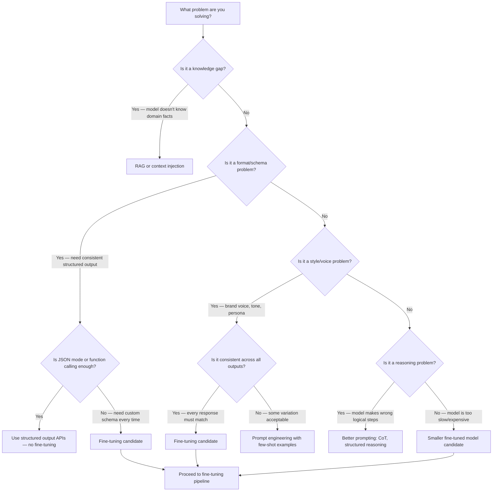

In 2024, the conventional wisdom was: use prompt engineering first, fine-tune if prompting can't get you there. That advice was reasonable then. In 2026, it's still mostly right, but the "if prompting can't get you there" threshold has moved so far that a decision that would have required fine-tuning two years ago is now a prompt engineering problem. Most teams haven't updated their mental model. They're spending weeks on fine-tuning runs for problems that a well-structured system prompt and a 200K context window would solve in an afternoon.



## What Prompt Engineering Actually Covers in 2026

The 200K context window changed the arithmetic. In 2024, fitting a meaningful number of few-shot examples into a prompt was genuinely constrained. Today, you can put 50 detailed examples in a system prompt without breaking a sweat. This matters because most "fine-tuning for style" problems are actually "I need consistent few-shot examples" problems.

Prompt caching makes this economical. On Claude and similar models, a cached prefix costs 10% of the normal input token price. A 20,000-token system prompt with 40 high-quality examples gets cached after the first request and costs almost nothing on subsequent calls. The economics that made fine-tuning attractive for reducing prompt size have weakened significantly.

What prompt engineering handles well in 2026:

**Factual knowledge**: If the model doesn't know something, you add it to context — either directly in the system prompt or via RAG. Fine-tuning does not reliably inject factual knowledge into a model. This is well-documented: fine-tuned models hallucinate facts from their training data when the underlying weights don't actually encode those facts reliably. If your team is fine-tuning to make a model "know" your internal product catalog, you're solving the wrong problem.

**Flexibility**: A fine-tuned model is optimized for a specific distribution of inputs and outputs. When your requirements shift — new output format, new task type — you retrain. A well-engineered prompt you update in minutes. For anything with evolving requirements, prompt engineering's edit-test-deploy cycle is faster by an order of magnitude.

**Reasoning quality**: If your model makes logical errors, fine-tuning on examples of correct reasoning sometimes helps but often just masks the problem. Chain-of-thought prompting, structured reasoning scaffolds, and model selection are the real levers here.

## Where Fine-Tuning Still Wins

Fine-tuning's value proposition has narrowed, but it hasn't disappeared. There are two cases where it's genuinely the right tool.

**Consistent output format and schema**: If every single response needs to conform to a specific structure — a particular JSON schema, a specific report template, a proprietary data format — and the base model's structured output APIs don't quite fit, fine-tuning delivers consistency that prompt engineering can't fully match. The model internalizes the format rather than following instructions, which means fewer edge cases where the format breaks.

**Brand voice and specialized vocabulary**: If your application needs a specific, consistent tone — a legal firm's formal register, a technical domain's precise terminology, a product's distinctive voice — fine-tuning can bake that into the model weights. The key word is *consistent*. If you need some variation (formal for some users, casual for others), that's a prompt engineering problem.

**Latency-sensitive structured output at high volume**: A fine-tuned model that produces a specific output format can be smaller and faster than a large general model following format instructions. At high inference volume, this translates to real cost and latency differences.

## A Worked Example: The Case That Looks Like Fine-Tuning But Isn't

A common enterprise use case: a company wants to generate customer support responses that match their tone and always include specific sections (acknowledgment, solution, next steps). The team's first instinct is fine-tuning because "we need consistent format and tone."

Before reaching for the training infrastructure, try this:

```python
SYSTEM_PROMPT = """You are a customer support specialist for Acme Corp.

TONE GUIDELINES:
- Warm but professional — empathetic without being informal
- Use "we" when referring to the company, "you" for the customer
- Never say "unfortunately" — use "here's what we can do instead"
- Avoid passive voice

REQUIRED RESPONSE STRUCTURE:
1. Acknowledgment (1-2 sentences — name the specific issue)
2. Solution or next step (be concrete, include timelines if known)
3. What to do if this doesn't resolve it (escalation path)

EXAMPLES:
[40 high-quality examples follow]
"""
```

With 40 carefully selected examples covering the range of support scenarios, a 200K-context model will produce responses that match this format and tone as reliably as a fine-tuned model for most use cases — with the ability to update the guidelines in minutes rather than running a new training job.

Fine-tuning makes sense for this problem only when: the output format is so complex that instruction-following breaks down despite good examples; inference volume is high enough that context window costs matter; or the response quality in edge cases is meaningfully better after fine-tuning (which you can only know by running a proper evaluation).

## A Case Where Fine-Tuning Genuinely Wins

A healthcare company needs to extract structured data from clinical notes and output it in a proprietary JSON schema with 30+ fields, many with domain-specific enumerated values the base model doesn't recognize (custom ICD-10 extensions, internal procedure codes). The extraction task is the same every time, the schema is fixed, and accuracy on the schema is critical.

Here the context-heavy prompting approach has real limits: the schema itself is large, the enumerated values are obscure, and the model makes systematic errors on the custom codes even with examples. A fine-tuned model trained on 2,000 high-quality extraction examples with the correct field values will outperform the prompted approach on this specific task — and can be a smaller, faster model since the task is well-defined.

The decision criteria: narrow task, fixed schema, domain vocabulary the base model doesn't know, high volume, accuracy requirements the base model can't meet with prompting alone.

## The Decision Framework in Practice

Run through these questions in order before touching a training pipeline:

1. **Is it a knowledge problem?** Add context or build RAG. Fine-tuning won't fix it reliably.
2. **Does structured output API solve the format problem?** Use it. It's faster, more reliable, and zero operational overhead.
3. **Can 20-40 good few-shot examples in the system prompt solve the style/format problem?** Test it first. You'll know in two hours whether it works.
4. **Does the model still fail on format or style after good prompting?** Now consider fine-tuning.
5. **Is inference volume high enough that a smaller fine-tuned model changes the cost equation?** Factor this in.

The real cost of premature fine-tuning isn't the training compute — it's the data pipeline you build, the evaluation harness you need, the retraining cycle every time requirements change, and the operational complexity of managing model artifacts. That overhead is worth it when fine-tuning solves a problem that prompting can't. It's expensive waste when prompting would have worked.

Most teams in 2026 should be reaching for the fine-tuning toolkit less, not more. The tools for prompt engineering — long contexts, prompt caching, structured output APIs, chain-of-thought — have gotten substantially better. Use them first.
