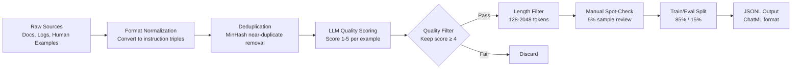

Ask any team that has run a fine-tuning project where the time actually went. It wasn't training. Training runs in the background while you do other things. The time went into finding examples, cleaning them, realizing half were garbage, throwing them out, generating more, arguing about quality criteria, and then doing it all over again when you saw what the model was learning. Data preparation is the project. Training is just compute.

Most guides skip this. They show you the training script and assume you already have a perfect JSONL file ready to go. You don't. Nobody does. Here's how to build one that produces a model you'd actually trust.



## The Instruction Dataset Format

Every example in your dataset is a triple: system prompt + user input + expected output. This maps directly to the ChatML format that most modern models use for fine-tuning:

```jsonc
{
  "messages": [
    {
      "role": "system",
      "content": "You are a technical support assistant for Acme Cloud Platform. Extract structured incident data from support tickets. Output valid JSON only."
    },
    {
      "role": "user",
      "content": "Ticket #4821: Customer reports intermittent 503 errors on the /api/orders endpoint starting around 14:30 UTC. Errors spike every 20 minutes. They're on the Pro plan, running in us-east-1. Load balancer logs show no upstream failures."
    },
    {
      "role": "assistant",
      "content": "{\"ticket_id\": \"4821\", \"severity\": \"medium\", \"category\": \"availability\", \"endpoint\": \"/api/orders\", \"error_code\": 503, \"start_time\": \"14:30 UTC\", \"pattern\": \"intermittent_periodic\", \"interval_minutes\": 20, \"region\": \"us-east-1\", \"plan\": \"pro\", \"upstream_failure\": false}"
    }
  ]
}
```

Every example should have a consistent system prompt — the same one you'll use at inference time. If your system prompt changes between training examples, the model learns to ignore it.

## Data Sources and Their Trade-offs

**Manual curation** is the gold standard and the most expensive. A human writes or selects examples that represent exactly the behavior you want. At 500 examples this is feasible. At 5,000 it's a significant labor cost. Reserve manual curation for your hardest examples and the cases where other methods produce bad output.

**Distillation from a larger model** means using GPT-4, Claude Opus, or another frontier model to generate examples by giving it your prompts and collecting its responses. This works well for style and format tasks. The risk is inheriting the larger model's errors and quirks — if the teacher model gets something wrong, your fine-tuned model learns to get it wrong consistently. Always evaluate distilled examples before using them.

**Synthetic generation** involves programmatically creating inputs and outputs from templates or rules. Good for structured tasks where you can define correctness precisely (JSON extraction, classification, format conversion). Terrible for open-ended tasks where correctness is hard to define programmatically.

In practice, most datasets are a mix: manually curated examples for the hard cases, distilled examples for the long tail, synthetic examples to cover edge cases.

## Deduplication: Don't Skip It

Near-duplicate examples are a silent killer. If 15% of your dataset is slight paraphrases of the same scenario, the model over-indexes on that scenario. Your model learns to solve that one problem very well and becomes worse at everything else.

MinHash is the standard tool for near-duplicate detection at scale. The implementation is straightforward:

```python
from datasketch import MinHash, MinHashLSH
import json
from pathlib import Path

def text_to_shingles(text: str, k: int = 5) -> set[str]:
    """Convert text to character k-grams for MinHash."""
    text = text.lower().strip()
    return {text[i:i+k] for i in range(len(text) - k + 1)}

def build_minhash(text: str, num_perm: int = 128) -> MinHash:
    m = MinHash(num_perm=num_perm)
    for shingle in text_to_shingles(text):
        m.update(shingle.encode("utf-8"))
    return m

def deduplicate_dataset(
    examples: list[dict],
    threshold: float = 0.85,
    num_perm: int = 128
) -> list[dict]:
    """Remove near-duplicates using MinHash LSH. Returns deduplicated list."""
    lsh = MinHashLSH(threshold=threshold, num_perm=num_perm)
    kept = []

    for i, ex in enumerate(examples):
        # Use user message as the deduplication key
        user_text = next(
            m["content"] for m in ex["messages"] if m["role"] == "user"
        )
        mh = build_minhash(user_text, num_perm)
        key = f"ex_{i}"

        if not lsh.query(mh):
            lsh.insert(key, mh)
            kept.append(ex)

    print(f"Deduplication: {len(examples)} → {len(kept)} examples "
          f"({len(examples) - len(kept)} removed)")
    return kept
```

Run this before anything else. At a 0.85 Jaccard similarity threshold, it catches paraphrases while preserving genuinely different examples.

## LLM Quality Scoring

After deduplication, score every remaining example using an LLM judge. This is the step that separates a mediocre dataset from a good one.

```python
import anthropic
import json

client = anthropic.Anthropic()

JUDGE_PROMPT = """You are evaluating training examples for LLM fine-tuning.

Score this example on a scale of 1-5:
5 — Perfect: Clear input, correct and complete output, demonstrates exactly the target behavior
4 — Good: Minor issues (slightly verbose, small formatting inconsistency), but correct and usable
3 — Acceptable: Correct behavior but has meaningful issues (incomplete output, ambiguous input)
2 — Poor: Incorrect, misleading, or poorly formatted — would teach the model bad behavior
1 — Discard: Wrong output, contradicts task requirements, or is a near-duplicate of a better example

Return JSON only: {"score": <1-5>, "reason": "<one sentence>"}

EXAMPLE TO EVALUATE:
<user_message>
{user_message}
</user_message>

<assistant_response>
{assistant_response}
</assistant_response>

Task context: {task_description}"""


def score_example(
    example: dict,
    task_description: str
) -> dict:
    user_msg = next(m["content"] for m in example["messages"] if m["role"] == "user")
    asst_msg = next(m["content"] for m in example["messages"] if m["role"] == "assistant")

    response = client.messages.create(
        model="claude-opus-4-5",
        max_tokens=256,
        messages=[{
            "role": "user",
            "content": JUDGE_PROMPT.format(
                user_message=user_msg,
                assistant_response=asst_msg,
                task_description=task_description
            )
        }]
    )

    result = json.loads(response.content[0].text)
    return {**example, "_score": result["score"], "_reason": result["reason"]}


def filter_by_quality(
    examples: list[dict],
    min_score: int = 4,
    task_description: str = ""
) -> list[dict]:
    scored = [score_example(ex, task_description) for ex in examples]
    kept = [ex for ex in scored if ex["_score"] >= min_score]
    discarded = len(scored) - len(kept)
    print(f"Quality filter: {len(scored)} → {len(kept)} examples ({discarded} discarded)")
    return kept
```

The min_score=4 cutoff is deliberately strict. A 3/5 example with "acceptable" quality still teaches the model mediocre behavior. You want examples the model should emulate, not examples that are merely not wrong.

## The Output Pipeline

Putting it together into a complete pipeline:

```python
def build_dataset(
    raw_examples: list[dict],
    task_description: str,
    output_path: str,
    eval_fraction: float = 0.15
) -> tuple[str, str]:
    """Full pipeline: raw examples → train/eval JSONL files."""
    import random
    from pathlib import Path

    # 1. Deduplicate
    examples = deduplicate_dataset(raw_examples)

    # 2. Quality score and filter
    examples = filter_by_quality(examples, min_score=4, task_description=task_description)

    # 3. Length filter (remove examples outside 128-2048 token range)
    # Approximate: 1 token ≈ 4 chars
    examples = [
        ex for ex in examples
        if 512 <= sum(len(m["content"]) for m in ex["messages"]) <= 8192
    ]

    # 4. Strip internal scoring metadata before writing
    for ex in examples:
        ex.pop("_score", None)
        ex.pop("_reason", None)

    # 5. Shuffle and split
    random.shuffle(examples)
    split_idx = int(len(examples) * (1 - eval_fraction))
    train_examples = examples[:split_idx]
    eval_examples = examples[split_idx:]

    # 6. Write JSONL
    base = Path(output_path)
    train_path = str(base.parent / f"{base.stem}_train.jsonl")
    eval_path = str(base.parent / f"{base.stem}_eval.jsonl")

    for path, data in [(train_path, train_examples), (eval_path, eval_examples)]:
        with open(path, "w") as f:
            for ex in data:
                f.write(json.dumps(ex) + "\n")

    print(f"Dataset ready: {len(train_examples)} train, {len(eval_examples)} eval")
    return train_path, eval_path
```

## Dataset Size vs Quality

The number everyone asks about: how many examples do I need?

The honest answer is: it depends on task complexity and example quality. What the research and practical experience consistently show is that quality dominates quantity. 500 examples scored 4-5/5 will produce a better fine-tuned model than 5,000 examples scored 3/5.

For a well-defined, narrow task (JSON extraction, format conversion, classification), 500-1,000 high-quality examples is enough to see real improvement over the base model. For broader behavior changes (tone, style across a wide range of inputs), you may need 2,000-5,000. Fine-tuning for a task the base model has almost no exposure to may require more — but at that point, question whether fine-tuning is the right approach.

Always hold out 15% for evaluation. Always. If you evaluate on your training data, you will convince yourself the model is much better than it is, ship it, and learn the truth from your users.
