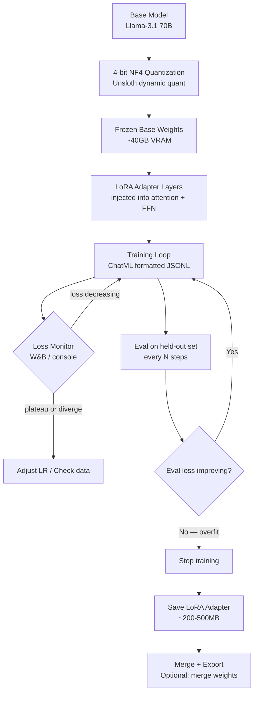

QLoRA was the technique that made large model fine-tuning accessible to teams without a rack of A100s. The idea is straightforward: quantize the base model to 4-bit precision to reduce VRAM requirements, then train only a small set of low-rank adapter matrices rather than the full model weights. A 70B model that would require ~140GB of VRAM for full fine-tuning fits in ~40GB with QLoRA. One H100 80GB can handle it.

Unsloth pushes this further. Custom Triton/CUDA kernels, manual gradient checkpointing implementations, and dynamic 4-bit quantization combine to deliver 2-5x faster training and about 70% less VRAM versus the naive QLoRA implementation in Hugging Face's PEFT library. For a 70B model on a single H100, this difference is the line between feasible and infeasible.



## Environment Setup

Start with a clean environment. Unsloth's installation is specific about CUDA version and torch version — mixing these is the most common source of cryptic errors.

```bash
# Create isolated environment
conda create -n unsloth-ft python=3.11 -y
conda activate unsloth-ft

# Install PyTorch with CUDA 12.1 (match your driver version)
pip install torch==2.3.0 torchvision torchaudio --index-url https://download.pytorch.org/whl/cu121

# Install Unsloth (auto-detects CUDA version)
pip install "unsloth[colab-new] @ git+https://github.com/unslothai/unsloth.git"

# Supporting libraries
pip install transformers datasets trl peft accelerate bitsandbytes
pip install wandb  # for experiment tracking
```

Verify VRAM before you start. A 70B model in 4-bit needs ~38-42GB, leaving 38-42GB for activations, gradients, and optimizer state at a reasonable batch size.

```python
import torch
print(f"CUDA available: {torch.cuda.is_available()}")
print(f"GPU: {torch.cuda.get_device_name(0)}")
print(f"VRAM: {torch.cuda.get_device_properties(0).total_memory / 1e9:.1f} GB")
```

## Loading the Model with Unsloth

```python
from unsloth import FastLanguageModel

model, tokenizer = FastLanguageModel.from_pretrained(
    model_name="meta-llama/Meta-Llama-3.1-70B-Instruct",
    max_seq_length=4096,      # Set to your longest expected sequence
    dtype=None,                # None = auto-detect (bfloat16 on Ampere+)
    load_in_4bit=True,         # QLoRA: quantize base model to 4-bit
    # token="hf_...",          # HuggingFace token if model is gated
)
```

## Configuring LoRA

The LoRA configuration is where most of the tuning happens.

```python
model = FastLanguageModel.get_peft_model(
    model,
    r=16,                    # LoRA rank: 8-64, start here
    target_modules=[
        "q_proj", "k_proj", "v_proj", "o_proj",   # Attention projections
        "gate_proj", "up_proj", "down_proj",        # FFN (MLP) layers
    ],
    lora_alpha=32,           # Scaling factor: typically 2x rank
    lora_dropout=0.05,       # Small dropout for regularization
    bias="none",             # Bias training: "none" is standard
    use_gradient_checkpointing="unsloth",  # Unsloth's optimized checkpointing
    random_state=42,
    use_rslora=False,        # Rank-stabilized LoRA: useful at high ranks
    loftq_config=None,
)
```

**On rank selection**: Rank controls how many parameters the adapter introduces. At rank 16, with the target modules above, you're training roughly 200M parameters on a 70B model — about 0.3% of total weights. This is usually enough for format and style adaptation. For more significant behavior changes, try rank 32-64. Higher rank means higher capacity, but also more risk of overfitting and longer training time.

**On target_modules**: Including only attention layers (q_proj, k_proj, v_proj, o_proj) is the conservative choice. Adding FFN layers (gate_proj, up_proj, down_proj) increases capacity and training time. For most fine-tuning tasks, attention-only is a reasonable starting point.

## Dataset Preparation

Unsloth expects ChatML-formatted data. The TRL library's `SFTTrainer` handles tokenization if you pass properly formatted conversations:

```python
from datasets import load_dataset

# Assuming your JSONL has {"messages": [...]} structure
dataset = load_dataset("json", data_files={
    "train": "data/train.jsonl",
    "validation": "data/eval.jsonl"
})

def format_chat(example):
    """Apply ChatML template to messages list."""
    return {
        "text": tokenizer.apply_chat_template(
            example["messages"],
            tokenize=False,
            add_generation_prompt=False
        )
    }

dataset = dataset.map(format_chat, remove_columns=dataset["train"].column_names)
```

## Training Configuration

```python
from trl import SFTTrainer
from transformers import TrainingArguments
import wandb

wandb.init(project="llama-70b-finetune", name="run-001")

training_args = TrainingArguments(
    output_dir="./checkpoints",
    per_device_train_batch_size=1,     # 1 sample per GPU; use grad accum for effective batch
    gradient_accumulation_steps=8,     # Effective batch size = 8
    warmup_ratio=0.05,                 # 5% of steps for warmup
    num_train_epochs=3,                # 3 epochs is a safe starting point
    learning_rate=2e-4,                # Standard for LoRA fine-tuning
    fp16=False,
    bf16=True,                         # bfloat16 on H100
    logging_steps=10,
    evaluation_strategy="steps",
    eval_steps=50,                     # Eval every 50 steps
    save_strategy="steps",
    save_steps=100,
    load_best_model_at_end=True,
    metric_for_best_model="eval_loss",
    optim="adamw_8bit",                # 8-bit optimizer: saves VRAM
    weight_decay=0.01,
    lr_scheduler_type="cosine",
    seed=42,
    report_to="wandb",
)

trainer = SFTTrainer(
    model=model,
    tokenizer=tokenizer,
    train_dataset=dataset["train"],
    eval_dataset=dataset["validation"],
    dataset_text_field="text",
    max_seq_length=4096,
    dataset_num_proc=4,
    args=training_args,
)

trainer.train()
```

## Saving the Adapter

```python
# Save only the LoRA adapter weights (~200-500MB, not the full model)
model.save_pretrained("./lora-adapter")
tokenizer.save_pretrained("./lora-adapter")

# Optional: merge LoRA weights into base model for faster inference
# (eliminates adapter switching overhead; do this for production deployments)
model_merged = model.merge_and_unload()
model_merged.save_pretrained("./merged-model", safe_serialization=True)
```

## The Pitfalls That Will Bite You

**Catastrophic forgetting**: If your learning rate is too high (>5e-4) or you train for too many epochs on a small dataset, the model forgets its general capabilities while learning your specific task. Monitor eval loss on a test set that includes general-purpose examples, not just your task examples. If general capability degrades, reduce the learning rate or add more diverse training data.

**Target modules mismatch**: Different model architectures use different names for their projection layers. Llama uses q_proj/k_proj/v_proj/o_proj. Mistral is similar. Qwen uses attn.c_attn. Always check the model's architecture before setting target_modules — an incorrect module name silently trains zero parameters.

```python
# Print all trainable parameter names to verify
for name, param in model.named_parameters():
    if param.requires_grad:
        print(name)
```

**Overfitting on small datasets**: If eval loss starts increasing while train loss keeps decreasing, you're overfitting. Stop training at the checkpoint with the best eval loss. This is why `load_best_model_at_end=True` matters.

**Max sequence length**: Set `max_seq_length` to the 95th percentile of your actual sequence lengths, not the maximum. Padding every sequence to max length wastes VRAM and slows training significantly. Check your distribution first:

```python
lengths = [len(tokenizer.encode(ex["text"])) for ex in dataset["train"]]
import numpy as np
print(f"p50: {np.percentile(lengths, 50):.0f}, p95: {np.percentile(lengths, 95):.0f}, max: {max(lengths)}")
```

A 70B model fine-tuned with careful data preparation, rank-16 LoRA, and 3 epochs at 2e-4 learning rate is a good baseline. Expect training time of 4-8 hours for 1,000 examples on a single H100. Track loss curves in W&B and stop early if eval loss plateaus — more steps are not always better.
