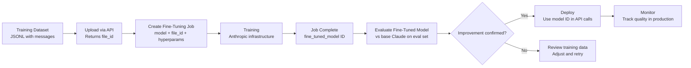

Running your own fine-tuning infrastructure is a meaningful operational commitment. You need GPU nodes, storage for model artifacts, a training orchestration layer, a model serving stack, and the engineering time to keep it all running. For teams that don't already have this, adding it for a single fine-tuning use case is often the wrong trade-off. Anthropic's fine-tuning API is the alternative: submit a dataset, get back a model ID, use it the same way you use the base Claude API. No training infrastructure, no adapter management, no serving stack.

The trade-off is real cost and less control. This post covers what the API offers, where it fits, and what the workflow actually looks like end to end.



## When to Use Anthropic Fine-Tuning vs OSS QLoRA

The decision comes down to three factors: operational complexity tolerance, inference volume, and data residency requirements.

**Choose Anthropic's fine-tuning API when:**
- Your team doesn't have ML infra and isn't building it for one use case
- You want Claude's safety training preserved and guaranteed
- You're iterating quickly and need fast experiment cycles
- Inference volume is moderate (not millions of requests per day)
- Per-token cost increase is acceptable for your margins

**Choose OSS fine-tuning (QLoRA on your infrastructure) when:**
- Inference volume is high enough that the per-token cost difference matters significantly
- Your training data cannot leave your infrastructure (compliance, data residency)
- You need model portability (deploy on-premises, air-gapped, to specific regions)
- You already have the ML serving infrastructure and want full control over the stack

There's no universal right answer. A team building an internal enterprise tool on moderate volume should strongly consider the Anthropic API. A team running millions of API calls per day to extract structured data from documents should probably model the full cost over 12 months before choosing.

## Dataset Format

Anthropic's fine-tuning API uses the same messages format as the inference API:

```jsonl
{"messages": [{"role": "user", "content": "Extract key entities from: 'Acme Corp signed a $2M contract with Beta Inc on March 15, 2026, for cloud infrastructure services.'"}, {"role": "assistant", "content": "{\"parties\": [\"Acme Corp\", \"Beta Inc\"], \"value\": \"$2M\", \"date\": \"2026-03-15\", \"service\": \"cloud infrastructure services\"}"}]}
{"messages": [{"role": "user", "content": "Extract key entities from: 'The merger between Delta Systems and Gamma Solutions, valued at $450M, was announced by CEO Sarah Chen on April 2nd.'"}, {"role": "assistant", "content": "{\"parties\": [\"Delta Systems\", \"Gamma Solutions\"], \"value\": \"$450M\", \"date\": \"April 2nd\", \"event\": \"merger\", \"spokesperson\": \"Sarah Chen, CEO\"}"}]}
```

You can include a system prompt by adding it as the first message with `"role": "system"`. If your system prompt is consistent across all training examples (which it should be), include it in every example:

```python
def format_for_anthropic_ft(
    system_prompt: str,
    user_input: str,
    expected_output: str
) -> dict:
    return {
        "messages": [
            {"role": "user", "content": user_input},
            {"role": "assistant", "content": expected_output}
        ]
    }
    # Note: Pass system prompt separately when creating the fine-tuning job,
    # or include in training messages depending on API version
```

Consult the current API documentation for whether system prompts are included in message arrays or specified as a separate job parameter — this has changed across API versions.

## The Full Fine-Tuning Workflow

```python
import anthropic
import json
from pathlib import Path
import time

client = anthropic.Anthropic()  # Uses ANTHROPIC_API_KEY env var

# Step 1: Upload training file
def upload_training_file(jsonl_path: str) -> str:
    """Upload JSONL dataset and return file ID."""
    with open(jsonl_path, "rb") as f:
        response = client.beta.files.upload(
            file=(Path(jsonl_path).name, f, "application/jsonl"),
        )
    file_id = response.id
    print(f"Uploaded training file: {file_id}")
    return file_id

# Step 2: Create fine-tuning job
def create_fine_tuning_job(
    file_id: str,
    model: str = "claude-haiku-4-5",  # Check current supported models
    suffix: str = "entity-extractor",
    n_epochs: int = 3,
) -> str:
    """Create a fine-tuning job and return the job ID."""
    job = client.beta.fine_tuning.jobs.create(
        model=model,
        training_file=file_id,
        hyperparameters={
            "n_epochs": n_epochs,
        },
        suffix=suffix,  # Appended to the fine-tuned model name
    )
    print(f"Created fine-tuning job: {job.id}")
    print(f"Status: {job.status}")
    return job.id

# Step 3: Poll for completion
def wait_for_job(job_id: str, poll_interval: int = 60) -> str:
    """Poll job status until complete. Returns fine-tuned model ID."""
    while True:
        job = client.beta.fine_tuning.jobs.retrieve(job_id)
        print(f"Status: {job.status} | "
              f"Trained tokens: {getattr(job, 'trained_tokens', 'N/A')}")

        if job.status == "succeeded":
            model_id = job.fine_tuned_model
            print(f"Fine-tuning complete. Model ID: {model_id}")
            return model_id
        elif job.status in ("failed", "cancelled"):
            raise RuntimeError(
                f"Fine-tuning job {job_id} {job.status}: {getattr(job, 'error', 'unknown error')}"
            )
        time.sleep(poll_interval)

# Step 4: Evaluate the fine-tuned model
def evaluate_model(
    model_id: str,
    eval_examples: list[dict],
    system_prompt: str
) -> dict:
    """Run eval set through the fine-tuned model. Returns basic metrics."""
    results = []
    for ex in eval_examples:
        user_msg = next(m["content"] for m in ex["messages"] if m["role"] == "user")
        expected = next(m["content"] for m in ex["messages"] if m["role"] == "assistant")

        response = client.messages.create(
            model=model_id,
            max_tokens=1024,
            system=system_prompt,
            messages=[{"role": "user", "content": user_msg}]
        )
        actual = response.content[0].text

        # For JSON output tasks: check valid JSON + key fields match
        try:
            expected_parsed = json.loads(expected)
            actual_parsed = json.loads(actual)
            format_correct = True
            # Field overlap as a simple content metric
            expected_keys = set(expected_parsed.keys())
            actual_keys = set(actual_parsed.keys())
            key_match = len(expected_keys & actual_keys) / len(expected_keys) if expected_keys else 0
        except json.JSONDecodeError:
            format_correct = False
            key_match = 0.0

        results.append({
            "format_correct": format_correct,
            "key_match": key_match
        })

    format_rate = sum(r["format_correct"] for r in results) / len(results)
    avg_key_match = sum(r["key_match"] for r in results) / len(results)
    print(f"Eval results — Format correct: {format_rate:.1%}, Key match: {avg_key_match:.1%}")
    return {"format_rate": format_rate, "avg_key_match": avg_key_match}

# Full workflow
if __name__ == "__main__":
    file_id = upload_training_file("data/train.jsonl")
    job_id = create_fine_tuning_job(file_id, suffix="entity-v1")
    model_id = wait_for_job(job_id)

    eval_data = [json.loads(line) for line in open("data/eval.jsonl")]
    system = "Extract structured entities from text. Output valid JSON only."
    evaluate_model(model_id, eval_data, system)

    print(f"\nUse in production: model='{model_id}'")
```

## Comparing Against Base Claude Before Committing

This step is mandatory and most teams skip it. A fine-tuned model that looks good in isolation might be worse than base Claude on your eval set, or only marginally better in ways that don't justify the cost. Always run your evaluation against both:

```python
base_metrics = evaluate_model("claude-haiku-4-5", eval_data, system)
ft_metrics = evaluate_model(fine_tuned_model_id, eval_data, system)

print(f"Format correct — base: {base_metrics['format_rate']:.1%}, "
      f"fine-tuned: {ft_metrics['format_rate']:.1%}")
print(f"Key match — base: {base_metrics['avg_key_match']:.1%}, "
      f"fine-tuned: {ft_metrics['avg_key_match']:.1%}")
```

If the improvement is less than 5-10 percentage points on your key metrics, the fine-tuned model probably isn't worth the ongoing per-token premium. Go back and examine your training data quality before running another job.

## Cost Model Reality Check

Fine-tuning costs you in two places: the training job (one-time, per dataset) and ongoing inference (higher per-token rate than the base model). The inference cost difference is where most teams underestimate total cost. Model the inference volume at your expected scale over 6-12 months. If you're calling the model hundreds of thousands of times per day, the per-token premium adds up to real money. That's when the operational overhead of OSS fine-tuning starts looking more attractive than the managed simplicity of the API.

For most enterprise internal tools running at moderate scale — thousands to low tens-of-thousands of calls per day — the API's operational simplicity wins.
