RLHF — Reinforcement Learning from Human Feedback — is what made modern LLMs behave the way they do. It's also the step that's completely impractical for most teams. You need human annotators rating response pairs, a separate reward model trained on those annotations, and a PPO training loop that's notoriously unstable to tune. Anthropic, OpenAI, and Google have teams built around this. You don't.

DPO (Direct Preference Optimization) and GRPO (Group Relative Policy Optimization) offer a path to alignment-style training without the reward model, the PPO instability, or the expensive human annotation pipelines. They're not a drop-in replacement for RLHF — they have real limitations — but for many practical alignment tasks, they're the actual right tool.

```mermaid
flowchart TD
    subgraph RLHF["RLHF (Traditional)"]
        A1[Human Annotators\nRate response pairs] --> B1[Reward Model\nTrained on preferences]
        B1 --> C1[PPO Training Loop\nUnstable, complex]
        C1 --> D1[Aligned Model]
    end

    subgraph DPO["DPO"]
        A2[Preference Pairs\nchosen vs rejected] --> B2[Direct Optimization\nNo reward model needed]
        B2 --> C2[Aligned Model]
    end

    subgraph GRPO["GRPO"]
        A3[Prompts only\nNo labels needed] --> B3[Generate N responses\nper prompt]
        B3 --> C3[Relative ranking\nwithin group]
        C3 --> D3[Aligned Model]
    end

    style RLHF fill:#fee2e2,stroke:#ef4444
    style DPO fill:#dcfce7,stroke:#22c55e
    style GRPO fill:#dbeafe,stroke:#3b82f6
```



## Why RLHF Fails at Team Scale

The reward model is the core problem. Training a good reward model requires thousands of high-quality human preference judgments — pairs of responses where a human has labeled one as clearly better. Getting this data is expensive, slow, and requires careful design to avoid systematic biases (annotators favor longer responses, responses that sound confident, responses from certain demographic perspectives).

Even with good preference data, training a reward model that generalizes beyond its training distribution is hard. Then you're using that imperfect reward model to shape a PPO training loop, where reward hacking (the policy model finds ways to score high on the reward model without actually improving) is a persistent problem.

The RLHF pipeline involves four separate models and training runs: the base model, the supervised fine-tuned (SFT) model, the reward model, and the final RLHF model. Each step introduces failure modes. This is why RLHF at scale requires dedicated teams.

## DPO: Alignment from Preference Pairs

DPO's insight is that you can optimize for human preferences directly without training a separate reward model. The mathematical derivation shows that the RLHF objective — maximize reward while staying close to the reference policy — can be re-expressed as a classification objective over preference pairs.

In practice: you need a dataset of (prompt, chosen_response, rejected_response) triples. You train the model to increase the probability of generating the chosen response relative to the rejected one, with a KL divergence penalty to prevent the model from drifting too far from the reference distribution.

```python
from trl import DPOTrainer, DPOConfig
from transformers import AutoModelForCausalLM, AutoTokenizer
from datasets import Dataset
import torch

# Load your SFT model (fine-tuned base) as the policy model
model = AutoModelForCausalLM.from_pretrained(
    "meta-llama/Meta-Llama-3.1-8B-Instruct",
    torch_dtype=torch.bfloat16,
    device_map="auto"
)
tokenizer = AutoTokenizer.from_pretrained("meta-llama/Meta-Llama-3.1-8B-Instruct")
tokenizer.pad_token = tokenizer.eos_token

# DPO dataset format: prompt + chosen + rejected
# Each field should be the full formatted conversation string
dpo_data = [
    {
        "prompt": "Summarize the following contract clause in plain English: ...",
        "chosen": "This clause means the vendor must deliver within 30 days of purchase order, or face a penalty of 1.5% of contract value per week of delay.",
        "rejected": "This clause pertains to delivery obligations and associated penalties for non-compliance with the specified timeline as outlined in the contract documentation."
    },
    # ... more examples
]

dataset = Dataset.from_list(dpo_data)

# DPO training configuration
dpo_config = DPOConfig(
    output_dir="./dpo-output",
    num_train_epochs=3,
    per_device_train_batch_size=2,
    gradient_accumulation_steps=4,
    learning_rate=5e-7,          # DPO needs lower LR than SFT
    beta=0.1,                    # KL penalty strength: lower = more deviation allowed
    max_length=1024,
    max_prompt_length=512,
    bf16=True,
    logging_steps=10,
    save_strategy="epoch",
    optim="adamw_torch_fused",
)

trainer = DPOTrainer(
    model=model,
    ref_model=None,    # If None, TRL uses a frozen copy of model as reference
    args=dpo_config,
    train_dataset=dataset,
    processing_class=tokenizer,
)

trainer.train()
trainer.save_model("./dpo-aligned-model")
```

**The beta parameter** controls how much the policy can deviate from the reference model. At beta=0.1, the model can change meaningfully toward preferred responses. At beta=0.5, it's more constrained. Start at 0.1 and increase if the model drifts too far from the reference behavior on general tasks.

## Generating Preference Data with LLM Judges

The biggest practical challenge for DPO is getting preference pairs. Human annotation is what DPO was designed to reduce, but you still need labeled pairs. The solution for most teams: use a strong LLM as the judge.

```python
import anthropic
import json

client = anthropic.Anthropic()

JUDGE_SYSTEM = """You are evaluating response quality for a legal document summarization task.
Given a prompt and two responses, determine which is better and explain why.
Criteria: accuracy, clarity, plain language use, and absence of unnecessary legal jargon.
Output JSON: {"winner": "A" or "B", "reason": "<one sentence>"}"""

def generate_preference_pair(
    prompt: str,
    response_a: str,
    response_b: str
) -> dict | None:
    """Use Claude to judge which response is better. Returns DPO-formatted pair or None."""
    judge_response = client.messages.create(
        model="claude-opus-4-5",
        max_tokens=256,
        system=JUDGE_SYSTEM,
        messages=[{
            "role": "user",
            "content": f"Prompt: {prompt}\n\nResponse A: {response_a}\n\nResponse B: {response_b}"
        }]
    )
    result = json.loads(judge_response.content[0].text)

    if result["winner"] == "A":
        chosen, rejected = response_a, response_b
    elif result["winner"] == "B":
        chosen, rejected = response_b, response_a
    else:
        return None  # Skip ties

    return {"prompt": prompt, "chosen": chosen, "rejected": rejected}
```

Generating preference pairs this way introduces the judge model's biases. The judge may systematically prefer longer responses, more hedged language, or other patterns unrelated to actual quality. Spot-check the preference pairs before training.

## GRPO: Alignment Without Preference Labels

GRPO takes a different approach that doesn't require preference pairs at all. For each training prompt, generate a group of N responses. Score them using a verifier (a function that checks correctness). Use the relative scores within the group — rather than absolute reward values — as the training signal.

This makes GRPO natural for tasks where correctness is verifiable: code execution (does the code run and produce the right output?), math (is the answer correct?), structured data extraction (does the JSON match the schema and contain correct values?).

```python
from trl import GRPOTrainer, GRPOConfig
import subprocess
import json

def code_execution_reward(prompts: list[str], completions: list[str], **kwargs) -> list[float]:
    """
    Reward function for code generation: execute the generated code
    and return 1.0 if it produces correct output, 0.0 otherwise.
    Expects completions to contain Python code blocks.
    """
    rewards = []
    for prompt, completion in zip(prompts, completions):
        # Extract code from markdown code block
        if "```python" in completion:
            code = completion.split("```python")[1].split("```")[0].strip()
        else:
            rewards.append(0.0)
            continue

        try:
            # Execute with timeout — never do this in production without sandboxing
            result = subprocess.run(
                ["python", "-c", code],
                capture_output=True, text=True, timeout=10
            )
            # Simple check: exit code 0 and expected output present
            # In practice, parse expected_output from the prompt
            rewards.append(1.0 if result.returncode == 0 else 0.0)
        except subprocess.TimeoutExpired:
            rewards.append(0.0)

    return rewards

grpo_config = GRPOConfig(
    output_dir="./grpo-output",
    num_train_epochs=3,
    per_device_train_batch_size=1,
    gradient_accumulation_steps=8,
    learning_rate=1e-6,
    num_generations=8,    # Generate 8 responses per prompt for group ranking
    max_new_tokens=512,
    bf16=True,
    logging_steps=5,
)

trainer = GRPOTrainer(
    model=model,
    args=grpo_config,
    reward_funcs=[code_execution_reward],
    train_dataset=prompt_dataset,    # Dataset of prompts only (no labels needed)
    processing_class=tokenizer,
)

trainer.train()
```

> **Code execution in training is a security risk.** Never execute untrusted generated code in your training environment without sandboxing. Use containerized execution with network isolation and resource limits. E2B, Modal, or a custom Docker-based sandbox are the right tools here.
{: .prompt-danger }

## What Alignment Training Can't Fix

Both DPO and GRPO adjust the distribution of responses — they make the model more likely to generate preferred outputs and less likely to generate rejected ones. What they cannot do:

**Add knowledge the base model doesn't have.** If the base model doesn't know your internal codebase, your proprietary terminology, or a recent event post-training-cutoff, DPO/GRPO won't fix it. Use RAG for knowledge gaps.

**Fix systematic reasoning errors.** If the model makes wrong logical steps, alignment training on the wrong reasoning is just teaching it to reproduce confident-sounding wrong answers. The base model's reasoning capability is a ceiling that alignment training can't raise.

**Generalize beyond training distribution.** A DPO-aligned model behaves better on inputs similar to its preference training data. On inputs outside that distribution, it may revert to base model behavior or behave unpredictably.

## Practical Guidance

Use **DPO** when: you have real user feedback (thumbs up/down, explicit corrections, A/B test results) that can be converted to preference pairs; you're tuning style, tone, or response quality across a relatively broad task space.

Use **GRPO** when: you have a verifiable correctness criterion (code runs, math answer is right, JSON validates against schema, tool call is syntactically correct); you want to improve a specific measurable task without any labeled preference data.

Use **neither** when: the base model plus good prompting gets you 90% of the way there. Alignment training is expensive to iterate on. Exhaust prompt engineering first.
