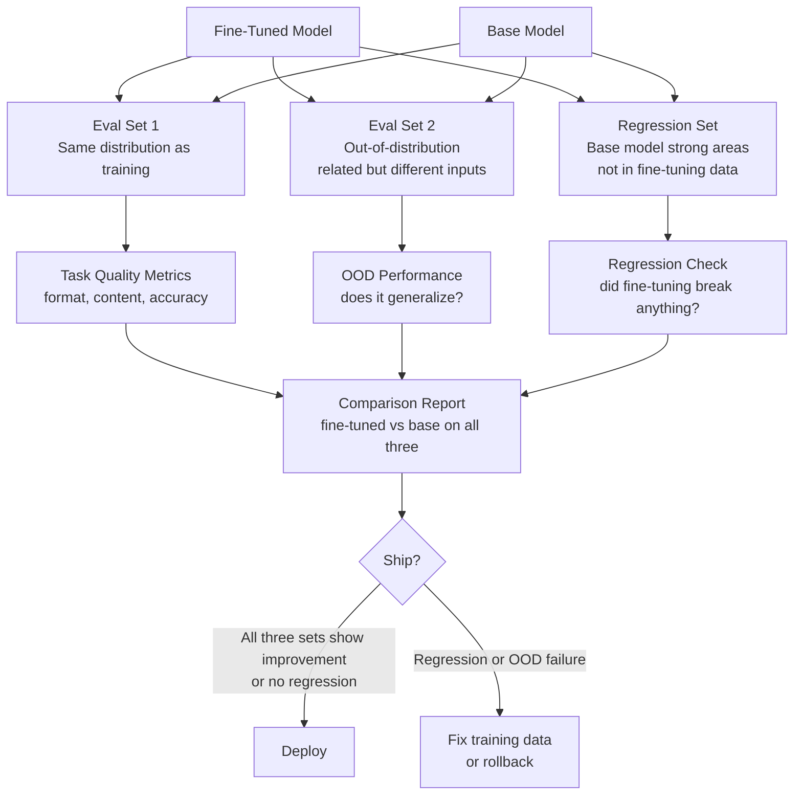

You've trained the model. Loss curves look good. Held-out eval from the training distribution shows a 15% improvement in your target metric. You ship it. Then your users tell you something's wrong — the model is worse at things it used to do, or it fails on inputs that are only slightly different from your eval examples. Fine-tuning didn't improve the model; it specialized it in a way that looked like improvement on the metrics you were measuring.

This is the evaluation problem. Bad evaluation methodology doesn't just give you wrong numbers — it gives you wrong confidence. You ship a model that's worse than the base model in ways you didn't measure, because you only measured what you optimized for.



## The Three-Set Evaluation Stack

A single held-out eval set from the same distribution as your training data only tells you whether the model learned your training task. It doesn't tell you whether it generalized, and it doesn't tell you whether you broke something. You need three sets.

**Set 1 — In-distribution eval**: Same task, same input format as training. This is the standard held-out set (15-20% of your cleaned dataset). It answers: does the model correctly do what it was trained to do? It's necessary but not sufficient.

**Set 2 — Out-of-distribution eval**: Same task, different input format or a related but adjacent task. If you trained on customer support email extraction, your OOD set might be Slack message extraction or phone call transcript extraction. This answers: does the model generalize, or did it memorize the surface features of your training data?

**Set 3 — Regression set**: A sample of prompts the base model handled well, covering areas not in your fine-tuning data. Code generation if you fine-tuned for text tasks. Reasoning problems if you fine-tuned for classification. Open-ended generation if you fine-tuned for structured output. This answers: did fine-tuning break capabilities the base model had?

Building Set 3 takes time upfront, but it's the set that catches the most important failures. Fine-tuning is particularly prone to regression on tasks the model rarely encounters in training — the optimizer pushes the model toward the training distribution and away from its general capabilities.

## Metrics by Task Type

Generic metrics rarely tell you what you need to know. Map your task to the right metric before writing any evaluation code.

**Structured output tasks** (JSON extraction, classification, schema conformance):
- Format correctness: is the output valid JSON / correct format?
- Field accuracy: are the extracted fields correct, not just present?
- Schema compliance: does the output conform to the required schema, including types and enumerations?

**Text generation tasks** (summarization, rewriting, explanation):
- LLM-as-judge quality score: use a frontier model to rate output quality 1-5 against specific criteria
- Reference comparison: ROUGE-L or BERTScore against reference outputs (useful as a complement but not sufficient alone)
- Human eval: for high-stakes tasks, include human spot-checks

**Code generation tasks**:
- Execution success: does the code run without errors?
- Test pass rate: does the code pass a defined test suite?
- Functional correctness: does the output match expected results for a range of inputs?

**Classification tasks**:
- Accuracy, precision, recall, F1 by class — breakdown by class is essential; a model that achieves 90% accuracy by always predicting the majority class is useless

## Separating Format from Content

One of the most common evaluation mistakes: treating format correctness and content correctness as the same thing. They're not, and they can diverge dramatically.

A fine-tuned model trained to produce structured JSON output will usually produce valid JSON. But whether that JSON contains the right values is a separate question the format check doesn't answer.

```python
import json
from anthropic import Anthropic

client = Anthropic()

def evaluate_example(
    model_id: str,
    system_prompt: str,
    user_input: str,
    expected_output: str,
    task_description: str
) -> dict:
    """Evaluate a single example across format and content dimensions."""
    response = client.messages.create(
        model=model_id,
        max_tokens=1024,
        system=system_prompt,
        messages=[{"role": "user", "content": user_input}]
    )
    actual_output = response.content[0].text

    # --- Format check ---
    format_correct = False
    format_error = None
    parsed_output = None
    try:
        parsed_output = json.loads(actual_output)
        format_correct = True
    except json.JSONDecodeError as e:
        format_error = str(e)

    # --- Content check via LLM judge ---
    judge_response = client.messages.create(
        model="claude-opus-4-5",
        max_tokens=256,
        system=f"""You are evaluating AI output quality for: {task_description}
Compare the actual output to the expected output.
Score content accuracy 1-5:
5 = Correct and complete
4 = Mostly correct, minor omissions
3 = Partially correct, meaningful errors
2 = Significantly wrong
1 = Completely wrong or irrelevant
Output JSON only: {{"content_score": <1-5>, "reason": "<one sentence>"}}""",
        messages=[{
            "role": "user",
            "content": f"Expected:\n{expected_output}\n\nActual:\n{actual_output}"
        }]
    )
    judge_result = json.loads(judge_response.content[0].text)

    return {
        "format_correct": format_correct,
        "format_error": format_error,
        "content_score": judge_result["content_score"],
        "content_reason": judge_result["reason"],
        "actual_output": actual_output,
    }


def run_evaluation(
    model_id: str,
    system_prompt: str,
    eval_examples: list[dict],
    task_description: str,
    label: str = "model"
) -> dict:
    """Run full evaluation suite. Returns aggregated metrics."""
    results = []
    for ex in eval_examples:
        user_msg = next(m["content"] for m in ex["messages"] if m["role"] == "user")
        expected = next(m["content"] for m in ex["messages"] if m["role"] == "assistant")
        result = evaluate_example(model_id, system_prompt, user_msg, expected, task_description)
        results.append(result)

    format_rate = sum(r["format_correct"] for r in results) / len(results)
    avg_content = sum(r["content_score"] for r in results) / len(results)
    high_quality_rate = sum(r["content_score"] >= 4 for r in results) / len(results)

    print(f"\n[{label}] Results on {len(results)} examples:")
    print(f"  Format correct:     {format_rate:.1%}")
    print(f"  Avg content score:  {avg_content:.2f}/5.0")
    print(f"  High quality (≥4):  {high_quality_rate:.1%}")

    return {
        "model": model_id,
        "label": label,
        "n": len(results),
        "format_rate": format_rate,
        "avg_content_score": avg_content,
        "high_quality_rate": high_quality_rate,
    }
```

## Always Compare Against Base Model

This one is non-negotiable. Run the same evaluation suite against both the fine-tuned model and the base model it was trained on. Report the delta, not just the fine-tuned model's absolute scores.

```python
SYSTEM_PROMPT = "Extract structured entities from text. Output valid JSON only."
TASK_DESC = "Entity extraction from business documents"

base_results = run_evaluation(
    "claude-haiku-4-5",
    SYSTEM_PROMPT,
    in_dist_eval,
    TASK_DESC,
    label="Base Model (in-dist)"
)

ft_results = run_evaluation(
    fine_tuned_model_id,
    SYSTEM_PROMPT,
    in_dist_eval,
    TASK_DESC,
    label="Fine-Tuned (in-dist)"
)

# Regression check
base_regression = run_evaluation(
    "claude-haiku-4-5",
    SYSTEM_PROMPT,
    regression_eval,
    TASK_DESC,
    label="Base Model (regression)"
)

ft_regression = run_evaluation(
    fine_tuned_model_id,
    SYSTEM_PROMPT,
    regression_eval,
    TASK_DESC,
    label="Fine-Tuned (regression)"
)

# Decision: only ship if fine-tuned wins on task AND doesn't regress significantly
task_improvement = ft_results["high_quality_rate"] - base_results["high_quality_rate"]
regression_delta = ft_regression["avg_content_score"] - base_regression["avg_content_score"]

print(f"\nTask improvement: {task_improvement:+.1%}")
print(f"Regression delta: {regression_delta:+.2f}/5.0")

if task_improvement > 0.05 and regression_delta > -0.3:
    print("Recommendation: Ship — meaningful improvement, acceptable regression")
else:
    print("Recommendation: Do not ship — insufficient improvement or significant regression")
```

## CI Integration: Eval on Every Checkpoint

Evaluating only after training completes is too late. By checkpoint 10, you might already be overfitting, but you won't know until training finishes. Integrate evaluation into your training loop.

In Hugging Face's `Trainer`, use a custom `compute_metrics` function that runs your evaluation suite on the held-out set every N steps. Set `load_best_model_at_end=True` and `metric_for_best_model` to your primary task metric. This gives you early stopping based on actual task performance, not just training loss.

For post-training CI, a GitHub Actions workflow that runs your evaluation script on every merge to main catches regressions when you update the training dataset or hyperparameters:

```yaml
# .github/workflows/model-eval.yml (relevant section)
- name: Run evaluation suite
  run: |
    python eval/run_eval.py \
      --fine-tuned-model ${{ env.FINE_TUNED_MODEL_ID }} \
      --base-model claude-haiku-4-5 \
      --eval-data eval/in_dist.jsonl \
      --regression-data eval/regression.jsonl \
      --min-task-improvement 0.05 \
      --max-regression-delta -0.3 \
      --output eval_results.json
```

Treat the evaluation pipeline as a first-class artifact alongside the model itself. Version your eval sets, commit them to the repo, and track results over time. A model that looks good today might look worse next month after a base model update — you won't know unless you're running the comparison continuously.
