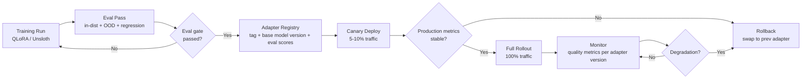

Fine-tuning guides end at `model.save_pretrained()`. That's where the operational work begins. A LoRA adapter is a trained artifact — 50 to 500MB of weight matrices — that needs to be versioned, tested, deployed, monitored, and rolled back when it degrades. Teams that treat it as just a file to copy around learn this the hard way when a bad adapter update reaches production and they have no fast path to revert.

The MLOps patterns for LoRA adapters are well-understood but rarely written down in one place. Here's the full operational picture.



## What a LoRA Adapter Actually Is

When you fine-tune with LoRA, you freeze the base model weights and train a set of low-rank decomposition matrices. These are added to specific weight matrices during inference: `W_new = W_base + BA`, where `B` and `A` are the trained low-rank matrices.

The adapter is the B and A matrices for every target layer — nothing else. For a 70B model with rank-16 LoRA targeting attention and FFN layers, this is roughly 200-500MB. The base model (35-140GB in various quantization formats) doesn't change. This has an important operational implication: adapter swaps are fast. Loading a new set of adapter weights at inference time takes milliseconds, not the minutes required to load a different base model.

## The Adapter Registry

Treat adapters like any other versioned artifact — docker images, Terraform modules, compiled binaries. An unregistered adapter in a directory somewhere is not deployable production infrastructure. It's a file that will cause confusion in three months when nobody remembers which training run it came from.

Define a schema for adapter metadata:

```yaml
# adapter-registry/entity-extractor/v1.2.0/metadata.yaml
adapter_id: entity-extractor-v1.2.0
version: 1.2.0
created_at: 2026-12-05T14:23:00Z
base_model: meta-llama/Meta-Llama-3.1-70B-Instruct
base_model_revision: main@abc123def  # Pin to commit hash, not branch

training:
  dataset: s3://ml-artifacts/datasets/entity-extraction-v3/train.jsonl
  dataset_sha256: 7f3a9c2b1e8d4f6a0c5b9e3d1a7f2c4e
  n_examples: 847
  n_epochs: 3
  learning_rate: 2.0e-4
  lora_rank: 16
  lora_alpha: 32
  target_modules: [q_proj, k_proj, v_proj, o_proj, gate_proj, up_proj, down_proj]

evaluation:
  in_dist_format_rate: 0.97
  in_dist_content_score: 4.31
  in_dist_high_quality_rate: 0.89
  ood_format_rate: 0.91
  ood_content_score: 3.98
  regression_delta: -0.08   # Regression vs base model (acceptable threshold: > -0.3)

artifacts:
  adapter_path: s3://ml-artifacts/adapters/entity-extractor/v1.2.0/
  adapter_sha256: 3c7b1a9e4d2f6c8a0b5e9d3f1c7a2b4e
  adapter_size_mb: 312

deployment:
  status: stable       # pending | canary | stable | deprecated
  canary_start: 2026-12-06T09:00:00Z
  full_rollout: 2026-12-06T21:00:00Z
  predecessor: entity-extractor-v1.1.2
```

Store adapters in object storage (S3, GCS, Azure Blob) with versioned paths. Tag SHA256 checksums on both the dataset and the adapter artifact — this makes provenance auditable and detects corruption.

A simple Python registry client:

```python
import yaml
import hashlib
import boto3
from pathlib import Path
from dataclasses import dataclass

@dataclass
class AdapterVersion:
    adapter_id: str
    version: str
    base_model: str
    base_model_revision: str
    adapter_path: str
    status: str
    eval_scores: dict

class AdapterRegistry:
    def __init__(self, registry_bucket: str, region: str = "us-east-1"):
        self.s3 = boto3.client("s3", region_name=region)
        self.bucket = registry_bucket

    def register(self, adapter_id: str, version: str, metadata: dict) -> str:
        """Register an adapter version. Returns the registry key."""
        key = f"registry/{adapter_id}/{version}/metadata.yaml"
        body = yaml.dump(metadata, default_flow_style=False).encode()
        self.s3.put_object(Bucket=self.bucket, Key=key, Body=body)
        return key

    def get_stable(self, adapter_id: str) -> AdapterVersion | None:
        """Get the current stable adapter version for an adapter_id."""
        # List versions and find most recent with status=stable
        prefix = f"registry/{adapter_id}/"
        paginator = self.s3.get_paginator("list_objects_v2")
        versions = []
        for page in paginator.paginate(Bucket=self.bucket, Prefix=prefix):
            for obj in page.get("Contents", []):
                if obj["Key"].endswith("metadata.yaml"):
                    response = self.s3.get_object(Bucket=self.bucket, Key=obj["Key"])
                    meta = yaml.safe_load(response["Body"].read())
                    if meta.get("deployment", {}).get("status") == "stable":
                        versions.append((meta["version"], meta))

        if not versions:
            return None

        versions.sort(key=lambda x: x[0], reverse=True)
        meta = versions[0][1]
        return AdapterVersion(
            adapter_id=meta["adapter_id"],
            version=meta["version"],
            base_model=meta["base_model"],
            base_model_revision=meta["base_model_revision"],
            adapter_path=meta["artifacts"]["adapter_path"],
            status=meta["deployment"]["status"],
            eval_scores=meta["evaluation"],
        )

    def update_status(self, adapter_id: str, version: str, new_status: str) -> None:
        key = f"registry/{adapter_id}/{version}/metadata.yaml"
        response = self.s3.get_object(Bucket=self.bucket, Key=key)
        meta = yaml.safe_load(response["Body"].read())
        meta["deployment"]["status"] = new_status
        self.s3.put_object(
            Bucket=self.bucket, Key=key,
            Body=yaml.dump(meta).encode()
        )
```

## Canary Deployment and Rollback

Because adapter swaps are fast, canary deployment is low-risk. Route 5-10% of production traffic to the new adapter and monitor for 12-24 hours before full rollout. If quality metrics degrade, swap back to the previous adapter.

With vLLM serving adapters, hot-loading a new adapter doesn't require a server restart:

```python
import httpx
from typing import AsyncGenerator

class AdapterAwareClient:
    """Client that routes to specific adapter versions and supports hot-swap."""

    def __init__(self, vllm_base_url: str):
        self.base_url = vllm_base_url
        self._current_adapter: str | None = None
        self._canary_adapter: str | None = None
        self._canary_fraction: float = 0.0

    def configure_canary(self, canary_adapter_id: str, fraction: float = 0.05):
        self._canary_adapter = canary_adapter_id
        self._canary_fraction = fraction

    def _select_adapter(self) -> str | None:
        """Route to canary at configured fraction, otherwise use stable adapter."""
        import random
        if self._canary_adapter and random.random() < self._canary_fraction:
            return self._canary_adapter
        return self._current_adapter

    async def complete(self, messages: list[dict], **kwargs) -> dict:
        adapter_id = self._select_adapter()
        payload = {
            "messages": messages,
            "model": adapter_id or "base",   # vLLM maps this to loaded adapter
            **kwargs
        }
        async with httpx.AsyncClient() as client:
            response = await client.post(
                f"{self.base_url}/v1/chat/completions",
                json=payload, timeout=30.0
            )
            return response.json()

    def rollback(self, previous_adapter_id: str):
        """Immediate rollback: point all traffic to a known good adapter."""
        self._canary_adapter = None
        self._canary_fraction = 0.0
        self._current_adapter = previous_adapter_id
        print(f"Rolled back to adapter: {previous_adapter_id}")
```

## Adapter Merging for Stable Production

When an adapter has proven stable in production over weeks and is no longer being actively iterated on, consider merging the LoRA weights into the base model:

```python
from transformers import AutoModelForCausalLM
from peft import PeftModel
import torch

def merge_adapter_into_base(
    base_model_id: str,
    adapter_path: str,
    output_path: str
) -> None:
    """Merge LoRA weights into base model. Result has no adapter overhead at inference."""
    base_model = AutoModelForCausalLM.from_pretrained(
        base_model_id,
        torch_dtype=torch.bfloat16,
        device_map="auto"
    )
    model_with_adapter = PeftModel.from_pretrained(base_model, adapter_path)
    merged_model = model_with_adapter.merge_and_unload()
    merged_model.save_pretrained(output_path, safe_serialization=True)
    print(f"Merged model saved to: {output_path}")
```

Merged models eliminate the adapter switching overhead at inference time — the forward pass doesn't need to add the LoRA matrices at each layer. The trade-off: you can't hot-swap an adapter anymore. You're serving a fixed model. Merge only when the adapter is truly stable and unlikely to be replaced in the near term.

## The Base Model Version Problem

LoRA adapters are tied to a specific base model version. If the base model updates — new quantization, patched weights, version bump — the adapter may silently degrade or fail entirely. This is the most underappreciated operational risk in adapter-based deployment.

Mitigations:
1. **Pin the base model to a specific commit hash** in your registry metadata (not just a branch or version tag).
2. **Run your full evaluation suite** whenever the base model updates, before switching.
3. **Maintain backward compatibility testing**: keep adapters tagged with the base model revision they were trained on. When the base model updates, retrain and re-evaluate before promoting to production.

The base model version dependency means adapter lifecycle management isn't independent — it's coupled to your base model update policy. Build that coupling explicitly into your deployment pipeline rather than discovering it when an undocumented base model update breaks a production adapter.
