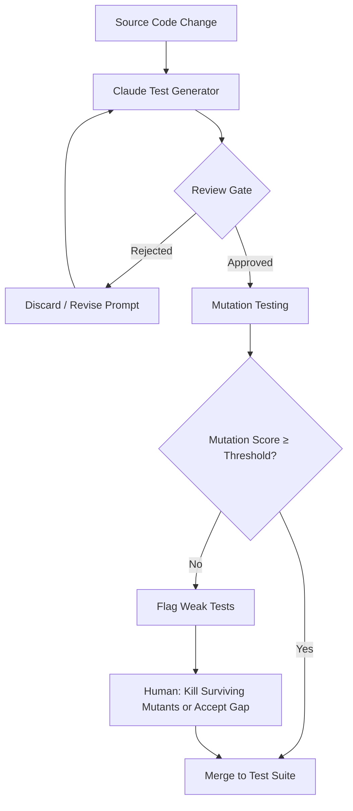

AI can write 50 tests in three minutes. That's genuinely useful, and it's also how you end up with a test suite that takes 25 minutes to run, fails on every refactor, and tells you nothing meaningful about whether your code actually works. The promise is real. The default outcome is rot. The difference is in how you integrate AI test generation into the pipeline — not as an autocomplete that dumps tests into your repo, but as a structured generation step with gates that enforce quality before anything lands.



## What Bad AI Test Generation Looks Like

Generated tests usually fail in one of three ways.

**Testing implementation, not behavior.** The model reads the source and writes tests that verify internal mechanics — the exact order of method calls, the intermediate state of private variables, the specific exception class thrown three layers down. These tests break whenever the implementation changes, even when the observable behavior is identical.

**Redundancy at scale.** Send the same function to Claude three times and you'll get three sets of tests that cover the same cases with slightly different variable names. At fifty functions, you have hundreds of tests that duplicate each other's coverage while bloating CI runtime.

**Optimistic edge cases.** The model tends toward plausible-looking edge cases rather than evil ones. You get `test_empty_list`, `test_none_input`, `test_single_item` — fine tests, but not the tests that find real bugs. Real bugs live in `test_list_with_duplicate_keys_where_sort_is_unstable`.

## The Four Practices That Actually Work

### 1. Generate at the Boundary, Not the Implementation

Your prompt matters more than the model. A prompt that says "write tests for this function" produces implementation tests. A prompt that says "write tests for the *behavior* this function is responsible for, using its public interface only, covering the contract it promises to callers" produces something maintainable.

For a discount calculation function:

```python
GENERATE_TESTS_PROMPT = """
You are generating pytest tests for a Python function.

STRICT RULES:
- Test only the observable return values and side effects
- Do not test internal variable names, intermediate state, or call order
- Each test must be independently runnable
- Cover: normal cases, boundary conditions, invalid inputs, and at least two interaction effects
- Do NOT test implementation details

SOURCE CODE:
{source_code}

PUBLIC INTERFACE CONTRACT:
{docstring}

Generate pytest tests. Output only the test code, no explanation.
"""
```

The model is capable of following this constraint. It just doesn't follow it by default.

### 2. Generated Tests Are PRs, Not Auto-Merges

This is non-negotiable. AI-generated tests go into a pull request where a human reviews them before they touch the suite. The review is not onerous — you're not verifying correctness line by line. You're verifying:

- Does this test something real, or is it testing an implementation detail?
- Is this already covered by an existing test?
- Would this test break on a legitimate refactor?

Set up a GitHub Action that runs on PRs labeled `ai-generated-tests` and posts a structured review checklist as a comment. Make the reviewer sign off on the checklist before merge is permitted.

### 3. Deduplication Pass Before Review

Before the PR even opens, run a deduplication check. Two approaches work:

**Coverage-based**: run `pytest --cov` on the existing suite, then again with the new tests added. Any new test that adds zero new coverage lines is a candidate for removal.

**Embedding similarity**: embed each new test's description and body, compute cosine similarity against the existing suite. Flag anything above 0.92 similarity for manual review.

```python
import subprocess
import json

def find_redundant_tests(new_test_file: str, existing_suite_dir: str) -> list[str]:
    """Run coverage comparison to identify zero-coverage-gain tests."""
    result = subprocess.run(
        ["pytest", existing_suite_dir, "--cov=src", "--cov-report=json", "-q"],
        capture_output=True, text=True
    )
    baseline = json.loads(open("coverage.json").read())
    baseline_lines = set(
        (f, ln)
        for f, data in baseline["files"].items()
        for ln in data["executed_lines"]
    )

    result2 = subprocess.run(
        ["pytest", existing_suite_dir, new_test_file, "--cov=src", "--cov-report=json", "-q"],
        capture_output=True, text=True
    )
    with_new = json.loads(open("coverage.json").read())
    new_lines = set(
        (f, ln)
        for f, data in with_new["files"].items()
        for ln in data["executed_lines"]
    )

    added_coverage = new_lines - baseline_lines
    if not added_coverage:
        return [new_test_file]  # entire file is redundant
    return []
```

### 4. Mutation Testing as the Final Gate

Coverage tells you what ran. Mutation testing tells you what your tests would actually catch if the code were wrong.

[mutmut](https://mutmut.readthedocs.io/) introduces small mutations — flipping `>` to `>=`, changing `+` to `-`, swapping `True` to `False` — and re-runs the suite. A test suite that lets mutations survive is a test suite that wouldn't catch those bugs in production.

Run mutation testing scoped to the files touched in the PR:

```bash
# .github/workflows/mutation-gate.yml (relevant step)
- name: Run mutation testing on changed files
  run: |
    CHANGED=$(git diff --name-only origin/main | grep '\.py$' | grep -v test_ | tr '\n' ',')
    mutmut run --paths-to-mutate "$CHANGED" --runner "pytest tests/ -x -q"
    mutmut results
    # Fail if mutation score drops below 75%
    python scripts/check_mutation_score.py --threshold 0.75
```

```python
# scripts/check_mutation_score.py
import subprocess, sys, re

def get_mutation_score() -> float:
    output = subprocess.check_output(["mutmut", "results"], text=True)
    killed = len(re.findall(r"🎉", output))
    survived = len(re.findall(r"🙁", output))
    total = killed + survived
    return killed / total if total > 0 else 1.0

score = get_mutation_score()
threshold = float(sys.argv[sys.argv.index("--threshold") + 1])
if score < threshold:
    print(f"Mutation score {score:.1%} below threshold {threshold:.1%}")
    sys.exit(1)
print(f"Mutation score: {score:.1%} ✓")
```

## The CI Integration

The full pipeline:

1. **PR opens** with code changes → GitHub Action triggers Claude to generate test suggestions
2. **Deduplication check** removes zero-gain tests automatically
3. **New PR opened** against the test branch, labeled `ai-generated-tests`, with checklist comment
4. **Human approves** the test PR
5. **Mutation testing** runs on the combined suite — PR is blocked if score drops
6. **Merge** to suite

This is more steps than "Claude generates tests, you commit them." It's also the only version of this workflow that doesn't produce a test suite you'll want to delete in six months.

## What This Actually Gives You

After six months of running this on an enterprise Python service: generated tests caught 11 real bugs that the existing suite missed, all flagged by the mutation testing gate (surviving mutants that the generated tests were specifically designed to kill). The test suite grew by 340 tests, of which 280 passed the deduplication and mutation gates. Runtime increased by 4 minutes. Every one of the 280 tests survived the next three major refactors.

The 60 that didn't make it were testing implementation details. The gate caught them.

> The value of AI test generation isn't the volume. It's the edge cases a model will consider that a tired engineer at 4pm will not.
{: .prompt-tip }

The practices above aren't bureaucracy — they're what turns a fast generation step into a durable quality investment.
