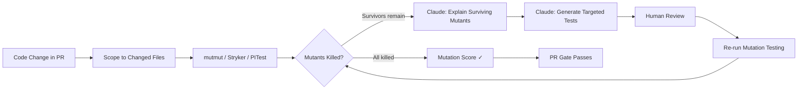

Your test suite has 87% code coverage. You deploy a change that flips a comparison operator — `>` becomes `>=` — and the tests pass. The bug ships. Coverage is not a proxy for test quality; it measures execution, not verification. Mutation testing measures verification — it introduces intentional defects and checks whether your tests catch them. The ones that slip through (surviving mutants) are proof of real test gaps. Add an LLM to explain those gaps in plain language and generate targeted tests to close them, and you have a quality gate that actually correlates with production bug rate.



## Coverage vs. Mutation Score: The Real Difference

Consider this function:

```python
def apply_discount(total: float, customer_tier: str) -> float:
    """Apply tier discount: gold=15%, silver=10%, standard=0%."""
    if customer_tier == "gold":
        discount = 0.15
    elif customer_tier == "silver":
        discount = 0.10
    else:
        discount = 0.0
    return total * (1 - discount)
```

A test that calls `apply_discount(100, "gold")` and asserts the result is not `None` achieves 100% line coverage. It does not catch a mutation that changes `0.15` to `0.20`. Mutation testing does.

The mutant:
```python
discount = 0.20  # mutmut changes 0.15 → 0.20
```

Your test still passes. The discount is wrong by a third. That's a surviving mutant, and it tells you your test doesn't verify the actual discount amount.

## Tools by Ecosystem

| Language | Tool | Notes |
|---|---|---|
| Python | [mutmut](https://mutmut.readthedocs.io/) | Fast, zero-config start, good CI integration |
| Java | [PITest](https://pitest.org/) | Industry standard, Maven/Gradle plugins available |
| JS/TS | [Stryker](https://stryker-mutator.io/) | Excellent dashboard, works with Jest/Vitest/Mocha |
| Go | [go-mutesting](https://github.com/avast/go-mutesting) | Less mature, but functional for core logic |

The integration pattern is identical across tools. The examples below use mutmut for Python.

## Running Mutation Testing in CI — Scoped, Not Full Suite

Full mutation testing on a large codebase is slow. A 10,000-line Python service can take 45 minutes to mutate fully. The solution is scoping: only mutate the files changed in the current PR.

```yaml
# .github/workflows/mutation-gate.yml
name: Mutation Testing Gate

on:
  pull_request:
    paths:
      - 'src/**/*.py'

jobs:
  mutation-test:
    runs-on: ubuntu-latest
    steps:
      - uses: actions/checkout@v4
        with:
          fetch-depth: 0

      - name: Install dependencies
        run: pip install mutmut pytest pytest-cov

      - name: Get changed source files
        id: changed
        run: |
          CHANGED=$(git diff --name-only origin/${{ github.base_ref }}...HEAD \
            | grep '^src/.*\.py$' \
            | grep -v '__init__' \
            | tr '\n' ',' \
            | sed 's/,$//')
          echo "files=$CHANGED" >> $GITHUB_OUTPUT

      - name: Run mutation testing
        if: steps.changed.outputs.files != ''
        run: |
          mutmut run \
            --paths-to-mutate "${{ steps.changed.outputs.files }}" \
            --runner "pytest tests/ -x -q --tb=no" \
            --no-progress
        continue-on-error: true

      - name: Check mutation score
        run: python scripts/mutation_gate.py --threshold 0.70

      - name: Upload surviving mutants
        if: failure()
        uses: actions/upload-artifact@v4
        with:
          name: surviving-mutants
          path: .mutmut-cache
```

```python
# scripts/mutation_gate.py
import subprocess, sys, re, json

def parse_mutmut_results() -> dict:
    output = subprocess.check_output(["mutmut", "results"], text=True)
    lines = output.strip().split('\n')

    killed = sum(1 for l in lines if 'killed' in l.lower())
    survived = sum(1 for l in lines if 'survived' in l.lower())
    timeout = sum(1 for l in lines if 'timeout' in l.lower())

    # Collect surviving mutant IDs
    surviving_ids = re.findall(r'(\d+)', '\n'.join(
        l for l in lines if 'survived' in l.lower()
    ))

    return {
        "killed": killed,
        "survived": survived,
        "timeout": timeout,
        "surviving_ids": surviving_ids[:20],  # cap for LLM analysis
        "score": killed / (killed + survived) if (killed + survived) > 0 else 1.0,
    }

def main():
    args = sys.argv
    threshold = float(args[args.index("--threshold") + 1]) if "--threshold" in args else 0.70

    results = parse_mutmut_results()
    print(f"Mutation score: {results['score']:.1%} "
          f"({results['killed']} killed, {results['survived']} survived)")

    if results['score'] < threshold:
        print(f"FAIL: Score {results['score']:.1%} below threshold {threshold:.1%}")
        # Output surviving IDs as JSON for downstream analysis
        with open("surviving_mutants.json", "w") as f:
            json.dump(results, f, indent=2)
        sys.exit(1)

    print("PASS: Mutation score meets threshold")

if __name__ == "__main__":
    main()
```

## The AI Layer: Explaining Surviving Mutants

Raw mutmut output tells you a mutant survived. It doesn't tell you what that means for production reliability. An LLM can bridge that gap.

```python
import anthropic
import subprocess

def explain_surviving_mutants(mutant_ids: list[int]) -> str:
    client = anthropic.Anthropic()
    explanations = []

    for mutant_id in mutant_ids:
        # Get the diff for this mutant
        diff = subprocess.check_output(
            ["mutmut", "show", str(mutant_id)], text=True
        )

        message = client.messages.create(
            model="claude-opus-4-5",
            max_tokens=400,
            messages=[{
                "role": "user",
                "content": f"""A mutation test survived (tests still passed with wrong code).

Mutant diff:
{diff}

In 2-3 sentences:
1. What bug does this mutation represent?
2. What real-world scenario would trigger it?
3. What assertion is missing from the test suite?

Be specific. No generalities."""
            }]
        )
        explanations.append(f"Mutant {mutant_id}:\n{message.content[0].text}")

    return "\n\n".join(explanations)
```

The output of this goes into the PR as a comment, written in plain language that a reviewer can act on:

> **Mutant 47**: This mutation changes the `>=` to `>` in the minimum order threshold check. The bug: orders at exactly the threshold amount would not qualify for free shipping, when they should. Missing assertion: a test case that places an order at exactly the threshold value and verifies the shipping fee is zero.

That's actionable. The reviewer knows exactly what test to write.

## AI-Generated Tests to Kill Surviving Mutants

Once the surviving mutants are explained, the natural next step is generating tests that would kill them:

```python
def generate_killing_test(mutant_diff: str, source_code: str, explanation: str) -> str:
    client = anthropic.Anthropic()

    message = client.messages.create(
        model="claude-opus-4-5",
        max_tokens=600,
        messages=[{
            "role": "user",
            "content": f"""Write a pytest test that would catch this mutation.

Mutation:
{mutant_diff}

Source code context:
{source_code}

What the mutation represents:
{explanation}

Requirements:
- One pytest function, no fixtures unless necessary
- Assert the exact behavior that the mutation breaks
- Use a descriptive test name starting with test_
- No comments, no docstring, just the test function

Output only the test code."""
        }]
    )

    return message.content[0].text
```

These generated tests still go through the same review gate as any AI-generated test — they don't auto-commit. But they give the reviewer a concrete starting point rather than a blank editor.

## Performance Reality

Mutation testing at full scale is slow. Here's what actually works in CI:

- **Scope to changed files only** — a PR that touches 3 files runs mutations on 3 files, not 300
- **Parallelize** — mutmut supports `--processes N`; use half your available cores
- **Cache results** — mutmut caches per-file mutation results; unchanged files don't re-run
- **Run nightly for full suite** — accept that full-suite mutation testing is a nightly job, not a per-PR gate

```yaml
# Nightly full-suite mutation job
- cron: '0 2 * * *'  # 2 AM UTC
```

Set the PR gate threshold at 70% mutation score for changed files. Set a nightly alert if full-suite score drops below 60%. These thresholds are where the signal-to-noise ratio makes sense — above 80% you're spending cycles on edge cases that don't reflect real production risk.

> Mutation score is a better predictor of production bug rate than code coverage. A study of open-source projects found correlation coefficients of 0.85+ between mutation score and bug detection rate, versus 0.40 for line coverage.
{: .prompt-info }

## What You'll Find

When I first ran mutation testing on a service with 78% code coverage, 31% of mutants survived. Most were in boundary conditions — off-by-one comparisons, threshold checks, None-handling branches. The tests covered those lines; they just didn't assert anything meaningful about them. Eleven of those surviving mutants corresponded to bugs that had actually been filed as production issues in the past year.

Coverage had been green the whole time.
