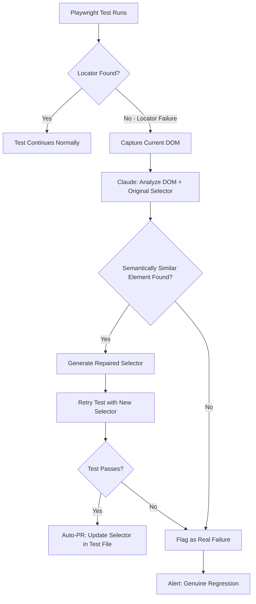

In a mature frontend, roughly 30% of test failures in any given week are selector rot — a CSS class got renamed, a component moved inside a different wrapper, a button's `data-testid` changed without updating the test. These are not bugs. They're maintenance overhead masquerading as quality signal. Every time a CI run fails on `locator('.submit-btn')` because the class is now `.btn-submit`, a developer stops what they're doing, reads a stack trace, updates a selector, and pushes a fix commit. Multiply that by 200 tests and three frontend teams, and selector maintenance becomes a meaningful chunk of engineering time. Self-healing tests don't solve the problem — they automate the mechanical part of it, so engineers spend time on real failures.



## Why Tests Break the Way They Do

UI test brittleness has two root causes. First, selectors tied to implementation details: CSS classes, element IDs, DOM hierarchy (`div > div:nth-child(2) > button`). These change whenever a developer refactors the component, even without any functional change. Second, timing assumptions: `waitForTimeout(2000)` instead of waiting for an actual element state.

The self-healing problem is only about the first cause. A selector that can't find its target because the class changed is a false failure — the functionality is intact. A selector that finds the element but the element no longer does what it used to do is a real bug. Self-healing needs to distinguish between the two.

The heuristic: if an AI can find a semantically equivalent element in the current DOM using the original selector's intent, it's a selector problem. If it cannot, it's probably a real change.

## Multiple Selector Strategies as Baseline Defense

Before AI repair, the first line of defense is resilient selectors. Playwright's recommended priority order, from most to least brittle:

```typescript
// Most brittle — breaks on any CSS refactor
page.locator('.submit-btn')

// Brittle — breaks if ID changes
page.locator('#submit-button')

// Resilient — semantic, tied to what the element is
page.getByRole('button', { name: 'Submit Order' })

// Resilient — requires explicit test attribute
page.getByTestId('order-submit')

// Resilient — text content (breaks if copy changes, but copy changes intentionally)
page.getByText('Submit Order')
```

A selector waterfall tries multiple strategies before failing:

```typescript
// selectors/resilient.ts
export async function findElement(
  page: Page,
  selectors: string[],
  timeout = 5000
): Promise<Locator | null> {
  for (const selector of selectors) {
    try {
      const locator = page.locator(selector);
      await locator.waitFor({ timeout, state: 'visible' });
      return locator;
    } catch {
      continue;
    }
  }
  return null;
}

// Usage in test:
const submitBtn = await findElement(page, [
  '[data-testid="order-submit"]',
  'button[aria-label="Submit Order"]',
  'button:has-text("Submit Order")',
  '.submit-btn',  // legacy fallback
]);
```

This gets you partial self-healing without AI. When all strategies fail, that's when AI repair kicks in.

## AI-Powered Selector Repair

When all locator strategies fail, capture the DOM and ask Claude to find the target element:

```typescript
// self-healing/selector-repair.ts
import Anthropic from '@anthropic-ai/sdk';

const client = new Anthropic();

export interface RepairResult {
  repaired: boolean;
  newSelector: string | null;
  confidence: 'high' | 'medium' | 'low';
  reasoning: string;
}

export async function repairSelector(
  failingSelector: string,
  selectorIntent: string,  // human-readable: "the button that submits the order"
  domSnapshot: string,     // page.content() or localized subtree
  maxDomLength = 8000
): Promise<RepairResult> {
  // Trim DOM to relevant portion to stay within context
  const trimmedDom = domSnapshot.slice(0, maxDomLength);

  const response = await client.messages.create({
    model: 'claude-opus-4-5',
    max_tokens: 400,
    messages: [{
      role: 'user',
      content: `A Playwright test locator failed. Find the correct element in the current DOM.

FAILING SELECTOR: ${failingSelector}
ELEMENT INTENT: ${selectorIntent}

CURRENT DOM (truncated):
${trimmedDom}

Respond with JSON only:
{
  "found": true/false,
  "new_selector": "the CSS/aria selector that will locate the element",
  "confidence": "high/medium/low",
  "reasoning": "one sentence explaining what changed"
}

If you cannot find a semantically equivalent element, set "found": false.
Prefer: data-testid > aria-label > role+name > text > CSS class`
    }]
  });

  const raw = response.content[0].type === 'text' ? response.content[0].text : '';

  try {
    const parsed = JSON.parse(raw.match(/\{[\s\S]+\}/)?.[0] ?? '{}');
    return {
      repaired: parsed.found === true,
      newSelector: parsed.new_selector ?? null,
      confidence: parsed.confidence ?? 'low',
      reasoning: parsed.reasoning ?? '',
    };
  } catch {
    return { repaired: false, newSelector: null, confidence: 'low', reasoning: 'parse error' };
  }
}
```

Integrate this into a Playwright global error handler:

```typescript
// playwright.config.ts — custom fixture with self-healing
import { test as base } from '@playwright/test';
import { repairSelector } from './self-healing/selector-repair';
import * as fs from 'fs';

export const test = base.extend({
  page: async ({ page }, use) => {
    // Intercept locator failures
    const originalLocator = page.locator.bind(page);

    page.locator = (selector: string, options?: any) => {
      const locator = originalLocator(selector, options);
      // Wrap waitFor to intercept TimeoutErrors
      const originalWaitFor = locator.waitFor.bind(locator);
      locator.waitFor = async (opts?: any) => {
        try {
          return await originalWaitFor(opts);
        } catch (error) {
          if (error.name === 'TimeoutError') {
            console.log(`[self-heal] Attempting repair for: ${selector}`);
            const dom = await page.content();
            const repair = await repairSelector(
              selector,
              `element matched by ${selector}`,
              dom
            );

            if (repair.repaired && repair.newSelector) {
              console.log(`[self-heal] Repaired: ${selector} → ${repair.newSelector}`);
              logRepair(selector, repair.newSelector, repair.reasoning);
              return await originalLocator(repair.newSelector).waitFor(opts);
            }
          }
          throw error;
        }
      };
      return locator;
    };

    await use(page);
  }
});

function logRepair(original: string, repaired: string, reason: string) {
  const log = { timestamp: new Date().toISOString(), original, repaired, reason };
  fs.appendFileSync('self-heal-log.jsonl', JSON.stringify(log) + '\n');
}
```

## Auto-PR for Permanent Selector Updates

Logging the repairs is only half the job. The other half is making the repair permanent so the test doesn't need healing on the next run. A nightly job reads `self-heal-log.jsonl` and opens PRs for accumulated repairs:

```python
# scripts/create_selector_prs.py
import json, subprocess, pathlib, re

def apply_selector_repair(test_file: str, old_selector: str, new_selector: str) -> bool:
    content = pathlib.Path(test_file).read_text()
    # Escape for regex
    old_escaped = re.escape(old_selector)
    if re.search(old_escaped, content):
        updated = re.sub(old_escaped, new_selector, content)
        pathlib.Path(test_file).write_text(updated)
        return True
    return False

repairs = [json.loads(l) for l in open("self-heal-log.jsonl")]
# Group by test file, apply patches, open PR
```

## Distinguishing False Failures from Real Bugs

The key metric is confidence from the repair step. When Claude finds a visually and semantically equivalent element with high confidence, it's a selector drift. When it cannot find any equivalent — the button is gone, the form is replaced by a modal, the page layout changed fundamentally — that's a real change worth investigating.

Operational thresholds that work in practice:

| Repair Confidence | Action |
|---|---|
| High | Auto-retry; queue permanent fix PR |
| Medium | Auto-retry; flag for human review before merging fix |
| Low | Mark as real failure; do not auto-repair |
| Not found | Mark as real failure immediately |

Track your self-healing rate over time. A healthy rate is 15–30% of UI test failures being self-healed selector drift. If it climbs above 50%, your selectors are too fragile — invest in `data-testid` attributes. If it's near zero, you probably have stable selectors and don't need the overhead.

> Self-healing is a maintenance tool, not a quality substitute. It removes noise from CI so real failures get the attention they deserve.
{: .prompt-warning }

## Commercial vs. Custom

[Mabl](https://www.mabl.com/) and [Applitools](https://applitools.com/) both offer production self-healing with sophisticated element detection. [Alumnium](https://github.com/alumnium-hq/alumnium) is OSS and integrates directly with Playwright/Selenium. The custom approach above costs you implementation time but gives full control over the repair logic and audit trail.

For teams already on Playwright with an existing Claude API contract, custom costs nothing marginal. For teams without an AI API integration, Mabl or Alumnium is the faster path to value.
