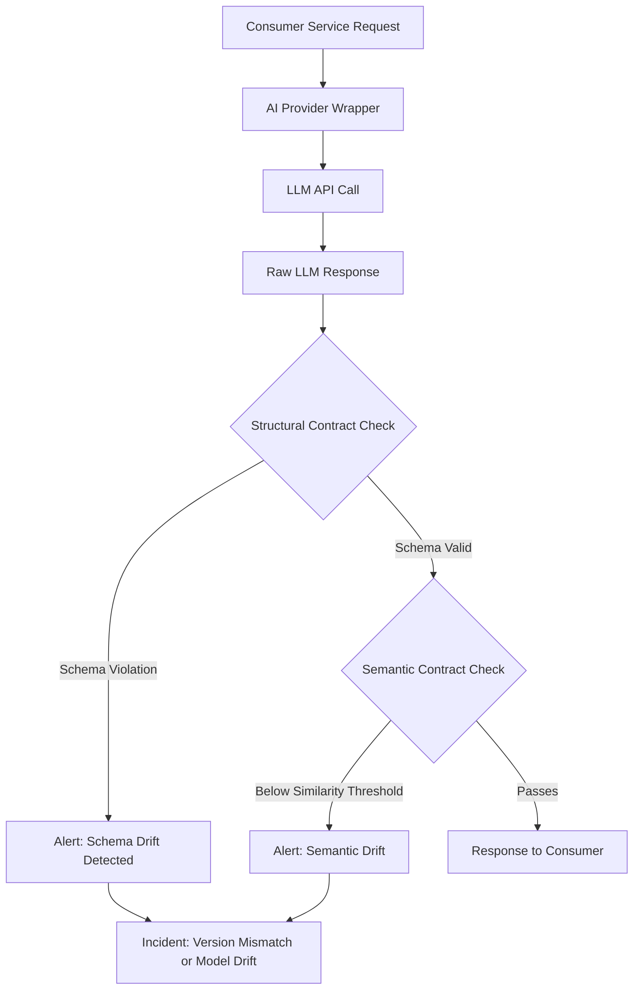

Standard contract testing (Pact, Spring Contract) works on a clean assumption: the consumer defines what response it expects, and the provider proves it can produce that exact response. This breaks the moment you put an LLM in the provider chain. The sentiment analysis service you're calling might return `"positive"` today and `"strongly positive"` tomorrow — both correct, both different, and your consumer service's enum validation rejects the second one. The contract is broken and the behavior is not. The inverse also happens: the schema drifts silently and the consumer service doesn't notice until a downstream field it depended on disappears entirely.

AI-integrated systems need two kinds of contracts working together: structural contracts for what the response looks like, and semantic contracts for what the response means.



## Why Standard Contract Testing Fails Here

A Pact consumer contract might look like this:

```json
{
  "request": {
    "method": "POST",
    "path": "/analyze",
    "body": { "text": "Great product, love it!" }
  },
  "response": {
    "status": 200,
    "body": {
      "sentiment": "positive",
      "confidence": 0.92,
      "entities": []
    }
  }
}
```

The provider verification replay sends the same request and checks the response matches. With a deterministic API, this works. With an LLM provider, confidence might be `0.87` today, `sentiment` might be `"very_positive"` if the model was updated, and `entities` might now include `["product"]` because the model learned to extract them. Three values changed, zero bugs introduced — but every Pact check fails.

The problem isn't the tool; it's the testing strategy. Exact value matching is the wrong contract for a non-deterministic system.

## Structural Contracts: What You Can Assert

Structural contracts verify the shape of the response independent of the specific values. JSON Schema handles this cleanly:

```python
# contracts/sentiment_v1.py
SENTIMENT_RESPONSE_SCHEMA = {
    "$schema": "https://json-schema.org/draft/2020-12",
    "type": "object",
    "required": ["sentiment", "confidence"],
    "properties": {
        "sentiment": {
            "type": "string",
            "enum": ["positive", "negative", "neutral", "mixed"]
        },
        "confidence": {
            "type": "number",
            "minimum": 0.0,
            "maximum": 1.0
        },
        "entities": {
            "type": "array",
            "items": {"type": "string"}
        }
    },
    "additionalProperties": False
}
```

Note `additionalProperties: False` — this catches schema expansion where the provider starts returning new fields the consumer hasn't accounted for. That's a legitimate breaking change even if all the expected fields are still there.

The validation runs on every response, not just during tests:

```python
from jsonschema import validate, ValidationError
import logging

def validate_sentiment_response(response: dict) -> bool:
    try:
        validate(instance=response, schema=SENTIMENT_RESPONSE_SCHEMA)
        return True
    except ValidationError as e:
        logging.error(
            "Contract violation: sentiment response schema mismatch",
            extra={
                "violation": e.message,
                "path": list(e.absolute_path),
                "response_sample": str(response)[:200]
            }
        )
        # Emit metric for alerting
        metrics.increment("contract.violation", tags=["service:sentiment", "type:structural"])
        return False
```

Run this in production on every LLM response, not just in tests. Schema violations in production are a leading indicator of model updates or provider migrations that haven't been communicated.

## Semantic Contracts: What You Can Assert About Meaning

Structural contracts don't verify that the classification is correct — only that it has the right shape. For that you need semantic contracts: a small set of canonical examples where you know what the correct output should be, tested periodically.

The catch is "correct" is fuzzy. A movie review that says "a challenging and demanding film" could reasonably be classified as positive or neutral depending on the model. Semantic contracts work at the level of clear cases — inputs where reasonable people agree on the right answer.

```python
# contracts/semantic_fixtures.py
SENTIMENT_SEMANTIC_FIXTURES = [
    {
        "input": "The product arrived broken and customer service was useless.",
        "expected_sentiment": "negative",
        "confidence_min": 0.80,
        "rationale": "Clear negative with specific complaint"
    },
    {
        "input": "Best purchase I've made this year. Works exactly as described.",
        "expected_sentiment": "positive",
        "confidence_min": 0.80,
        "rationale": "Clear positive with strong endorsement"
    },
    {
        "input": "It's okay. Does what it's supposed to.",
        "expected_sentiment": "neutral",
        "confidence_min": 0.60,
        "rationale": "Neutral with no strong signal"
    },
]

def run_semantic_contract_check(client: SentimentClient) -> dict:
    results = []
    for fixture in SENTIMENT_SEMANTIC_FIXTURES:
        response = client.analyze(fixture["input"])
        passed = (
            response["sentiment"] == fixture["expected_sentiment"]
            and response["confidence"] >= fixture["confidence_min"]
        )
        results.append({
            "input": fixture["input"],
            "expected": fixture["expected_sentiment"],
            "actual": response["sentiment"],
            "passed": passed
        })

    pass_rate = sum(1 for r in results if r["passed"]) / len(results)
    return {"pass_rate": pass_rate, "results": results, "threshold": 0.85}
```

Run this as a scheduled check — not on every request (too slow), but as a daily canary. If the pass rate drops below your threshold, the model has drifted or changed. Emit an alert. Don't fail silently.

## LLM-as-Judge for Semantic Equivalence

For cases where the expected output isn't a simple enum match, use an LLM to judge semantic equivalence:

```python
import anthropic

def semantic_equivalence_check(
    expected_response: str,
    actual_response: str,
    context: str
) -> dict:
    """Judge whether two AI responses are semantically equivalent."""
    client = anthropic.Anthropic()

    response = client.messages.create(
        model="claude-opus-4-5",
        max_tokens=200,
        messages=[{
            "role": "user",
            "content": f"""Are these two responses semantically equivalent for the given context?

Context: {context}

Expected response: {expected_response}
Actual response: {actual_response}

Respond with JSON:
{{
  "equivalent": true/false,
  "confidence": 0.0-1.0,
  "key_difference": "one sentence describing the meaningful difference, or null if equivalent"
}}

Equivalent means: same factual content, same practical meaning for a user, minor wording differences acceptable.
Not equivalent: different facts, contradictory conclusions, meaningfully different advice."""
        }]
    )

    import json
    raw = response.content[0].text
    return json.loads(raw.match(r'\{[\s\S]+\}').group())
```

This is expensive — only use it for the semantic fixture suite, not production traffic.

## Schema Evolution and Versioning

Contracts need versioning. When the provider wants to add a new field or change an enum value, the process should be:

1. Provider announces intent (via API changelog, Confluence, Slack — whatever your org uses)
2. New schema version defined alongside old: `SENTIMENT_RESPONSE_SCHEMA_V2`
3. Consumer updates to accept both versions with a transition window
4. Old version deprecated after 30 days

```python
# Support multiple schema versions during migration
SCHEMA_VERSIONS = {
    "v1": SENTIMENT_RESPONSE_SCHEMA_V1,
    "v2": SENTIMENT_RESPONSE_SCHEMA_V2,
}

def validate_any_version(response: dict) -> tuple[bool, str | None]:
    for version, schema in SCHEMA_VERSIONS.items():
        try:
            validate(instance=response, schema=schema)
            return True, version
        except ValidationError:
            continue
    return False, None
```

Log which version is being matched. When v1 hits zero matches over a 7-day window, it's safe to remove.

## Integrating into CI

The structural contract tests run fast (pure validation, no LLM calls) and belong in the standard test suite:

```python
# tests/test_sentiment_contract.py
import pytest
from contracts.sentiment_v1 import SENTIMENT_RESPONSE_SCHEMA, validate_sentiment_response

class TestSentimentStructuralContract:
    def test_valid_positive_response(self):
        response = {"sentiment": "positive", "confidence": 0.91}
        assert validate_sentiment_response(response)

    def test_rejects_unknown_sentiment_value(self):
        response = {"sentiment": "very_positive", "confidence": 0.91}
        assert not validate_sentiment_response(response)

    def test_rejects_additional_properties(self):
        response = {"sentiment": "positive", "confidence": 0.91, "new_field": "value"}
        assert not validate_sentiment_response(response)

    def test_rejects_missing_required_fields(self):
        response = {"confidence": 0.91}
        assert not validate_sentiment_response(response)
```

The semantic contract checks run separately — either as a scheduled job or as a pre-release gate in staging:

```yaml
# .github/workflows/semantic-contract-check.yml
on:
  schedule:
    - cron: '0 6 * * *'  # Daily at 6 AM UTC
  workflow_dispatch:

jobs:
  semantic-check:
    runs-on: ubuntu-latest
    steps:
      - run: python -m pytest tests/test_semantic_contracts.py -v
        env:
          SENTIMENT_API_URL: ${{ vars.STAGING_SENTIMENT_URL }}
```

> Structural contracts are cheap enough to run on every build. Semantic contracts cost LLM tokens — run them on a schedule, not per-commit.
{: .prompt-tip }

## What Actually Breaks in Production

The most common real-world contract violations in AI-integrated systems, in order of frequency:

1. **Enum expansion** — provider adds new classification values without notifying consumers
2. **Confidence calibration drift** — model update changes confidence score distribution; consumers filtering on `confidence > 0.8` start seeing different traffic
3. **Response time degradation** — timeout assumptions baked into consumer code; provider starts timing out more under load
4. **Field removal** — provider deprecates a field without versioning; consumers fail silently on `KeyError`

Numbers 1, 2, and 4 are caught by structural contracts running in production monitoring. Number 3 requires SLO-based alerting on latency percentiles, which is a different problem — but worth mentioning because teams often assume contract testing covers it.
