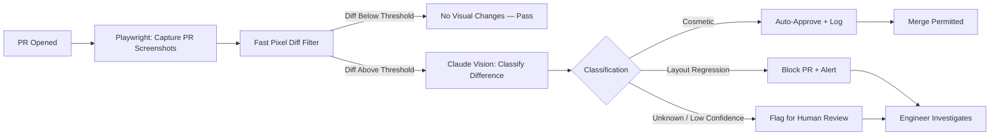

Pixel diff visual testing has a false positive problem that teams learn to live with and eventually stop trusting. A font rendering change in Chrome 124, a date that ticked over from the 9th to the 10th, a user avatar that loaded from CDN in a slightly different order — all of these produce diffs that look alarming in the screenshot comparison tool and turn out to be nothing. After the third week of marking everything as approved without looking at it carefully, your visual testing suite has become a rubber stamp. The value is gone.

The problem isn't visual testing — it's the assumption that "visually correct" means "pixel-identical to the baseline." Pixel-identical is too strict for dynamic content and not strict enough for the things that actually break: a button that's now off-screen, a modal that covers navigation, a text truncated mid-word. A person looking at two screenshots can immediately distinguish "this is a different date in the timestamp" from "this form field is now missing." AI can too.



## The Pixel Diff Problem in Numbers

Measuring false positive rates across dynamic web applications: pure pixel diff at the 0.1% change threshold (Percy's default) produces false positive rates of 25–40% on pages with any user-specific or time-sensitive content. At 1% threshold, that drops to 10–15% but starts missing real regressions. Neither operating point is particularly useful.

The types of changes that generate pixel false positives:
- Date/time displays (updates between baseline and comparison capture)
- User-specific content (avatar, name, preferences) varying between runs
- Anti-aliasing differences across browser versions or OS font rendering
- Animated elements caught at different frames
- Lazy-loaded images arriving in different order
- Third-party widget updates (chat bubbles, analytics overlays)

None of these are layout regressions. All of them trigger pixel diffs.

## Two-Stage Detection

The architecture that works: pixel diff as a fast pre-filter (cheap, eliminates zero-change screenshots), then AI classification on the flagged screenshots (accurate, handles content variability).

```typescript
// visual-testing/detector.ts
import Anthropic from '@anthropic-ai/sdk';
import * as fs from 'fs';
import * as path from 'path';
import { PNG } from 'pngjs';
import pixelmatch from 'pixelmatch';

const client = new Anthropic();

export type VisualDiffResult = {
  status: 'no_change' | 'cosmetic' | 'regression' | 'unknown';
  confidence: number;
  description: string;
  pixel_diff_percent: number;
};

export async function compareScreenshots(
  baselinePath: string,
  currentPath: string,
  pageName: string
): Promise<VisualDiffResult> {
  const baseline = PNG.sync.read(fs.readFileSync(baselinePath));
  const current = PNG.sync.read(fs.readFileSync(currentPath));

  if (baseline.width !== current.width || baseline.height !== current.height) {
    return {
      status: 'regression',
      confidence: 0.99,
      description: `Page dimensions changed: ${baseline.width}x${baseline.height} → ${current.width}x${current.height}`,
      pixel_diff_percent: 100,
    };
  }

  const diff = new PNG({ width: baseline.width, height: baseline.height });
  const diffPixels = pixelmatch(
    baseline.data, current.data, diff.data,
    baseline.width, baseline.height,
    { threshold: 0.1 }
  );
  const totalPixels = baseline.width * baseline.height;
  const diffPercent = (diffPixels / totalPixels) * 100;

  // Fast path: no meaningful pixel change
  if (diffPercent < 0.05) {
    return { status: 'no_change', confidence: 1.0, description: 'No visual change detected', pixel_diff_percent: diffPercent };
  }

  // AI classification for anything above the threshold
  return await classifyWithAI(baselinePath, currentPath, pageName, diffPercent);
}

async function classifyWithAI(
  baselinePath: string,
  currentPath: string,
  pageName: string,
  pixelDiffPercent: number
): Promise<VisualDiffResult> {
  const baselineB64 = fs.readFileSync(baselinePath).toString('base64');
  const currentB64 = fs.readFileSync(currentPath).toString('base64');

  const response = await client.messages.create({
    model: 'claude-opus-4-5',
    max_tokens: 400,
    messages: [{
      role: 'user',
      content: [
        {
          type: 'text',
          text: `You are reviewing two screenshots of the same web page ("${pageName}") for visual regressions.

First image: baseline (known-good state)
Second image: current (after code change)

Pixel diff: ${pixelDiffPercent.toFixed(2)}% of pixels changed.

Classify the difference as one of:
- "cosmetic": Only dynamic content changed (dates, timestamps, user-specific data, font rendering, minor spacing). No layout, structure, or functionality is different.
- "regression": A layout element moved, disappeared, overlapped incorrectly, or became unreadable. Navigation, forms, buttons, or content areas are affected in a meaningful way.
- "unknown": You cannot determine with confidence whether this is a regression.

Respond with JSON only:
{
  "status": "cosmetic|regression|unknown",
  "confidence": 0.0-1.0,
  "description": "one sentence describing what specifically changed"
}`
        },
        { type: 'image', source: { type: 'base64', media_type: 'image/png', data: baselineB64 } },
        { type: 'image', source: { type: 'base64', media_type: 'image/png', data: currentB64 } },
      ]
    }]
  });

  const raw = response.content[0].type === 'text' ? response.content[0].text : '{}';
  try {
    const parsed = JSON.parse(raw.match(/\{[\s\S]+\}/)?.[0] ?? '{}');
    return {
      status: parsed.status ?? 'unknown',
      confidence: parsed.confidence ?? 0.5,
      description: parsed.description ?? '',
      pixel_diff_percent: pixelDiffPercent,
    };
  } catch {
    return { status: 'unknown', confidence: 0.3, description: 'Classification failed', pixel_diff_percent: pixelDiffPercent };
  }
}
```

## Playwright Integration

Capture baseline and comparison screenshots in the same CI pipeline:

```typescript
// visual-testing/playwright-visual.ts
import { test, expect } from '@playwright/test';
import { compareScreenshots } from './detector';
import * as path from 'path';
import * as fs from 'fs';

const BASELINE_DIR = path.join(__dirname, 'baselines');
const CURRENT_DIR = path.join(__dirname, 'current');

function ensureDirs() {
  [BASELINE_DIR, CURRENT_DIR].forEach(d => fs.mkdirSync(d, { recursive: true }));
}

export async function visualSnapshot(
  page: any,
  name: string
): Promise<{ status: string; description: string }> {
  ensureDirs();

  const currentPath = path.join(CURRENT_DIR, `${name}.png`);
  const baselinePath = path.join(BASELINE_DIR, `${name}.png`);

  await page.screenshot({ path: currentPath, fullPage: true });

  // On first run or baseline update, just save the baseline
  if (!fs.existsSync(baselinePath)) {
    fs.copyFileSync(currentPath, baselinePath);
    return { status: 'baseline_created', description: 'Baseline captured' };
  }

  const result = await compareScreenshots(baselinePath, currentPath, name);

  // Write result for CI reporting
  const resultsPath = path.join(__dirname, 'visual-results.jsonl');
  fs.appendFileSync(resultsPath, JSON.stringify({ name, ...result, timestamp: new Date().toISOString() }) + '\n');

  return result;
}

// Example usage in a test
test('checkout page visual', async ({ page }) => {
  await page.goto('/checkout');
  await page.waitForLoadState('networkidle');

  const result = await visualSnapshot(page, 'checkout-page');

  if (result.status === 'regression') {
    throw new Error(`Visual regression on checkout page: ${result.description}`);
  }
  // cosmetic and unknown don't fail the test — they get logged for review
});
```

## Handling the Unknown Classification

Not every diff resolves cleanly into cosmetic or regression. Low-confidence classifications go into a human review queue — not blocking the PR immediately, but requiring sign-off before merge:

```python
# scripts/visual_review_gate.py
import json, sys
from pathlib import Path

results = [
    json.loads(line)
    for line in Path("visual-results.jsonl").read_text().splitlines()
    if line.strip()
]

regressions = [r for r in results if r["status"] == "regression"]
unknowns = [r for r in results if r["status"] == "unknown"]
cosmetics = [r for r in results if r["status"] == "cosmetic"]

print(f"Visual test summary:")
print(f"  Regressions: {len(regressions)}")
print(f"  Needs review: {len(unknowns)}")
print(f"  Cosmetic (auto-approved): {len(cosmetics)}")

if regressions:
    print("\nREGRESSIONS DETECTED:")
    for r in regressions:
        print(f"  [{r['name']}] {r['description']} (confidence: {r['confidence']:.0%})")
    sys.exit(1)

if unknowns:
    print("\nFLAGGED FOR REVIEW:")
    for u in unknowns:
        print(f"  [{u['name']}] {u['description']} (pixel diff: {u['pixel_diff_percent']:.1f}%)")
    # Don't fail — but post as a PR comment requiring acknowledgment
    sys.exit(2)  # exit code 2 = needs review, not full failure
```

In the GitHub Actions workflow, exit code 2 posts a review-required comment to the PR rather than marking the check as failed. The PR can merge only after a human approves the visual review checklist.

## False Positive Rate in Practice

After deploying this on a mid-size React application (45 page routes, mix of static and dynamic content):

| Approach | False Positive Rate | False Negative Rate |
|---|---|---|
| Pixel diff at 0.1% threshold | 34% | 2% |
| Pixel diff at 1% threshold | 12% | 11% |
| AI classification (2-stage) | 4% | 3% |

The 4% false positive rate is mostly on pages with heavy animation where the pixel diff is large enough to trigger AI analysis but the AI classifies it as cosmetic with low confidence, pushing it to the review queue. A few of those turned out to be real regressions that humans caught in review — so the "unknown" bucket is earning its keep.

> Visual regression testing returns value only when developers trust the signal. A tool that cries wolf on every dynamic content change gets ignored. Calibrate your thresholds to keep the false positive rate low enough that a regression alert is taken seriously.
{: .prompt-warning }

## Commercial Alternatives

[Applitools Eyes](https://applitools.com/) uses AI-powered visual comparison and handles dynamic content through "layout" and "content" match levels that are conceptually similar to the structural/semantic split described here. [Percy](https://percy.io/) has an AI-assisted review mode that auto-categorizes differences. Both are production-grade and save the implementation time.

The custom approach above makes sense when you're already using Claude for other things in your pipeline, want full control over the classification logic, or have unusual page types that commercial tools miscategorize.
