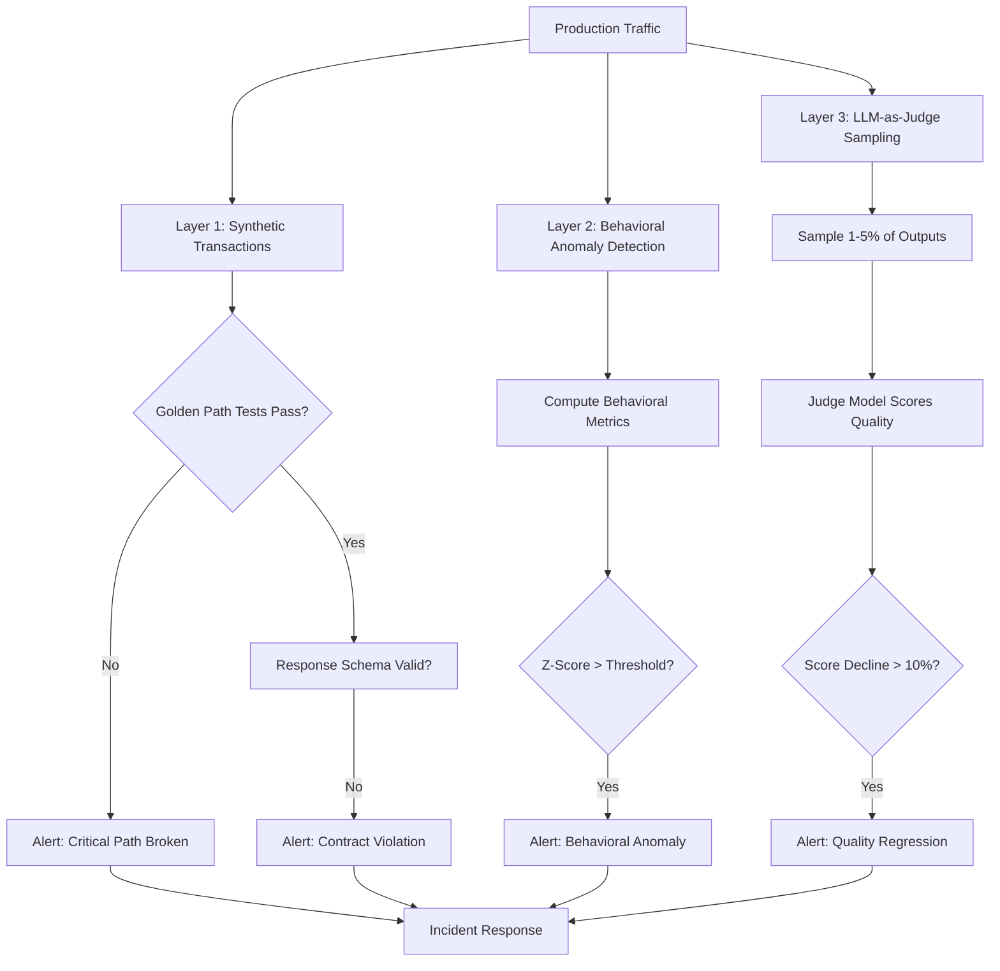

CI passes. Deploy succeeds. Five minutes later your error rate is unchanged, latency looks normal, and you close the laptop. Two days later, support tickets start coming in about the AI summarization feature producing low-quality outputs for documents over 50 pages. Your test dataset had nothing over 20 pages. Your staging environment doesn't have real user documents. The regression was real and live for 48 hours before anyone noticed.

This is the gap between CI quality gates and production reality. Automated tests pass on the data you wrote them for. Production exposes the data you didn't think of. The only way to catch this class of regression is to monitor quality in production continuously — not just infrastructure health, but the behavioral quality of your AI features.



## Layer 1: Synthetic Transactions

Synthetic monitoring runs scripted user journeys against production continuously. Unlike health checks (is the service up?), synthetic transactions verify that the AI feature's actual behavior is correct on known inputs.

The key constraint: synthetic transactions must test *structure*, not *content*. AI content varies; structure should not. A summarization endpoint should always return a response with a summary field, a word count, and key themes — even if the exact wording differs each run.

```python
# monitoring/synthetic/summarization_probe.py
import anthropic
import requests
import json
import time
from dataclasses import dataclass
from typing import Optional

KNOWN_INPUT = """Q3 2024 marked a significant turning point for the company's AI initiatives.
Revenue from AI-powered products grew 34% quarter-over-quarter, driven primarily by
enterprise adoption of the document intelligence platform. Customer churn in the AI
segment remained at 2.1%, below the 3.5% industry average..."""

EXPECTED_SCHEMA = {
    "required_fields": ["summary", "word_count", "key_themes"],
    "summary_min_words": 30,
    "summary_max_words": 200,
    "themes_min_count": 2,
    "themes_max_count": 8,
}

@dataclass
class ProbeResult:
    success: bool
    latency_ms: float
    failure_reason: Optional[str]
    schema_valid: bool
    word_count: Optional[int]

def run_summarization_probe(base_url: str, api_key: str) -> ProbeResult:
    start = time.monotonic()
    try:
        response = requests.post(
            f"{base_url}/api/summarize",
            json={"text": KNOWN_INPUT, "max_words": 100},
            headers={"Authorization": f"Bearer {api_key}"},
            timeout=30
        )
        latency_ms = (time.monotonic() - start) * 1000

        if response.status_code != 200:
            return ProbeResult(
                success=False, latency_ms=latency_ms,
                failure_reason=f"HTTP {response.status_code}: {response.text[:200]}",
                schema_valid=False, word_count=None
            )

        body = response.json()

        # Schema validation
        schema_issues = []
        for field in EXPECTED_SCHEMA["required_fields"]:
            if field not in body:
                schema_issues.append(f"missing field: {field}")

        if "summary" in body:
            words = len(body["summary"].split())
            if words < EXPECTED_SCHEMA["summary_min_words"]:
                schema_issues.append(f"summary too short: {words} words")
            if words > EXPECTED_SCHEMA["summary_max_words"]:
                schema_issues.append(f"summary too long: {words} words")

        if "key_themes" in body:
            count = len(body["key_themes"])
            if count < EXPECTED_SCHEMA["themes_min_count"]:
                schema_issues.append(f"too few themes: {count}")

        schema_valid = len(schema_issues) == 0

        return ProbeResult(
            success=schema_valid,
            latency_ms=latency_ms,
            failure_reason="; ".join(schema_issues) if schema_issues else None,
            schema_valid=schema_valid,
            word_count=len(body.get("summary", "").split())
        )

    except requests.Timeout:
        return ProbeResult(
            success=False,
            latency_ms=30000,
            failure_reason="Request timed out after 30s",
            schema_valid=False,
            word_count=None
        )
```

Run this every 2 minutes from a Lambda or Cloud Function. Emit results to your observability stack. Alert on three consecutive failures (not one — transient errors happen).

## Layer 2: Behavioral Anomaly Detection

Behavioral metrics capture the signals users produce when an AI feature isn't performing well — without requiring users to explicitly report a problem.

The metrics worth tracking per AI feature:

| Metric | What it signals |
|---|---|
| Regenerate rate | User didn't like the first response |
| Edit-after-accept rate | Output needed significant manual correction |
| Copy rate | Proxy for "good enough to use" |
| Task completion rate | Did the user accomplish what they came to do? |
| Follow-up question rate | Response didn't answer the question |
| Session abandonment rate | User gave up |

Each of these is a proxy, not a direct measure. High regenerate rate might mean quality drop, or might mean a new user segment with different expectations. The signal is in the *change* from baseline, not the absolute value.

```python
# monitoring/behavioral/anomaly_detector.py
import numpy as np
from dataclasses import dataclass
from datetime import datetime, timedelta
from typing import Optional

@dataclass
class AnomalyResult:
    metric: str
    current_value: float
    baseline_mean: float
    baseline_std: float
    z_score: float
    is_anomaly: bool
    direction: str  # 'increase' or 'decrease'

def detect_behavioral_anomaly(
    metric_name: str,
    current_value: float,
    historical_values: list[float],
    z_threshold: float = 2.5,
) -> AnomalyResult:
    """
    Z-score anomaly detection against rolling baseline.
    historical_values: last 7 days of daily averages for this metric.
    """
    arr = np.array(historical_values)
    mean = np.mean(arr)
    std = np.std(arr)

    if std < 0.001:  # Avoid division by near-zero
        std = 0.001

    z_score = (current_value - mean) / std

    return AnomalyResult(
        metric=metric_name,
        current_value=current_value,
        baseline_mean=float(mean),
        baseline_std=float(std),
        z_score=float(z_score),
        is_anomaly=abs(z_score) > z_threshold,
        direction='increase' if z_score > 0 else 'decrease',
    )

class BehavioralMonitor:
    def __init__(self, metrics_client, alert_client, z_threshold: float = 2.5):
        self.metrics = metrics_client
        self.alerts = alert_client
        self.z_threshold = z_threshold

    def check_all_metrics(self, feature_name: str) -> list[AnomalyResult]:
        metrics_to_check = [
            "regenerate_rate",
            "edit_after_accept_rate",
            "task_completion_rate",
        ]

        anomalies = []
        for metric in metrics_to_check:
            current = self.metrics.get_hourly_average(feature_name, metric)
            historical = self.metrics.get_daily_averages(
                feature_name, metric, days=7
            )

            result = detect_behavioral_anomaly(
                metric, current, historical, self.z_threshold
            )

            if result.is_anomaly:
                anomalies.append(result)
                # Quality regressions show as increases in regenerate/edit rates
                # and decreases in completion/copy rates
                severity = "high" if abs(result.z_score) > 4.0 else "medium"
                self.alerts.send(
                    title=f"Behavioral anomaly: {feature_name}.{metric}",
                    body=f"{metric} is {result.direction} significantly "
                         f"(z={result.z_score:.1f}, current={result.current_value:.3f}, "
                         f"baseline={result.baseline_mean:.3f})",
                    severity=severity,
                )

        return anomalies
```

## Layer 3: LLM-as-Judge Quality Sampling

Behavioral metrics tell you *that* something is wrong. LLM-as-judge sampling tells you *what* is wrong with the AI outputs specifically.

Sample 1–5% of production outputs and score them with a judge model. Track quality score as a time series. Alert when the 7-day rolling average drops more than 10%.

```python
# monitoring/judge/quality_sampler.py
import anthropic
import random
from dataclasses import dataclass
from datetime import datetime

client = anthropic.Anthropic()

QUALITY_RUBRIC = """Score this AI-generated summary on a scale of 0.0 to 1.0.

Scoring criteria:
- 1.0: Accurate, complete, well-structured, appropriate length, no hallucinations
- 0.7-0.9: Minor issues (slightly verbose, minor omission, acceptable wording)
- 0.4-0.6: Noticeable quality issues (key info missing, poor structure, or slightly misleading)
- 0.0-0.3: Significant problems (hallucinations, major omissions, incoherent, wrong conclusion)

Respond with JSON only:
{"score": 0.0-1.0, "issues": ["list of specific issues, empty if none"]}"""

@dataclass
class JudgmentResult:
    request_id: str
    score: float
    issues: list[str]
    sampled_at: datetime
    input_length_chars: int
    output_length_chars: int

def judge_output(
    request_id: str,
    input_text: str,
    output_text: str,
    feature_context: str,
) -> JudgmentResult:
    response = client.messages.create(
        model="claude-opus-4-5",
        max_tokens=200,
        messages=[{
            "role": "user",
            "content": f"""{QUALITY_RUBRIC}

Feature context: {feature_context}

INPUT (first 1000 chars):
{input_text[:1000]}

AI OUTPUT:
{output_text}"""
        }]
    )

    import json, re
    raw = response.content[0].text if response.content else "{}"
    try:
        parsed = json.loads(re.search(r'\{[\s\S]+\}', raw).group())
    except Exception:
        parsed = {"score": 0.5, "issues": ["parse error in judge response"]}

    return JudgmentResult(
        request_id=request_id,
        score=float(parsed.get("score", 0.5)),
        issues=parsed.get("issues", []),
        sampled_at=datetime.utcnow(),
        input_length_chars=len(input_text),
        output_length_chars=len(output_text),
    )


class ProductionSampler:
    def __init__(self, sample_rate: float = 0.02):
        self.sample_rate = sample_rate

    def should_sample(self) -> bool:
        return random.random() < self.sample_rate

    def record_and_maybe_judge(
        self,
        request_id: str,
        input_text: str,
        output_text: str,
        feature: str,
    ) -> JudgmentResult | None:
        if not self.should_sample():
            return None
        return judge_output(request_id, input_text, output_text, feature)
```

Storing and aggregating quality scores over time gives you the time series you need for alerting:

```python
# Alert logic — runs as a scheduled job every hour
def check_quality_trend(feature: str, db) -> None:
    # 7-day rolling average
    scores_7d = db.get_quality_scores(feature, days=7)
    scores_1d = db.get_quality_scores(feature, days=1)

    if not scores_7d or not scores_1d:
        return

    baseline = sum(scores_7d) / len(scores_7d)
    current = sum(scores_1d) / len(scores_1d)

    decline = (baseline - current) / baseline

    if decline > 0.10 and len(scores_1d) >= 20:  # Require minimum samples
        alert(
            f"Quality regression in {feature}: "
            f"{decline:.0%} decline from 7-day baseline "
            f"({baseline:.2f} → {current:.2f}), "
            f"n={len(scores_1d)} samples"
        )
```

## Escalation: Rollback vs. Data Triage

When monitoring triggers an alert, the first question is whether this is a feature rollback scenario or a data triage scenario.

**Rollback signal**: Quality score declines uniformly across all user segments, input types, and input lengths. Correlated with a recent deployment. Action: roll back the change, investigate the regression.

**Data triage signal**: Quality score declines for a specific input segment — documents over 50 pages, inputs in non-English languages, queries containing specific terminology. Not correlated with a deployment. Action: investigate the data segment, update test fixtures, possibly retrain or adjust prompts for that segment.

The LLM-as-judge results help here because they capture the issues in plain language. A cluster of judgments all flagging "key information missing from long documents" points clearly at a context handling bug, not a general regression.

```python
def triage_regression(feature: str, db) -> str:
    """Rough triage: uniform regression or segment-specific."""
    recent_judgments = db.get_recent_judgments(feature, hours=4)
    low_quality = [j for j in recent_judgments if j.score < 0.5]

    if not low_quality:
        return "no_regression"

    # Check for length pattern
    avg_bad_length = sum(j.input_length_chars for j in low_quality) / len(low_quality)
    avg_all_length = sum(j.input_length_chars for j in recent_judgments) / len(recent_judgments)

    if avg_bad_length > avg_all_length * 1.5:
        return "segment_regression:long_inputs"

    # Check issue clustering
    all_issues = [issue for j in low_quality for issue in j.issues]
    if all_issues:
        from collections import Counter
        top_issue = Counter(all_issues).most_common(1)[0][0]
        return f"clustered_issue:{top_issue[:50]}"

    return "uniform_regression"
```

> The goal isn't zero defects in production — it's detecting defects before users report them. A monitoring system that catches quality regressions within two hours is far better than one that relies on support tickets.
{: .prompt-tip }

## Implementation Priority

If you're starting from zero: Layer 1 (synthetic transactions) first, always. It catches the worst regressions — complete feature failure, broken contracts — and costs little to implement. Layer 2 (behavioral anomaly detection) requires meaningful behavioral event data, which means instrumenting your frontend first. Layer 3 (LLM-as-judge) costs real API money and requires enough traffic to sample meaningfully.

In practice, Layer 1 catches infrastructure and contract failures. Layer 3 catches the subtle quality degradations that Layer 1 doesn't see. Layer 2 catches the user experience impact of either. You need all three for production confidence.
