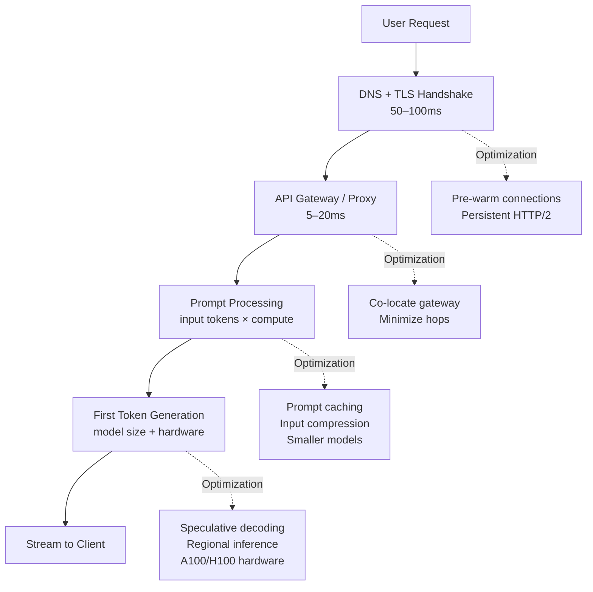

After 11 years of building systems that people actually use, I've learned one thing about latency: users don't care about your end-to-end numbers. They care about when they see *something*. For AI systems, that means Time to First Token (TTFT) is the latency metric that drives perceived performance — everything else is secondary once you're streaming.

This post covers the architecture decisions that actually move the TTFT needle, with honest benchmarks for what's achievable today.



## TTFT vs. End-to-End Latency: Why the Distinction Matters

End-to-end latency — the time from request sent to response complete — is the wrong optimization target for interactive AI. When you stream tokens, the user starts reading before generation is done. A response that takes 8 seconds to complete but starts streaming in 400ms *feels* faster than one that delivers the full response in 2 seconds.

TTFT is the time from sending the request to receiving the first token in the response stream. This is the number you need to obsess over for conversational and interactive workloads. End-to-end latency matters for batch processing and workflows where you need the complete output before proceeding.

The practical implication: streaming is not optional for interactive AI. If you're collecting the full response before displaying anything, you're making your product feel slower than it is.

## What Determines TTFT

TTFT is the sum of four components:

**1. Network overhead (50–150ms)**
DNS resolution, TLS handshake, and TCP connection establishment. On a warm persistent connection, this drops to 1–5ms. This is why connection pre-warming matters for latency-sensitive applications.

**2. Gateway/proxy overhead (5–20ms)**
Every hop through authentication layers, load balancers, and rate limiters adds latency. A well-designed internal gateway adds 5–10ms. A poorly designed one with synchronous database lookups for rate limiting can add 50–200ms.

**3. Prompt processing (input tokens × compute)**
The model must process all input tokens before generating the first output token. A 1,000-token system prompt takes roughly 2–3x longer to process than a 300-token one on the same hardware. This is the component where prompt caching has the most leverage.

**4. First token generation**
The actual time to generate the first output token after processing input. Determined primarily by model size and hardware generation. H100 GPUs generate first tokens roughly 2–3x faster than A100s for the same model.

## Latency Targets by Use Case

Not every workload needs sub-500ms TTFT. Over-engineering latency for batch jobs is waste. Here's how to think about targets:

| Use case | TTFT target | Notes |
|---|---|---|
| Conversational AI (chat) | < 500ms | Users perceive > 500ms as "slow" |
| Code completion | < 300ms | Competitive with autocomplete expectations |
| Interactive tools (search, Q&A) | < 1s | Still feels responsive |
| Document analysis | < 3s | User expects some processing time |
| Async processing | < 30s | Background enrichment, acceptable to queue |

These are p50 targets. For p95 — the number that catches your worst 5% of users — budget 2–3x the p50.

## The Five Optimizations That Actually Move the Needle

### 1. Prompt Caching

If your system prompt is the same across requests (common in enterprise deployments — same instructions, same tool definitions), you're paying to process those tokens on every request. Prompt caching stores the KV states for the cached prefix, eliminating reprocessing.

Anthropic's prompt caching writes at $3.75/MTok for cache creation and reads at $0.30/MTok. If your system prompt is 2,000 tokens and you're handling 10,000 requests/day, the math is stark:

- Without caching: 2,000 tokens × 10,000 requests × input price
- With caching: 2,000 tokens × 1 cache write + 9,999 reads at 10% of the input price

But beyond cost, caching cuts TTFT for the cached portion entirely — the model doesn't process those tokens at inference time.

```python
import anthropic

client = anthropic.Anthropic()

# Mark system prompt for caching
response = client.messages.create(
    model="claude-opus-4-5",
    max_tokens=1024,
    system=[
        {
            "type": "text",
            "text": LONG_SYSTEM_PROMPT,  # 2000+ tokens
            "cache_control": {"type": "ephemeral"}
        }
    ],
    messages=[{"role": "user", "content": user_message}]
)

# Check cache hit in response
print(response.usage.cache_read_input_tokens)   # > 0 on cache hit
print(response.usage.cache_creation_input_tokens)  # > 0 on cache miss
```

### 2. Model Selection Based on Task Complexity

The single biggest lever on TTFT is model size. Haiku-class models produce first tokens 3–5x faster than Opus-class models. Routing simple tasks — classification, extraction, short Q&A — to smaller models while routing complex reasoning to larger ones is the highest-ROI latency optimization.

Benchmarks I've seen in production (varies by provider and load):
- Claude Haiku 3.5: p50 TTFT ~200–350ms for 500-token input
- Claude Sonnet 4: p50 TTFT ~400–700ms for 500-token input
- Claude Opus 4: p50 TTFT ~800–1500ms for 500-token input

These degrade under high load — p95 can be 3–5x the p50 during peak periods.

### 3. Input Compression

Every input token costs processing time. Before sending a 4,000-token context window, ask: does the model actually need all of it?

Techniques that work:
- **Truncate conversation history**: Keep the last 3–5 turns, not the full history. For most tasks, recent context dominates.
- **Summarize old turns**: Replace older conversation segments with a compact summary.
- **Remove boilerplate**: Strip template text that adds tokens without information — repeated headers, redundant instructions.
- **Selective retrieval**: In RAG systems, retrieve 3–5 highly relevant chunks rather than 10–20 marginally relevant ones.

A 30% reduction in input tokens typically yields 20–25% TTFT improvement.

### 4. Regional Inference Routing

Network latency to the model provider's data centers varies by 50–150ms depending on geography. If you're serving users in Europe but routing all requests to US-East inference endpoints, you're adding latency for no reason.

Route requests to the closest inference region. Most major providers offer multi-region endpoints. The tradeoff: you need to handle region failover when one region goes down.

### 5. Connection Pre-Warming

A cold HTTP connection to an LLM API includes DNS lookup (~20–50ms), TCP handshake (~30–80ms depending on geography), and TLS negotiation (~30–60ms). That's 80–190ms before the first byte of your request is sent.

Maintain a pool of warm connections to your model providers:

```python
import httpx
import asyncio

# Persistent HTTP/2 client — reuses connections across requests
client = httpx.AsyncClient(
    http2=True,
    limits=httpx.Limits(max_connections=50, max_keepalive_connections=20),
    timeout=httpx.Timeout(30.0, connect=5.0)
)

# Keep connection pool warm during idle periods
async def keep_warm(interval_seconds: int = 60):
    while True:
        try:
            # Minimal probe request to maintain connection
            await client.get("https://api.anthropic.com/healthcheck")
        except Exception:
            pass
        await asyncio.sleep(interval_seconds)
```

## What Doesn't Help

**CDN for LLM APIs**: CDNs cache static content. LLM API calls are dynamic and stateful — a CDN cannot cache the response. It will forward the request to origin and add a hop.

**SSE buffering tricks**: Some gateway implementations buffer SSE tokens and send them in larger chunks to reduce TCP overhead. This increases perceived latency — users see fewer, larger updates rather than immediate first-token feedback.

**Aggressive timeouts**: Cutting connection timeouts makes p50 look better at the expense of p95 — you're discarding slow requests rather than serving them. Your error rate goes up.

## p95 Reality Check

Here's what's actually achievable end-to-end for a well-architected system in 2026:

| Configuration | p50 TTFT | p95 TTFT |
|---|---|---|
| Haiku + cached 2K prompt + warm conn | 220ms | 480ms |
| Sonnet + cached 2K prompt + warm conn | 450ms | 950ms |
| Opus + cold 4K prompt + new conn | 1,800ms | 4,200ms |

The difference between the best and worst case is roughly 10–20x. Architecture choices matter more than any single optimization.

Sub-500ms TTFT is achievable for most interactive workloads if you pick the right model tier, cache your system prompt, maintain warm connections, and deploy close to your users. The gap between p50 and p95 is the next problem to solve — and that's where observability and adaptive routing earn their keep.
