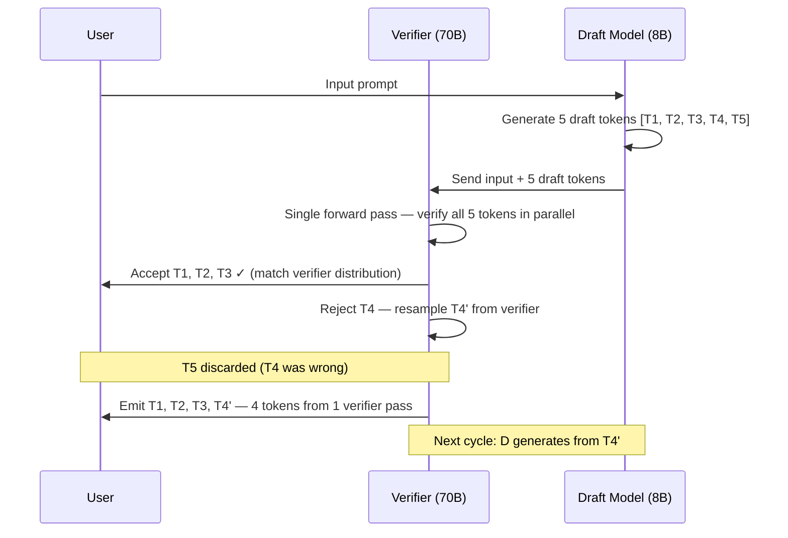

LLM inference is slow for a fundamental reason: it's autoregressive. Each token requires a full forward pass through the model, and you can't start generating token N+1 until token N is done. Generating a 500-token response means 500 sequential forward passes. There's no obvious way to parallelize this without changing the model.

Speculative decoding is the closest thing to a free lunch in LLM inference. It cuts latency 2–5x with no quality degradation and no model changes. Here's how it works and where it's worth deploying.



## Why Autoregressive Generation Is Slow

To understand why speculative decoding helps, you need to understand what makes standard inference slow.

A 70B parameter model requires moving roughly 140GB of weight data through GPU compute for each forward pass (at FP16 precision). Modern H100 GPUs have 3.35 TB/s memory bandwidth. At that rate, a single forward pass takes roughly 40–50ms — and that's the floor for generating *one token*.

At 50ms per token, generating a 200-token response takes 10 seconds. This is the constraint. You cannot make the 70B model significantly faster at generating individual tokens without different hardware or quantization (which trades quality for speed).

What you *can* do is generate multiple tokens per verifier pass.

## How Speculative Decoding Works

The key insight: while autoregressive *generation* is inherently sequential, autoregressive *verification* of an existing token sequence can be parallelized.

If I hand you a sequence of 5 tokens and ask "would your model have generated these?", you can check all 5 simultaneously in a single forward pass. The probability of each token conditioned on prior tokens is computable in parallel for a complete sequence.

Speculative decoding exploits this:

1. A small, fast "draft" model generates 4–8 candidate tokens autoregressively (fast, because it's small)
2. The large "verifier" model checks all candidate tokens in a *single* forward pass
3. Tokens that the verifier would also have generated (within acceptable probability) are accepted
4. The first rejected token is resampled by the verifier, and the remaining candidates are discarded
5. Repeat from step 1

The critical property: the output distribution is **identical** to running the verifier alone. Accepted tokens are exactly what the verifier would have produced. Rejected tokens are resampled from the verifier's distribution. There's no quality tradeoff — mathematically proven.

The speedup comes from the acceptance rate. If the draft model gets 4 out of 5 tokens right, you just got 4 tokens for the cost of 1 verifier pass (plus 5 draft model passes, which are cheap).

## Acceptance Rate: The Core Variable

Acceptance rate is the fraction of draft tokens the verifier accepts. It determines your actual speedup:

- **Acceptance rate 90%**: ~4x speedup at 5 draft tokens
- **Acceptance rate 75%**: ~2.5x speedup
- **Acceptance rate 60%**: ~1.5x speedup (marginal — overhead of draft model may not be worth it)

What drives acceptance rate?

**Model family alignment**: Draft and verifier from the same model family have higher acceptance rates. Llama 3 8B as draft for Llama 3 70B achieves 80–90% on code. A mismatched pair (different training data, tokenizer variations) will see 50–60%.

**Task type**:
- Code generation: 80–90% acceptance (highly predictable token sequences)
- Technical documentation: 75–85%
- General conversation: 65–80%
- Creative writing: 55–70% (high entropy, less predictable)

**Number of draft tokens**: More draft tokens per cycle increases the chance of a mismatch. 4–6 is typically the sweet spot. Beyond 8, acceptance rate drops enough to negate the benefit.

## Setting Up Speculative Decoding in vLLM

vLLM has native speculative decoding support. The setup is straightforward:

```bash
python -m vllm.entrypoints.openai.api_server \
    --model meta-llama/Llama-3.1-70B-Instruct \
    --speculative-model meta-llama/Llama-3.2-8B-Instruct \
    --num-speculative-tokens 5 \
    --speculative-draft-tensor-parallel-size 1 \
    --max-model-len 8192 \
    --gpu-memory-utilization 0.85
```

The draft model runs on the same GPU(s) as the verifier. For a 70B verifier, you typically need 4 A100 80GB GPUs. The 8B draft fits comfortably within the remaining memory headroom.

For measuring actual acceptance rate and speedup:

```python
import time
import openai

client = openai.OpenAI(base_url="http://localhost:8000/v1", api_key="token")

def benchmark_speculative(prompt: str, n_runs: int = 20):
    results = []
    for _ in range(n_runs):
        start = time.perf_counter()
        first_token_time = None

        stream = client.chat.completions.create(
            model="meta-llama/Llama-3.1-70B-Instruct",
            messages=[{"role": "user", "content": prompt}],
            stream=True,
            max_tokens=200
        )

        tokens = 0
        for chunk in stream:
            if first_token_time is None and chunk.choices[0].delta.content:
                first_token_time = time.perf_counter() - start
            tokens += 1

        total_time = time.perf_counter() - start
        results.append({
            "ttft": first_token_time,
            "total": total_time,
            "throughput": tokens / total_time
        })

    avg_ttft = sum(r["ttft"] for r in results) / n_runs
    avg_throughput = sum(r["throughput"] for r in results) / n_runs
    return avg_ttft, avg_throughput

# Run with code generation prompt (high acceptance rate expected)
ttft, tps = benchmark_speculative(
    "Write a Python function to parse a JSON file and validate against a schema:"
)
print(f"TTFT: {ttft*1000:.0f}ms | Throughput: {tps:.1f} tokens/sec")
```

To observe the acceptance rate directly from vLLM metrics:

```bash
# vLLM exposes Prometheus metrics
curl http://localhost:8000/metrics | grep speculative
# vllm:spec_decode_draft_acceptance_rate
# vllm:spec_decode_efficiency
```

## The Throughput Tradeoff

Speculative decoding optimizes for latency, not throughput. Under high concurrency, the picture changes.

The draft model consumes GPU compute that could otherwise serve more requests. At low concurrency (1–10 concurrent requests), the draft model runs efficiently and speculative decoding pays off cleanly. At high concurrency (100+ concurrent requests), you're splitting compute between draft generation and request batching — you may see speculative decoding *reduce* throughput compared to running the verifier alone.

The rule of thumb: speculative decoding is worth it when you care about TTFT and p95 latency for individual requests. If your bottleneck is requests-per-second and your GPU utilization is already high, speculative decoding may hurt you.

| Metric | With Speculative Decoding | Without |
|---|---|---|
| p50 TTFT (low concurrency) | 180ms | 520ms |
| p95 TTFT (low concurrency) | 350ms | 1,100ms |
| Throughput (1 request) | 85 tok/sec | 25 tok/sec |
| Throughput (50 concurrent) | 420 tok/sec | 500 tok/sec |

These are indicative numbers from a Llama 3.1 70B + 8B draft setup on 4× A100 80GB. Your numbers will vary based on hardware, model, and workload mix.

## When to Deploy Speculative Decoding

**Use it when:**
- You're running your own inference (vLLM, TGI, SGLang)
- Low-to-medium concurrency interactive workloads (chat, code completion)
- Draft and verifier are from the same model family
- Task is code or structured text (high acceptance rate expected)

**Skip it when:**
- Using a managed API (Anthropic, OpenAI) — they may implement it server-side, but you can't control it
- High concurrency batch processing is your primary workload
- You don't have memory headroom for the draft model
- Workload is high-entropy creative text (acceptance rate too low)

If you're self-hosting LLMs and serving interactive applications, speculative decoding is one of the few optimizations that genuinely delivers 2–3x improvement with zero quality cost. That's rare enough to be worth the operational complexity.
