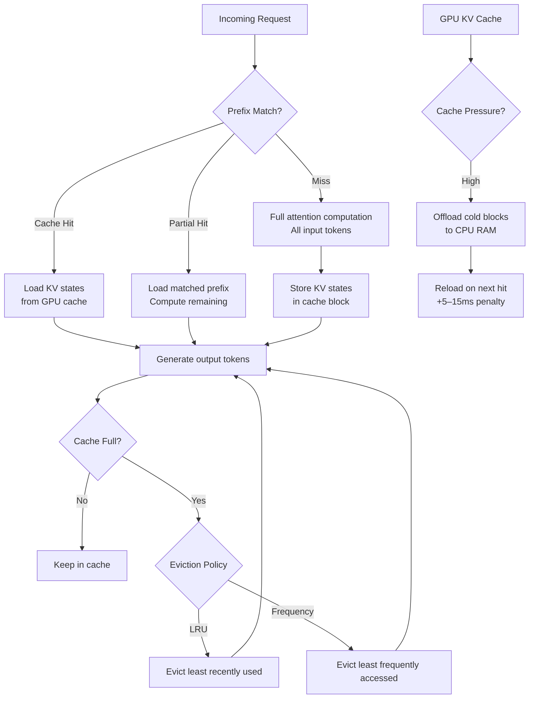

When you're running LLMs at scale, GPU memory is the constraint that determines everything else — how many requests you can serve in parallel, how long your context windows can be, whether you can fit a second model on the same hardware. And the biggest consumer of that memory, often larger than the model weights themselves under load, is the KV cache.

Understanding the KV cache and how to optimize it is the difference between a vLLM deployment that handles 20 concurrent users and one that handles 200.



## What the KV Cache Actually Is

Every transformer attention layer computes keys and values for each input token. During generation, you need these KV tensors for all previous tokens to compute attention for the current token. Rather than recompute them from scratch at every generation step, the model caches them — hence the KV cache.

The memory cost is significant. For a 70B parameter model:
- Each attention layer has 64 KV heads (typically)
- Each KV head stores 2 tensors (key, value) per token per layer
- At FP16 (2 bytes per element), memory per token per layer: `2 × head_dim × 2 bytes`
- Across 80 layers with head_dim=128: `2 × 128 × 2 × 80 = 40,960 bytes ≈ 40KB per token`
- For 4K context: 160MB per request
- For 100 concurrent requests: **16GB of KV cache** just for a 4K context window

This is why a 70B model that fits in 140GB at 4 × A100 can only handle 30–40 concurrent requests with 4K context before GPU memory is exhausted. The KV cache competes directly with model weights for VRAM.

## Prefix Caching: The Highest-ROI Optimization

If multiple requests share a common prefix — the same system prompt, the same document, the same conversation history prefix — you're computing the same KV states redundantly. Prefix caching stores those states once and reuses them across requests.

In vLLM, prefix caching operates at the block level. The context is divided into blocks (typically 16 or 32 tokens each). Blocks with identical content share cached KV states.

The scenarios where this delivers major wins:

**RAG with shared documents**: If you're embedding the same 10-page document into every query's context, all of those document tokens have the same KV states across requests. With prefix caching, the document is processed once.

**Multi-turn chat**: The conversation history grows with each turn. Turn N's context is a prefix of turn N+1's context. Prefix caching means each turn only computes KV states for the new tokens.

**Fixed system prompts**: Any deployment with a constant system prompt pays for computing it once, not once per request.

```bash
# Enable prefix caching in vLLM
python -m vllm.entrypoints.openai.api_server \
    --model meta-llama/Llama-3.1-70B-Instruct \
    --enable-prefix-caching \
    --max-model-len 8192 \
    --gpu-memory-utilization 0.90
```

Measuring the impact:

```python
import openai
import time

client = openai.OpenAI(base_url="http://localhost:8000/v1", api_key="token")

SHARED_DOCUMENT = "..." * 500  # ~500 tokens of context

def timed_request(prompt: str) -> dict:
    start = time.perf_counter()
    first_token = None

    stream = client.chat.completions.create(
        model="meta-llama/Llama-3.1-70B-Instruct",
        messages=[
            {"role": "system", "content": f"You are a document analyst. Document: {SHARED_DOCUMENT}"},
            {"role": "user", "content": prompt}
        ],
        stream=True,
        max_tokens=100
    )

    for chunk in stream:
        if first_token is None and chunk.choices[0].delta.content:
            first_token = time.perf_counter() - start

    return {"ttft": first_token}

# First request — cache miss, full computation
r1 = timed_request("Summarize the key points.")
print(f"Cold TTFT: {r1['ttft']*1000:.0f}ms")

# Second request — cache hit on shared document prefix
r2 = timed_request("What are the risks mentioned?")
print(f"Warm TTFT: {r2['ttft']*1000:.0f}ms")
# Expect 40-60% reduction in TTFT on the second request
```

In production RAG deployments, prefix caching on document context typically cuts TTFT by 40–65% and reduces compute cost proportionally.

## KV Cache Quantization: 2x More Capacity

KV cache tensors are stored at FP16 by default. Quantizing them to INT8 or FP8 cuts memory usage by 2x with minimal quality impact — KV cache values are not as precision-sensitive as model weights.

```bash
python -m vllm.entrypoints.openai.api_server \
    --model meta-llama/Llama-3.1-70B-Instruct \
    --kv-cache-dtype fp8 \
    --enable-prefix-caching \
    --max-model-len 8192
```

The quality impact of FP8 KV cache quantization: in benchmark evaluations (MMLU, HumanEval, GSM8K), the performance gap between FP16 and FP8 KV cache is less than 0.5%. For most production workloads, this is acceptable.

The practical benefit: if your original deployment supports 50 concurrent requests at 4K context with FP16, FP8 KV cache gets you to ~100 concurrent requests. That's a doubling of throughput for zero additional hardware.

INT8 gives slightly more memory reduction than FP8 but may show larger quality degradation on tasks requiring precise numerical reasoning. Start with FP8.

## Eviction Policies: What to Do When the Cache Is Full

The KV cache has a fixed capacity. When it's full, you need to evict blocks to make room for new requests. The eviction policy determines which blocks to drop.

**LRU (Least Recently Used)**: The default in vLLM. Evict the block that hasn't been accessed longest. Works well for most workloads.

**Frequency-based eviction**: Track how many times each block has been accessed and evict the least-frequently-accessed blocks. Better for RAG workloads where the same documents are accessed repeatedly — LRU might evict a popular document block if it hasn't been accessed in the last few seconds, while frequency-based eviction keeps it warm.

vLLM's current default is LRU. For RAG-heavy workloads, you may want to build a custom eviction layer that tracks frequency at the document level rather than block level.

## CPU Offloading: Extending Cache Beyond GPU Memory

When KV cache pressure is high, blocks can be offloaded from GPU memory to CPU RAM (DRAM). CPU RAM is 10–50x cheaper per GB than GPU VRAM, and modern servers have 512GB–2TB of DRAM.

The tradeoff: loading a KV block from CPU RAM back to GPU takes 5–15ms (PCIe bandwidth bound). This adds latency to cache hits that were offloaded, but it's cheaper than a cache miss (full recomputation).

```bash
python -m vllm.entrypoints.openai.api_server \
    --model meta-llama/Llama-3.1-70B-Instruct \
    --enable-prefix-caching \
    --cpu-offload-gb 64 \
    --gpu-memory-utilization 0.85
```

This tells vLLM to use up to 64GB of CPU RAM as a secondary KV cache tier. Cold blocks migrate to CPU; hot blocks stay on GPU.

## Putting It Together: A Production Configuration

Here's the vLLM configuration I'd use for a RAG-heavy production deployment:

```bash
python -m vllm.entrypoints.openai.api_server \
    --model meta-llama/Llama-3.1-70B-Instruct \
    --tensor-parallel-size 4 \
    --enable-prefix-caching \
    --kv-cache-dtype fp8 \
    --cpu-offload-gb 128 \
    --max-model-len 16384 \
    --gpu-memory-utilization 0.88 \
    --max-num-seqs 128 \
    --enable-chunked-prefill \
    --disable-log-requests
```

Key settings:
- `--enable-prefix-caching`: Essential for RAG. No reason not to enable it.
- `--kv-cache-dtype fp8`: 2x cache capacity at <0.5% quality cost.
- `--cpu-offload-gb 128`: 128GB of CPU RAM as cache overflow.
- `--enable-chunked-prefill`: Breaks large prefill batches into chunks, reducing latency spikes.

## Monitoring Cache Health

Cache hit rate is the primary health metric. Watch it per workload type:

```bash
# Prometheus metrics from vLLM
curl http://localhost:8000/metrics | grep cache

# Key metrics:
# vllm:gpu_cache_usage_perc     — GPU cache utilization (want 70-90%)
# vllm:cpu_cache_usage_perc     — CPU cache utilization
# vllm:prefix_cache_hit_rate    — Cache hit rate (want > 50% for RAG workloads)
```

A prefix cache hit rate below 20% suggests your workloads aren't sharing prefixes — prefix caching is still free to have enabled, but it's not helping. A cache hit rate above 70% is excellent and means you're getting substantial TTFT and compute savings.

Cache utilization above 95% means you're evicting blocks before they can be reused — consider adding GPU memory (scale up) or reducing max concurrent sequences.

The combination of prefix caching, FP8 quantization, and CPU offloading typically allows 3–4x more concurrent requests per GPU compared to an unoptimized deployment. In enterprise deployments where GPU costs dominate the infrastructure bill, that's meaningful.
